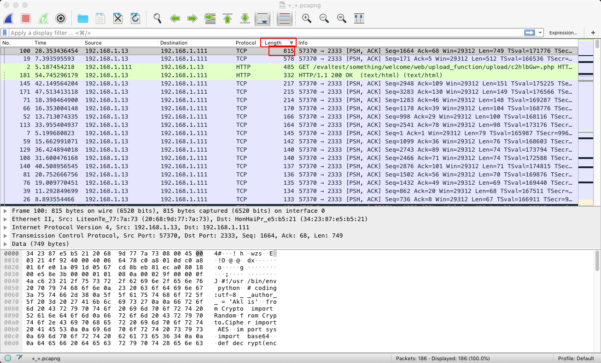
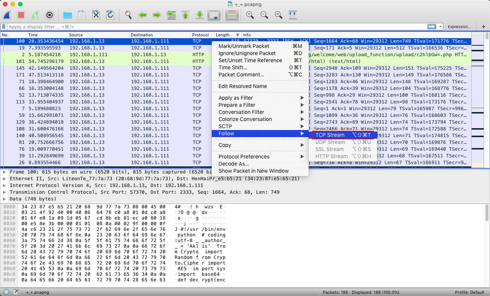
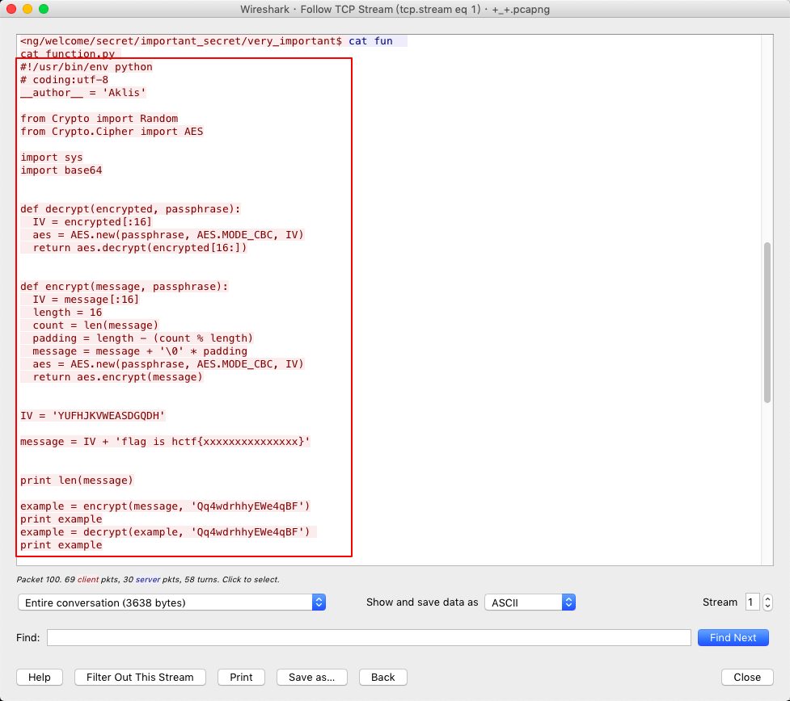
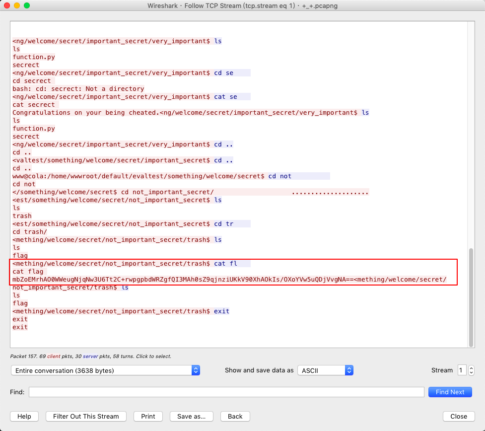
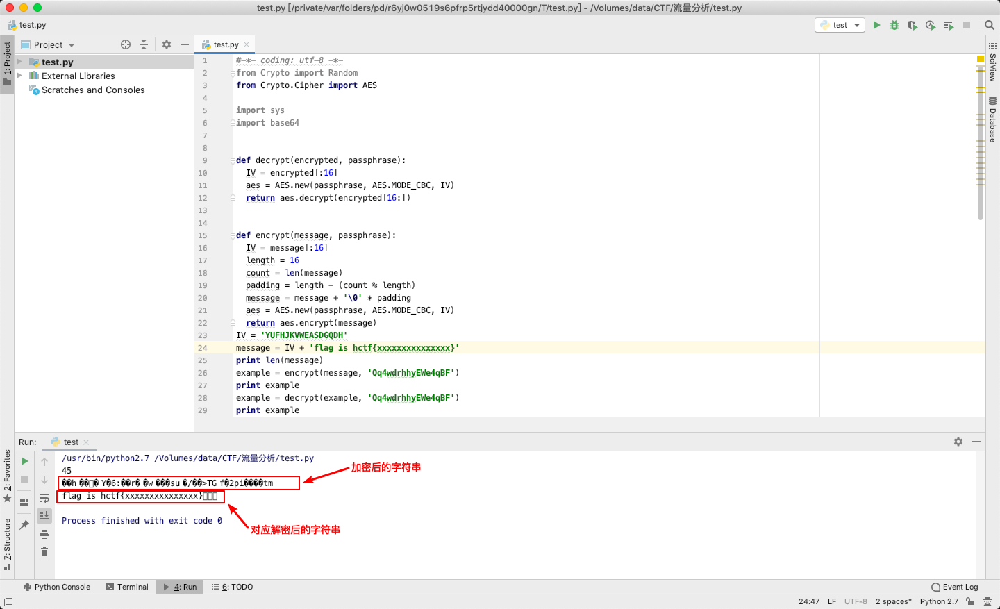
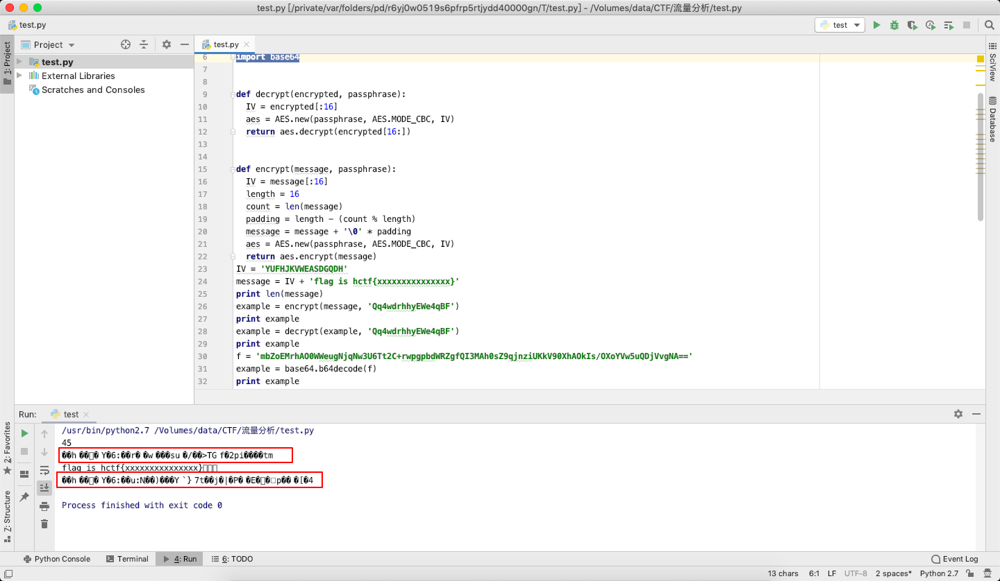
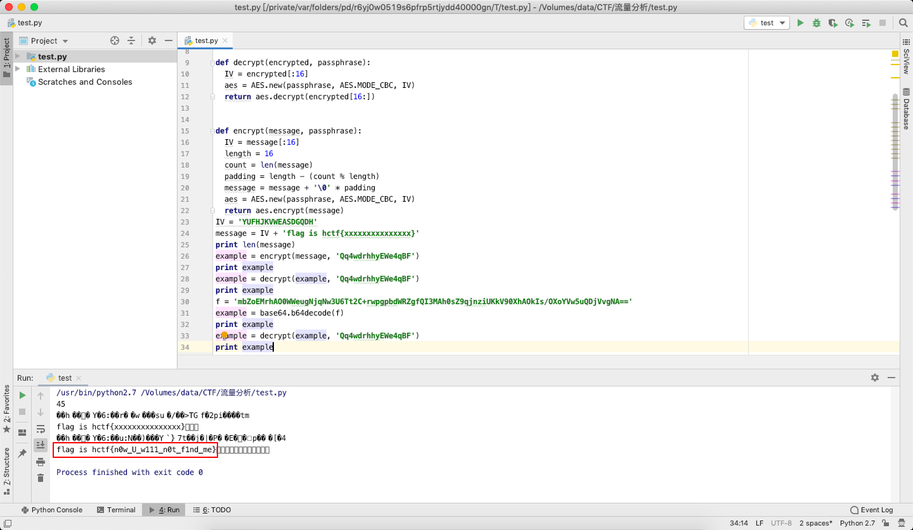

# webshell流量分析

## 流量分析 简单    安全杂项

### 描述    

webshell流量分析。flag格式为hctf{字符串}。

### 附件

[104+2045664263.rar](file/104+2045664263.rar)

### 解题步骤：

基操走起，解压，使用wireshark打开。



将数据包按照length倒序排列，先看最大的，毕竟里面的信息最多。。。





找到了这样一段python代码
```
cat function.py 
#!/usr/bin/env python
# coding:utf-8
__author__ = 'Aklis'

from Crypto import Random
from Crypto.Cipher import AES

import sys
import base64


def decrypt(encrypted, passphrase):
  IV = encrypted[:16]
  aes = AES.new(passphrase, AES.MODE_CBC, IV)
  return aes.decrypt(encrypted[16:])


def encrypt(message, passphrase):
  IV = message[:16]
  length = 16
  count = len(message)
  padding = length - (count % length)
  message = message + '\0' * padding
  aes = AES.new(passphrase, AES.MODE_CBC, IV)
  return aes.encrypt(message)


IV = 'YUFHJKVWEASDGQDH'

message = IV + 'flag is hctf{xxxxxxxxxxxxxxx}'


print len(message)

example = encrypt(message, 'Qq4wdrhhyEWe4qBF')
print example
example = decrypt(example, 'Qq4wdrhhyEWe4qBF') 
print example
```
再往下翻，又找到了一个flag


```
cat flag 
mbZoEMrhAO0WWeugNjqNw3U6Tt2C+rwpgpbdWRZgfQI3MAh0sZ9qjnziUKkV90XhAOkIs/OXoYVw5uQDjVvgNA==
```

稍微仔细一看，下面的这段flag是base64加密后的字符串，而上面的function.py则是实现一种加解密的功能呢，根据print的格式判断，这个py运行环境应该是python2，python3的print后面需要加括号。。。。。。

先运行一下function.py，看看输出的内容吧。



虽然直接打印出来一个flag is hctf{xxxxxxxxxxxxxxx}，但是实际的flag并不是hctf{xxxxxxxxxxxxxxx}。。。所以回到刚才找到的那段flag上，先进行base64解密。
```
import base64
f = 'mbZoEMrhAO0WWeugNjqNw3U6Tt2C+rwpgpbdWRZgfQI3MAh0sZ9qjnziUKkV90XhAOkIs/OXoYVw5uQDjVvgNA=='
example = base64.b64decode(f)
print example
```


看看经过base64解密后的样子是不是很熟悉，跟上面function.py加密后的样子好像啊。。。。尝试再使用function.py进行解密。



最终拿到了这个flag is hctf{n0w_U_w111_n0t_f1nd_me}

