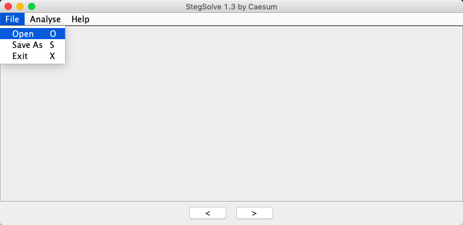
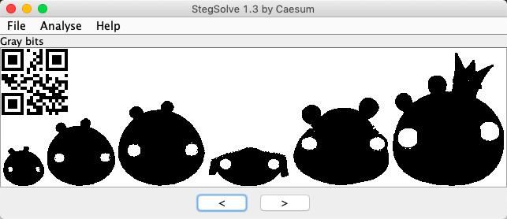
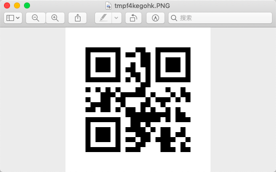
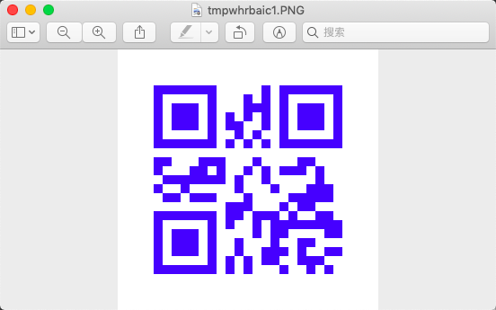

# 图片隐写术pigs

## pigs 简单    安全杂项

### 描述    

你能找到隐藏在图片中的信息吗？flag格式为flag{字符串}。

### 附件

[194+pigs.png](file/194+pigs.png)

### 解题步骤：

直接上神器Stegsolve，不要问我怎么知道的，如果非要问的话，就是百度的。

[Stegsolve下载地址](http://www.caesum.com/handbook/Stegsolve.jar)

下载完，配置好java的环境变量，可以直接运行。



打开后，点击左箭头，使用Gray bits查看图片，发现一个二维码，扫描后获得flag。



也可以另存为bmp图片，然后使用 python3 下的 zxing 来识别二维码。

安装依赖库：pip install qrcode pillow image zxing

识别二维码：
```
reader = zxing.BarCodeReader()
barcode = reader.decode("/Volumes/data/CTF/安全杂项/solved.bmp")
print(barcode.parsed)
```

附：使用python生成二维码

```
#
import qrcode
# 二维码内容
data = "I Love Python"
# 生成二维码
img = qrcode.make(data=data)
# 直接显示二维码
img.show()
# 保存二维码为文件
# img.save("python.jpg")
```
生成效果：



设置生成的二维码大小、颜色等参数属性：
```
import qrcode
# 实例化二维码生成类
qr = qrcode.QRCode(
    version=1,
    error_correction=qrcode.constants.ERROR_CORRECT_L,
    box_size=10,
    border=4,
)
# 设置二维码数据
data = "I Love Python"
qr.add_data(data=data)
# 启用二维码颜色设置
qr.make(fit=True)
img = qr.make_image(fill_color="blue", back_color="white")
# 显示二维码
img.show()
```
生成效果：


