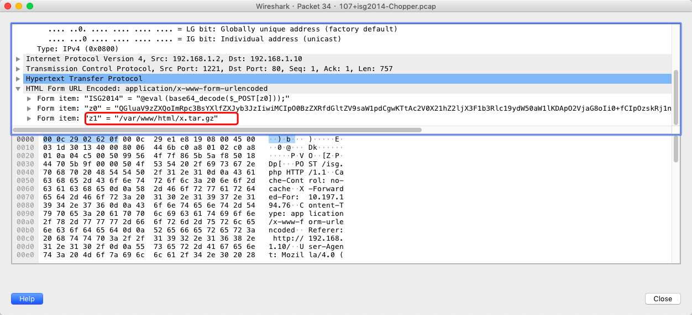
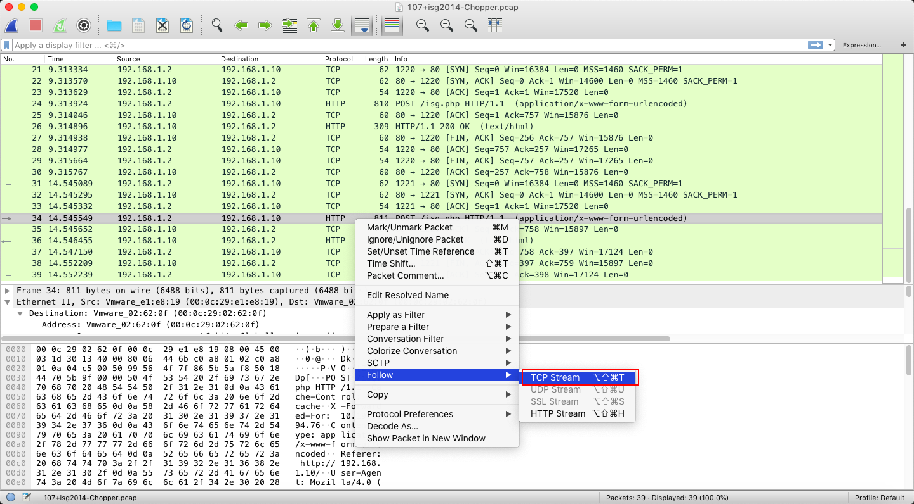
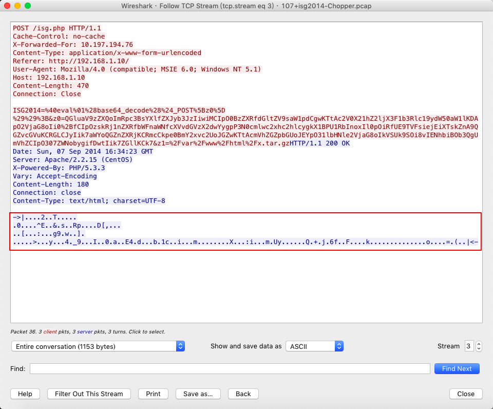
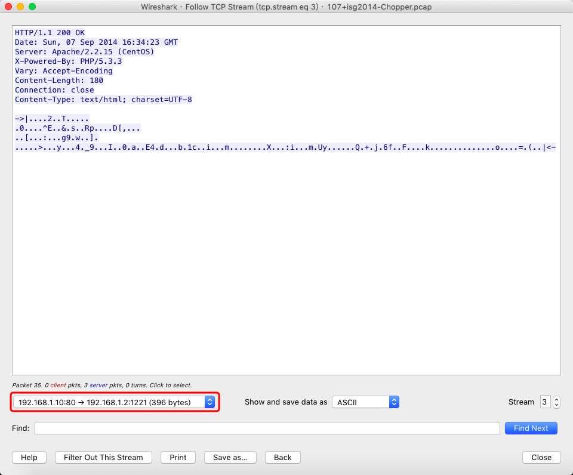
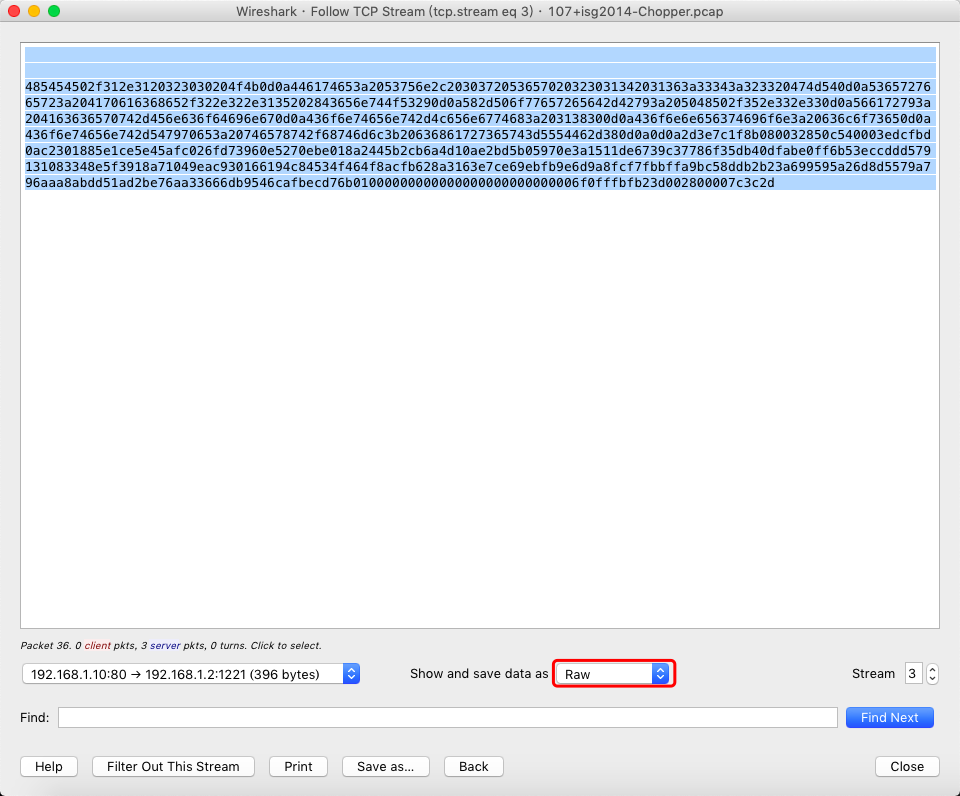
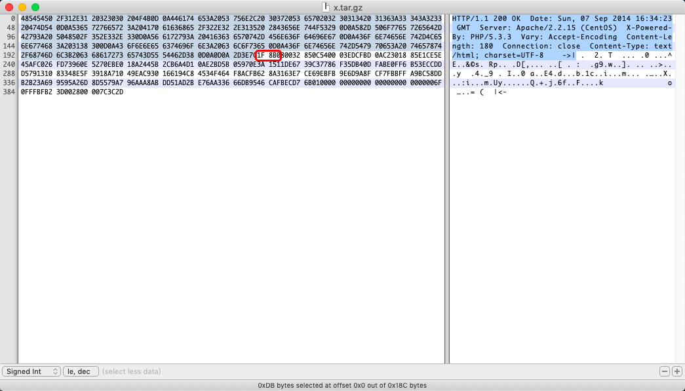
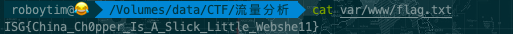

# 流量分析之文件简单提取

## 文件简单提取 简单    安全杂项
### 描述    
来找flag吧。格式为ISG{字符串}。
### 附件
[107+isg2014-Chopper.pcap](file/107+isg2014-Chopper.pcap)

### 解题步骤：
#### 1.先下载安装需要的工具，这里我们使用wireshark

[点我下载](https://pan.baidu.com/s/1bi6crOgAe7my4AVuv2QMAw)

#### 2. 使用wireshark打开下载到的pcap文件

经过简单分析得知有一个名叫x.tar.gz的文件，格式是一个压缩包，猜测所需的flag在该压缩包中，然后想办法获取该文件。
#### 3. 通过pcap获取所需文件

#### 4. 在该数据包右键，选择Follow->TCP Stream.

红框中的乱码应该为文件。

#### 5. 过滤掉多余信息，只保留该文件的数据包。

#### 6. 设置数据格式为raw，然后保存为文件，命名为x.tar.gz。

#### 7. 将得到的文件使用Hex Fiend打开（MAC下使用Hex Fiend，win下使用winhex工具，下载地址请自行百度），删除掉多余信息

注：.tar.gz的文件。这种压缩格式的文件开头是1F8B，找到这个删除之前的全部内容，该文件后有boundary分隔符，将这部分删去，即掐头去尾留下来的就是真正的数据。

#### 8. 删除掉其他多余信息后即可得到正确tar.gz文件，使用tar zxvf 命令解压后得到flag文件。

至此得到正确的flag：

