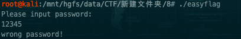
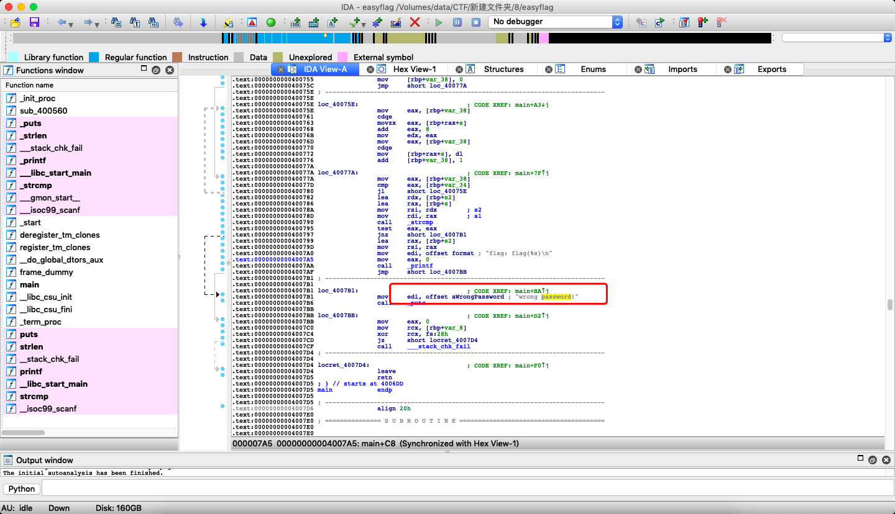
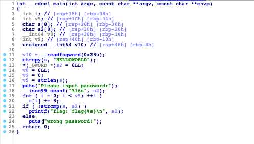
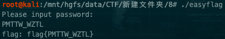

# 逆向工程easyflag

## asyflag  简单    逆向工程

### 描述    

破译这个程序就能看到flag。flag格式为flag{字符串}。

### 附件

[easyflag.zip](file/easyflag.zip)

### 解题步骤：

#### 1.下载解压附件，得到easyflag可执行文件。常规操作，随便输入一些内容，看看输出结果



#### 2.之前用过很多次r2，这次我们换一个工具试试，用IDA打开文件。



找到刚才输出报错信息的地方，直接按下F5，查看伪代码。



通过这一串代码，我们看到程序是拿到输入的字符后，与“HELLOWORLD”每个字符ascii码+8进行比较，所以，这个就简单了，根据ascii码表一一对应找到flag即可，当然也可以自己写个脚本来进行计算。

```
#!/usr/bin/env python2
# _*_ coding:UTF-8 _*_
import sys
s = 'HELLOWORLD'
for i in s:
    sys.stdout.write(chr(ord(i)+8))
```
执行后得到“PMTTW_WZTL”。

再次使用该字符尝试执行。



应该是OK的。