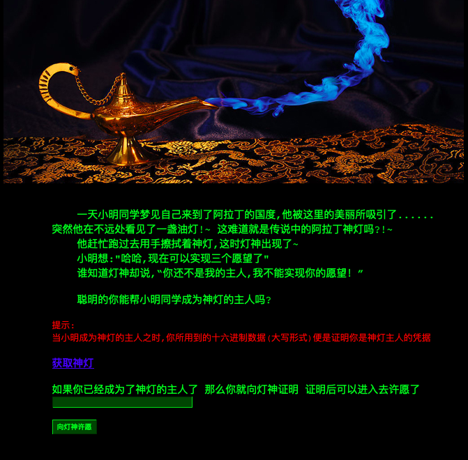
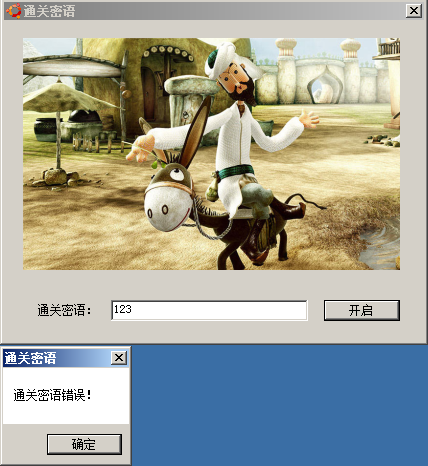
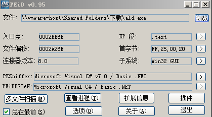
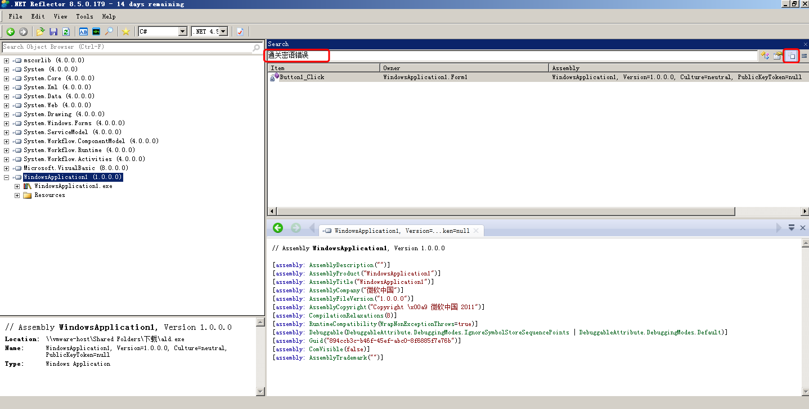
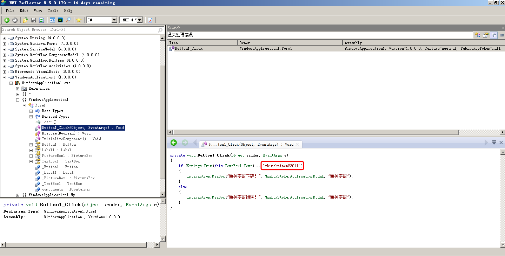
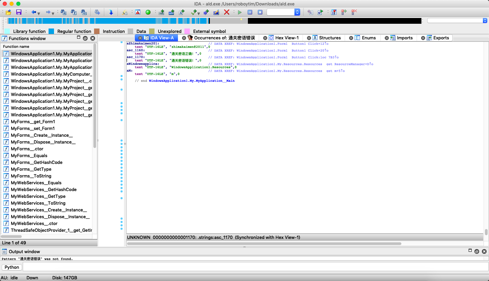
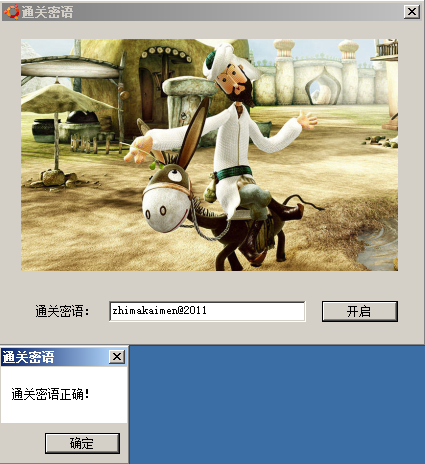

# 逆向工程之阿拉丁神灯

## 题目链接
[阿拉丁神灯](http://ctf5.shiyanbar.com/crack/1/)

## 解题步骤：

### 1.下载文件获得一个ald.exe，先运行一下看看。

随便先输入点东西试试。。。

### 2.输入123，点击‘开启’出现，“通关密语错误”的提示信息。拿到这个exe，我们先来了解要破解的程序是由什么语言写的，有没有加壳（壳可以理解为对程序的加密使逆向人员难以看到源码）。

这里我们使用PEID，PEID的作用就是查看一个PE文件是用什么语言撰写的，当然了，jar和APK这种不属于PE文件（你可以理解为PE文件就是windows下的exe文件和dll文件）。以下是PEID查看文件的效果图：

可以看到ald.exe是由C#编写的，所以我们使用.net reflecter来进行反编译。

选择Search String，输入“通关密语错误”的错误提示，搜索结果双击打开。

这样就找到了应该输入的信息。

当然同样的方法，适用于使用IDA工具。。。

