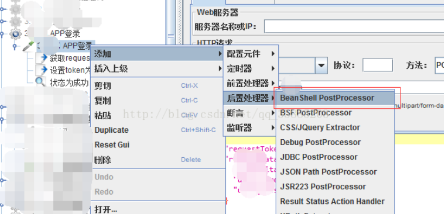
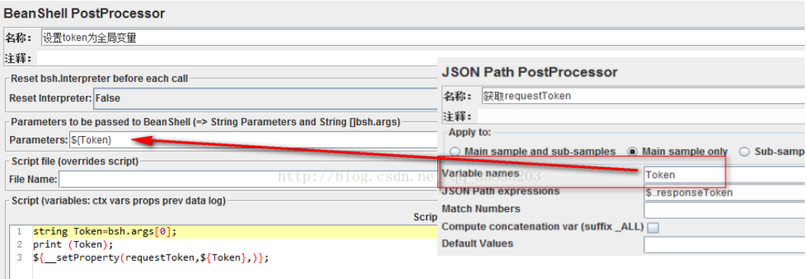
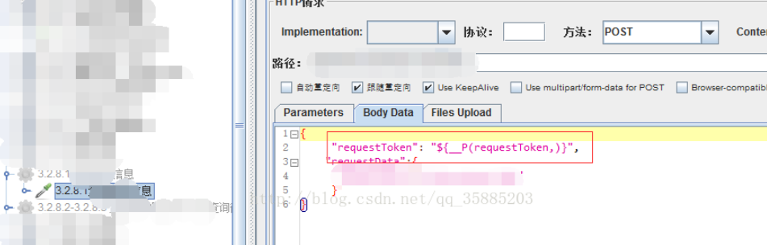

# Jmeter跨线程传递变量

jmeter的线程组之间是相互独立的，各个线程组互不影响，所以线程组A中输出的参数，是无法直接在线程组B中被调用的。

但是有时为了方便管理，我们可能是把各个接口单独存放在不同的线程组中。拿token来说，虽然每一个线程组中我们也可以在放一个登录请求，然后输出一个token供此线程组使用，但这样就比较繁琐且冗余。此时我们就可以使用跨线程组传递参数来解决这样的问题

方法：jmeter本身的内置函数中，"\_\_setProperty"函数可以把某参数的值设置成jmeter本身的内置属性，而jmeter的内置属性是所有线程组都可以调用的，是全局变量。各个线程组调用时，只需使用调用jmeter属性的函数"\_\_P"来调用相应的属性即可。

操作：以Token来示例，在登录请求中添加一个正则表达式提取器（上一章有说），提取响应值中的token的值。然后再添加一个 Bean Shell PostProcessor 的后置处理器，在这个处理器中调用"\_\_setProperty"函数，设置正则提取到的token的值为全局变量。然后在另外一个线程组中添加一个其他需要用到此token的请求，通过函数"\_\_P"来调用token。

## 流程
1. 添加Bean Shell PostProcessor后置处理器

2. Bean Shell PostProcessor操作面板
Parametres：把需要操作的参数传递给Bean Shell PostProcessor。前面提取出来的Token的值，就把参数Token写入
Script：  string Token=bsh.args[0];     把Bean Shell PostProcessor接收到的参数值，赋值给某参数。0是第一个值。
${\_\_setProperty(requestToken,${Token},)};
调用函数\_\_setProperty，把Bean Shell PostProcessor中的参数Token的值赋值给requestToken，并设置requestToken为jmeter内置属性。

3. 其他线程组调用Token的值
