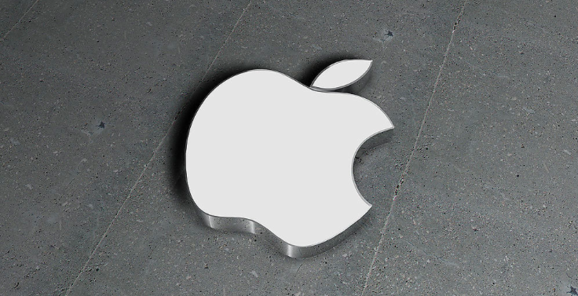

# IOS

iOS是由苹果公司开发的移动操作系统。苹果公司最早于2007年1月9日的Macworld大会上公布这个系统，最初是设计给iPhone使用的，后来陆续套用到iPod touch、iPad以及Apple TV等产品上。iOS与苹果的macOS操作系统一样，属于类Unix的商业操作系统。原本这个系统名为iPhone OS，因为iPad，iPhone，iPod touch都使用iPhone OS，所以2010年WWDC大会上宣布改名为iOS(iOS为美国Cisco 公司网络设备操作系统注册商标，苹果改名已获得Cisco公司授权）。