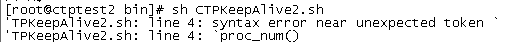
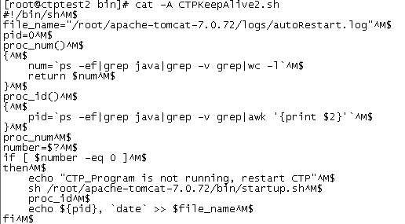
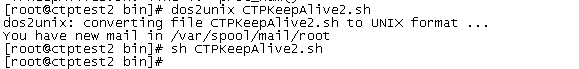

# Linux执行shell脚本报语法错误

在Windows编辑的Sheel脚本，上传至Linux服务器，执行时报错
```shell
[root@ctptest2 bin]# sh CTPKeepAlive2.sh
'TPKeepAlive2.sh: line 4: syntax error near unexpected token `
'TPKeepAlive2.sh: line 4: `proc_num()
```
脚本内容如下：
```shell
#!/bin/sh
file_name="/root/apache-tomcat-7.0.72/logs/autoRestart.log"
pid=0
proc_num()
{
    num=`ps -ef|grep java|grep -v grep|wc -l`
    return $num
}
proc_id()
{
    pid=`ps -ef|grep java|grep -v grep|awk '{print $2}'`
}
proc_num
number=$?
if [ $number -eq 0 ]
then
    echo "CTP_Program is not running, restart CTP"
    sh /root/apache-tomcat-7.0.72/bin/startup.sh
    proc_id
    echo ${pid}, `date` >> $file_name
fi
```
脚本检测是否存在java进程，如果进程不存在，则启动tomcat服务。

使用命令sh CTPKeepAlive2.sh，脚本报错。



怀疑由于字符编码格式导致报错。

使用命令cat -A  CTPKeepAlive2.sh，查看文件，发现结束符为^M$。



注：在Windows下换行符显示为^M$，Linux下换行符显示为$。

使用命令dos2unix CTPKeepAlive2.sh将脚本转换为Linux下的编码格式，再次执行后没有报错，脚本正常运行。

