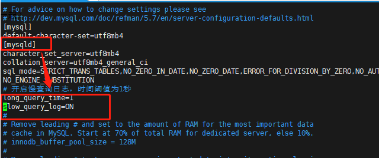
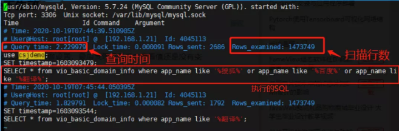

# MySql慢查询优化

慢查询，顾名思义，执行很慢的查询。有多慢？超过 long_query_time 参数设定的时间阈值（默认 10s），就被认为是慢的，是需要优化的。慢查询被记录在慢查询日志里。

慢查询日志默认是不开启的，如果你需要优化 SQL 语句，就可以开启这个功能，它可以让你很容易地知道哪些语句是需要优化的（想想一个 SQL 要 10s 就可怕）。好了，下面我们就一起来看看怎么处理慢查询。

## 慢查询配置

### 开启慢查询

MySQL 支持通过以下方式开启慢查询：
- 输入命令开启慢查询（临时），在 MySQL 服务重启后会自动关闭。
- 配置 my.cnf（Windows 是 my.ini）系统文件开启，修改配置文件是持久化开启慢查询的方式

#### 方法一：通过命令开启慢查询

步骤 1：查询 slow_query_log 查看是否已开启慢查询日志：
```sql
show variables like '%slow_query_log%';
```
```sql
mysql> show variables like '%slow_query_log%';
+---------------------+-----------------------------------+
| Variable_name       | Value                             |
+---------------------+-----------------------------------+
| slow_query_log      | OFF                               |
| slow_query_log_file | /var/lib/mysql/localhost-slow.log |
+---------------------+-----------------------------------+
2 rows in set (0.01 sec)
```

步骤 2：开启慢查询命令：
```sql
set global slow_query_log='ON';
```

步骤 3：指定记录慢查询日志 SQL 执行时间得阈值（long_query_time 单位：秒，默认 10 秒）。
如下我设置成了 1 秒，执行时间超过 1 秒的 SQL 将记录到慢查询日志中：
```sql
set global long_query_time=1;
```

步骤 4：查询 “慢查询日志文件存放位置”。
```sql
show variables like '%slow_query_log_file%';
```
```sql
mysql> show variables like '%slow_query_log_file%';
+---------------------+-----------------------------------+
| Variable_name       | Value                             |
+---------------------+-----------------------------------+
| slow_query_log_file | /var/lib/mysql/localhost-slow.log |
+---------------------+-----------------------------------+
1 row in set (0.01 sec)
```
slow_query_log_file 指定慢查询日志的存储路径及文件（默认和数据文件放一起）。

步骤 5：核对慢查询开启状态，需要退出当前 MySQL 终端，重新登录即可刷新。

配置了慢查询后，它会记录以下符合条件的 SQL：
- 查询语句
- 数据修改语句
- 已经回滚的 SQL

#### 方式二：通过配置 my.cnf（Windows 是 my.ini）系统文件开启（版本：MySQL 5.5 及以上）。

在 my.cnf 文件的 [mysqld] 下增加如下配置开启慢查询，如下图：
```sql
# 开启慢查询功能
slow_query_log=ON
# 指定记录慢查询日志SQL执行时间得阈值
long_query_time=1
# 选填，默认数据文件路径
# slow_query_log_file=/var/lib/mysql/localhost-slow.log
```



重启数据库后即持久化开启慢查询，查询验证如下：
```sql
mysql> show variables like '%_query_%';
+------------------------------+-----------------------------------+
| Variable_name                | Value                             |
+------------------------------+-----------------------------------+
| have_query_cache             | YES                               |
| long_query_time              | 1.000000                          |
| slow_query_log               | ON                                |
| slow_query_log_file          | /var/lib/mysql/localhost-slow.log |
+------------------------------+-----------------------------------+
6 rows in set (0.01 sec)
```

### 慢查询日志介绍



如上图，是执行时间超过 1 秒的 SQL 语句（测试）：

- 第一行：记录时间。
- 第二行：用户名 、用户的 IP 信息、线程 ID 号。
- 第三行：执行花费的时间【单位：秒】、执行获得锁的时间、获得的结果行数、扫描的数据行数。
- 第四行：这 SQL 执行的时间戳。
- 第五行：具体的 SQL 语句。

## Explain 分析慢查询 SQL

分析 MySQL 慢查询日志，利用 Explain 关键字可以模拟优化器执行 SQL 查询语句，来分析 SQL 慢查询语句。

下面我们的测试表是一张 137w 数据的 app 信息表，我们来举例分析一下。

SQL 示例如下：

```sql
-- 1.185s
SELECT * from vio_basic_domain_info where app_name like '%翻译%' ;
```

这是一条普通的模糊查询语句，查询耗时：1.185s，查到了 148 条数据。

我们用 Explain 分析结果如下表，根据表信息可知：该 SQL 没有用到字段 app_name 上的索引，查询类型是全表扫描，扫描行数 137w。
```sql
mysql> EXPLAIN SELECT * from vio_basic_domain_info where app_name like '%翻译%' ;
+----+-------------+-----------------------+------------+------+---------------+------+---------+------+---------+----------+-------------+
| id | select_type | table                 | partitions | type | possible_keys | key  | key_len | ref  | rows    | filtered | Extra       |
+----+-------------+-----------------------+------------+------+---------------+------+---------+------+---------+----------+-------------+
|  1 | SIMPLE      | vio_basic_domain_info | NULL       | ALL  | NULL          | NULL | NULL    | NULL | 1377809 |    11.11 | Using where |
+----+-------------+-----------------------+------------+------+---------------+------+---------+------+---------+----------+-------------+
1 row in set, 1 warning (0.00 sec)
```

当这条 SQL 使用到索引时，SQL 如下：查询耗时：0.156s，查到 141 条数据：

```
-- 0.156s
SELECT * from vio_basic_domain_info where app_name like '翻译%' ;
```

Explain 分析结果如下表；根据表信息可知：该 SQL 用到了 idx_app_name 索引，查询类型是索引范围查询，扫描行数 141 行。

由于查询的列不全在索引中（select \*），因此回表了一次，取了其他列的数据。

```sql
mysql> EXPLAIN SELECT * from vio_basic_domain_info where app_name like '翻译%' ;
+----+-------------+-----------------------+------------+-------+---------------+--------------+---------+------+------+----------+-----------------------+
| id | select_type | table                 | partitions | type  | possible_keys | key          | key_len | ref  | rows | filtered | Extra                 |
+----+-------------+-----------------------+------------+-------+---------------+--------------+---------+------+------+----------+-----------------------+
|  1 | SIMPLE      | vio_basic_domain_info | NULL       | range | idx_app_name  | idx_app_name | 515     | NULL |  141 |   100.00 | Using index condition |
+----+-------------+-----------------------+------------+-------+---------------+--------------+---------+------+------+----------+-----------------------+
1 row in set, 1 warning (0.00 sec)
```

当这条 SQL 使用到覆盖索引时，SQL 如下：查询耗时：0.091s，查到 141 条数据。
```sql
-- 0.091s
SELECT app_name from vio_basic_domain_info where app_name like '翻译%' ;
```
Explain 分析结果如下表；根据表信息可知：和上面的 SQL 一样使用到了索引，由于查询列就包含在索引列中，又省去了 0.06s 的回表时间。

```sql
mysql> EXPLAIN SELECT app_name from vio_basic_domain_info where app_name like '翻译%' ;
+----+-------------+-----------------------+------------+-------+---------------+--------------+---------+------+------+----------+--------------------------+
| id | select_type | table                 | partitions | type  | possible_keys | key          | key_len | ref  | rows | filtered | Extra                    |
+----+-------------+-----------------------+------------+-------+---------------+--------------+---------+------+------+----------+--------------------------+
|  1 | SIMPLE      | vio_basic_domain_info | NULL       | range | idx_app_name  | idx_app_name | 515     | NULL |  141 |   100.00 | Using where; Using index |
+----+-------------+-----------------------+------------+-------+---------------+--------------+---------+------+------+----------+--------------------------+
1 row in set, 1 warning (0.00 sec)
```
那么是如何通过 EXPLAIN 解析结果分析 SQL 的呢？各列属性又代表着什么？一起往下看。

### 各列属性的简介
各列属性的简介如下：
- id：SELECT 的查询序列号，体现执行优先级，如果是子查询，id的序号会递增，id 值越大优先级越高，越先被执行。
- select_type：表示查询的类型。
- table：输出结果集的表，如设置了别名，也会显示。
- partitions：匹配的分区。
- type：对表的访问方式。
- possible_keys：表示查询时，可能使用的索引。
- key：表示实际使用的索引。
- key_len：索引字段的长度。
- ref：列与索引的比较。
- rows：扫描出的行数（估算的行数）。
- filtered：按表条件过滤的行百分比。
- Extra：执行情况的描述和说明。

以上标星的几类是我们优化慢查询时常用到的。

### 慢查询分析常用到的属性

#### ①type

对表访问方式，表示 MySQL 在表中找到所需行的方式，又称“访问类型”。

存在的类型有：ALL、index、range、ref、eq_ref、const、system、NULL（从左到右，性能从低到高）。

介绍三个咱们天天见到的：

- ALL：（Full Table Scan）MySQL 将遍历全表以找到匹配的行，常说的全表扫描。
- Index：（Full Index Scan）Index 与 ALL 区别为 Index 类型只遍历索引树。
- Range：只检索给定范围的行，使用一个索引来选择行。

#### ②key

key 列显示了 SQL 实际使用索引，通常是 possible_keys 列中的索引之一，MySQL 优化器一般会通过计算扫描行数来选择更适合的索引，如果没有选择索引，则返回 NULL。

当然，MySQL 优化器存在选择索引错误的情况，可以通过修改 SQL 强制MySQL“使用或忽视某个索引”：

- 强制使用一个索引：FORCE INDEX (index_name)、USE INDEX (index_name)。
- 强制忽略一个索引：IGNORE INDEX (index_name)。

#### ③rows

rows 是 MySQL 估计为了找到所需的行而要读取（扫描）的行数，可能不精确。

#### ④Extra

这一列显示一些额外信息，很重要。

**Using index**：查询的列被索引覆盖，并且 where 筛选条件是索引的是前导列，Extra 中为 Using index。意味着通过索引查找就能直接找到符合条件的数据，无须回表。

注：前导列一般指联合索引中的第一列或“前几列”，以及单列索引的情况；这里为了方便理解我统称为前导列。

**Using where**：说明 MySQL 服务器将在存储引擎检索行后再进行过滤；即没有用到索引，回表查询。

可能的原因：
- 查询的列未被索引覆盖。
- where 筛选条件非索引的前导列或无法正确使用到索引。

**Using temporary**：这意味着 MySQL 在对查询结果排序时会使用一个临时表。

**Using filesort**：说明 MySQL 会对结果使用一个外部索引排序，而不是按索引次序从表里读取行。

**Using index condition**：查询的列不全在索引中，where 条件中是一个前导列的范围。

**Using where；Using index**：查询的列被索引覆盖，并且 where 筛选条件是索引列之一，但不是索引的前导列或出现了其他影响直接使用索引的情况（如存在范围筛选条件等），Extra 中为 Using where；Using index，意味着无法直接通过索引查找来查询到符合条件的数据，影响并不大。

## 一些慢查询优化经验分享

### 优化 LIMIT 分页

在系统中需要分页的操作通常会使用 limit 加上偏移量的方法实现，同时加上合适的 order by 子句。

如果有对应的索引，通常效率会不错，否则 MySQL 需要做大量的文件排序操作。

一个非常令人头疼问题就是当偏移量非常大的时候，例如可能是 limit 1000000，10 这样的查询。

这是 MySQL 需要查询 1000000 条然后只返回最后 10 条，前面的 1000000 条记录都将被舍弃，这样的代价很高，会造成慢查询。

优化此类查询的一个最简单的方法是尽可能的使用索引覆盖扫描，而不是查询所有的列。

然后根据需要做一次关联操作再返回所需的列。对于偏移量很大的时候这样做的效率会得到很大提升。

对于下面的查询：
```sql
-- 执行耗时：1.379s
SELECT * from vio_basic_domain_info LIMIT 1000000,10;
```
Explain 分析结果：
```sql
mysql> EXPLAIN SELECT * from vio_basic_domain_info LIMIT 1000000,10;
+----+-------------+-----------------------+------------+------+---------------+------+---------+------+---------+----------+-------+
| id | select_type | table                 | partitions | type | possible_keys | key  | key_len | ref  | rows    | filtered | Extra |
+----+-------------+-----------------------+------------+------+---------------+------+---------+------+---------+----------+-------+
|  1 | SIMPLE      | vio_basic_domain_info | NULL       | ALL  | NULL          | NULL | NULL    | NULL | 1377809 |   100.00 | NULL  |
+----+-------------+-----------------------+------------+------+---------------+------+---------+------+---------+----------+-------+
1 row in set, 1 warning (0.00 sec)
```
该语句存在的最大问题在于 limit M，N 中偏移量 M 太大，导致每次查询都要先从整个表中找到满足条件的前 M 条记录，之后舍弃这 M 条记录并从第 M+1 条记录开始再依次找到 N 条满足条件的记录。

如果表非常大，且筛选字段没有合适的索引，且 M 特别大那么这样的代价是非常高的。

那么如果我们下一次的查询能从前一次查询结束后标记的位置开始查找，找到满足条件的 10 条记录，并记下下一次查询应该开始的位置，以便于下一次查询能直接从该位置开始。

这样就不必每次查询都先从整个表中先找到满足条件的前 M 条记录，舍弃掉，再从 M+1 开始再找到 10 条满足条件的记录了。

处理分页慢查询的方式一般有以下几种：

#### 方法一：构造覆盖索引

通过修改 SQL，使用上覆盖索引，比如我需要只查询表中的 app_name、createTime 等少量字段，那么我秩序在 app_name、createTime 字段设置联合索引，即可实现覆盖索引，无需全表扫描。

适用于查询列较少的场景，查询列数过多的不推荐，耗时：0.390s。
```sql
mysql> EXPLAIN SELECT app_name,createTime from vio_basic_domain_info LIMIT 1000000,10;
+----+-------------+-----------------------+------------+-------+---------------+--------------+---------+------+---------+----------+-------------+
| id | select_type | table                 | partitions | type  | possible_keys | key          | key_len | ref  | rows    | filtered | Extra       |
+----+-------------+-----------------------+------------+-------+---------------+--------------+---------+------+---------+----------+-------------+
|  1 | SIMPLE      | vio_basic_domain_info | NULL       | index | NULL          | idx_app_name | 515     | NULL | 1377809 |   100.00 | Using index |
+----+-------------+-----------------------+------------+-------+---------------+--------------+---------+------+---------+----------+-------------+
1 row in set, 1 warning (0.00 sec)
```

#### 方法二：优化 offset

无法用上覆盖索引，那么重点是想办法快速过滤掉前 100w 条数据。我们可以利用自增主键有序的条件，先查询出第 1000001 条数据的 id 值，再往后查 10 行。

适用于主键 id 自增的场景，耗时：0.471s。

```sql
SELECT * from vio_basic_domain_info where 
  id >=(SELECT id from vio_basic_domain_info ORDER BY id limit 1000000,1) limit 10;
```
原理：先基于索引查询出第 1000001 条数据对应的主键 id 的值，然后直接通过该 id 的值直接查询该 id 后面的 10 条数据。

下方 EXPLAIN 分析结果中大家可以看到这条 SQL 的两步执行流程：
```sql
mysql> EXPLAIN SELECT * from vio_basic_domain_info where id >=(SELECT id from vio_basic_domain_info ORDER BY id limit 1000000,1) limit 10;
+----+-------------+-----------------------+------------+-------+---------------+---------+---------+------+---------+----------+-------------+
| id | select_type | table                 | partitions | type  | possible_keys | key     | key_len | ref  | rows    | filtered | Extra       |
+----+-------------+-----------------------+------------+-------+---------------+---------+---------+------+---------+----------+-------------+
|  1 | PRIMARY     | vio_basic_domain_info | NULL       | range | PRIMARY       | PRIMARY | 8       | NULL |      10 |   100.00 | Using where |
|  2 | SUBQUERY    | vio_basic_domain_info | NULL       | index | NULL          | PRIMARY | 8       | NULL | 1000001 |   100.00 | Using index |
+----+-------------+-----------------------+------------+-------+---------------+---------+---------+------+---------+----------+-------------+
2 rows in set, 1 warning (0.40 sec)
```
#### 方法三：“延迟关联”

耗时：0.439s，延迟关联适用于数量级较大的表。

SQL 如下：
```sql
SELECT * from vio_basic_domain_info inner join (select id from vio_basic_domain_info order by id limit 1000000,10) as myNew using(id);
```

这里我们利用到了覆盖索引+延迟关联查询，相当于先只查询 id 列，利用覆盖索引快速查到该页的 10 条数据 id，然后再把返回的 10 条 id 拿到表中通过主键索引二次查询。（表数据增速快的情况对该方法影响较小）

```sql
mysql> EXPLAIN SELECT * from vio_basic_domain_info inner join (select id from vio_basic_domain_info order by id limit 1000000,10) as myNew using(id);
+----+-------------+-----------------------+------------+--------+---------------+---------+---------+----------+---------+----------+-------------+
| id | select_type | table                 | partitions | type   | possible_keys | key     | key_len | ref      | rows    | filtered | Extra       |
+----+-------------+-----------------------+------------+--------+---------------+---------+---------+----------+---------+----------+-------------+
|  1 | PRIMARY     | <derived2>            | NULL       | ALL    | NULL          | NULL    | NULL    | NULL     | 1000010 |   100.00 | NULL        |
|  1 | PRIMARY     | vio_basic_domain_info | NULL       | eq_ref | PRIMARY       | PRIMARY | 8       | myNew.id |       1 |   100.00 | NULL        |
|  2 | DERIVED     | vio_basic_domain_info | NULL       | index  | NULL          | PRIMARY | 8       | NULL     | 1000010 |   100.00 | Using index |
+----+-------------+-----------------------+------------+--------+---------------+---------+---------+----------+---------+----------+-------------+
3 rows in set, 1 warning (0.00 sec)
```
## 排查索引没起作用的情况

### ①模糊查询尽量避免用通配符'%'开头，会导致数据库引擎放弃索引进行全表扫描

如下：
```sql
SELECT * FROM t WHERE username LIKE '%陈%'
```

优化方式：尽量在字段后面使用模糊查询。如下：
```sql
SELECT * FROM t WHERE username LIKE '陈%'
```

如果需求是要在前面使用模糊查询：

- 使用 MySQL 内置函数 INSTR（str，substr）来匹配，作用类似于 Java 中的 indexOf()，查询字符串出现的角标位置。
- 使用 FullText 全文索引，用 match against 检索。
- 数据量较大的情况，建议引用 ElasticSearch、Solr，亿级数据量检索速度秒级。
- 当表数据量较少（几千条儿那种），别整花里胡哨的，直接用 like '%xx%'。

### ②尽量避免使用 not in，会导致引擎走全表扫描。建议用 not exists 代替

如下：
```sql
-- 不走索引
SELECT * FROM t WHERE name not IN ('提莫','队长');
-- 走索引
select * from t as t1 where not exists (select * from t as t2 where name IN ('提莫','队长') and t1.id = t2.id);
```

### ③尽量避免使用 or，会导致数据库引擎放弃索引进行全表扫描

如下：
```sql
SELECT * FROM t WHERE id = 1 OR id = 3
```
优化方式：可以用 union 代替 or。如下：
```sql
SELECT * FROM t WHERE id = 1
   UNION
SELECT * FROM t WHERE id = 3
```
### ④尽量避免进行 null 值的判断，会导致数据库引擎放弃索引进行全表扫描

如下：
```sql
SELECT * FROM t WHERE score IS NULL
```
优化方式：可以给字段添加默认值 0，对 0 值进行判断。如下：
```sql
SELECT * FROM t WHERE score = 0
```

### ⑤尽量避免在 where 条件中等号的左侧进行表达式、函数操作，会导致数据库引擎放弃索引进行全表扫描

可以将表达式、函数操作移动到等号右侧。如下：
```sql
-- 全表扫描
SELECT * FROM T WHERE score/10 = 9
-- 走索引
SELECT * FROM T WHERE score = 10*9
```

### ⑥当数据量大时，避免使用 where 1=1 的条件。通常为了方便拼装查询条件，我们会默认使用该条件，数据库引擎会放弃索引进行全表扫描

如下：
```sql
SELECT username, age, sex FROM T WHERE 1=1
```
优化方式：用代码拼装 SQL 时进行判断，没 where 条件就去掉 where，有 where 条件就加 and。

### ⑦查询条件不能用 <> 或者 !=

使用索引列作为条件进行查询时，需要避免使用<>或者!=等判断条件。

如确实业务需要，使用到不等于符号，需要在重新评估索引建立，避免在此字段上建立索引，改由查询条件中其他索引字段代替。

### ⑧where 条件仅包含复合索引非前导列

如：复合（联合）索引包含 key_part1，key_part2，key_part3 三列，但 SQL 语句没有包含索引前置列"key_part1"，按照 MySQL 联合索引的最左匹配原则，不会走联合索引。
```sql
-- 不走索引
select col1 from table where key_part2=1 and key_part3=2
-- 走索引
select col1 from table where key_part1 =1 and key_part2=1 and key_part3=2
```

### ⑨隐式类型转换造成不使用索引

如下 SQL 语句由于索引对列类型为 varchar，但给定的值为数值，涉及隐式类型转换，造成不能正确走索引。
```sql
select col1 from table where col_varchar=123; 
```