# Mysql与Hbase对比

MySQL + HBase是我们日常应用中常用的两个数据库，分别解决应用的在线事务问题和大数据场景的海量存储问题。
## 从架构对比看差异
相比MySQL，HBase的架构特点:

1. 完全分布式（数据分片、故障自恢复)
2. 底层使用HDFS(存储计算分离)。

由架构看到的能力差异:

1. MySQL:运维简单(组件少)、延时低(访问路径短)
2. HBase:扩展性好、内置容错恢复与数据冗余
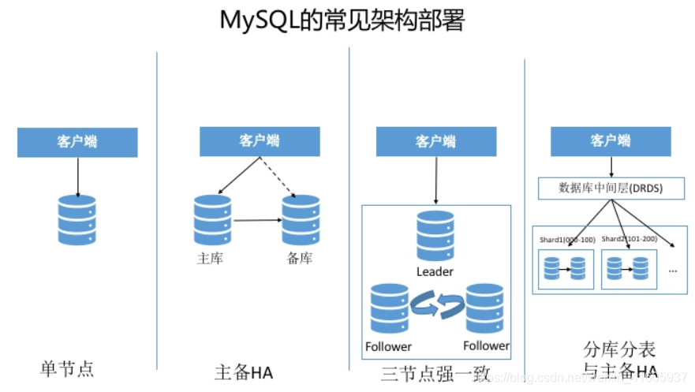
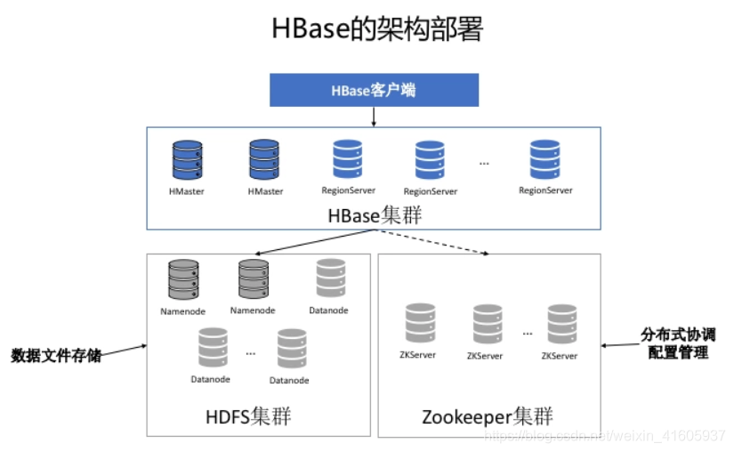
## 从引擎结构看差异
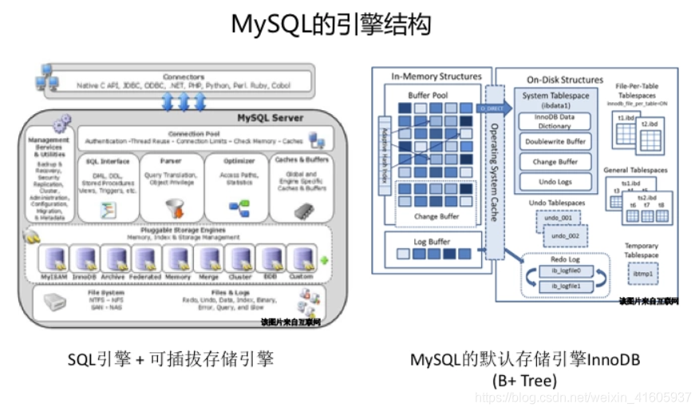

相比MySQL，HBase的内部引擎特点:

1. HBase原生没有SQL引擎(无法使用SQL访问，使用API)，云HBase增强版(Lindorm)及开源Phoenix均提供SQL能力
2. HBase使用LSM(Log-Structure Merge)树，,Innodb使用B+树。

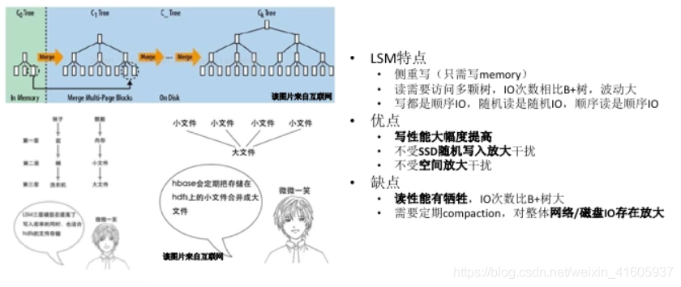
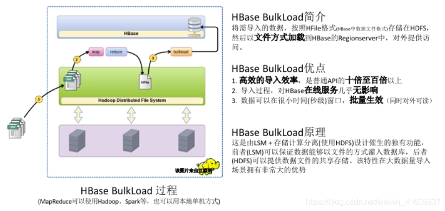

由引擎结构(B+Tree vs LSM Tree)看到的能力差异:

1. MySQL:读写均衡、存在空间碎片
2. HBase:侧重于写、存储紧凑无浪费、Io放大、数据导入能力强

## 关于LSM树和B+树的理解

目的是为了减少磁盘IO，
索引：某种数据结构，方便查找数据
hash索引不利于范围查询，使用树结构
### B+树
- 从磁盘读数据是以页为单位，根据这个特点使用平衡多路查找树
- B+树的非叶子节点存放索引，叶子节点存放数据
- 非叶子节点能够存放更多的索引，树的高度更低
- 叶子节点通过指针相连，有利于区间查询
- 叶子节点和根节点的距离基本相同，查找的效率稳定
- 数据插入导致叶子节点分裂，最终导致逻辑连续的数据存放到不同物理磁盘块位置，导致区间查询效率下降

### LSM Tree
- LSM（Log-Structured Merge），LevelDB，RocksDB，HBase，Cassandra等都是基于LSM结构
- HDD，SSD顺序读写的速度都高于随机读写，写入日志就是顺序写
- WAL，memtable，sstable
- 有利于写，不利于读，先从memtable查找，再到磁盘所有的sstable文件查找
- Compaction的目的是减少sstable文件数量，缓解读放大的问题，加速查找可以对sstable文件使用布隆过滤器
- Compaction策略
- STCS（SIze-Tiered Compaction Strategy）空间放大和读放大问题
- LCS（Leveled Compaction Strategy）写放大问题
- Compaction会引入写放大问题，在Value较大时采用KV分离存储缓解写放大
- 写操作多于读操作时，LSM树有更好的性能，因为随着insert操作，为了维护B+树结构，节点分裂。读磁盘的随机读写概率会变大，性能会逐渐减弱。LSM树相比于B+树，多次单页随机写变成一次多页随机写,复用了磁盘寻道时间，极大提高写性能。不过付出代价就是放弃部分读性能。
## 数据访问
相同之处:数据以表的模型进行逻辑组织，应用对数据进行增删改查
不同之处:MySQL的SQL功能更丰富:事务能力更强，HBase既可以用APIl进行更灵活、性能更好的访问，也可以借助Phoenix使用标准sQL访问;只支持单行事务
### HBase的特色功能--TTL
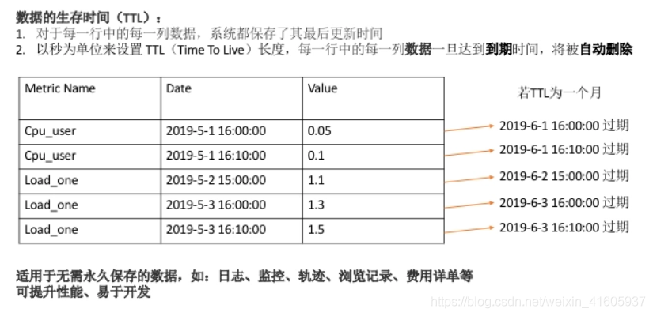
### HBase的特色功能—多版本
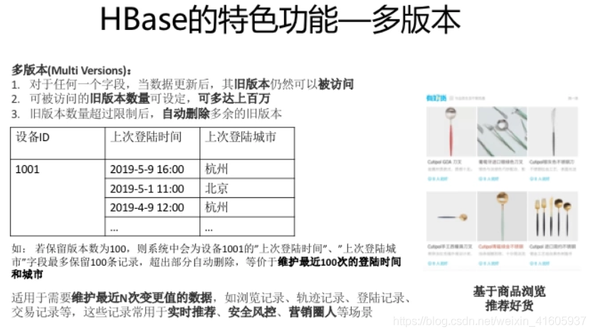
### HBase的特色功能—多列簇
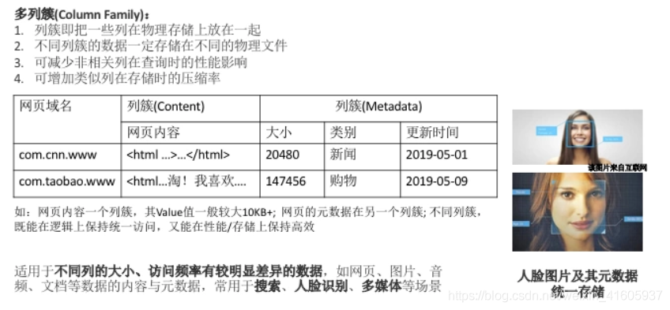
### HBase的特色功能—MOB
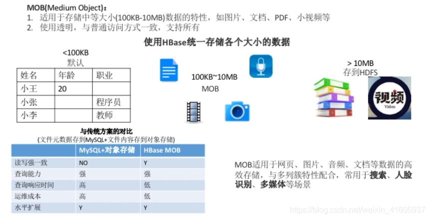
## 从生态看差异
MySQL:满足APP的在线数据库存储，一般有我足矣
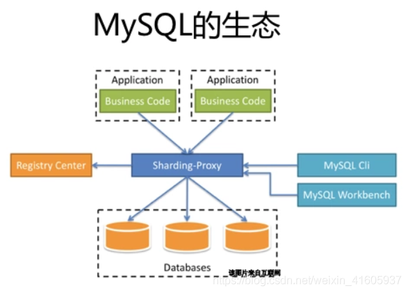
大数据圈:应用于大数据场景的存储、计算及管理组件
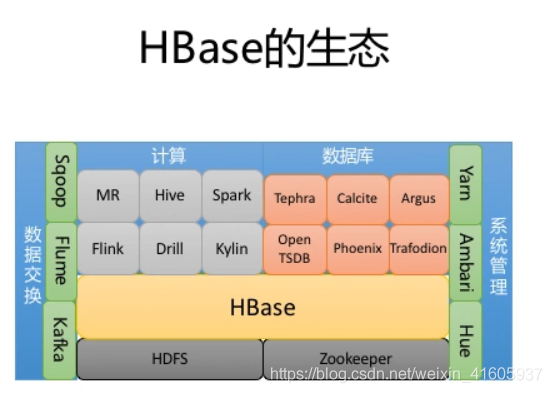
MySQL:一般可独立满足在线应用的数据存储需求，或者与少量组件配合(如缓存、分库中间件)
HBase:一般需要和较多大数据组件一起配合完成应用场景，场景架构的设计、实施存在较大的挑战
## 总结
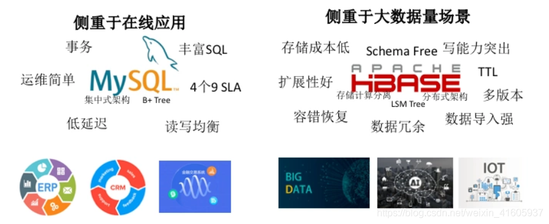

### 哪些场景的存储适合HBase ?
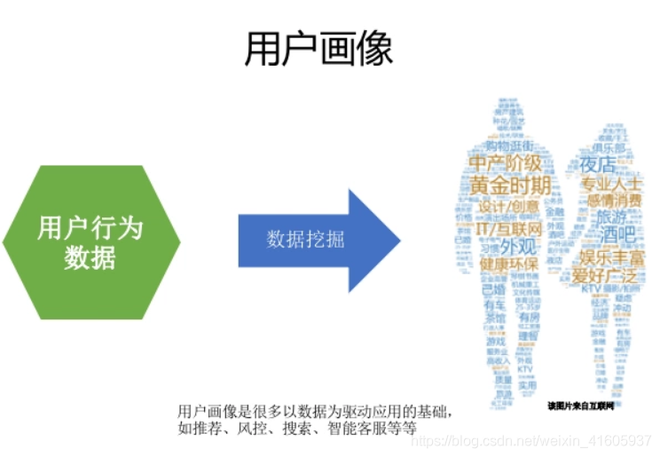
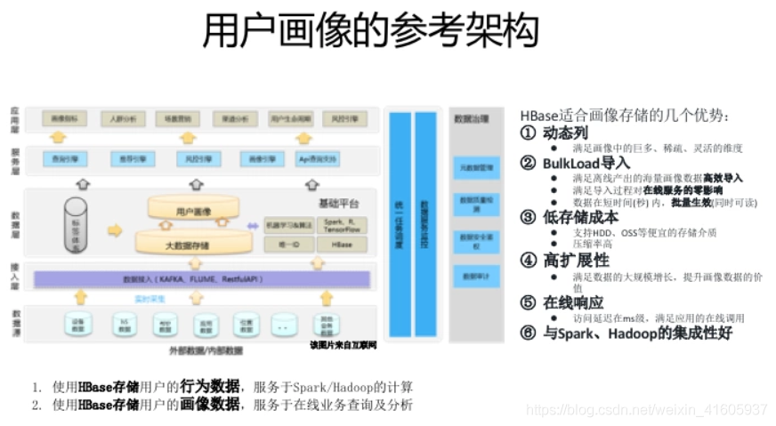
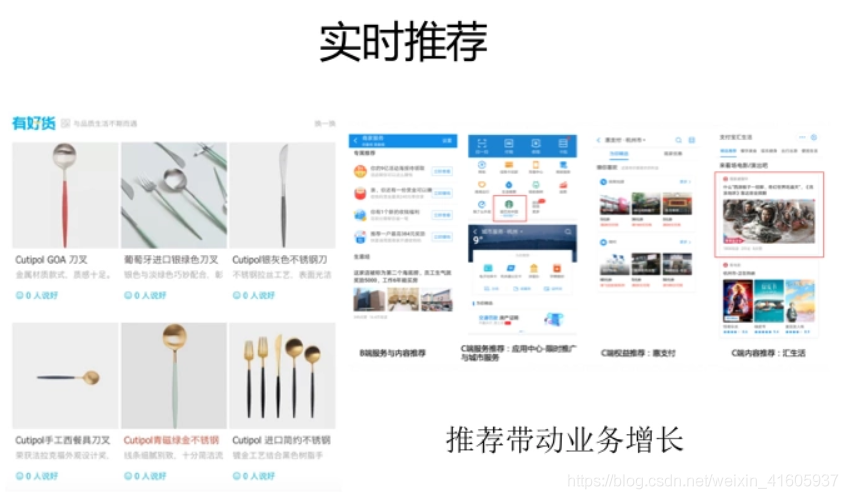
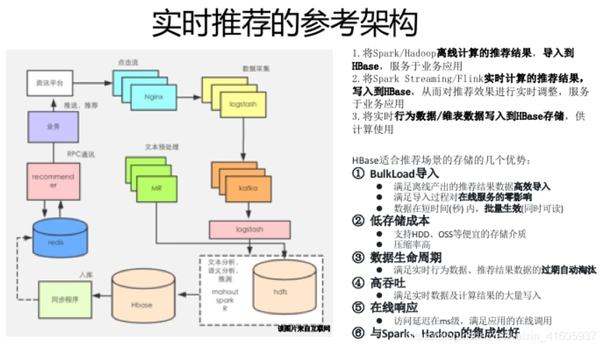
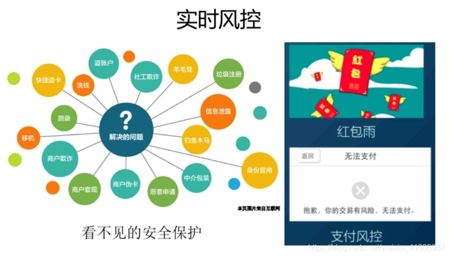
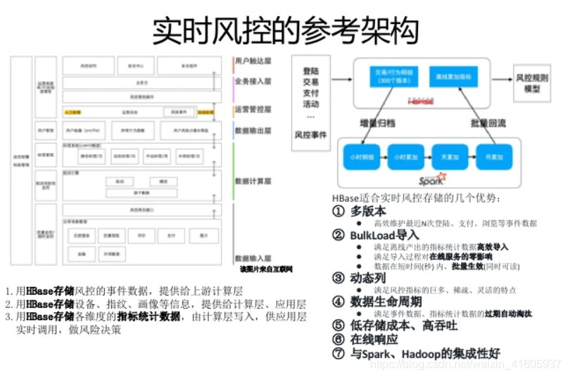
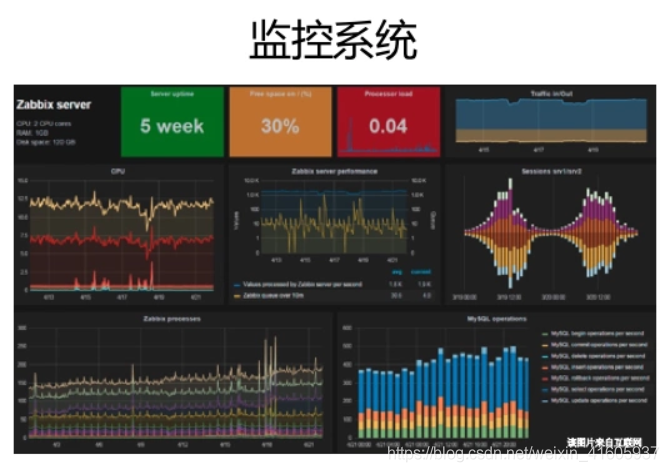
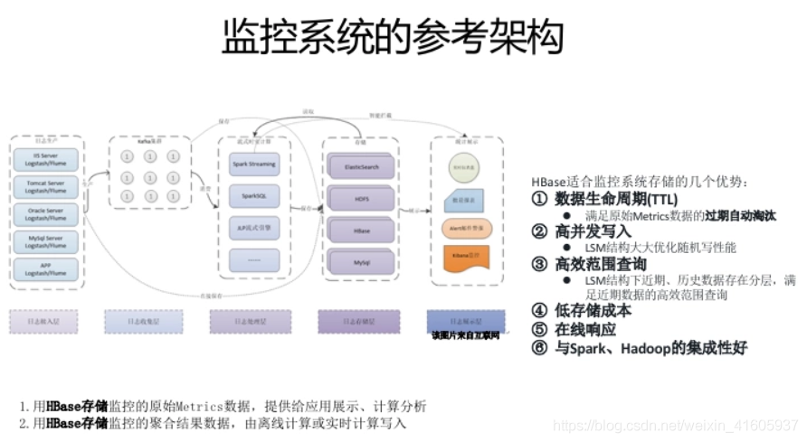
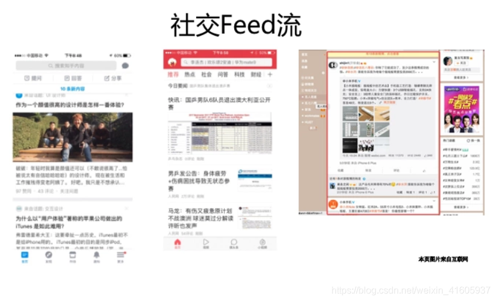
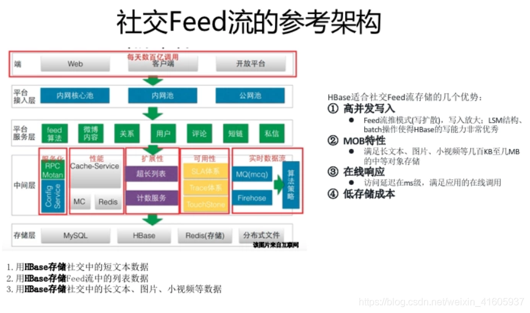
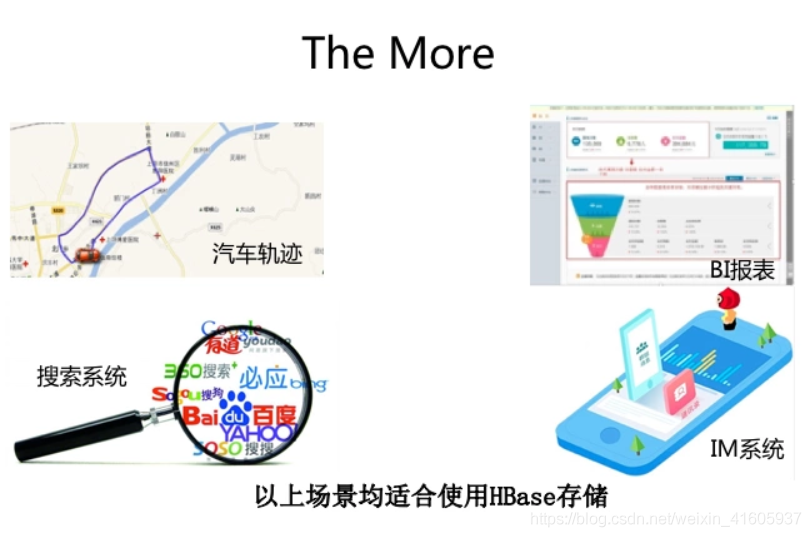
HBase不是MySQL的替换，HBase是业务规模及场景扩张后，对MySQL的自然延伸
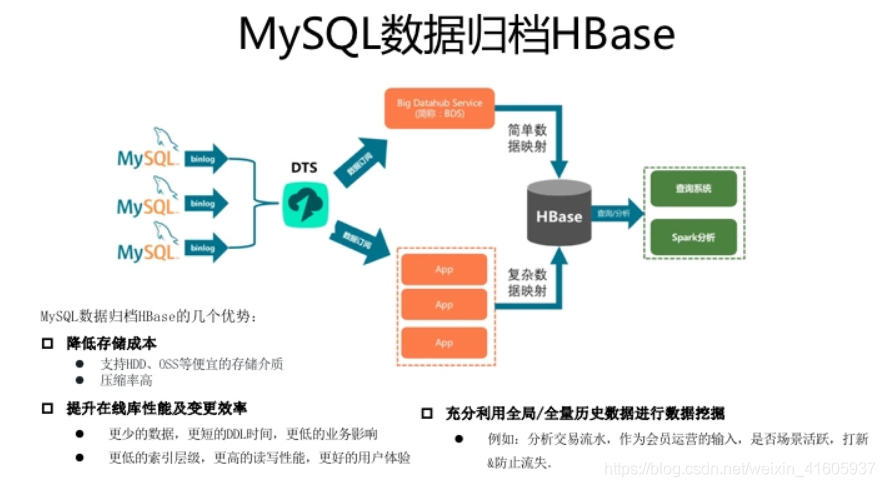

