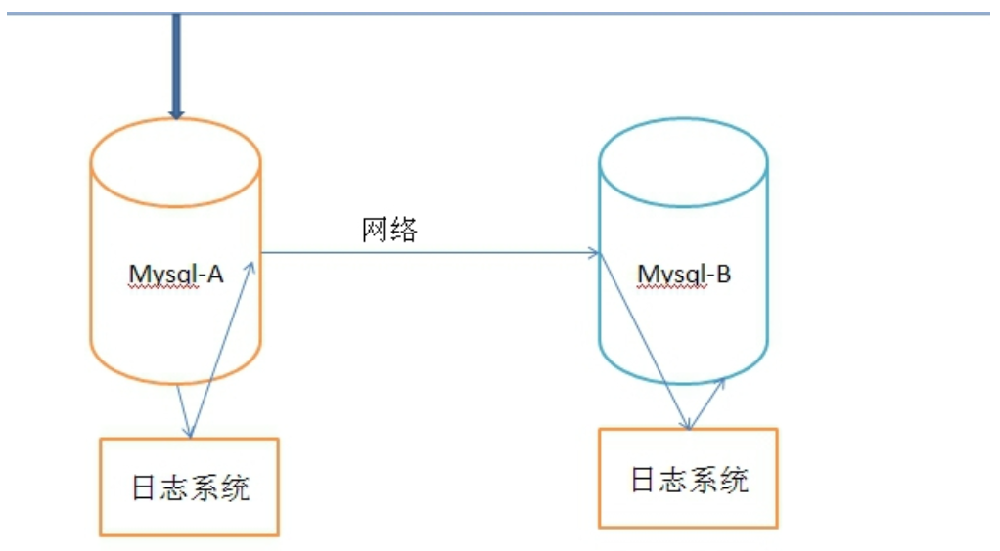
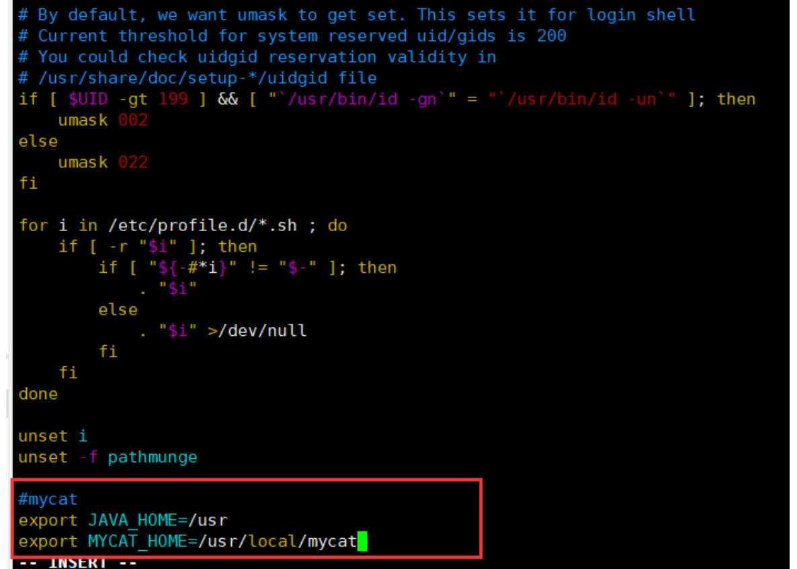
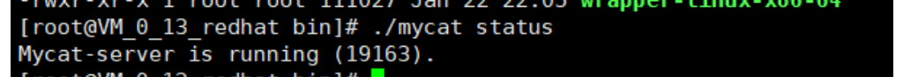
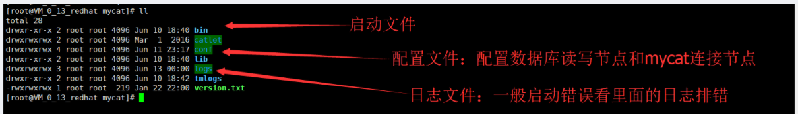
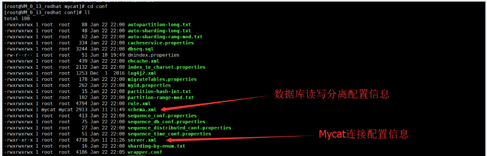
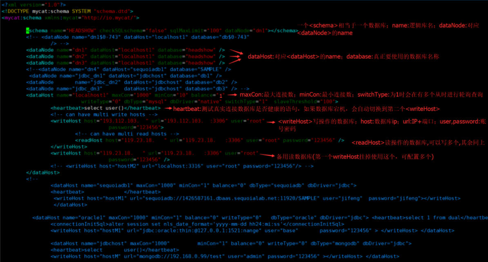
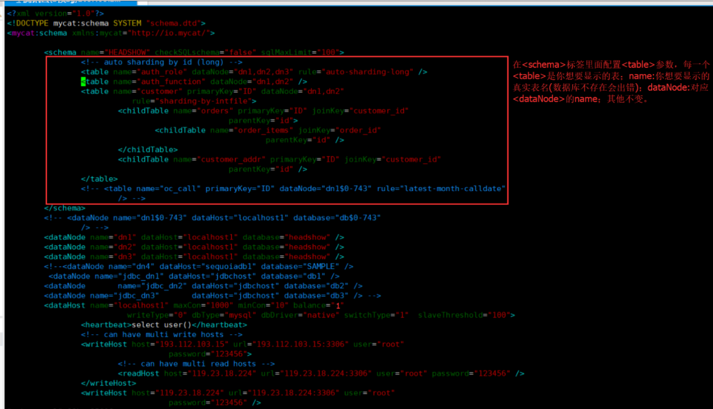
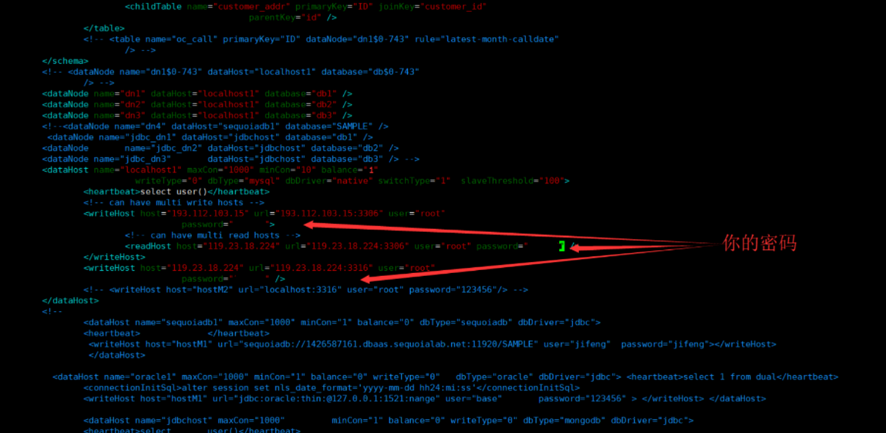
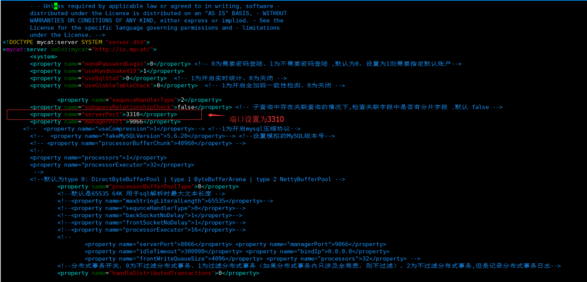
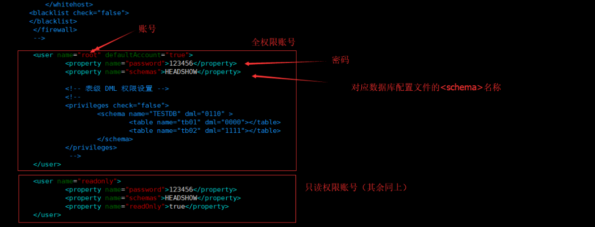

# Mysql实现读写分离

## 一、读写分离的思路
### 1.1 原理
顾名思义，读写分离基本的原理是让主数据库处理事务性增、改、删操作，而从数据库处理查询操作。数据库复制被用来把事务性操作导致的变更同步到集群中的从数据库。
大型网站为了软解大量的并发访问，除了在网站实现分布式负载均衡，远远不够。到了数据业务层、数据访问层，如果还是传统的数据结构，或者只是单单靠一台服务器来处理如此多的数据库连接操作，数据库必然会崩溃，特别是数据丢失的话，后果更是不堪设想。
利用主从数据库来实现读写分离，从而分担主数据库的压力。在多个服务器上部署mysql，将其中一台认为主数据库，而其他为从数据库，实现主从同步。其中主数据库负责主动写的操作，而从数据库则只负责主动读的操作（slave从数据库仍然会被动的进行写操作，为了保持数据一致性），这样就可以很大程度上的避免数据丢失的问题，同时也可减少数据库的连接，减轻主数据库的负载。

主从同步复制有以下几种方式：
1. 同步复制，master的变化，必须等待slave-1,slave-2,...,slave-n完成后才能返回。
2. 异步复制，master只需要完成自己的数据库操作即可，至于slaves是否收到二进制日志，是否完成操作，不用关心。MYSQL的默认设置。
3. 半同步复制，master只保证slaves中的一个操作成功，就返回，其他slave不管。这个功能，是由google为MYSQL引入的。

### 1.2 实现方式
实现方式有很多，但是不外乎分为内部配置和使用中间件，下面列举几个常用的方法：
1. 配置多个数据源，根据业务需求访问不同的数据，指定对应的策略：增加，删除，修改操作访问对应数据，查询访问对应数据，不同数据库做好的数据一致性的处理。由于此方法相对易懂，简单，不做过多介绍。
2. 动态切换数据源，根据配置的文件，业务动态切换访问的数据库:此方案通过Spring的AOP，AspactJ来实现动态织入，通过编程继承实现Spring中的AbstractRoutingDataSource,来实现数据库访问的动态切换，不仅可以方便扩展，不影响现有程序，而且对于此功能的增删也比较容易。
3. 通过mycat来实现读写分离:使用mycat提供的读写分离功能，mycat连接多个数据库，数据源只需要连接mycat，对于开发人员而言他还是连接了一个数据库(实际是mysql的mycat中间件)，而且也不需要根据不同业务来选择不同的库，这样就不会有多余的代码产生。

每个方法都有优缺点，我们选择对程序代码改动最小(只改数据源)的方法三，讲解mycat的配置和使用。
## 二、Mycat安装和配置
### 2.1安装步骤
```shell
#安装Java环境(mycat基于java)
yum install java-1.8.0-openjdk.x86_64 
# 下载mycat
wget http://dl.mycat.io/1.6.5/Mycat-server-1.6.5-release-20180122220033-linux.tar.gz
# 解压
tar -zxvf Mycat-server-1.6.5-release-20180122220033-linux.tar.gz
# 剪切到/usr/local下
mv mycat /usr/local/
# 创建专门运行mycat账号
adduser mycat
# 切换到mycat文件夹路径下
cd /usr/local
# 将文件权限赋给mycat账号
chown mycat:mycat -R mycat
#配置环境变量并添加 export JAVA_HOME=/usr export MYCAT_HOME=/usr/local/mycat(如下图所示)
vim /etc/profile
```

按Esc，输入:wq保存退出
```shell
# 刷新环境变量文件
source /etc/profile
# 切换mycat用户
su mycat
#切换目录
cd /usr/local/mycat/bin/
#启动mycat
./mycat start
```

好了，mycat启动成功，来看一下读写分离的配置和mycat的连接配置!
## 三、配置Mycat的读写分离
### 3.1 Mycat的目录结构
根目录

进到conf文件夹里面查看配置文件:

### 3.2 配置读写分离信息
```shell
#进入配置文件
vi /usr/local/mycat/conf/schema.xml
```
以下是两种配置方式和配置说明
1. 提供一个数据库内所有表的权限：

2. 只显示一个数据库的指定表:

这样对于数据库的读写信息就配置完成了；一般刚开始做，先使用第一种方法。

## 四、配置Mycat的连接信息(账号密码)
```shell
#进入配置文件
vi /usr/local/mycat/conf/server.xml
```
设置端口和mycat连接信息


对于<dataHost>标签，它里面重要的参数列举如下:
balance指的负载均衡类型，目前的取值有4种：
1. balance=”0”, 不开启读写分离机制，所有读操作都发送到当前可用的writeHost上。
2.  balance=”1”，全部的readHost与stand bywriteHost参与select语句的负载均衡，简单的说，当双主双从模式(M1->S1，M2->S2，并且M1与 M2互为主备)，正常情况下，M2,S1,S2都参与select语句的负载均衡。
3.  balance=”2”，所有读操作都随机的在writeHost、readhost上分发。
4.  balance=”3”，所有读请求随机的分发到wiriterHost对应的readhost执行，writerHost不负担读压力
注意：balance=3只在1.4及其以后版本有，1.3没有。

writeType属性：
1. writeType=”0”,所有写操作发送到配置的第一个writeHost,第一个挂了切到还生存的第二个writeHost,重新启动后以切换后的为准，切换记录在配置文件中:dnindex.properties.
2. writeType=”1”,所有写操作都随机地发送到配置的writeHost,1.5以后废弃不推荐。

switchType指的是切换的模式，目前的取值也有4种：
1. switchType=’-1’ 表示不自动切换
2. switchType=’1’ 默认值，表示自动切换
3. switchType=’2’ 基于MySQL主从同步的状态决定是否切换,心跳语句为 show slave status
4. switchType=’3’基于MySQLgalary cluster的切换机制（适合集群）（1.4.1），心跳语句为 show status like ‘wsrep%’。

注意：估计Mycat1.4才开始支持switchType。1.3版本配置该属性的话，日志里会报错：org.xml.sax.SAXParseException;lineNumber: 61; columnNumber: 86; Attribute “switchType” must bedeclared for element type “dataHost”。
MyCAT心跳检查询句配置为 show slave status ，dataHost 上定义两个新属性： switchType=”2” 与slaveThreshold=”100”，此时意味着开启MySQL主从复制状态绑定的读写分离与切换机制，Mycat心跳机制通过检测 show slave status 中的 “Seconds_Behind_Master”,”Slave_IO_Running”,”Slave_SQL_Running”三个字段来确定当前主从同步的状态及Seconds_Behind_Master主从复制时延，当Seconds_Behind_Master>slaveThreshold时，读写分离筛选器会过滤掉此Slave机器，防止读到很久以前的旧数据，当主节点宕机后，切换逻辑会检查Slave上的Seconds_Behind_Master是否为0，为0时则表示主仅同步，可安全切换，否则不会切换。

Mycat的配置到这里就算完成了，现在我们重启Mycat并连接测试
```shell
#切换路径
cd /usr/local/mycat/bin
#重启
./mycat restart
```
项目开发中，我们只需要将mysql的连接地址换成mycat的地址即可，无需任何其余操作，更不会造成多余的业务逻辑。