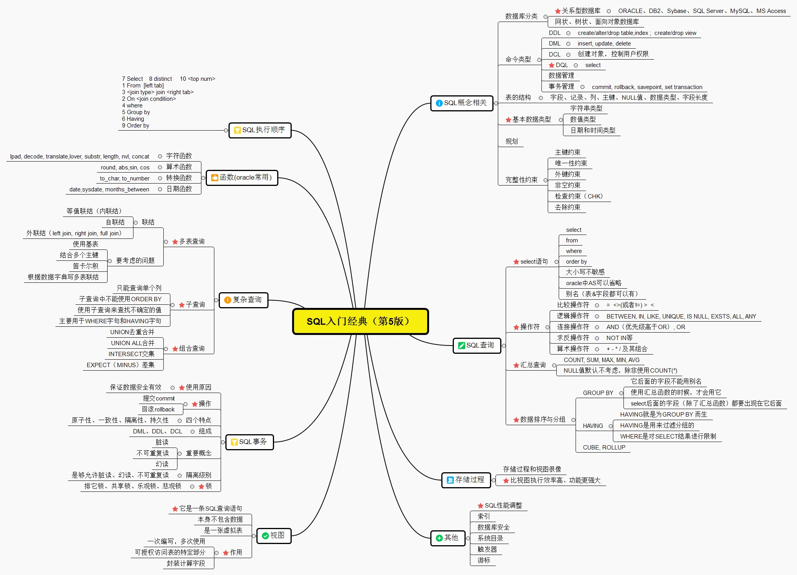
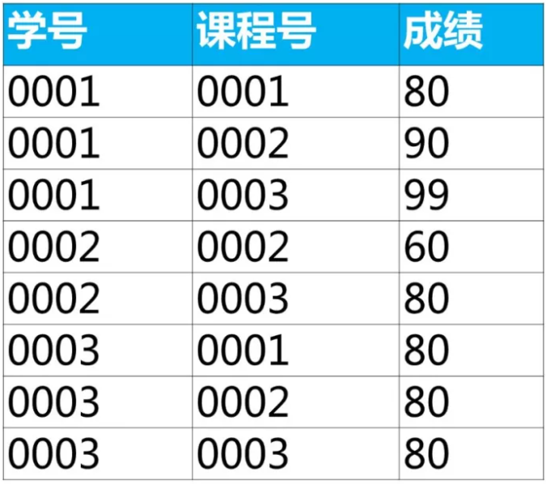
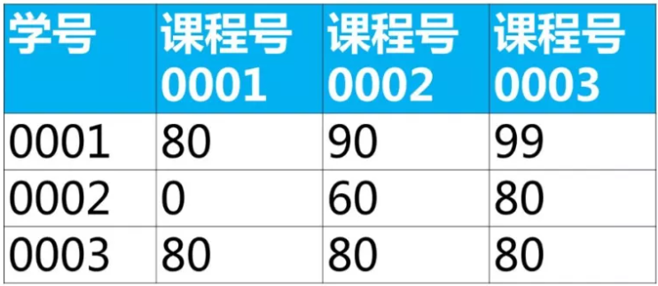
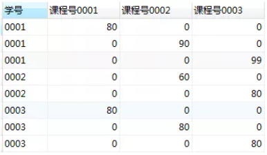
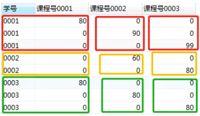
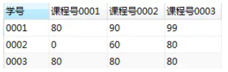

# 常见的SQL样例



## SQL基础知识整理

select 查询结果    如: [学号,平均成绩：组函数avg(成绩)]
from 从哪张表中查找数据   如:[涉及到成绩：成绩表score]
where 查询条件    如:[b.课程号='0003' and b.成绩>80]
group by 分组    如:[每个学生的平均：按学号分组]
	oracle,SQL server中出现在select 子句后的非分组函数，必须出现在group by子句后出现,MySQL中可以不用
having 对分组结果指定条件    如:[大于60分]
order by 对查询结果排序    如:[增序: 成绩  ASC / 降序: 成绩 DESC];
limit   使用limt子句返回topN（对应这个问题返回的成绩前两名）如:[ limit  2 ==>从0索引开始读取2个]
limit==>从0索引开始 [0,N-1]
```sql
select * from table limit 2,1;                
//含义是跳过2条取出1条数据，limit后面是从第2条开始读，读取1条信息，即读取第3条数据
select * from table limit 2 offset 1;     
//含义是从第1条（不包括）数据开始取出2条数据，limit后面跟的是2条数据，offset后面是从第1条开始读取，即读取第2,3条
```
组函数: 去重 distinct()  统计总数sum()   计算个数count()  平均数avg()  最大值max() 最小数min() 
多表连接: 内连接(省略默认inner) join ...on..左连接left join tableName as b on a.key ==b.key右连接right join  连接union(无重复(过滤去重))和union all(有重复[不过滤去重])
>
--union 并集
--union all(有重复)
oracle(SQL server)数据库
--intersect 交集 
--minus(except) 相减(差集)
- JOIN: 如果表中有至少一个匹配，则返回行
- LEFT JOIN: 即使右表中没有匹配，也从左表返回所有的行
- RIGHT JOIN: 即使左表中没有匹配，也从右表返回所有的行
- FULL JOIN: 只要其中一个表中存在匹配，就返回行


## oracle
### 数据库对象： 表(table)  视图(view)  序列(sequence)  索引(index)  同义词(synonym)

#### 视图: 存储起来的 select 语句
```sql
create view emp_vw
as
select employee_id, last_name, salary
from employees
where department_id = 90;

select * from emp_vw;
```
可以对简单视图进行 DML 操作
```sql
update emp_vw
set last_name = 'HelloKitty'
where employee_id = 100;

select * from employees
where employee_id = 100;
```
##### 复杂视图
```sql
create view emp_vw2
as
select department_id, avg(salary) avg_sal
from employees
group by department_id;

select * from emp_vw2;
```
复杂视图不能进行 DML 操作
```sql
update emp_vw2
set avg_sal = 10000
where department_id = 100;
```

#### 序列：用于生成一组有规律的数值。（通常用于为主键设置值）
```sql
create sequence emp_seq1
start with 1
increment by 1
maxvalue 10000
minvalue 1
cycle
nocache;

select emp_seq1.currval from dual;

select emp_seq1.nextval from dual;
```
问题：裂缝 
原因：
- 当多个表共用同一个序列时
- rollback
- 发生异常

```sql
create table emp1(
       id number(10),
       name varchar2(30)
);

insert into emp1
values(emp_seq1.nextval, '张三');

select * from emp1;
```
#### 索引：提高查询效率
自动创建：Oracle 会为具有唯一约束(唯一约束，主键约束)的列，自动创建索引
```sql
create table emp2(
       id number(10) primary key,
       name varchar2(30)
)
```
手动创建
```sql
create index emp_idx
on emp2(name);

create index emp_idx2
on emp2(id, name);
```
#### 同义词
```sql
create synonym d1 for departments;
select * from d1;
```
#### 表：
DDL ：数据定义语言 create table .../ drop table ... / rename ... to..../ truncate table.../alter table ...
DML : 数据操纵语言

insert into ... values ...
update ... set ... where ...
delete from ... where ...

【重要】
- select ... 组函数(MIN()/MAX()/SUM()/AVG()/COUNT())
- from ...join ... on ... 左外连接：left join ... on ... 右外连接: right join ... on ...
- where ... 
- group by ... (oracle,SQL server中出现在select 子句后的非分组函数，必须出现在 group by子句后)
- having ... 用于过滤 组函数
- order by ... asc 升序， desc 降序
- limit (0,4) 限制N条数据 如: topN数据
- union 并集
- union all(有重复)
- intersect 交集
- minus 相减

DCL : 数据控制语言  commit : 提交 / rollback : 回滚 / 授权grant…to…  /revoke
## 样例
问题：查询工资大于149号员工工资的员工的信息
```sql
select * 
from employees
where salary > (
      select salary
      from employees
      where employee_id = 149
)
```
问题：查询与141号或174号员工的manager_id和department_id相同的其他员工的employee_id, manager_id, department_id 
```sql
select employee_id, manager_id, department_id
from employees
where manager_id in (
      select manager_id
      from employees
      where employee_id in(141, 174)
) and department_id in (
      select department_id
      from employees
      where employee_id in(141, 174)
) and employee_id not in (141, 174);

select employee_id, manager_id, department_id
from employees
where (manager_id, department_id) in (
      select manager_id, department_id
      from employees
      where employee_id in (141, 174)
) and employee_id not in(141, 174);
```
问题：返回比本部门平均工资高的员工的last_name, department_id, salary及平均工资
```sql
select last_name, department_id, salary, (select avg(salary) from employees where department_id = e1.department_id)
from employees e1
where salary > (
      select avg(salary)
      from employees e2
      where e1.department_id = e2.department_id
)

select last_name, e1.department_id, salary, avg_sal
from employees e1, (
     select department_id, avg(salary) avg_sal
     from employees
     group by department_id
) e2
where e1.department_id = e2.department_id
and e1.salary > e2.avg_sal;
```
查询：若部门号为10 查看工资的 1.1 倍，部门号为 20 工资的1.2倍，其余 1.3 倍
```sql
select employee_id, last_name, salary, case department_id 
when 10 then salary * 1.1 
when 20 then salary * 1.2
else salary * 1.3
end "new_salary"
from employees;

select employee_id, last_name, salary, decode(department_id, 10, salary * 1.1,20, salary * 1.2,salary * 1.3) "new_salary"
from employees;
```
问题：显式员工的employee_id,last_name和location。其中，若员工department_id与location_id为1800的department_id相同，则location为’Canada’,其余则为’USA’。
```sql
select employee_id, last_name, case department_id when (
                    select department_id
                    from departments
                    where location_id = 1800
) then 'Canada' else 'USA' end "location"
from employees;
```
问题：查询员工的employee_id,last_name,要求按照员工的department_name排序
```sql
select employee_id, last_name
from employees e1
order by (
      select department_name
      from departments d1
      where e1.department_id = d1.department_id
)
```
问题：查询公司管理者的employee_id,last_name,job_id,department_id信息
SQL 优化：能使用 EXISTS 就不要使用 IN
```sql
select employee_id, last_name, job_id, department_id
from employees
where employee_id in (
      select manager_id
      from employees
)
select employee_id, last_name, job_id, department_id
from employees e1
where exists (
      select 'x'
      from employees e2
      where e1.employee_id = e2.manager_id
) 
```
问题：查询departments表中，不存在于employees表中的部门的department_id和department_name
```sql
select department_id, department_name
from departments d1
where not exists (
      select 'x'
      from employees e1
      where e1.department_id = d1.department_id
)
```
问题：更改 108 员工的信息: 使其工资变为所在部门中的最高工资, job 变为公司中平均工资最低的 job
```sql
update employees e1
set salary = (
    select max(salary)
    from employees e2
    where e1.department_id = e2.department_id
), job_id = (
   select job_id
   from employees
   group by job_id
   having avg(salary) = (
         select min(avg(salary))
         from employees
         group by job_id
   )
)
where employee_id = 108;
```
问题： 删除 108 号员工所在部门中工资最低的那个员工.
```sql
delete from employees e1
where salary = (
      select min(salary)
      from employees
      where department_id = (
            select department_id
            from employees
            where employee_id = 108
      )
)
select * from employees where employee_id = 108;
select * from employees where department_id = 100
order by salary;
rollback;
```
### 常见的SQL面试题：经典50题
已知有如下4张表：
学生表：student(学号,学生姓名,出生年月,性别)
成绩表：score(学号,课程号,成绩)
课程表：course(课程号,课程名称,教师号)
教师表：teacher(教师号,教师姓名)
根据以上信息按照下面要求写出对应的SQL语句。

查询课程编号为“0002”的总成绩
```sql
*
分析思路
select 查询结果 [总成绩:汇总函数sum]
from 从哪张表中查找数据[成绩表score]
where 查询条件 [课程号是0002]
*/
select sum(成绩)
from score
where 课程号 = '0002';
```
查询选了课程的学生人数
```sql
/*
这个题目翻译成大白话就是：查询有多少人选了课程
select 学号，成绩表里学号有重复值需要去掉
from 从课程表查找score;
*/
select count(distinct 学号) as 学生人数 
from score;
```
查询各科成绩最高和最低的分， 以如下的形式显示：课程号，最高分，最低分
```sql
/*
分析思路
select 查询结果 [课程ID：是课程号的别名,最高分：max(成绩) ,最低分：min(成绩)]
from 从哪张表中查找数据 [成绩表score]
where 查询条件 [没有]
group by 分组 [各科成绩：也就是每门课程的成绩，需要按课程号分组];
*/
select 课程号,max(成绩) as 最高分,min(成绩) as 最低分
from score
group by 课程号;
```
查询每门课程被选修的学生数
```sql
/*
分析思路
select 查询结果 [课程号，选修该课程的学生数：汇总函数count]
from 从哪张表中查找数据 [成绩表score]
where 查询条件 [没有]
group by 分组 [每门课程：按课程号分组];
*/
select 课程号, count(学号)
from score
group by 课程号;
```
查询男生、女生人数
```sql
/*
分析思路
select 查询结果 [性别，对应性别的人数：汇总函数count]
from 从哪张表中查找数据 [性别在学生表中，所以查找的是学生表student]
where 查询条件 [没有]
group by 分组 [男生、女生人数：按性别分组]
having 对分组结果指定条件 [没有]
order by 对查询结果排序[没有];
*/
select 性别,count(*)
from student
group by 性别;
```
查询平均成绩大于60分学生的学号和平均成绩
```sql
/* 
题目翻译成大白话：
平均成绩：展开来说就是计算每个学生的平均成绩
这里涉及到“每个”就是要分组了
平均成绩大于60分，就是对分组结果指定条件
 
分析思路
select 查询结果 [学号，平均成绩：汇总函数avg(成绩)]
from 从哪张表中查找数据 [成绩在成绩表中，所以查找的是成绩表score]
where 查询条件 [没有]
group by 分组 [平均成绩：先按学号分组，再计算平均成绩]
having 对分组结果指定条件 [平均成绩大于60分]
*/
select 学号, avg(成绩)
from score
group by 学号
having avg(成绩)>60;
```
查询至少选修两门课程的学生学号
```sql
/* 
翻译成大白话：
第1步，需要先计算出每个学生选修的课程数据，需要按学号分组
第2步，至少选修两门课程：也就是每个学生选修课程数目>=2，对分组结果指定条件
 
分析思路
select 查询结果 [学号,每个学生选修课程数目：汇总函数count]
from 从哪张表中查找数据 [课程的学生学号：课程表score]
where 查询条件 [至少选修两门课程：需要先计算出每个学生选修了多少门课，需要用分组，所以这里没有where子句]
group by 分组 [每个学生选修课程数目：按课程号分组，然后用汇总函数count计算出选修了多少门课]
having 对分组结果指定条件 [至少选修两门课程：每个学生选修课程数目>=2]
*/
select 学号, count(课程号) as 选修课程数目
from score
group by 学号
having count(课程号)>=2;
```
查询同名同性学生名单并统计同名人数
```sql
/* 
翻译成大白话，问题解析：
1）查找出姓名相同的学生有谁，每个姓名相同学生的人数
查询结果：姓名,人数
条件：怎么算姓名相同？按姓名分组后人数大于等于2，因为同名的人数大于等于2
分析思路
select 查询结果 [姓名,人数：汇总函数count(*)]
from 从哪张表中查找数据 [学生表student]
where 查询条件 [没有]
group by 分组 [姓名相同：按姓名分组]
having 对分组结果指定条件 [姓名相同：count(*)>=2]
order by 对查询结果排序[没有];
*/
 
select 姓名,count(*) as 人数
from student
group by 姓名
having count(*)>=2;
```
查询不及格的课程并按课程号从大到小排列
```sql
/* 
分析思路
select 查询结果 [课程号]
from 从哪张表中查找数据 [成绩表score]
where 查询条件 [不及格：成绩 <60]
group by 分组 [没有]
having 对分组结果指定条件 [没有]
order by 对查询结果排序[课程号从大到小排列：降序desc];
*/
select 课程号
from score 
where 成绩<60
order by 课程号 desc;
```
查询每门课程的平均成绩，结果按平均成绩升序排序，平均成绩相同时，按课程号降序排列
```sql
/* 
分析思路
select 查询结果 [课程号,平均成绩：汇总函数avg(成绩)]
from 从哪张表中查找数据 [成绩表score]
where 查询条件 [没有]
group by 分组 [每门课程：按课程号分组]
having 对分组结果指定条件 [没有]
order by 对查询结果排序[按平均成绩升序排序:asc，平均成绩相同时，按课程号降序排列:desc];
*/
select 课程号, avg(成绩) as 平均成绩
from score
group by 课程号
order by 平均成绩 asc,课程号 desc;
```
检索课程编号为“0004”且分数小于60的学生学号，结果按按分数降序排列
```sql
/* 
分析思路
select 查询结果 []
from 从哪张表中查找数据 [成绩表score]
where 查询条件 [课程编号为“04”且分数小于60]
group by 分组 [没有]
having 对分组结果指定条件 []
order by 对查询结果排序[查询结果按按分数降序排列];
*/
select 学号
from score
where 课程号='04' and 成绩 <60
order by 成绩 desc;
```
统计每门课程的学生选修人数(超过2人的课程才统计)
要求输出课程号和选修人数，查询结果按人数降序排序，若人数相同，按课程号升序排序
```sql
/* 
分析思路
select 查询结果 [要求输出课程号和选修人数]
from 从哪张表中查找数据 []
where 查询条件 []
group by 分组 [每门课程：按课程号分组]
having 对分组结果指定条件 [学生选修人数(超过2人的课程才统计)：每门课程学生人数>2]
order by 对查询结果排序[查询结果按人数降序排序，若人数相同，按课程号升序排序];
*/
select 课程号, count(学号) as '选修人数'
from score
group by 课程号
having count(学号)>2
order by count(学号) desc,课程号 asc;
```
查询两门以上不及格课程的同学的学号及其平均成绩
```sql
/*
分析思路
先分解题目：
1）[两门以上][不及格课程]限制条件
2）[同学的学号及其平均成绩]，也就是每个学生的平均成绩，显示学号，平均成绩
分析过程：
第1步：得到每个学生的平均成绩，显示学号，平均成绩
第2步：再加上限制条件：
1）不及格课程
2）两门以上[不及格课程]：课程数目>2
 
 
/* 
第1步：得到每个学生的平均成绩，显示学号，平均成绩
select 查询结果 [学号,平均成绩：汇总函数avg(成绩)]
from 从哪张表中查找数据 [涉及到成绩：成绩表score]
where 查询条件 [没有]
group by 分组 [每个学生的平均：按学号分组]
having 对分组结果指定条件 [没有]
order by 对查询结果排序[没有];
*/
select 学号, avg(成绩) as 平均成绩
from score
group by 学号;
 
 
/* 
第2步：再加上限制条件：
1）不及格课程
2）两门以上[不及格课程]
select 查询结果 [学号,平均成绩：汇总函数avg(成绩)]
from 从哪张表中查找数据 [涉及到成绩：成绩表score]
where 查询条件 [限制条件：不及格课程，平均成绩<60]
group by 分组 [每个学生的平均：按学号分组]
having 对分组结果指定条件 [限制条件：课程数目>2,汇总函数count(课程号)>2]
order by 对查询结果排序[没有];
*/
select 学号, avg(成绩) as 平均成绩
from score
where 成绩 <60
group by 学号
having count(课程号)>=2;
```
查询所有课程成绩小于60分学生的学号、姓名
```sql
【知识点】子查询
 
1.翻译成大白话
1）查询结果：学生学号，姓名
2）查询条件：所有课程成绩 < 60 的学生，需要从成绩表里查找，用到子查询
 
第1步，写子查询（所有课程成绩 < 60 的学生）
select 查询结果[学号]
from 从哪张表中查找数据[成绩表：score]
where 查询条件[成绩 < 60]
group by 分组[没有]
having 对分组结果指定条件[没有]
order by 对查询结果排序[没有]
limit 从查询结果中取出指定行[没有];
 
select 学号 
from score
where 成绩 < 60;
 
第2步，查询结果：学生学号，姓名，条件是前面1步查到的学号
 
select 查询结果[学号,姓名]
from 从哪张表中查找数据[学生表:student]
where 查询条件[用到运算符in]
group by 分组[没有]
having 对分组结果指定条件[没有]
order by 对查询结果排序[没有]
limit 从查询结果中取出指定行[没有];
*/
select 学号,姓名
from student
where  学号 in (
select 学号 
from score
where 成绩 < 60
);
```
查询没有学全所有课的学生的学号、姓名
```sql
/*
查找出学号，条件：没有学全所有课，也就是该学生选修的课程数 < 总的课程数
【考察知识点】in，子查询
*/
select 学号,姓名
from student
where 学号 in(
select 学号 
from score
group by 学号
having count(课程号) < (select count(课程号) from course)
);
```
查询出只选修了两门课程的全部学生的学号和姓名
```sql
select 学号,姓名
from student
where 学号 in(
select 学号
from score
group by 学号
having count(课程号)=2
);
```
1990年出生的学生名单
```sql
/*
查找1990年出生的学生名单
学生表中出生日期列的类型是datetime
*/
select 学号,姓名 
from student 
where year(出生日期)=1990; 
```
按课程号分组取成绩最大值所在行的数据
```sql
/*
我们可以使用分组（group by）和汇总函数得到每个组里的一个值（最大值，最小值，平均值等）。但是无法得到成绩最大值所在行的数据。
*/
select 课程号,max(成绩) as 最大成绩
from score 
group by 课程号;
/*可以使用关联子查询来实现*/
select * 
from score as a 
where 成绩 = (
select max(成绩) 
from score as b 
where b.课程号 = a.课程号);
```
按课程号分组取成绩最小值所在行的数据
```sql
select * 
from score as a 
where 成绩 = (
select min(成绩) 
from score as b 
where b.课程号 = a.课程号);
```
查询各科成绩前两名的记录
```sql
/*
第1步，查出有哪些组
我们可以按课程号分组，查询出有哪些组，对应这个问题里就是有哪些课程号
select 课程号,max(成绩) as 最大成绩
from score 
group by 课程号;
第2步：先使用order by子句按成绩降序排序（desc），然后使用limt子句返回topN（对应这个问题返回的成绩前两名）
-- 课程号'0001' 这一组里成绩前2名
select * 
from score 
where 课程号 = '0001' 
order by 成绩  desc 
limit 2;
第3步，使用union all 将每组选出的数据合并到一起
-- 左右滑动可以可拿到全部sql
(select * from score where 课程号 = '0001' order by 成绩  desc limit 2)
union all
(select * from score where 课程号 = '0002' order by 成绩  desc limit 2)
union all
(select * from score where 课程号 = '0003' order by 成绩  desc limit 2);
*/
```
查询所有学生的学号、姓名、选课数、总成绩
```sql
selecta.学号,a.姓名,count(b.课程号) as 选课数,sum(b.成绩) as 总成绩
from student as a left join score as b
on a.学号 = b.学号
group by a.学号;
```
查询平均成绩大于85的所有学生的学号、姓名和平均成绩
```sql
select a.学号,a.姓名, avg(b.成绩) as 平均成绩
from student as a left join score as b
on a.学号 = b.学号
group by a.学号
having avg(b.成绩)>85;
```
查询学生的选课情况：学号，姓名，课程号，课程名称
```sql
select a.学号, a.姓名, c.课程号,c.课程名称
from student a inner join score b on a.学号=b.学号
inner join course c on b.课程号=c.课程号;
```
查询出每门课程的及格人数和不及格人数
```sql
-- 考察case表达式
select 课程号,
sum(case when 成绩>=60 then 1 
	 else 0 
    end) as 及格人数,
sum(case when 成绩 <  60 then 1 
	 else 0 
    end) as 不及格人数
from score
group by 课程号;
```
使用分段[100-85],[85-70],[70-60],[<60]来统计各科成绩，分别统计：各分数段人数，课程号和课程名称
```sql
-- 考察case表达式
select a.课程号,b.课程名称,
sum(case when 成绩 between 85 and 100 
	 then 1 else 0 end) as '[100-85]',
sum(case when 成绩 >=70 and 成绩<85 
	 then 1 else 0 end) as '[85-70]',
sum(case when 成绩>=60 and 成绩<70  
	 then 1 else 0 end) as '[70-60]',
sum(case when 成绩<60 then 1 else 0 end) as '[<60]'
from score as a right join course as b 
on a.课程号=b.课程号
group by a.课程号,b.课程名称;
```
查询课程编号为0003且课程成绩在80分以上的学生的学号和姓名
```sql
select a.学号,a.姓名
from student  as a inner join score as b on a.学号=b.学号
where b.课程号='0003' and b.成绩>80;
```
下面是学生的成绩表（表名score，列名：学号、课程号、成绩）

使用sql实现将该表行转列为下面的表结构

【解答】
第1步，使用常量列输出目标表的结构
可以看到查询结果已经和目标表非常接近了
```sql
select 学号,'课程号0001','课程号0002','课程号0003'
from score;
```

第2步，使用case表达式，替换常量列为对应的成绩
```sql
select 学号,
(case 课程号 when '0001' then 成绩 else 0 end) as '课程号0001',
(case 课程号 when '0002' then 成绩 else 0 end) as  '课程号0002',
(case 课程号 when '0003' then 成绩 else 0 end) as '课程号0003'
from score;
```

在这个查询结果中，每一行表示了某个学生某一门课程的成绩。比如第一行是'学号0001'选修'课程号00001'的成绩，而其他两列的'课程号0002'和'课程号0003'成绩为0。
每个学生选修某门课程的成绩在下图的每个方块内。我们可以通过分组，取出每门课程的成绩。

第3步，分组，并使用最大值函数max取出上图每个方块里的最大值

```sql
select 学号,
max(case 课程号 when '0001' then 成绩 else 0 end) as '课程号0001',
max(case 课程号 when '0002' then 成绩 else 0 end) as '课程号0002',
max(case 课程号 when '0003' then 成绩 else 0 end) as '课程号0003'
from score
group by 学号;
```
这样我们就得到了目标表（行列互换）
