[TOC]
# 非功能测试

## 一、性能测试

### 1.1客户端

#### 1.1.1Web（前端页面性能）

##### 工具

###### Google Chrome浏览器

Ctrl+Shift+I/F12开发工具

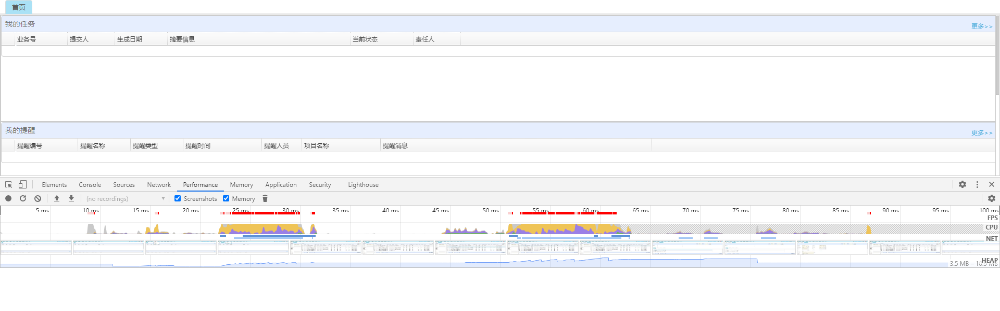

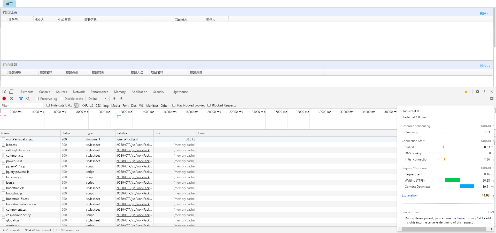

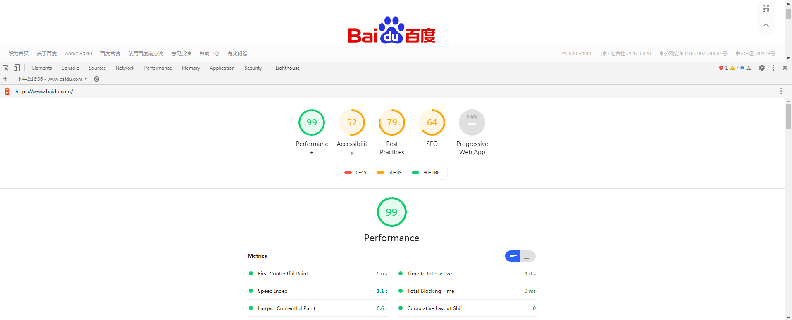

###### Mozilla Firefox浏览器

Shift+F5开发工具


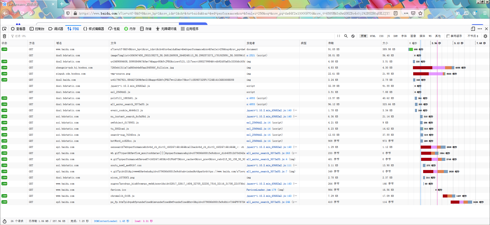

#### 1.1.2手机

##### Android

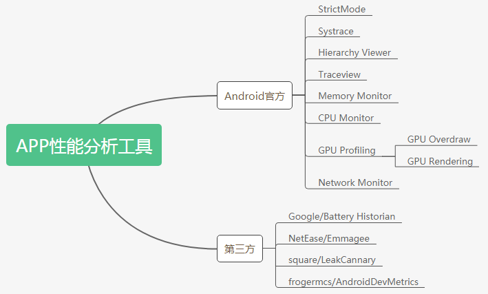

###### Systrace

systrace命令允许你收集和检查在你的设备上运行的所有系统级别进程的定时信息。它联合Android内核（比如CPU调度程序）、磁盘活动和app线程，生成一份HTML报告。

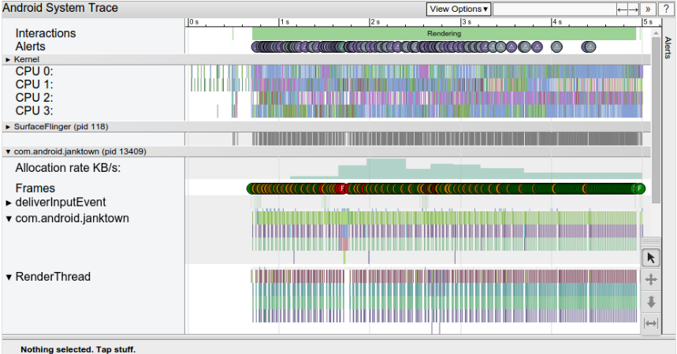

###### Emmagee

[Emmagee下载](https://code.google.com/archive/p/emmagee/downloads)、[NetEase/Emmagee · GitHub](https://github.com/NetEase/Emmagee/releases)，网易开发的性能检测工具，不需要在应用中集成sdk，能够对应用的常用性能指标进行检测，并以csv的格式保存方便查看应用的各项参数。

Emmagee是一个简单易上手的Android性能监测工具，主要用于监测单个App的CPU、内存、流量、电量、电流帧数以及整体性能状态，同时支持自定义的监控频率以及性能数据的实时显示。
该工具的优势在于如同windows系统性能监视器类似，它提供的是数据采集的功能，而行为则基于用户真实的应用操作。

<div align="center">

</div>
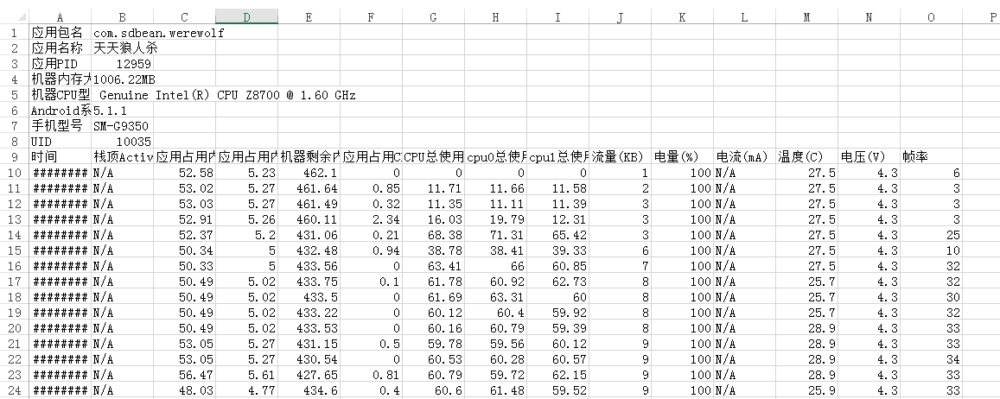

##### Android APP性能测试步骤

1. 设计场景 ：手工或自动化工具
2. 获取数据：可获取的数据包括：内存、CPU、电量功耗、hprof (内存泄露分析文件)、响应时间等。配合手工或自动化工具来获取数据（最好多取几次，并且每次配合不同的设备取平均值）作为最后的对比分析。
3. 结果分析 ：拿到数据后，分析哪些模块的数据异常，再去Check code来定位问题

##### Android APP测试方法

1. 压力测试
APP压力测试是在强负载（大数据量、大量并发用户等）下，模拟APP的软硬件环境的测试，查看APP在峰值使用情况下操作行为，从而有效地发现APP的功能隐患、测试系统是否具有良好的容错能力和可恢复能力。压力测试分为高负载下的长时间（如24小时以上）的稳定性压力测试和极限负载情况下导致系统崩溃的破坏性压力测试。通过压力测试，可以更快地发现内存泄漏问题，还可以更快地发现影响系统稳定性的问题。压力测试法用来测试目标系统在一定饱和状态下，例如CPU、内存等在饱和状态下、系统能够处理的session的能力，以及系统是否会出现错误。
```
例如：测试Android APP，耗时2小时，通过Google原生测试工具monkey对APP进行模拟用户随机操作测试，根据用户选择的频率输入大量点击，滑动等操作事件及导航事件等伪随机事件，让APP在一个稳定的压力负荷下运行，同时检测应用的各项运行参数。
```
2. 遍历测试
Android APP最常见的测试就是菜单遍历，就是反复遍历菜单N次，可以理解为遍历APP的每个activity。Activity是Android应用层开发的四大组件之一，主要负责和用户交互部分，有自己的生命周期，在其上可以布置按钮，文本框等各种控件，简单来说就是Android的UI部分。遍历activity就是每次获取当前activity所有的view，然后每个view都有若干操作，基于这些操作生成树状结构，进行遍历，每次执行一个操作后，update当前activity的view。
```
例如：耗时2小时，通过脚本以用户选择的操作对APP进行循环遍历APP菜单进行测试，同时检测APP的各项运行参数。
```
3. 空载测试
空载测试是指不介入负载的情况下，对APP进行测试。APP的空子测试常常是为了测试APP后台运行期间的CPU占有率，内存消耗，流量及电量消耗等。
```
例如：耗时30分钟，启APP后按HOME键退出，让应用在后台运行，同时检测应用的各项运行参数。
```
##### 指标

数据性能指标：

- 应用占用内存PSS(MB)：应用当前占内存的大小；
- 应用占用内存比(%)：应有占总内存的百分比；
- 机器剩余内存(MB)：机器当前剩余内存；
- 应用占用CPU率(%)：应用占用总CPU的百分比；
- CPU总使用率(%)：CPU的总使用率，包括当前应有，和系统的所有运行的应有；
- CPU0-CPU3是因为手机是多核的（4核显示cpu0-cpu3，10核显示到cpu0-cpu9）
- 流量(KB)：从检测开始共耗用的流量；
- 电量(%)：剩余电池的百分比，包括其他应用的，这个是有误差的，所以测试期间尽可能关闭其他软件，或者期间别操作其他的应用，避免带来误差；
- 电流(mA)：小于0是放电大于0是充电；
- 温度(C)：手机当前的温度；
- 电压(V)：电池工作电压；
- 帧率：不确定是两次取数之间的平均帧率还是取数据的瞬间帧率。


### 1.2服务端

#### 1.2.1测试工具

##### Loadruner

性能测试是利用产品、人员和流程来降低应用程序、升级程序或补丁程序部署风险的一种手段。性能测试的主要思想是通过模拟产生真实业务的压力对被测系统进行加压，验证被测系统在不同压力情况下的表现，找出其潜在的瓶颈。

LoadRunner提供了3大主要功能模块：VirtualUser Generator（用于录制性能测试脚本），LoadRunner Controller（用于创建、运行和监控场景），LoadRunner Analysis（用于分析性能测试结果）既可以作为独立的工具完成各自的功能，又可以作为LoadRunner的一部分彼此衔接，与其他模块共同完成软件性能的整体测试。

##### Jmeter

JMeter作为一款广为流传的开源压测产品，最初被设计用于Web应用测试，如今JMeter可以用于测试静态和动态资源，例如静态文件、Java 小服务程序、CGI 脚本、Java 对象、数据库、FTP服务器等等，还能对服务器、网络或对象模拟巨大的负载，通过不同压力类别测试它们的强度和分析整体性能。另外，JMeter能够对应用程序做功能测试和回归测试，通过创建带有断言的脚本来验证你的程序返回了你期望的结果。为了最大限度的灵活性，JMeter允许使用正则表达式创建断言。

JMeter的特点包括对HTTP、FTP服务器、数据库进行压力测试和性能测试；完全的可移植性；完全 Swing和轻量组件支持包；完全多线程；缓存和离线分析/回放测试结果；可链接的取样器；具有提供动态输入到测试的功能；支持脚本编程的取样器等。在设计阶段，JMeter能够充当HTTP PROXY（代理）来记录浏览器的HTTP请求，也可以记录Apache等WebServer的log文件来重现HTTP流量，并在测试运行时以此为依据设置重复次数和并发度（线程数）来进行压测。

##### Neoload

NeoLoad是Neotys出品的一种负载和性能测试工具，可真实地模拟用户活动并监视基础架构运行状态，从而消除所有Web和移动应用程序中的瓶颈。NeoLoad通过使用无脚本GUI和一系列自动化功能，可让测试设计速度提高5-10倍，并将维护的脚本维持在原始设计时间的10％，同时帮助用户使用持续集成系统自动进行测试。

NeoLoad支持WebSocket、HTTP1/ 2、GWT、HTML5、AngularJS、Oracle Forms等技术协议，能够监控包括操作系统，应用服务器，Web服务器，数据库和网络设备在内的各种IT基础设施，同时可以通过Neotys云平台发起外部压力。

#### 1.2.2测试场景

- 单交易基准场景
- 单交易负载场景
- 混合场景
- 稳定性场景
- 浪涌场景
- 特殊场景

#### 1.2.3测试类型

##### 负载测试

通过在被测系统上不断加压，直到性能指标达到极限，例如“响应时间”超过预定指标或都某种资源已经达到饱和状态。
**特点：**
1. 这种性能测试方法的主要目的是找到系统处理能力的极限。
2. 这种性能测试方法需要在给定的测试环境下进行，通常也需要考虑被测试系统的业务压力量和典型场景、使得测试结果具有业务上的意义。
3. 这种性能测试方法一般用来了解系统的性能容量，或是配合性能调优来使用。

也就是说，这种方法是对一个系统持续不段的加压，看你在什么时候已经超出“我的要求”或系统崩溃。

##### 压力测试
压力测试方法测试系统在一定饱和状态下，例如cpu、内存在饱和使用情况下，系统能够处理的会话能力，以及系统是否会出现错误
**特点：**
1. 这种性能测试方法的主要目的是检查系统处于压力性能下时，应用的表现。
2. 这种性能测试一般通过模拟负载等方法，使得系统的资源使用达到较高的水平。
3. 这种性能测试方法一般用于测试系统的稳定性。

也就是说，这种测试是让系统处在很大强度的压力之下，看系统是否稳定，哪里会出问题。

##### 配置测试
配置测试方法通过对被测系统的软\硬件环境的调整，了解各种不同对系统的性能影响的程度，从而找到系统各项资源的最优分配原则。
**特点：**

1. 这种性能测试方法的主要目的是了解各种不同因素对系统性能影响的程度，从而判断出最值得进行的调优操作。
2. 这种性能测试方法一般在对系统性能状况有初步了解后进行。
3. 这种性能测试方法一般用于性能调优和规划能力。

也就是说，这种测试关注点是“微调”，通过对软硬件的不段调整，找出这他们的最佳状态，使系统达到一个最强的状态。

##### 并发测试
并发测试方法通过模拟用户并发访问，测试多用户并发访问同一个应用、同一个模块或者数据记录时是否存在死锁或其者他性能问题。
**特点：**
1. 这种性能测试方法的主要目的是发现系统中可能隐藏的并发访问时的问题。
2. 这种性能测试方法主要关注系统可能存在的并发问题，例如系统中的内存泄漏、线程锁和资源争用方面的问题。
3. 这种性能测试方法可以在开发的各个阶段使用需要相关的测试工具的配合和支持。

也就是说，这种测试关注点是多个用户同时（并发）对一个模块或操作进行加压。

##### 稳定性测试
在特定硬件、软件、网络环境条件下，给系统加载一定业务压力，使系统运行一段较长的时间，以此检测系统是否稳定。
**特点：**
1. 这种性能测试方法的主要目的是验证是否支持长期稳定的运行。
2. 这种性能测试方法需要在压力下持续一段时间的运行。（2~3天）
3. 测试过程中需要关注系统的运行状况。

也就是说，这种测试的关注点是“稳定”，不需要给系统太大的压力，只要系统能够长期处于一个稳定的状态。

#### 1.2.4测试流程

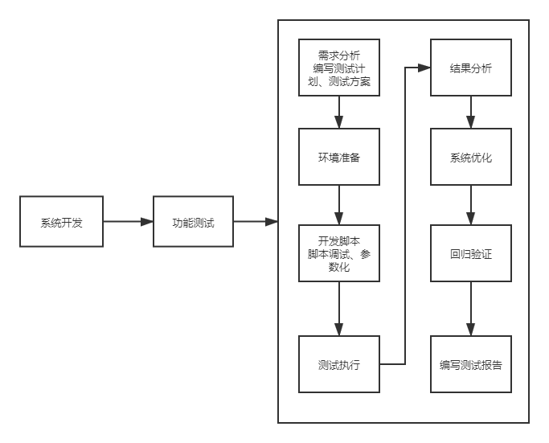

#### 1.2.5关注内容

用户关注的是用户操作的相应时间。

其次，我们站在管理员的角度考虑需要关注的性能点。

1. 响应时间
2. 服务器资源使用情况是否合理
3. 应用服务器和数据库资源使用是否合理
4. 系统能否实现扩展
5. 系统最多支持多少用户访问. 系统最大业务处理量是多少
6. 系统性能可能存在的瓶颈在哪里
7. 更换那些设备可以提高性能
8. 系统能否支持7×24小时的业务访问
9. 整个系统的稳定性，可恢复性

再次，站在开发（设计）人员角度去考虑。

1. 架构设计是否合理
2. 数据库设计是否合理
3. 代码是否存在性能方面的问题
4. 系统中是否有不合理的内存使用方式
5. 系统中是否存在不合理的线程同步方式
6. 系统中是否存在不合理的资源竞争
7. 代码，算法，sql语句设计是否合理

等等。。。。

#### 1.2.6性能指标

##### 虚拟用户数

虚拟用户（Virtual User）：模拟真实业务逻辑步骤的虚拟用户，虚拟用户模拟的操作步骤都被记录在虚拟用户脚本里。Vuser脚本用于描述Vuser在场景中执行的操作。

##### 事务

并发（Concurrency）：所有用户在同一时刻发起相同的业务请求，用于测试系统对并发操作的处理能力。

```
平均并发用户数的计算：C=nL / T
其中C是平均的并发用户数，n是平均每天访问用户数（login session），L是一天内用户从登录到退出的平均时间（login session的平均时间），T是考察时间长度（一天内多长时间有用户使用系统）
并发用户数峰值计算：C^约等于C + 3*根号C
其中C^是并发用户峰值，C是平均并发用户数，该公式遵循泊松分布理论。
```

##### 用户并发数

用户并发数量：在同一时刻与服务器进行交互的用户数量。

##### 请求响应时间

请求响应时间：从发出请求到得到响应这一过程的耗时。

```
响应时间：对请求作出响应所需要的时间
网络传输时间：N1+N2+N3+N4
应用服务器处理时间：A1+A3
数据库服务器处理时间：A2
响应时间=N1+N2+N3+N4+A1+A3+A2
```

##### 事务响应时间

事务响应时间：事务可能由一系列的请求组成，事务响应时间是针对用户而言，用于说明业务响应时间。

##### 思考时间

思考时间（Think Time）：用户操作过程中，每个请求之间的间隔时间
Think Time，从业务角度来看，这个时间指用户进行操作时每个请求之间的时间间隔，而在做新能测试时，为了模拟这样的时间间隔，引入了思考时间这个概念，来更加真实的模拟用户的操作。
```
在吞吐量这个公式中F=VU * R / T说明吞吐量F是VU数量、每个用户发出的请求数R和时间T的函数，而其中的R又可以用时间T和用户思考时间TS来计算：R = T / TS
下面给出一个计算思考时间的一般步骤：
A、首先计算出系统的并发用户数
C=nL / T F=R×C
B、统计出系统平均的吞吐量
F=VU * R / T R×C = VU * R / T
C、统计出平均每个用户发出的请求数量
R=u*C*T/VU
D、根据公式计算出思考时间
TS=T/R
```

##### 吞吐量

吞吐量指在一次性能测试过程中，网络上传输数据流量的总和。吞吐量/传输时间=吞吐率。
```
指单位时间内系统处理用户的请求数
从业务角度看，吞吐量可以用：请求数/秒、页面数/秒、人数/天或处理业务数/小时等单位来衡量
从网络角度看，吞吐量可以用：字节/秒来衡量
对于交互式应用来说，吞吐量指标反映的是服务器承受的压力，他能够说明系统的负载能力
以不同方式表达的吞吐量可以说明不同层次的问题，例如，以字节数/秒方式可以表示数要受网络基础设施、服务器架构、应用服务器制约等方面的瓶颈；已请求数/秒的方式表示主要是受应用服务器和应用代码的制约体现出的瓶颈。
当没有遇到性能瓶颈的时候，吞吐量与虚拟用户数之间存在一定的联系，可以采用以下公式计算：F=VU * R /T
其中F为吞吐量，VU表示虚拟用户个数，R表示每个虚拟用户发出的请求数，T表示性能测试所用的时间

```

##### 吞吐率

吞吐率（Throughput）：单位时间内网络上传输的数据流量，某些情况下也可以指单位时间内所处理的请求数（requests/second）。

##### 点击率

点击率（Hit Per Second）：用户每秒钟向服务器提交的HTTP请求数，是WEB应用的特有指标。

##### 资源利用率

资源利用率：指对不同系统资源的使用程度，如服务器CPU的利用率、磁盘利用率，主要针对WEB应用服务器、操作系统、数据库服务器和网络等，是分析系统性能指标并调优的重要依据。
```
从服务器的角度看，性能测试主要关注CPU、内存、服务器负载、网络、磁盘IO等
```
###### CPU
后台服务的所有指令和数据处理都是由CPU负责，服务对CPU的利用率对服务的性能起着决定性的作用。
Linux系统的CPU主要有如下几个维度的统计数据

- us：用户态使用的cpu时间百分比
- sy：系统态使用的cpu时间百分比
- ni：用做nice加权的进程分配的用户态cpu时间百分比
- id：空闲的cpu时间百分比
- wa：cpu等待IO完成时间百分比
- hi：硬中断消耗时间百分比
- si：软中断消耗时间百分比

**Top 命令输出详解**

us & sy：大部分后台服务使用的CPU时间片中us和sy的占用比例是最高的。同时这两个指标又是互相影响的，us的比例高了，sy的比例就低，反之亦然。通常sy比例过高意味着被测服务在用户态和系统态之间切换比较频繁，此时系统整体性能会有一定下降。另外，在使用多核CPU的服务器上，CPU 0负责CPU各核间的调度，CPU 0上的使用率过高会导致其他CPU核心之间的调度效率变低。因此测试过程中CPU 0需要重点关注。

ni：每个Linux进程都有个优先级，优先级高的进程有优先执行的权利，这个叫做pri。进程除了优先级外，还有个优先级的修正值。这个修正值就叫做进程的nice值。一般来说，被测服务和服务器整体的ni值不会很高。如果测试过程中ni的值比较高，需要从服务器Linux系统配置、被测服务运行参数查找原因

id：线上服务运行过程中，需要保留一定的id冗余来应对突发的流量激增。在性能测试过程中，如果id一直很低，吞吐量上不去，需要检查被测服务线程/进程配置、服务器系统配置等。

wa：磁盘、网络等IO操作会导致CPU的wa指标提高。通常情况下，网络IO占用的wa资源不会很高，而频繁的磁盘读写会导致wa激增。如果被测服务不是IO密集型的服务，那需要检查被测服务的日志量、数据载入频率等。

hi & si：硬中断是外设对CPU的中断，即外围硬件发给CPU或者内存的异步信号就是硬中断信号；软中断由软件本身发给操作系统内核的中断信号。通常是由硬中断处理程序或进程调度程序对操作系统内核的中断，也就是我们常说的系统调用(System Call)。在性能测试过程中，hi会有一定的CPU占用率，但不会太高。对于IO密集型的服务，si的CPU占用率会高一些。

**针对CPU：**

针对cpu的监控，其实linux已经提供了两个比较好用的工具，一个是top，一个是vmstat。
关于这两个命令就不细说了，参考这里

top（http://linuxtools-rst.readthedocs.io/zh_CN/latest/tool/top.html）
vmstat（http://linuxtools-rst.readthedocs.io/zh_CN/latest/tool/vmstat.html）

关于cpu主要关注4个值：us(user), sy(system), wa(wait), id(idle)。理论上他们加起来应该等于100%。而前三个每一个值过高都有可能表示存在某些问题。

*us过高：*

1. 代码问题。比如一个耗时的循环不加sleep，或者在一些cpu密集计算（如xml解析，加解密，加解压，数据计算）时没处理好
2. gc频繁。一个比较容易遗漏的问题就是gc频繁时us容易过高，因为垃圾回收属于大量计算的过程。gc频繁带来的cpu过高常伴有内存的大量波动，通过内存来判断并解决该问题更好。
```
小技巧：如何定位us过高的线程并查看它的状态。
a. top命令找到消耗us过高的进程pid
b. top -Hp pid找到对应的线程tid
c. printf %x tid转为16进制tid16
d. jstack pid | grep -C 20  tid16 即可查到该线程堆栈
```
*sy过高：*

上下文切换次数过多。通常是系统内线程数量较多，并且线程经常在切换，由于系统抢占相对切换时间和次数比较合理，所以sy过高通常都是主动让出cpu的情况，比如sleep或者lock wait, io wait。

*wa过高：*

等待io的cpu占比较多。注意与上面情况的区别，io wait引起的sy过高指的是io不停的wait然后唤醒，因为数量较大，导致上下文切换较多，强调的是动态的过程；而io wait引起的wa过高指的是io wait的线程占比较多，cpu切换到这个线程是io wait，到那个线程也是io wait，于是总cpu就是wait占比较高。

*id过高：*

很多人认为id高是好的，其实在性能测试中id高说明资源未完全利用，或者压测不到位，并不是好事。

###### 内存

性能测试过程中对内存监控的主要目的是检查被测服务所占用内存的波动情况。
在Linux系统中有多个命令可以获取指定进程的内存使用情况，最常用的是top命令，其中

- VIRT：进程所使用的虚拟内存的总数。它包括所有的代码，数据和共享库，加上已换出的页面，所有已申请的总内存空间
- RES：进程正在使用的没有交换的物理内存（栈、堆），申请内存后该内存段已被重新赋值
- SHR：进程使用共享内存的总数。该数值只是反映可能与其它进程共享的内存，不代表这段内存当前正被其他进程使用
- SWAP：进程使用的虚拟内存中被换出的大小，交换的是已经申请，但没有使用的空间，包括（栈、堆、共享内存）
- DATA：进程除可执行代码以外的物理内存总量，即进程栈、堆申请的总空间

从上面的解释可以看出，测试过程中主要监控RES和VIRT，对于使用了共享内存的多进程架构服务，还需要监控SHR。
```
注：
通常我们看到Linux用top命令查看系统运行状况，普遍看到Used Memory占到了将近总内存的90%，然后很多人以为系统内存已经不足。其实，这只是Linux的为了提高文件读取的性能的内存使用机制罢了。不同于Windows，windows程序执行完后，会马上释放掉内存，把Memory降下来。而对于Linux，如果你的服务器内存还有足够多的空间的话，Linux会把程序运行的数据缓存起来，加入到Cache中，所以内存会不断增加，直到一定的限度为止.当超过这限度后，内核必须将脏页写回磁盘，以便释放内存。也就是说，当空闲内存低于一个特定的阈值时，内核的守护进程就会进行内存块回收。
```
用free -m 命令查看下内存的使用情况：

以上各参数的解释：

- total:总物理内存的大小。
- used:已使用内存。
- free:可用内存。
- Shared:多个进程共享的内存总额。
- Buffers/cached:磁盘缓存的大小。

第二行:memory使用情况。

第三行(-/+ buffers/cache)。

第四行交换分区使用情况。
```
区别：第二行(mem)的used/free与第三行(-/+ buffers/cache) used/free的区别。 
这两个的区别在于使用的角度来看，第一行是从OS的角度来看，因为对于OS，buffers/cached 都是属于被使用，所以他的可用内存是746M,已用内存是3085M,其中包括，内核（OS）使用+Application(X, oracle,etc)使用的+buffers+cached.
第三行所指的是从应用程序角度来看，对于应用程序来说，buffers/cached 是等于可用的，因为buffer/cached是为了提高文件读取的性能，当应用程序需在用到内存的时候，buffer/cached会很快地被回收。
所以从应用程序的角度来说，可用内存=系统free memory+buffers+cached。
```
```
我们通过free命令查看机器空闲内存时，会发现free的值很小。这主要是因为，在linux中有这么一种思想，内存不用白不用，因此它尽可能的cache和buffer一些数据，提高文件读取的性能，以方便下次使用。但实际上这些内存，如果需要的话，也是可以立刻拿来使用的。
所以计算可用内存=free+buffers+cached=total-used
```
buffer是用于存放要输出到disk（块设备）的数据的，而cache是存放从disk上读出的数据。这二者是为了提高IO性能的，并由OS管理。

**针对内存：**

关于java应用的内存，通常只需要关注jvm内存，但有些特殊情况也需要关注物理内存。

关于jvm内存，常见的工具有

jstat（http://blog.csdn.net/fenglibing/article/details/6411951）

jmap（http://www.cnblogs.com/ggjucheng/archive/2013/04/16/3024986.html）

pidstat（https://linux.cn/article-4257-1.html）

vmstat

top

<font color=#FF0000 size=5 face="微软雅黑">JVM内存: </font>

**异常gc :**

1. 通常gc发生意味着总归是有一块区域空间不足而触发gc。而许多导致异常gc的情况通常是持有了不必要的引用而没有即时的释放，比如像cache这样的地方就容易处理不好导致内存泄露引发异常gc。
2. 有可能是程序的行为是正常的，但是由于没有配置对合适的gc参数导致异常gc，这种情况通常需要调优gc参数或者堆代大小参数。
3. Full gc 发生的情况: 
	永久代满
	年老代满
	minor gc晋升到旧生代的平均大小大于旧生代剩余大小
	CMS gc中promotion fail或concurrent mode fail

**OOM：**

1. OOM经常伴随着异常gc，之所以单独拿出来讲，是因为它的危害更大一些，异常gc顶多是收集速度过快或者回收不了内存，但是起码有个缓冲时间，但是出了OOM问题就大了。至于各种类型的OOM如何区分，如何发生，请参考这里（http://www.jianshu.com/p/2fdee831ed03），算是总结得比较全面的。对于常见的OOM，基本上可以一下子指出问题所在。
2. heap区，对象创建过多或持有太多无效引用（泄露）或者堆内存分配不足。使用jmap找到内存中对象的分布，使用ps找到相应进程及初始内存配置。
3. stack区, 不正确的递归调用。
4. perm区，初始加载包过多，分配内存不足。
5. 堆外内存区，分配ByteBuffer未释放导致。

###### 网络

性能测试中网络监控主要包括网络流量、网络连接状态的监控。

**网络流量监控**

可以使用nethogs命令。该命令与top类似，是一个实时交互的命令

在后台服务性能测试中，对于返回文本结果的服务，并不需要太多关注在流量方面。

**网络连接状态监控**

性能测试中对网络的监控主要是监控网络连接状态的变化和异常。对于使用TCP协议的服务，需要监控服务已建立连接的变化情况（即ESTABLISHED状态的TCP连接）。对于HTTP协议的服务，需要监控被测服务对应进程的网络缓冲区的状态、TIME_WAIT状态的连接数等。Linux自带的很多命令如netstat、ss都支持如上功能.

**针对网络IO**

针对网络IO比较有用的工具有

sar（https://linuxstory.org/generate-cpu-memory-io-report-sar-command/）

netstat（https://linux.cn/article-2434-1.html）

netstat是一个非常牛逼的命令，可以助于排查很多问题, 

网络IO：网络IO的问题较为复杂，仅举几个常见的

1. 大量TIME_WAIT。根据TCP协议，主动发起关闭连接的那一方，关闭了自己这端的连接后再收到被动发起关闭的那一方的关闭请求后，会将状态变为TIME_WAIT，并等待2MSL, 目的是等待自己的回执发送到对方。如果在服务器上发现大量TIME_WAIT，说明服务器主动断开了连接，什么情况下服务器会主动断开连接，很可能是客户端忘了断开连接，所以一个典型的案例就是jdbc连接忘记关闭，则数据库服务器可能会出现大量的TIME_WAIT状态。
2. 大量CLOSE_WAIT。CLOSE_WAIT状态，在收到主动关闭连接的一方发出关闭连接之后，被动关闭的一方进入CLOSE_WAIT状态，如果这时候被hang住了没进行后续关闭，则会出现大量CLOSE_WAIT。啥情况会被hang住呢，举几个例子，比如刚刚的忘记关闭数据库连接，在应用服务器这端，大量的浏览器请求进来，由于没有连接池连接被hang住，这时候浏览器等待一定时间超时发送关闭连接请求，而应用服务器这边由于servlet线程被hang住了，自然没有办法走第二个关闭回去。因此在应用服务器出现大量CLOSE_WAIT。另一个例子是httpClient的坑，在调用response.getEntity(); 前都不会做inputStream.close()，如果在调用response.getEntity()前就返回了，就狗带了。（这个例子可以参考http://blog.csdn.net/shootyou/article/details/6615051）

###### 磁盘
性能测试过程中，如果被测服务对磁盘读写过于频繁，会导致大量请求处于IO等待的状态，系统负载升高，响应时间变长，吞吐量下降。

Linux下可以用iostat命令来监控磁盘状态

- tps：该设备每秒的传输次数。“一次传输”意思是“一次I/O请求”。多个逻辑请求可能会被合并为“一次I/O请求”。“一次传输”请求的大小是未知的
- kB_read/s：每秒从设备（driveexpressed）读取的数据量，单位为Kilobytes
- kB_wrtn/s：每秒向设备（driveexpressed）写入的数据量，单位为Kilobytes
- kB_read：读取的总数据量，单位为Kilobytes
- kB_wrtn：写入的总数量数据量，单位为Kilobytes

从iostat的输出中，能够获得系统运行最基本的统计数据。但对于性能测试来说，这些数据不能提供更多的信息。需要加上-x参数

- rrqm/s：每秒这个设备相关的读取请求有多少被Merge了（当系统调用需要读取数据的时候，VFS将请求发到各个FS，如果FS发现不同的读取请求读取的是相同Block的数据，FS会将这个请求合并Merge）
- wrqm/s：每秒这个设备相关的写入请求有多少被Merge了
- await：每一个IO请求的处理的平均时间（单位是毫秒）
- %util：在统计时间内所有处理IO时间，除以总共统计时间。例如，如果统计间隔1秒，该设备有0.8秒在处理IO，而0.2秒闲置，那么该设备的%util = 0.8/1 = 80%，该参数暗示了设备的繁忙程度。

**针对文件IO**

针对文件io的工具有

pidstat

iostat（http://linuxtools-rst.readthedocs.io/zh_CN/latest/tool/iostat.html）

文件IO：

从技术上来说，对于大文件IO可以采取的措施是异步批处理，采用异步方式用于削峰并累计buffer，采用批处理能够让磁盘寻道连续从而更加快速。

#### 1.2.7常见性能瓶颈
<font color=#FF0000 size=3 face="微软雅黑" >仅供参考</font>

##### 吞吐量到上限时系统负载未到阈值

一般是被测服务分配的系统资源过少导致的。测试过程中如果发现此类情况，可以从ulimit、系统开启的线程数、分配的内存等维度定位问题原因。

##### CPU的us和sy不高，但wa很高

如果被测服务是磁盘IO密集型型服务，wa高属于正常现象。但如果不是此类服务，最可能导致wa高的原因有两个，一是服务对磁盘读写的业务逻辑有问题，读写频率过高，写入数据量过大，如不合理的数据载入策略、log过多等，都有可能导致这种问题。二是服务器内存不足，服务在swap分区不停的换入换出。

##### 同一请求的响应时间忽大忽小

在正常吞吐量下发生此问题，可能的原因有两方面，一是服务对资源的加锁逻辑有问题，导致处理某些请求过程中花了大量的时间等待资源解锁；二是Linux本身分配给服务的资源有限，某些请求需要等待其他请求释放资源后才能继续执行。

##### 内存持续上涨

在吞吐量固定的前提下，如果内存持续上涨，那么很有可能是被测服务存在明显的内存泄漏，需要使用valgrind等内存检查工具进行定位。

##### 内存泄漏检测工具valgrind神器

###### 概述

**介绍**

Valgrind是一套Linux下，开放源代码（GPL V2）的仿真调试工具的集合。Valgrind由内核（core）以及基于内核的其他调试工具组成。内核类似于一个框架（framework），它模拟了一个CPU环境，并提供服务给其他工具；而其他工具则类似于插件 (plug-in)，利用内核提供的服务完成各种特定的内存调试任务。

**工具**

Valgrind一般包含下列工具：

1. Memcheck
最常用的工具，用来检测程序中出现的内存问题，所有对内存的读写都会被检测到，一切对malloc()/free()/new/delete的调用都会被捕获。所以，它能检测以下问题：
- 对未初始化内存的使用；
- 读/写释放后的内存块；
- 读/写超出malloc分配的内存块；
- 读/写不适当的栈中内存块；
- 内存泄漏，指向一块内存的指针永远丢失；
- 不正确的malloc/free或new/delete匹配；
- memcpy()相关函数中的dst和src指针重叠。

2. Callgrind
和gprof类似的分析工具，但它对程序的运行观察更是入微，能给我们提供更多的信息。和gprof不同，它不需要在编译源代码时附加特殊选项，但加上调试选项是推荐的。Callgrind收集程序运行时的一些数据，建立函数调用关系图，还可以有选择地进行cache模拟。在运行结束时，它会把分析数据写入一个文件。callgrind_annotate可以把这个文件的内容转化成可读的形式。

3. Cachegrind
Cache分析器，它模拟CPU中的一级缓存I1，Dl和二级缓存，能够精确地指出程序中cache的丢失和命中。如果需要，它还能够为我们提供cache丢失次数，内存引用次数，以及每行代码，每个函数，每个模块，整个程序产生的指令数。这对优化程序有很大的帮助。

4. Helgrind
它主要用来检查多线程程序中出现的竞争问题。Helgrind寻找内存中被多个线程访问，而又没有一贯加锁的区域，这些区域往往是线程之间失去同步的地方，而且会导致难以发掘的错误。Helgrind实现了名为“Eraser”的竞争检测算法，并做了进一步改进，减少了报告错误的次数。不过，Helgrind仍然处于实验阶段。

5. Massif
堆栈分析器，它能测量程序在堆栈中使用了多少内存，告诉我们堆块，堆管理块和栈的大小。Massif能帮助我们减少内存的使用，在带有虚拟内存的现代系统中，它还能够加速我们程序的运行，减少程序停留在交换区中的几率。
此外，lackey和nulgrind也会提供。Lackey是小型工具，很少用到；Nulgrind只是为开发者展示如何创建一个工具。

**原理**

Memcheck 能够检测出内存问题，关键在于其建立了两个全局表。Valid-Value 表
对于进程的整个地址空间中的每一个字节(byte)，都有与之对应的 8 个 bits；对于CPU的每个寄存器，也有一个与之对应的bit向量。这些bits负责记录该字节或者寄存器值是否具有有效的、已初始化的值。

Valid-Address 表
对于进程整个地址空间中的每一个字节(byte)，还有与之对应的1个bit，负责记录该地址是否能够被读写。

检测原理：

当要读写内存中某个字节时，首先检查这个字节对应的 A bit。如果该A bit显示该位置是无效位置，memcheck则报告读写错误。

内核（core）类似于一个虚拟的 CPU 环境，这样当内存中的某个字节被加载到真实的 CPU 中时，该字节对应的 V bit 也被加载到虚拟的 CPU 环境中。一旦寄存器中的值，被用来产生内存地址，或者该值能够影响程序输出，则 memcheck 会检查对应的V bits，如果该值尚未初始化，则会报告使用未初始化内存错误。

###### 安装使用

**安装**

从官网http://www.valgrind.org下载最新版本

```shell
#tar xvf valgrind-3.11.1.tar.bz2
#cd valgrind-3.11.1
#./configure --prefix=/usr/local/valgrind--指定安装目录
#make
#make install
```

**命令介绍**
用法:valgrind[options] prog-and-args [options]: 常用选项，适用于所有Valgrind工具
-tool=<name> 最常用的选项。运行 valgrind中名为toolname的工具。默认memcheck。

```shell
h –help 显示帮助信息。
-version 显示valgrind内核的版本，每个工具都有各自的版本。
q –quiet 安静地运行，只打印错误信息。
v –verbose 更详细的信息, 增加错误数统计。
-trace-children=no|yes 跟踪子线程? [no]
-track-fds=no|yes 跟踪打开的文件描述？[no]
-time-stamp=no|yes 增加时间戳到LOG信息? [no]
-log-fd=<number> 输出LOG到描述符文件 [2=stderr]
-log-file=<file> 将输出的信息写入到filename.PID的文件里，PID是运行程序的进行ID
-log-file-exactly=<file> 输出LOG信息到 file
-log-file-qualifier=<VAR> 取得环境变量的值来做为输出信息的文件名。 [none]
-log-socket=ipaddr:port 输出LOG到socket ，ipaddr:port
```

LOG信息输出:

```shell
-xml=yes 将信息以xml格式输出，只有memcheck可用
-num-callers=<number> show <number> callers in stack traces [12]
-error-limit=no|yes 如果太多错误，则停止显示新错误? [yes]
-error-exitcode=<number> 如果发现错误则返回错误代码 [0=disable]
-db-attach=no|yes 当出现错误，valgrind会自动启动调试器gdb。[no]
-db-command=<command> 启动调试器的命令行选项[gdb -nw %f %p]
```

适用于Memcheck工具的相关选项：

```shell
-leak-check=no|summary|full 要求对leak给出详细信息? [summary]
-leak-resolution=low|med|high how much bt merging in leak check [low]
-show-reachable=no|yes show reachable blocks in leak check? [no]
```

###### 应用实践

下面通过介绍几个范例来说明如何使用Memcheck （其他工具暂不涉及，感兴趣可以交流），示例仅供参考，更多用途可在实际应用中不断探索。

**数组越界/内存未释放**

```c
#include<stdlib.h>
void k(void)
{
int *x = malloc(8 * sizeof(int));
x[9] = 0; //数组下标越界
} //内存未释放

int main(void)
{
k();
return 0;
}
```

1）编译程序test.c
gcc -Wall test.c -g -o test#Wall提示所有告警，-g gdb，-o输出

2）使用Valgrind检查程序BUG
valgrind --tool=memcheck --leak-check=full ./test
#--leak-check=full 所有泄露检查

3) 运行结果如下：
```shell
==2989== Memcheck, a memory error detector
==2989== Copyright (C) 2002-2012, and GNU GPL'd, by Julian Seward
et al.
==2989== Using Valgrind-3.8.1 and LibVEX; rerun with -h for
copyright info
==2989== Command: ./test
==2989==
==2989== Invalid write of size 4
==2989== at 0x4004E2: k (test.c:5)
==2989== by 0x4004F2: main (test.c:10)
==2989== Address 0x4c27064 is 4 bytes after a block of size 32 alloc'd
==2989== at 0x4A06A2E: malloc (vg_replace_malloc.c:270)
==2989== by 0x4004D5: k (test.c:4)
==2989== by 0x4004F2: main (test.c:10)
==2989==
==2989==
==2989== HEAP SUMMARY:
==2989== in use at exit: 32 bytes in 1 blocks
==2989== total heap usage: 1 allocs, 0 frees, 32 bytes allocated
==2989==
==2989== 32 bytes in 1 blocks are definitely lost in loss record 1
of 1
==2989== at 0x4A06A2E: malloc (vg_replace_malloc.c:270)
==2989== by 0x4004D5: k (test.c:4)
==2989== by 0x4004F2: main (test.c:10)
==2989==
==2989== LEAK SUMMARY:
==2989== definitely lost: 32 bytes in 1 blocks
==2989== indirectly lost: 0 bytes in 0 blocks
==2989== possibly lost: 0 bytes in 0 blocks
==2989== still reachable: 0 bytes in 0 blocks
==2989==suppressed: 0 bytes in 0 blocks
==2989==
==2989== For counts of detected and suppressed errors, rerun with: -v
==2989== ERROR SUMMARY: 2 errors from 2 contexts
(suppressed: 6 from 6)
```
**内存释放后读写**
```c
#include <stdio.h>
#include <stdlib.h>

int main(void)
{
char *p = malloc(1); //分配
*p = 'a';

char c = *p;

printf("\n [%c]\n",c);

free(p); //释放
c = *p; //取值
return 0;
}
```
1）编译程序t2.c
gcc -Wall t2.c -g -o t2

2）使用Valgrind检查程序BUG
valgrind --tool=memcheck --leak-check=full ./t2

3) 运行结果如下：
```shell
==3058== Memcheck, a memory error detector
==3058== Copyright (C) 2002-2012, and GNU GPL'd, by Julian
Seward et al.
==3058== Using Valgrind-3.8.1 and LibVEX; rerun with -h
for copyright info
==3058== Command: ./t2
==3058==

[a]
==3058== Invalid read of size 1
==3058== at 0x4005A3: main (t2.c:14)
==3058== Address 0x4c27040 is 0 bytes inside a block of size
1 free'd
==3058== at 0x4A06430: free (vg_replace_malloc.c:446)
==3058== by 0x40059E: main (t2.c:13)
==3058==
==3058==
==3058== HEAP SUMMARY:
==3058== in use at exit: 0 bytes in 0 blocks
==3058== total heap usage: 1 allocs, 1 frees, 1 bytes allocated
==3058==
==3058== All heap blocks were freed -- no leaks are possible
==3058==
==3058== For counts of detected and suppressed errors, rerun with:
-v
==3058== ERROR SUMMARY: 1 errors from 1 contexts
(suppressed: 6 from 6)
```
从上输出内容可以看到，Valgrind检测到无效的读取操作然后输出“Invalid read of size 1”。

**无效读写**
```c
#include <stdio.h>
#include <stdlib.h>

int main(void)
{
char *p = malloc(1); //分配1字节
*p = 'a';
char c = *(p+1); //地址加1
printf("\n [%c]\n",c);
free(p);
return 0;
}
```
1）编译程序t3.c
gcc -Wall t3.c -g -o t3

2）使用Valgrind检查程序BUG
valgrind --tool=memcheck --leak-check=full ./t3

3) 运行结果如下：
```shell
==3128== Memcheck, a memory error detector
==3128== Copyright (C) 2002-2012, and GNU GPL'd, by Julian Seward et al.
==3128== Using Valgrind-3.8.1 and LibVEX; rerun with -h for copyright info
==3128== Command: ./t3
==3128==
==3128== Invalid read of size 1 #无效读取
==3128==at 0x400579: main (t3.c:9)
==3128==Address 0x4c27041 is 0 bytes after a block of size 1 alloc'd
==3128==at 0x4A06A2E: malloc (vg_replace_malloc.c:270)
==3128==by 0x400565: main (t3.c:6)
==3128==
[]
==3128==
==3128== HEAP SUMMARY:
==3128==in use at exit: 0 bytes in 0 blocks
==3128==total heap usage: 1 allocs, 1 frees, 1 bytes allocated
==3128==
==3128== All heap blocks were freed -- no leaks are possible
==3128==
==3128== For counts of detected and suppressed errors, rerun with: -v
==3128== ERROR SUMMARY: 1 errors from 1 contexts
(suppressed: 6 from 6)
```
**内存泄露**
```c
#include <stdio.h>
#include <stdlib.h>

int main(void)
{
int *p = malloc(1);
*p = 'x';
char c = *p;
printf("%c\n",c); //申请后未释放
return 0;
}
```
1）编译程序t4.c
gcc -Wall t4.c -g -o t4

2）使用Valgrind检查程序BUG
valgrind --tool=memcheck --leak-check=full ./t4

3) 运行结果如下：
```shell
==3221== Memcheck, a memory error detector
==3221== Copyright (C) 2002-2012, and GNU GPL'd, by Julian Seward et al.
==3221== Using Valgrind-3.8.1 and LibVEX; rerun with -h for copyright info
==3221== Command: ./t4
==3221==
==3221== Invalid write of size 4
==3221==at 0x40051E: main (t4.c:7)
==3221==Address 0x4c27040 is 0 bytes inside a block of size 1 alloc'd
==3221==at 0x4A06A2E: malloc (vg_replace_malloc.c:270)
==3221==by 0x400515: main (t4.c:6)
==3221==
==3221== Invalid read of size 4
==3221==at 0x400528: main (t4.c:8)
==3221==Address 0x4c27040 is 0 bytes inside a block of size 1 alloc'd
==3221==at 0x4A06A2E: malloc (vg_replace_malloc.c:270)
==3221==by 0x400515: main (t4.c:6)
==3221==
x
==3221==
==3221== HEAP SUMMARY:
==3221==in use at exit: 1 bytes in 1 blocks
==3221==total heap usage: 1 allocs, 0 frees, 1 bytes allocated
==3221==
==3221== 1 bytes in 1 blocks are definitely lost in loss record 1 of 1
==3221==at 0x4A06A2E: malloc (vg_replace_malloc.c:270)
==3221==by 0x400515: main (t4.c:6)
==3221==
==3221== LEAK SUMMARY:
==3221==definitely lost: 1 bytes in 1 blocks
==3221==indirectly lost: 0 bytes in 0 blocks
==3221== possibly lost: 0 bytes in 0 blocks
==3221==still reachable: 0 bytes in 0 blocks
==3221== suppressed: 0 bytes in 0 blocks
==3221==
==3221== For counts of detected and suppressed errors, rerun with: -v
==3221== ERROR SUMMARY: 3 errors from 3 contexts
(suppressed: 6 from 6)
```
从检查结果看，可以发现内存泄露。

**内存多次释放**
```c
#include <stdio.h>
#include <stdlib.h>
int main(void)
{
char *p;
p=(char *)malloc(100);
if(p)
printf("Memory Allocated at: %s/n",p);
else
printf("Not Enough Memory!/n");
free(p); //重复释放
free(p);
free(p);
return 0;
}
```
1）编译程序t5.c
gcc -Wall t5.c -g -o t5

2）使用Valgrind检查程序BUG
valgrind --tool=memcheck --leak-check=full ./t5

3) 运行结果如下：

```shell
==3294== Memcheck, a memory error detector
==3294== Copyright (C) 2002-2012, and GNU GPL'd, by Julian Seward
et al.
==3294== Using Valgrind-3.8.1 and LibVEX; rerun with -h for
copyright info
==3294== Command: ./t5
==3294==
==3294== Conditional jump or move depends on uninitialised value(s)
==3294== at 0x3CD4C47E2C: vfprintf (in /lib64/libc-2.12.so)
==3294== by 0x3CD4C4F189: printf (in /lib64/libc-2.12.so)
==3294== by 0x400589: main (t5.c:9)
==3294==
==3294== Invalid free() / delete / delete[] / realloc()
==3294== at 0x4A06430: free (vg_replace_malloc.c:446)
==3294== by 0x4005B5: main (t5.c:13)
==3294== Address 0x4c27040 is 0 bytes inside a block of size
100 free'd
==3294== at 0x4A06430: free (vg_replace_malloc.c:446)
==3294== by 0x4005A9: main (t5.c:12)
==3294==
==3294== Invalid free() / delete / delete[] / realloc()
==3294== at 0x4A06430: free (vg_replace_malloc.c:446)
==3294== by 0x4005C1: main (t5.c:14)
==3294== Address 0x4c27040 is 0 bytes inside a block of size
100 free'd
==3294== at 0x4A06430: free (vg_replace_malloc.c:446)
==3294== by 0x4005A9: main (t5.c:12)
==3294==
Memory Allocated at: /n==3294==
==3294== HEAP SUMMARY:
==3294== in use at exit: 0 bytes in 0 blocks
==3294== total heap usage: 1 allocs, 3 frees, 100 bytes allocated
```
从上面的输出可以看到(标注), 该功能检测到我们对同一个指针调用了3次释放内存操作。

**内存动态管理**

常见的内存分配方式分三种：静态存储，栈上分配，堆上分配。全局变量属于静态存储，它们是在编译时就被分配了存储空间，函数内的局部变量属于栈上分配，而最灵活的内存使用方式当属堆上分配，也叫做内存动态分配了。常用的内存动态分配函数包括：malloc, alloc, realloc, new等，动态释放函数包括free, delete。

一旦成功申请了动态内存，我们就需要自己对其进行内存管理，而这又是最容易犯错误的。下面的一段程序，就包括了内存动态管理中常见的错误。
```c
#include <stdio.h>
#include <stdlib.h>
int main(int argc,char *argv[])
{
int i;
char* p = (char*)malloc(10);
char* pt=p;
for(i = 0;i < 10;i++)
{
p[i] = 'z';
}
free(p);
pt[1] = 'x';
free(pt);
return 0;
}
```
1）编译程序t6.c
gcc -Wall t6.c -g -o t6

2）使用Valgrind检查程序BUG
valgrind --tool=memcheck --leak-check=full ./t6

3) 运行结果如下：

```shell
==3380== Memcheck, a memory error detector
==3380== Copyright (C) 2002-2012, and GNU GPL'd, by Julian Seward et al.
==3380== Using Valgrind-3.8.1 and LibVEX; rerun with -h for copyright info
==3380== Command: ./t6
==3380==
==3380== Invalid write of size 1
==3380==at 0x40055C: main (t6.c:14)
==3380==Address 0x4c27041 is 1 bytes inside a block of size 10 free'd
==3380==at 0x4A06430: free (vg_replace_malloc.c:446)
==3380==by 0x400553: main (t6.c:13)
==3380==
==3380== Invalid free() / delete / delete[] / realloc()
==3380==at 0x4A06430: free (vg_replace_malloc.c:446)
==3380==by 0x40056A: main (t6.c:15)
==3380==Address 0x4c27040 is 0 bytes inside a block of size 10 free'd
==3380==at 0x4A06430: free (vg_replace_malloc.c:446)
==3380==by 0x400553: main (t6.c:13)
==3380==
==3380==
==3380== HEAP SUMMARY:
==3380==in use at exit: 0 bytes in 0 blocks
==3380==total heap usage: 1 allocs, 2 frees, 10 bytes allocated
```

申请内存在使用完成后就要释放。如果没有释放，或少释放了就是内存泄露；多释放也会产生问题。上述程序中，指针p和pt指向的是同一块内存，却被先后释放两次。系统会在堆上维护一个动态内存链表，如果被释放，就意味着该块内存可以继续被分配给其他部分，如果内存被释放后再访问，就可能覆盖其他部分的信息，这是一种严重的错误，上述程序第14行中就在释放后仍然写这块内存。

输出结果显示，第13行分配和释放函数不一致；第14行发生非法写操作，也就是往释放后的内存地址写值；第15行释放内存函数无效。

#### 1.2.8JAVA性能调优

调优步骤：衡量系统现状、设定调优目标、寻找性能瓶颈、性能调优、衡量是否到达目标(如果未到达目标，需重新寻找性能瓶颈）、性能调优结束。

##### 寻找性能瓶颈

性能瓶颈的表象：资源消耗过多、外部处理系统的性能不足、资源消耗不多但程序的响应速度却仍达不到要求。

资源消耗：CPU、文件IO、网络IO、内存。

外部处理系统的性能不足：所调用的其他系统提供的功能或数据库操作的响应速度不够。

资源消耗不多但程序的响应速度却仍达不到要求：程序代码运行效率不够高、未充分使用资源、程序结构不合理。

<font color=#FF0000 size=3 face="微软雅黑" >CPU消耗分析</font>

CPU主要用于中断、内核、用户进程的任务处理，优先级为中断>内核>用户进程。

<font color=#FF0000 size=3 face="微软雅黑" >上下文切换：</font>

每个线程分配一定的执行时间，当到达执行时间、线程中有IO阻塞或高优先级线程要执行时，将切换执行的线程。在切换时要存储目前线程的执行状态，并恢复要执行的线程的状态。

对于Java应用，典型的是在进行文件IO操作、网络IO操作、锁等待、线程Sleep时，当前线程会进入阻塞或休眠状态，从而触发上下文切换，上下文切换过多会造成内核占据较多的CPU的使用。

<font color=#FF0000 size=3 face="微软雅黑" >运行队列：</font>

每个CPU核都维护一个可运行的线程队列。系统的load主要由CPU的运行队列来决定。

运行队列值越大，就意味着线程会要消耗越长的时间才能执行完成。

<font color=#FF0000 size=3 face="微软雅黑" >利用率：</font>

CPU在用户进程、内核、中断处理、IO等待、空闲，这五个部分使用百分比。

<font color=#FF0000 size=3 face="微软雅黑" >文件IO消耗分析</font>

Linux在操作文件时，将数据放入文件缓存区，直到内存不够或系统要释放内存给用户进程使用。所以通常情况下只有写文件和第一次读取文件时会产生真正的文件IO。

对于Java应用，造成文件IO消耗高主要是多个线程需要进行大量内容写入（例如频繁的日志写入）的动作、磁盘设备本身的处理速度慢、文件系统慢、操作的文件本身已经很大。

<font color=#FF0000 size=3 face="微软雅黑" >网络IO消耗分析</font>

对于分布式Java应用，网卡中断是不是均衡分配到各CPU(cat/proc/interrupts查看)。

<font color=#FF0000 size=3 face="微软雅黑" >内存消耗分析</font>（-Xms和-Xmx设为相同的值，避免运行期JVM堆内存要不断申请内存）

对于Java应用，内存的消耗主要在Java堆内存上，只有创建线程和使用Direct ByteBuffer才会操作JVM堆外的内存。

JVM内存消耗过多会导致GC执行频繁，CPU消耗增加，应用线程的执行速度严重下降，甚至造成OutOfMemoryError，最终导致Java进程退出。

<font color=#FF0000 size=3 face="微软雅黑" >JVM堆外的内存</font>

swap的消耗、物理内存的消耗、JVM内存的消耗。

<font color=#FF0000 size=3 face="微软雅黑" >程序执行慢原因分析</font>

锁竞争激烈：很多线程竞争互斥资源，但资源有限， 造成其他线程都处于等待状态。

未充分使用硬件资源：线程操作被串行化。

数据量增长：单表数据量太大（如1个亿）造成数据库读写速度大幅下降（操作此表）。

##### 调优

<font color=#FF0000 size=3 face="微软雅黑" >JVM调优</font>

（最关键参数为：-Xms -Xmx -Xmn -XX:SurvivorRatio -XX:MaxTenuringThreshold）

<font color=#FF0000 size=3 face="微软雅黑" >代大小调优</font>

避免新生代大小设置过小、避免新生代大小设置过大、避免Survivor设置过小或过大、合理设置新生代存活周期。

-Xmn 调整新生代大小，新生代越大通常也意味着更多对象会在minor GC阶段被回收，但可能有可能造成旧生代大小，造成频繁触发Full GC，甚至是OutOfMemoryError。

-XX:SurvivorRatio调整Eden区与Survivor区的大小，Eden 区越大通常也意味着minor GC发生频率越低，但可能有可能造成Survivor区太小，导致对象minor GC后就直接进入旧生代，从而更频繁触发Full GC。

<font color=#FF0000 size=3 face="微软雅黑" >GC策略的调优</font>

CMS GC多数动作是和应用并发进行的，确实可以减小GC动作给应用造成的暂停时间。对于Web应用非常需要一个对应用造成暂停时间短的GC，再加上Web应用 的瓶颈都不在CPU上，在G1还不够成熟的情况下，CMS GC是不错的选择。

（如果系统不是CPU密集型，且从新生代进入旧生代的大部分对象是可以回收的，那么采用CMS GC可以更好地在旧生代满之前完成对象的回收，更大程度降低Full GC发生的可能）
在调整了内存管理方面的参数后应通过-XX:PrintGCDetails、-XX:+PrintGCTimeStamps、 -XX:+PrintGCApplicationStoppedTime以及jstat或visualvm等方式观察调整后的GC状况。

除内存管理以外的其他方面的调优参数

-XX:CompileThreshold、-XX:+UseFastAccessorMethods、 -XX:+UseBaiasedLocking。

##### 程序调优

CPU消耗严重的解决方法

<font color=#FF0000 size=3 face="微软雅黑" >CPU us高的解决方法</font>

CPU us 高的原因主要是执行线程不需要任何挂起动作，且一直执行，导致CPU 没有机会去调度执行其他的线程。

调优方案： 增加Thread.sleep，以释放CPU 的执行权，降低CPU 的消耗。以损失单次执行性能为代价的，但由于其降低了CPU 的消耗，对于多线程的应用而言，反而提高了总体的平均性能。
（在实际的Java应用中类似场景， 对于这种场景最佳方式是改为采用wait/notify机制）

对于其他类似循环次数过多、正则、计算等造成CPU us过高的状况， 则需要结合业务调优。
对于GC频繁，则需要通过JVM调优或程序调优，降低GC的执行次数。

<font color=#FF0000 size=3 face="微软雅黑" >CPU sy高的解决方法</font>

CPU sy 高的原因主要是线程的运行状态要经常切换，对于这种情况，常见的一种优化方法是减少线程数。

调优方案： 将线程数降低

这种调优过后有可能会造成CPU us过高，所以合理设置线程数非常关键。

对于Java分布式应用，还有一种典型现象是应用中有较多的网络IO操作和确实需要一些锁竞争机制（如数据库连接池），但为了能够支撑搞得并发量，可采用协程（Coroutine）来支撑更高的并发量，避免并发量上涨后造成CPU sy消耗严重、系统load迅速上涨和系统性能下降。

在Java中实现协程的框架有Kilim，Kilim执行一项任务创建Task，使用Task的暂停机制，而不是Thread，Kilim承担了线程调度以及上下切换动作，Task相对于原生Thread而言就轻量级多了，且能更好利用CPU。Kilim带来的是线程使用率的提升，但同时由于要在JVM堆中保存Task上下文信息，因此在采用Kilim的情况下要消耗更多的内存。（目前JDK 7中也有一个支持协程方式的实现，另外基于JVM的Scala的Actor也可用于在Java使用协程）

<font color=#FF0000 size=3 face="微软雅黑" >文件IO消耗严重的解决方法</font>

从程序的角度而言，造成文件IO消耗严重的原因主要是多个线程在写进行大量的数据到同一文件，导致文件很快变得很大，从而写入速度越来越慢，并造成各线程激烈争抢文件锁。

常用调优方法：
	异步写文件
	批量读写
	限流
	限制文件大小

<font color=#FF0000 size=3 face="微软雅黑" >网络IO消耗严重的解决方法</font>

从程序的角度而言，造成网络IO消耗严重的原因主要是同时需要发送或接收的包太多。

常用调优方法：

限流，限流通常是限制发送packet的频率，从而在网络IO消耗可接受的情况下来发送packget。

<font color=#FF0000 size=3 face="微软雅黑" >内存消耗严重的解决方法</font>

释放不必要的引用：代码持有了不需要的对象引用，造成这些对象无法被GC，从而占据了JVM堆内存。（使用ThreadLocal：注意在线程内动作执行完毕时，需执行ThreadLocal.set把对象清除，避免持有不必要的对象引用）

使用对象缓存池：创建对象要消耗一定的CPU以及内存，使用对象缓存池一定程度上可降低JVM堆内存的使用。

采用合理的缓存失效算法：如果放入太多对象在缓存池中，反而会造成内存的严重消耗， 同时由于缓存池一直对这些对象持有引用，从而造成Full GC增多，对于这种状况要合理控制缓存池的大小，避免缓存池的对象数量无限上涨。（经典的缓存失效算法来清除缓存池中的对象：FIFO、LRU、LFU等）

合理使用SoftReference和WeekReference：SoftReference的对象会在内存不够用的时候回收，WeekReference的对象会在Full GC的时候回收。

资源消耗不多但程序执行慢的情况的解决方法降低锁竞争： 线程多了，锁竞争的状况会比较明显，这时候线程很容易处于等待锁的状况，从而导致性能下降以及CPU sy上升。

使用并发包中的类：大多数采用了lock-free、nonblocking算法。
使用Treiber算法：基于CAS以及AtomicReference。
使用Michael-Scott非阻塞队列算法：基于CAS以及AtomicReference，典型ConcurrentLindkedQueue。

（基于CAS和AtomicReference来实现无阻塞是不错的选择，但值得注意的是，lock-free算法需不断的循环比较来保证资源的一致性的，对于冲突较多的应用场景而言，会带来更高的CPU消耗，因此不一定采用CAS实现无阻塞的就一定比采用lock方式的性能好。 还有一些无阻塞算法的改进：MCAS、WSTM等）

尽可能少用锁：尽可能只对需要控制的资源做加锁操作（通常没有必要对整个方法加锁，尽可能让锁最小化，只对互斥及原子操作的地方加锁，加锁时尽可能以保护资源的最小化粒度为单位--如只对需要保护的资源加锁而不是this）。

拆分锁：独占锁拆分为多把锁（读写锁拆分、类似ConcurrentHashMap中默认拆分为16把锁），很多程度上能提高读写的性能，但需要注意在采用拆分锁后，全局性质的操作会变得比较复杂（如ConcurrentHashMap中size操作）。（拆分锁太多也会造成副作用，如CPU消耗明显增加）

去除读写操作的互斥：在修改时加锁，并复制对象进行修改，修改完毕后切换对象的引用，从而读取时则不加锁。这种称为CopyOnWrite，CopyOnWriteArrayList是典型实现，好处是可以明显提升读的性能，适合读多写少的场景， 但由于写操作每次都要复制一份对象，会消耗更多的内存。

##### 充分利用硬件资源（CPU和内存）

<font color=#FF0000 size=3 face="微软雅黑" >充分利用CPU</font>

在能并行处理的场景中未使用足够的线程（线程增加：CPU资源消耗可接受且不会带来激烈竞争锁的场景下）， 例如单线程的计算，可以拆分为多个线程分别计算，最后将结果合并，JDK 7中的fork-join框架。

Amdahl定律公式：1/(F+(1-F)/N)。

<font color=#FF0000 size=3 face="微软雅黑" >充分利用内存</font>

数据的缓存、耗时资源的缓存（数据库连接创建、网络连接的创建等）、页面片段的缓存。

毕竟内存的读取肯定远快于硬盘、网络的读取， 在内存消耗可接受、GC频率、以及系统结构（例如集群环境可能会带来缓存的同步）可接受情况下，应充分利用内存来缓存数据，提升系统的性能。

##### 总结

好的调优策略是收益比（调优后提升的效果/调优改动所需付出的代价）最高的，通常来说简单的系统调优比较好做，因此尽量保持单机上应用的纯粹性， 这是大型系统的基本架构原则。

调优的三大有效原则：充分而不过分使用硬件资源、合理调整JVM、合理使用JDK包。

## 二、高可用

高可用性（High Availability简称HA)多被定义为IT系统的运营综合指标，其体现形式就是一个多个九的百分数，表征IT系统运营的稳定可靠程度，越靠近100%，就表明系统约稳定可靠，当然这种稳定与可靠需诸多方面的努力才能获得，例如应用程序结构设计、IT系统冗余架构、灾备机制、环境基础（水、电、空、火、间）、设备质量以及精细化运维管理，几乎缺一不可，那么HA的百分数，具体表示什么意思呢？最直接的解释就是表明1年时间内允许中断服务（运营）的时间，具体的算法如下：

```
T=365*24*60*(1-HA) 单位：分钟
```

具体的参数含义请参考下表：
|编号|HA（可用水平率）|T（每年可中断时间）|
|:-----:|:-----:|:-----:|
|1|99.9999%|<1分钟|
|2|99.999%|<5.3分钟|
|3|99.99%|<53分钟|
|4|99.9%|<8小时46分钟|
|5|99%|<87小时36分钟|

### 2.1容灾恢复能力的关键指标

#### RPO
RPO:（Recovery Point Obejective，恢复点目标）是指业务系统所允许的在灾难过程中的最大数据丢失量，用来衡量容灾系统的数据冗余备份能力。


#### RTO
RTO：（Recovery Time Objective，恢复时间目标）是指信息系统从灾难状态恢复到可运行状态所需的时间，用来衡量容灾系统的业务恢复能力。


### 2.2高可用级别

#### 级别一：FT(Fault Tolerance)双机热备

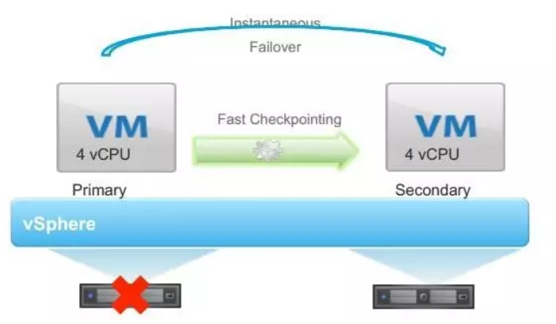

通过创建与主实例保持虚拟同步的虚拟机，使应用在服务器发生故障的情况下也能够持续可用。

这种方法常通过使主虚拟机 和辅助虚拟机执行相同顺序的 x86指令来完成此过程。主虚拟机捕获所有输入和事件，并在辅助虚拟机上进行重放。

辅助虚拟机执行与主虚拟机相同的指令序列，如果运行主虚拟机的主机或运行辅助虚拟机的主机发生故障，则会发生即时且透明的故障切换。

虽然FT功能很强大，但是在虚拟化中很少用到FT功能，一是对资源浪费比较严重，二是性能下降比较快，由于是指令级别的同步，因而两台虚拟机之间的距离非常近，无法完全达到容灾的目的，三是如果主虚拟机因为执行非法指令蓝屏，则辅助虚拟机也马上就会发生，根本无法保证业务延续性。

#### 级别二：虚拟机HA

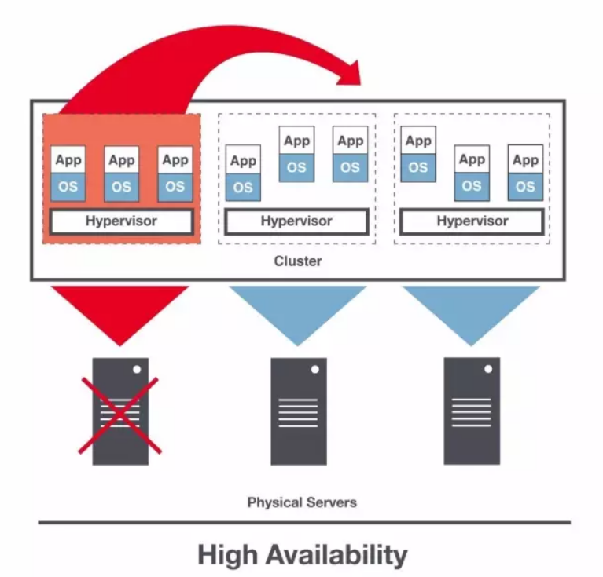

虚拟机HA主要指在有一个共享存储池的情况下，当一台物理机挂了，这台物理机上的虚拟机可以迁移到其他物理机的机制。

因为虚拟机是有状态的，因而需要共享存储池来保证状态可以被另外一台物理机读取到。

在HA状态下，虚拟机的恢复时间一般在秒级别，也即当监控探测到物理机挂了之后，可以迅速在空闲的物理机上将虚拟机启动起来。

启动HA的物理机集群可以比较大，可以跨机架，比FT更能起到容灾的目标。

#### 级别三：同城双活

如果一个机架，或者整个机房，甚至整个数据中心着火了，则如何保证业务的连续性呢？

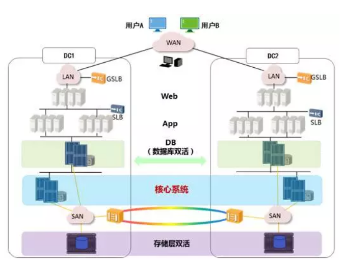

一种常用的机制是同城双活，就是在同一个城市，距离大概30km到100km的两个数据中心之间，通过高速专线互联的方式，让两个数据中心形成一个大二层网络。

同城双活最重要的是数据如何从一个数据中心同步到另一个数据中心，并且在一个数据中心故障的时候，可以实现存储设备的切换，保证状态能够快速切换到另一个数据中心。主流的存储厂商都提供在高速光纤互联情况下，在一定距离之内的两台存储设备的近实时的同步，数据双活是一切双活的基础。

基于双数据中心的数据同步，对上看起来可以形成一个统一的存储池，从而数据库层在共享存储池的情况下可以近实时的切换，例如Oracle RAC。

虚拟机在统一的存储池的情况下，也可以实现跨机房的HA，在一个机房切换到另一个机房。

SLB负载均衡实现同一机房的各个虚拟机之间的负载均衡。

GSLB可以实现跨机房的负载均衡，实现外部访问的切换。

如果在两个数据中心距离很近，并且大二层可通的情况下，也可以使用VRRP协议，通过VIP方式进行外部访问的切换。

同城双活一般宣称是实时切换，但是真正实施起来，一般在几分钟到十几分钟，对于数据量比较大的，还会几十分钟。

#### 级别四：异地容灾

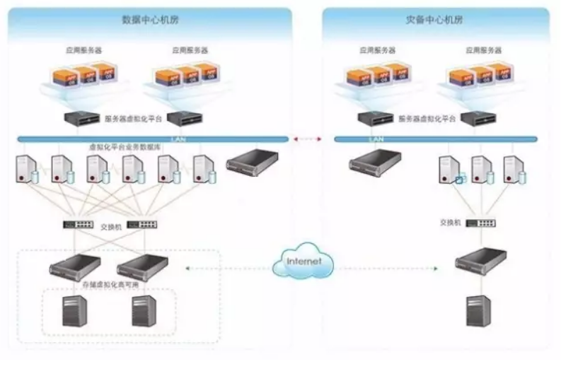

当你觉得一个地方两个数据中心还是不保险，例如海啸，地震，原子弹等，则可以在异地修建容灾数据中心。

第一大问题还是数据的问题，也即生产数据中心的数据如何备份到容灾数据中心，由于异地距离比较远，不可能像双活一样采取近同步的方式，只能通过异步的方式进行同步，也可以预见的是，容灾切换的时候，数据会丢失一部分。

由于容灾数据中心平时是不用的，不会讲所有的业务都进行容灾，否则成本太高。

对于数据的问题比较建议从业务层面进行容灾，由于数据同步会比较慢，可以根据业务需求高优先级同步重要的数据，因而容灾的层次越高越好。

例如有的用户完全不想操心，则使用存储层面的异步复制，对于存储设备来讲，是无法区分放在存储上的虚拟机哪台是重要的，哪台是不重要的，完全根据块进行复制，很可能先复制了不重要的虚拟机。

如果用户想对虚拟机做区分，则可以使用虚拟机层面的异步复制，用户知道哪些虚拟机更重要一些，哪些虚拟机不重要，则可以先同步重要的虚拟机。

如果用户可以根据业务层情况，在更细的粒度上区分哪些对业务来讲是重要的数据，例如交易数据，需要优先同步，哪些对于业务来讲是不重要的数据，例如日志数据。

在有异地容灾的情况下，可以平时进行容灾演练，看容灾数据中心是否能够真正起作用，别容灾了半天，真用上的时候掉链子。

由于是异地，容灾切换的时间一般在小时级别，几个小时不等。

####级别五：异地备份

备份是比容灾更加不灵活的一种方式，和容灾的不同是，容灾需要使得虚拟机的资源时刻准备着，等需要切换的时候，马上就用，数据和虚拟机还是热数据。而备份更多的是以冷数据的方式，将虚拟机镜像，数据库镜像等变成文件存放在价格比较便宜的存储上面，成本比容灾要低得多。

存储可以是专门用于备份的存储设备，也可以使用对象存储等大容量而且成本低的存储。

备份往往区分全量备份和差量备份，一般在重要的时间点保存全量备份，然后以后的一段时间保存差量备份，然后再全量备份，再差量备份。

备份恢复的过程也是从最近的全量备份开始，逐渐补足差量备份，从而达到最接近最终状态的数据。

一旦用到备份，则说明环境已经全部不在，需要重新准备环境来运行虚拟机和存储，所以恢复的时间在天级别。

### 2.3容错、高可用、灾备

#### 2.3.1容错

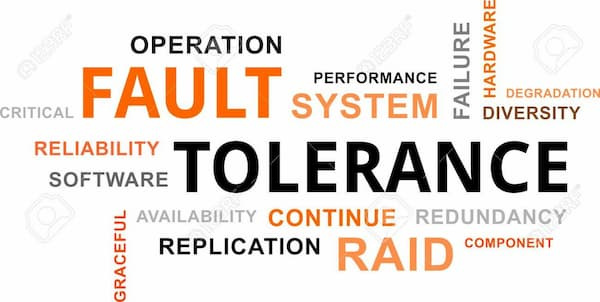

容错（fault tolerance）指的是， 发生故障时，系统还能继续运行。

容错的目的是，发生故障时，系统的运行水平可能有所下降，但是依然可用，不会完全失败。

#### 2.3.2高可用


高可用（high availability）指的是， 系统能够比正常时间更久地保持一定的运行水平。

高可用不是指系统不中断（那是容错能力），而是指一旦中断能够快速恢复，即中断必须是短暂的。如果需要很长时间才能恢复可用性，就不叫高可用了

#### 2.3.3灾备


灾备（又称灾难恢复，disaster recovery）指的是， 发生灾难时恢复业务的能力。

灾备的目的就是，保存系统的核心部分。一个好的灾备方案，就是从失败的基础设施中获取企业最宝贵的数据，然后在新的基础设施上恢复它们。注意，灾备不是为了挽救基础设置，而是为了挽救业务。

#### 2.3.4总结

上面三个方面可以结合起来，设计一个可靠的系统。
- 容错：发生故障时，如何让系统继续运行。
- 高可用：系统中断时，如何尽快恢复。
- 灾备：系统毁灭时，如何抢救数据。

## 三、扩展性

可伸缩性/可扩展性(Scalable/scalability)：可伸缩性(可扩展性)是一种对软件系统计算处理能力的设计指标，高可伸缩性代表一种弹性，在系统扩展成长过程中，软件能够保证旺盛的生命力，通过很少的改动甚至只是硬件设备的添置，就能实现整个系统处理能力的线性增长，实现高吞吐量和低延迟高性能。

可伸缩性和纯粹性能调优有本质区别， 可伸缩性是高性能、低成本和可维护性等诸多因素的综合考量和平衡，可伸缩性讲究平滑线性的性能提升，更侧重于系统的水平伸缩，通过廉价的服务器实现分布式计算；而普通性能优化只是单台机器的性能指标优化。他们共同点都是根据应用系统特点在吞吐量和延迟之间进行一个侧重选择，当然水平伸缩分区后会带来CAP定理约束。

软件的可扩展性设计非常重要，但又比较难以掌握，业界试图通过云计算或高并发语言等方式节省开发者精力，但是，无论采取什么技术，如果应用系统内部是铁板一块，例如严重依赖数据库，系统达到一定访问规模，负载都集中到一两台数据库服务器上，这时进行分区扩展伸缩就比较困难，正如Hibernate框架创建人Gavin King所说：关系数据库是最不可扩展的。

### 3.1性能和扩展性

什么是性能问题？ 如果你的系统对于一个用户访问还很慢，那就是性能问题；
什么是扩展性问题？ 如果你的系统对一个用户来说是快的，但是在用户不断增长的高访问量下就慢了。

### 3.2延迟和吞吐量

延迟和吞吐量是衡量可扩展性的一对指标，我们希望获得低延迟和高吞吐量的系统架构。所谓低延迟，也就是用户能感受到的系统响应时间，比如一个网页在几秒内打开，越短表示延迟越低，而吞吐量表示同时有多少用户能够享受到这种低延迟，如果并发用户量很大时，用户感觉网页的打开速度很慢，这意味着系统架构的吞吐量有待提高。

扩展性的目标是用可接受的延迟获得最大的吞吐量。可靠性(可用性)目标：用可接受的延迟获得数据更新的一致性。

### 3.3CAP原理

#### 3.3.1概述

CAP原则又称CAP定理，指的是在一个分布式系统中， Consistency（一致性）、 Availability（可用性）、Partition tolerance（分区容错性），三者不可得兼。

CAP原则是NOSQL数据库的基石。

分布式系统的CAP理论：理论首先把分布式系统中的三个特性进行了如下归纳：

- 一致性（C）：在分布式系统中的所有数据备份，在同一时刻是否同样的值。（等同于所有节点访问同一份最新的数据副本）
- 可用性（A）：在集群中一部分节点故障后，集群整体是否还能响应客户端的读写请求。（对数据更新具备高可用性）
- 分区容忍性（P）：以实际效果而言，分区相当于对通信的时限要求。系统如果不能在时限内达成数据一致性，就意味着发生了分区的情况，必须就当前操作在C和A之间做出选择。

一致性与可用性的决择编辑

CAP理论就是说在分布式存储系统中，最多只能实现上面的两点。而由于当前的网络硬件肯定会出现延迟丢包等问题，所以分区容忍性是我们必须需要实现的。所以我们只能在一致性和可用性之间进行权衡，没有NoSQL系统能同时保证这三点。

对于web2.0网站来说，关系数据库的很多主要特性却往往无用武之地

**数据库事务一致性需求**

很多web实时系统并不要求严格的数据库事务，对读一致性的要求很低，有些场合对写一致性要求并不高。允许实现最终一致性。
　　
**数据库的写实时性和读实时性需求**

对关系数据库来说，插入一条数据之后立刻查询，是肯定可以读出来这条数据的，但是对于很多web应用来说，并不要求这么高的实时性，比方说发一条消息之 后，过几秒乃至十几秒之后，我的订阅者才看到这条动态是完全可以接受的。
　　
**对复杂的SQL查询，特别是多表关联查询的需求 **

任何大数据量的web系统，都非常忌讳多个大表的关联查询，以及复杂的数据分析类型的报表查询，特别是SNS类型的网站，从需求以及产品设计角 度，就避免了这种情况的产生。往往更多的只是单表的主键查询，以及单表的简单条件分页查询，SQL的功能被极大的弱化了。
　　
#### 3.3.2取舍策略

CAP三个特性只能满足其中两个，那么取舍的策略就共有三种：

CA without P：如果不要求P（不允许分区），则C（强一致性）和A（可用性）是可以保证的。但放弃P的同时也就意味着放弃了系统的扩展性，也就是分布式节点受限，没办法部署子节点，这是违背分布式系统设计的初衷的。传统的关系型数据库RDBMS：Oracle、MySQL就是CA。

CP without A：如果不要求A（可用），相当于每个请求都需要在服务器之间保持强一致，而P（分区）会导致同步时间无限延长(也就是等待数据同步完才能正常访问服务)，一旦发生网络故障或者消息丢失等情况，就要牺牲用户的体验，等待所有数据全部一致了之后再让用户访问系统。设计成CP的系统其实不少，最典型的就是分布式数据库，如Redis、HBase等。对于这些分布式数据库来说，数据的一致性是最基本的要求，因为如果连这个标准都达不到，那么直接采用关系型数据库就好，没必要再浪费资源来部署分布式数据库。

AP wihtout C：要高可用并允许分区，则需放弃一致性。一旦分区发生，节点之间可能会失去联系，为了高可用，每个节点只能用本地数据提供服务，而这样会导致全局数据的不一致性。典型的应用就如抢购场景，可能前几秒你浏览商品的时候页面提示是有库存的，当你选择完商品准备下单的时候，系统提示你下单失败，商品已售完。这其实就是先在 A（可用性）方面保证系统可以正常的服务，然后在数据的一致性方面做了些牺牲，虽然多少会影响一些用户体验，但也不至于造成用户购物流程的严重阻塞。

### 3.4BASE理论

BASE是Basically Available（基本可用）、Soft state（软状态）和Eventually consistent（最终一致性）三个短语的简写，BASE是对CAP中一致性和可用性权衡的结果，其来源于对大规模互联网系统分布式实践的结论，是基于CAP定理逐步演化而来的，其核心思想是即使无法做到强一致性（Strong consistency），但每个应用都可以根据自身的业务特点，采用适当的方式来使系统达到最终一致性（Eventual consistency）。接下来我们着重对BASE中的三要素进行详细讲解。

#### 3.4.1基本可用

基本可用是指分布式系统在出现不可预知故障的时候，允许损失部分可用性——但请注意，这绝不等价于系统不可用，以下两个就是“基本可用”的典型例子。

响应时间上的损失：正常情况下，一个在线搜索引擎需要0.5秒内返回给用户相应的查询结果，但由于出现异常（比如系统部分机房发生断电或断网故障），查询结果的响应时间增加到了1~2秒。
功能上的损失：正常情况下，在一个电子商务网站上进行购物，消费者几乎能够顺利地完成每一笔订单，但是在一些节日大促购物高峰的时候，由于消费者的购物行为激增，为了保护购物系统的稳定性，部分消费者可能会被引导到一个降级页面。

#### 3.4.2软状态

弱状态也称为软状态，和硬状态相对，是指允许系统中的数据存在中间状态，并认为该中间状态的存在不会影响系统的整体可用性，即允许系统在不同节点的数据副本之间进行数据听不的过程存在延时。

#### 3.4.3最终一致性

最终一致性强调的是系统中所有的数据副本，在经过一段时间的同步后，最终能够达到一个一致的状态。因此，最终一致性的本质是需要系统保证最终数据能够达到一致，而不需要实时保证系统数据的强一致性

亚马逊首席技术官Werner Vogels在于2008年发表的一篇文章中对最终一致性进行了非常详细的介绍。他认为最终一致性时一种特殊的弱一致性：系统能够保证在没有其他新的更新操作的情况下，数据最终一定能够达到一致的状态，因此所有客户端对系统的数据访问都能够胡渠道最新的值。同时，在没有发生故障的前提下，数据达到一致状态的时间延迟，取决于网络延迟，系统负载和数据复制方案设计等因素。

在实际工程实践中，最终一致性存在以下五类主要变种。

##### 因果一致性

        因果一致性是指，如果进程A在更新完某个数据项后通知了进程B，那么进程B之后对该数据项的访问都应该能够获取到进程A更新后的最新值，并且如果进程B要对该数据项进行更新操作的话，务必基于进程A更新后的最新值，即不能发生丢失更新情况。与此同时，与进程A无因果关系的进程C的数据访问则没有这样的限制。

##### 读己之所写

        读己之所写是指，进程A更新一个数据项之后，它自己总是能够访问到更新过的最新值，而不会看到旧值。也就是说，对于单个数据获取者而言，其读取到的数据一定不会比自己上次写入的值旧。因此，读己之所写也可以看作是一种特殊的因果一致性。

##### 会话一致性

        会话一致性将对系统数据的访问过程框定在了一个会话当中：系统能保证在同一个有效的会话中实现“读己之所写”的一致性，也就是说，执行更新操作之后，客户端能够在同一个会话中始终读取到该数据项的最新值。

##### 单调读一致性

        单调读一致性是指如果一个进程从系统中读取出一个数据项的某个值后，那么系统对于该进程后续的任何数据访问都不应该返回更旧的值。

##### 单调写一致性

         单调写一致性是指，一个系统需要能够保证来自同一个进程的写操作被顺序地执行。

以上就是最终一致性的五类常见的变种，在时间系统实践中，可以将其中的若干个变种互相结合起来，以构建一个具有最终一致性的分布式系统。事实上，可以将其中的若干个变种相互结合起来，以构建一个具有最终一致性特性的分布式系统。事实上，最终一致性并不是只有那些大型分布式系统才设计的特性，许多现代的关系型数据库都采用了最终一致性模型。在现代关系型数据库中，大多都会采用同步和异步方式来实现主备数据复制技术。在同步方式中，数据的复制国耻鞥通常是更新事务的一部分，因此在事务完成后，主备数据库的数据就会达到一致。而在异步方式中，备库的更新往往存在延时，这取决于事务日志在主备数据库之间传输的时间长短，如果传输时间过长或者甚至在日志传输过程中出现异常导致无法及时将事务应用到备库上，那么狠显然，从备库中读取的的数据将是旧的，因此就出现了不一致的情况。当然，无论是采用多次重试还是认为数据订正，关系型数据库还是能搞保证最终数据达到一致——这就是系统提供最终一致性保证的经典案例。

总的来说，BASE理论面向的是大型高可用可扩展的分布式系统，和传统事务的ACID特性使相反的，它完全不同于ACID的强一致性模型，而是提出通过牺牲强一致性来获得可用性，并允许数据在一段时间内是不一致的，但最终达到一致状态。但同时，在实际的分布式场景中，不同业务单元和组件对数据一致性的要求是不同的，因此在具体的分布式系统架构设计过程中，ACID特性与BASE理论往往又会结合在一起使用。

### 3.5数据库事务的ACID

事务定义：所谓事务，它是一个操作序列，这些操作要么都执行，要么都不执行，它是一个不可分割的工作单位。

#### 3.5.1原子性（atomicity)

一个事务要么全部提交成功，要么全部失败回滚，不能只执行其中的一部分操作，这就是事务的原子性

#### 3.5.2一致性（consistency)

事务的执行不能破坏数据库数据的完整性和一致性，一个事务在执行之前和执行之后，数据库都必须处于一致性状态。

如果数据库系统在运行过程中发生故障，有些事务尚未完成就被迫中断，这些未完成的事务对数据库所作的修改有一部分已写入物理数据库，这是数据库就处于一种不正确的状态，也就是不一致的状态

#### 3.5.3隔离性（isolation）

事务的隔离性是指在并发环境中，并发的事务时相互隔离的，一个事务的执行不能不被其他事务干扰。不同的事务并发操作相同的数据时，每个事务都有各自完成的数据空间，即一个事务内部的操作及使用的数据对其他并发事务时隔离的，并发执行的各个事务之间不能相互干扰。

在标准SQL规范中，定义了4个事务隔离级别，不同的隔离级别对事务的处理不同，分别是：未授权读取，授权读取，可重复读取和串行化

1. 未提交读（Read Uncommited），该隔离级别允许脏读取，其隔离级别最低；比如事务A和事务B同时进行，事务A在整个执行阶段，会将某数据的值从1开始一直加到10，然后进行事务提交，此时，事务B能够看到这个数据项在事务A操作过程中的所有中间值（如1变成2，2变成3等），而对这一系列的中间值的读取就是未授权读取

2. 授权读取也称为已提交读（Read Commited），授权读取只允许获取已经提交的数据。比如事务A和事务B同时进行，事务A进行+1操作，此时，事务B无法看到这个数据项在事务A操作过程中的所有中间值，只能看到最终的10。另外，如果说有一个事务C，和事务A进行非常类似的操作，只是事务C是将数据项从10加到20，此时事务B也同样可以读取到20，即授权读取允许不可重复读取。

3. 可重复读（Repeatable Read），就是保证在事务处理过程中，多次读取同一个数据时，其值都和事务开始时刻是一致的，因此该事务级别禁止不可重复读取和脏读取，但是有可能出现幻影数据。所谓幻影数据，就是指同样的事务操作，在前后两个时间段内执行对同一个数据项的读取，可能出现不一致的结果。在上面的例子中，可重复读取隔离级别能够保证事务B在第一次事务操作过程中，始终对数据项读取到1，但是在下一次事务操作中，即使事务B（注意，事务名字虽然相同，但是指的是另一个事务操作）采用同样的查询方式，就可能读取到10或20；

4. 可串行读（Serializable），是最严格的事务隔离级别，它要求所有事务被串行执行，即事务只能一个接一个的进行处理，不能并发执行。

SQL Server隔离事务之间的影响是通过锁来实现的，通过阻塞来阻止上述影响。不同的隔离级别是通过加不同的锁，造成阻塞来实现的，所以会以付出性能作为代价；安全级别越高，处理效率越低；安全级别越低，效率高。

使用方法：SET TRANSACTIONISOLATION LEVEL REPEATABLE READ

未提交读： 在读数据时不会检查或使用任何锁。因此，在这种隔离级别中可能读取到没有提交的数据。

已提交读：只读取提交的数据并等待其他事务释放排他锁。读数据的共享锁在读操作完成后立即释放。已提交读是SQL Server的默认隔离级别。

可重复读： 像已提交读级别那样读数据，但会保持共享锁直到事务结束。

可串行读：工作方式类似于可重复读。但它不仅会锁定受影响的数据，还会锁定这个范围。这就阻止了新数据插入查询所涉及的范围。

#### 3.5.4持久性（durability）

一旦事务提交，那么它对数据库中的对应数据的状态的变更就会永久保存到数据库中。--即使发生系统崩溃或机器宕机等故障，只要数据库能够重新启动，那么一定能够将其恢复到事务成功结束的状态

持久性，意味着在事务完成以后，该事务所对数据库所作的更改便持久的保存在数据库之中，并不会被回滚。

即使出现了任何事故比如断电等，事务一旦提交，则持久化保存在数据库中。

SQL SERVER通过write-ahead transaction log来保证持久性。write-ahead transaction log的意思是，事务中对数据库的改变在写入到数据库之前，首先写入到事务日志中。而事务日志是按照顺序排号的（LSN）。当数据库崩溃或者服务器断点时，重启动SQL SERVER，SQLSERVER首先会检查日志顺序号，将本应对数据库做更改而未做的部分持久化到数据库，从而保证了持久性。

```
计算机系统从集中式向分布式的变革随着包括分布式网络、分布式事务和分布式数据一致性等在内的一系列问题与挑战，同时也催生了一大批诸如ACID、CAP和BASE等经典理论的快速发展。
BASE(Basically Available, Soft State, Eventual Consistency  基本可用、软状态、最终一致性) 对CAP AP理论的延伸, Redis等众多系统构建与这个理论之上
ACID是传统数据库常用的设计理念, ACID和BASE代表了两种截然相反的设计哲学，分处一致性-可用性分布图谱的两极。
在单机环境中，ACID是数据的属性；而在分布式环境中，BASE就是数据的属性。
```

## 四、安全

### 4.1什么是软件安全性测试

#### 4.1.1软件安全

软件安全属于软件领域里一个重要的子领域。在以前的单机时代，安全问题主要是操作系统容易感染病毒，单机应用程序软件安全问题并不突出。但是自从互联网普及后，软件安全问题愈加显加突显，使得软件安全性测试的重要性上升到一个前所未有的高度。

软件安全一般分为两个层次，即应用程序级别的安全性和操作系统级别的安全性。应用程序级别的安全性，包括对数据或业务功能的访问，在预期的安全性情况下，操作者只能访问应用程序的特定功能、有限的数据等。操作系统级别的安全性是确保只有具备系统平台访问权限的用户才能访问，包括对系统的登录或远程访问。

本文所讲的软件安全主要是应用程序层的安全，包括两个层面：①是应用程序本身的安全性。一般来说，应用程序的安全问题主要是由软件漏洞导致的，这些漏洞可以是设计上的缺陷或是编程上的问题，甚至是开发人员预留的后门。②是应用程序的数据安全，包括数据存储安全和数据传输安全两个方面。

#### 4.1.2软件安全性测试

一般来说，对安全性要求不高的软件，其安全性测试可以混在单元测试、集成测试、系统测试里一起做。但对安全性有较高需求的软件，则必须做专门的安全性测试，以便在破坏之前预防并识别软件的安全问题。

安全性测试(Security Testing)是指有关验证应用程序的安全等级和识别潜在安全性缺陷的过程。应用程序级安全测试的主要目的是查找软件自身程序设计中存在的安全隐患，并检查应用程序对非法侵入的防范能力, 根据安全指标不同测试策略也不同。注意：安全性测试并不最终证明应用程序是安全的，而是用于验证所设立策略的有效性，这些对策是基于威胁分析阶段所做的假设而选择的。例如，测试应用软件在防止非授权的内部或外部用户的访问或故意破坏等情况时的运作。

### 4.2软件安全性测试过程

(1)安全性测试方法

有许多的测试手段可以进行安全性测试，目前主要安全测试方法有：

①静态的代码安全测试：主要通过对源代码进行安全扫描，根据程序中数据流、控制流、语义等信息与其特有软件安全规则库进行匹对，从中找出代码中潜在的安全漏洞。静态的源代码安全测试是非常有用的方法，它可以在编码阶段找出所有可能存在安全风险的代码，这样开发人员可以在早期解决潜在的安全问题。而正因为如此，静态代码测试比较适用于早期的代码开发阶段，而不是测试阶段。

②动态的渗透测试：渗透测试也是常用的安全测试方法。是使用自动化工具或者人工的方法模拟黑客的输入，对应用系统进行攻击性测试，从中找出运行时刻所存在的安全漏洞。这种测试的特点就是真实有效，一般找出来的问题都是正确的，也是较为严重的。但渗透测试一个致命的缺点是模拟的测试数据只能到达有限的测试点，覆盖率很低。

③程序数据扫描。一个有高安全性需求的软件，在运行过程中数据是不能遭到破坏的，否则就会导致缓冲区溢出类型的攻击。数据扫描的手段通常是进行内存测试，内存测试可以发现许多诸如缓冲区溢出之类的漏洞，而这类漏洞使用除此之外的测试手段都难以发现。例如，对软件运行时的内存信息进行扫描，看是否存在一些导致隐患的信息，当然这需要专门的工具来进行验证，手工做是比较困难的。

(2)反向安全性测试过程

大部分软件的安全测试都是依据缺陷空间反向设计原则来进行的，即事先检查哪些地方可能存在安全隐患，然后针对这些可能的隐患进行测试。因此，反向测试过程是从缺陷空间出发，建立缺陷威胁模型，通过威胁模型来寻找入侵点，对入侵点进行已知漏洞的扫描测试。好处是可以对已知的缺陷进行分析，避免软件里存在已知类型的缺陷，但是对未知的攻击手段和方法通常会无能为力。

①建立缺陷威胁模型。建立缺陷威胁模型主要是从已知的安全漏洞入手，检查软件中是否存在已知的漏洞。建立威胁模型时，需要先确定软件牵涉到哪些专业领域，再根据各个专业领域所遇到的攻击手段来进行建模。

②寻找和扫描入侵点。检查威胁模型里的哪些缺陷可能在本软件中发生，再将可能发生的威胁纳入入侵点矩阵进行管理。如果有成熟的漏洞扫描工具，那么直接使用漏洞扫描工具进行扫描，然后将发现的可疑问题纳入入侵点矩阵进行管理。

③入侵矩阵的验证测试。创建好入侵矩阵后，就可以针对入侵矩阵的具体条目设计对应的测试用例，然后进行测试验证。

(3)正向安全性测试过程

为了规避反向设计原则所带来的测试不完备性，需要一种正向的测试方法来对软件进行比较完备的测试，使测试过的软件能够预防未知的攻击手段和方法。

①先标识测试空间。对测试空间的所有的可变数据进行标识，由于进行安全性测试的代价高昂，其中要重点对外部输入层进行标识。例如，需求分析、概要设计、详细设计、编码这几个阶段都要对测试空间进行标识，并建立测试空间跟踪矩阵。

②精确定义设计空间。重点审查需求中对设计空间是否有明确定义，和需求牵涉到的数据是否都标识出了它的合法取值范围。在这个步骤中，最需要注意的是精确二字，要严格按照安全性原则来对设计空间做精确的定义。

③标识安全隐患。根据找出的测试空间和设计空间以及它们之间的转换规则，标识出哪些测试空间和哪些转换规则可能存在安全隐患。例如,测试空间愈复杂，即测试空间划分越复杂或可变数据组合关系越多也越不安全。还有转换规则愈复杂，则出问题的可能性也愈大，这些都属于安全隐患。

④建立和验证入侵矩阵。安全隐患标识完成后，就可以根据标识出来的安全隐患建立入侵矩阵。列出潜在安全隐患，标识出存在潜在安全隐患的可变数据，和标识出安全隐患的等级。其中对于那些安全隐患等级高的可变数据，必须进行详尽的测试用例设计。

(4)正向和反向测试的区别

正向测试过程是以测试空间为依据寻找缺陷和漏洞，反向测试过程则是以已知的缺陷空间为依据去寻找软件中是否会发生同样的缺陷和漏洞，两者各有其优缺点。反向测试过程主要的一个优点是成本较低，只要验证已知的可能发生的缺陷即可，但缺点是测试不完善，无法将测试空间覆盖完整，无法发现未知的攻击手段。正向测试过程的优点是测试比较充分，但工作量相对来说较大。因此，对安全性要求较低的软件，一般按反向测试过程来测试即可，对于安全性要求较高的软件，应以正向测试过程为主，反向测试过程为辅。

### 4.3常见的软件安全性缺陷和漏洞

软件的安全有很多方面的内容，主要的安全问题是由软件本身的漏洞造成的，下面介绍常见的软件安全性缺陷和漏洞。

(1)缓冲区溢出

缓冲区溢出已成为软件安全的头号公敌，许多实际中的安全问题都与它有关。造成缓冲区溢出问题通常有以下两种原因。

①设计空间的转换规则的校验问题。即缺乏对可测数据的校验，导致非法数据没有在外部输入层被检查出来并丢弃。非法数据进入接口层和实现层后，由于它超出了接口层和实现层的对应测试空间或设计空间的范围，从而引起溢出。

②局部测试空间和设计空间不足。当合法数据进入后，由于程序实现层内对应的测试空间或设计空间不足，导致程序处理时出现溢出。

(2)加密弱点

这几种加密弱点是不安全的：

①使用不安全的加密算法。加密算法强度不够，一些加密算法甚至可以用穷举法破解。

②加密数据时密码是由伪随机算法产生的，而产生伪随机数的方法存在缺陷，使密码很容易被破解。

③身份验证算法存在缺陷。

④客户机和服务器时钟未同步，给攻击者足够的时间来破解密码或修改数据。

⑤未对加密数据进行签名，导致攻击者可以篡改数据。所以，对于加密进行测试时，必须针对这些可能存在的加密弱点进行测试。

(3)错误处理

一般情况下，错误处理都会返回一些信息给用户，返回的出错信息可能会被恶意用户利用来进行攻击，恶意用户能够通过分析返回的错误信息知道下一步要如何做才能使攻击成功。如果错误处理时调用了一些不该有的功能，那么错误处理的过程将被利用。错误处理属于异常空间内的处理问题，异常空间内的处理要尽量简单，使用这条原则来设计可以避免这个问题。但错误处理往往牵涉到易用性方面的问题，如果错误处理的提示信息过于简单，用户可能会一头雾水，不知道下一步该怎么操作。所以,在考虑错误处理的安全性的同时，需要和易用性一起进行权衡。

(4)权限过大

如果赋予过大的权限，就可能导致只有普通用户权限的恶意用户利用过大的权限做出危害安全的操作。例如没有对能操作的内容做出限制，就可能导致用户可以访问超出规定范围的其他资源。进行安全性测试时必须测试应用程序是否使用了过大的权限，重点要分析在各种情况下应该有的权限，然后检查实际中是否超出了给定的权限。权限过大问题本质上属于设计空间过大问题，所以在设计时要控制好设计空间，避免设计空间过大造成权限过大的问题。

### 4.4APP安全测试

#### 4.4.1安装包测试

##### 关于反编译

目的是为了保护公司的知识产权和安全方面的考虑等，一些程序开发人员会在源码中硬编码一些敏感信息，如密码。而且若程序内部一些设计欠佳的逻辑，也可能隐含漏洞，一旦源码泄漏，安全隐患巨大。

为了避免这些问题，除了代码审核外，通常开发的做法是对代码进行混淆，混淆后源代码通过反软件生成的源代码是很难读懂的，测试中，我们可以直接使用反编译工具（dex2jar和jd-gui工具）查看源代码，判断是否进行了代码混淆，包括显而易见的敏感信息。

##### 关于签名

这点IOS可以不用考虑，因为APP stroe都会校验。但Android没有此类权威检查，我们要在发布前校验一下签名使用的key是否正确，以防被恶意第三方应用覆盖安装等。可使用下列命令检查：

jarsigner -verify -verbose -certs apk包路径

若结果为“jar 已验证”，说明签名校验成功。

##### 完整性校验

为确保安装包不会在测试完成到最终交付过程中因为知足者趾问题发生文件损坏，需要对安装包进行完整性校验，通常做法是检查文件的md5值，而且一般可以通过自动化做校验。

##### 权限设置检查

一般用户对自己的隐私问题十 分敏感，因此，我们需要对APP申请某些特定权限的必要性进行检查，如访问通讯录等。对于没有必要的权限，一般都建议开发 直接支除。

Android：直接检查manifest文件来读取应用所需要的全部权限，并结合需求进行校验此权限是否为必须的。manifest文件的修改也需要关注，在增加新权限前需要进行评估。

IOS：没有类似manifest文件来查看，IOS的用户权限只有在用户使用APP到了需要使用的权限时，系统才会弹出提示框，提示用户当前APP需要访问照片、联系人列表等组件。我们可以扫描代码来查看项目工程中有哪些权限设置。通过搜索关键类名，如通讯录一般需要访问ABAddressBookRef，照片是UIImagePickerController等。如果是纯黑盒测试，则必须覆盖到所有代码路径才能保证没有遗漏，也可使用代码覆盖率测试判断是否覆盖。

##### 敏感信息测试

数据库是否存储敏感信息，某些应用会把cookie类数据保存在数据库中，一旦此数据被他人获取，可能造成用户账户被盗用等严重问题，测试中在跑完一个包含数据库操作的测试用例后，我们可以直接查看数据库里的数据，观察是否有敏感信息存储在内。一般来说这些敏感信息需要用户进行注销操作后删除。如果是cookie类数据，建议设置合理的过期时间。

日志是否存在敏感信息，一般开发在写程序的过程中会加入日志帮助高度，所有可能会写入一些敏感信息，通常APP的发布版不会使用日志，但也不排除特殊情况。

配置文件是否存在敏感信息，与日志类似，我们需要检查配置文件中是否包含敏感信息。

##### 软键盘劫持

如果用户安装了第三方键盘，可能存在劫持情况，对此，我们在一些特别敏感的输入地方可以做检查，例如金融类APP登录界面的用户名密码输入框等，看是否支持第三方输入法，一般建议使用应用内的软键盘。

##### 账户安全

密码是否明文存储在后台数据库，在评审和测试中需要关注密码的存储。

密码传输是否加密，测试中我们需要查看密码是否被 明文传输，如果是HTTP接口，我们可以使用FIddler等工具直接查看。

账户锁定策略。对于 用户输入错误密码次数过多的情况，是否会将账户临时锁定，避免被暴力破解，

同时会话情况。一些应用对同时会话会有通知功能，这样至少可以让用户知识他的账户可能已经被泄漏了。在一定程度上能免提升用户体验。

注销机制。在客户端注销后，我们需要验证任何的来自该用户的，需要身份验证的接口调用都不能成功。

##### 数据通信安全

关键数据是否散列或加密。密码在传输中必须是加密的，其他敏感信息传输前也需要进行散列或者加加密，以免被中间节点获取并恶意利用。

关键连接是否使用安全通信，例如HTTPS。在获知接口设计后我们需要评估是否其中内容包含敏感信息，如果未使用安全通信，需要知会开发修改。 

是否对数字证书合法性进行验证。即便使用了安全通信，例如HTTPS，我们也需要在客户端代码中对服务端证书进行合法性校验。测试中可以使用Fiddler工具模拟中间人攻击方法。如果客户端对于Fiddler证书没有校验而能正常调用，则存在安全隐患。

是否校验数据合法性。在一些情况下，我们需要有方法来确保服务端下发的明文数据不被篡改。通常开发侧的实现方式是对数据进行数字签名并在客户端进行校验。我们可以模拟后台返回进行相关的测试工作。此外，对于其他一些客户端未进行数据校验的接口，我们也需要有意识地思考如果不进行校验是否会产生问题，并通过模拟后台返回验证。

##### 组件安全测试

这里主要是指Android平台各个组件是否能被 外部应用恶意调用从而带来一些安全问题。包括Activity、Service、ContentProvider、Broadcast等等。采用的测试方法是通过使用drozer工具结合查看代码的方式，具体使用方法可查看官方文档。

#### 4.4.2服务端接口测试

主要关注服务端接口是否存在以下问题
- SQL注入
- XSS跨站脚本攻击
- CSRF跨站请求伪造
- 越权访问

除了上述服务端问题外，我们还需要结合实际的需求，设计和代码，分析是否需求或设计本身就会带来安全问题。

#### 4.4.3附录

##### 软件权限

1）扣费风险：包括短信、拨打电话、连接网络等。
2）隐私泄露风险：包括访问手机信息、访问联系人信息等。
3）对App的输入有效性校验、认证、授权、数据加密等方面进行检测
4）限制/允许使用手机功能接入互联网
5）限制/允许使用手机发送接收信息功能
6）限制或使用本地连接
7）限制/允许使用手机拍照或录音
8）限制/允许使用手机读取用户数据
9）限制/允许使用手机写入用户数据
10）限制/允许应用程序来注册自动启动应用程序

##### 数据安全性

1）当将密码或其它的敏感数据输入到应用程序时，其不会被存储在设备中，同时密码也不会被解码。
2）输入的密码将不以明文形式进行显示。
3）密码、信用卡明细或其他的敏感数据将不被存储在它们预输入的位置上。
4）不同的应用程序的个人身份证或密码长度必须至少在4-8个数字长度之间。
5）当应用程序处理信用卡明细或其它的敏感数据时，不以明文形式将数据写到其他单独的文件或者临时文件中。以防止应用程序异常终止而又没有删除它的临时文件，文件可能遭受入侵者的袭击，然后读取这些数据信息。
6）党建敏感数据输入到应用程序时，其不会被存储在设备中。
7）应用程序应考虑或者虚拟机器产生的用户提示信息或安全警告
8）应用程序不能忽略系统或者虚拟机器产生的用户提示信息或安全警告，更不能在安全警告显示前，利用显示误导信息欺骗用户，应用程序不应该模拟进行安全警告误导用户。
9）在数据删除之前，应用程序应当通知用户或者应用程序提供一个“取消”命令的操作。
10）应用程序应当能够处理当不允许应用软件连接到个人信息管理的情况。
11）当进行读或写用户信息操作时，应用程序将会向用户发送一个操作错误的提示信息。
12）在没有用户明确许可的前提下不损坏删除个人信息管理应用程序中的任何内容。
13）如果数据库中重要的数据正要被重写，应及时告知用户。
14）能合理的处理出现的错误。
15）意外情况下应提示用户。

##### 通讯安全性

1）在运行软件过程中，如果有来电、SMS、蓝牙等通讯或充电时，是否能暂停程序，优先处理通信，并在处理完毕后能正常恢复软件，继续其原来的功能。
2）当创立连接时，应用程序能够处理因为网络连接中断，进而告诉用户连接中断的情况。
3）应能处理通讯延时或中断。
4）应用程序将保持工作到通讯超时，进而给用户一个错误信息指示有链接错误。
5）应能处理网络异常和及时将异常情况通报用户。
6）应用程序关闭网络连接不再使用时应及时关闭，断开。

##### 人机接口安全测试

1）返回菜单应总保持可用。
2）命令有优先权顺序。
3）声音的设置不影响使用程序的功能。
4）应用程序必须能够处理不可预知的用户操作，例如错误的操作和同时按下多个键。

## 五、兼容性

### 5.1兼容性测试含义

兼容性测试是指要测试的软件在不同的硬件平台上、不同的应用软件之间、不同的操作系统中、不同的网络环境中是否可以正常的运行、有无异常的测试过程。即是通常说的软件的可移植性。

### 5.2兼容性测试分类

兼容测试主要包括：

1. **浏览器兼容性测试：**检查要测试的软件在不同浏览器上Web页面的样式和元素的展示效果以及交互是否正常；主流浏览器：windows下，IE 9以上、FireFox、Chrome。Mac下，Safari、Chrome、Firefox。
浏览器兼容性问题也可以被称为网页兼容性或网站兼容性问题，指网页在各种浏览器上的显示效果可能不一致而产生浏览器和网页间的兼容问题。
你可能遇到过功能明明是正常的，换一个浏览器就不正常的情况。这是因为不同浏览器使用内核及所支持的HTML（标准通用标记语言下的一个应用）等网页语言标准不同；以及用户客户端的环境不同（如分辨率不同）造成的显示效果不能达到理想效果，功能不正常等。

2. **屏幕尺寸和分辨率兼容性测试：**检查要测试的软件在不同分辨率下能否正常显示；

3. **操作系统兼容性测试：**检查要测试的软件在不同的操作系统下功能是否正常，显示是否正确等；主流操作系统：windows系列、Mac OS X系列、UNIX/Linux系列、Android系列、IOS系列。

4. **不同设备型号兼容性测试：**针对于APP，由于移动设备型号众多，则需要测试要测试的APP在主流设备上能否正常运行，会不会出现崩溃的现象。

### 5.3兼容性测试方法

兼容性测试，可以全手工测试兼容即：人工测试，主要是测试要测试的软件在主流浏览器和常用操作系统上的主流程和主界面。另外一种是借助第三方兼容性测试工具进行测试；
第三方 Web的兼容性测试工具，推荐IEtester（离线）、SuperPreview（离线）和Browsershots：browsershots.org（在线）。
```
IETester，是专门用于测试网页在IE浏览器各个版本中兼容性的工具，版本包含IE5.5至IE9的各个版本。
Spoon Browser Sandbox，点击你需要测试的浏览器环境，安装插件就可以进行测试了。帮助你测试网页在Safari、Chrome、Firefox和Opera浏览器中是否正常。
BrowserShots，一款免费的跨浏览器测试工具，捕捉网站在不同浏览器中的截图。最有名，最古老的浏览器兼容性测试工具。
Multiple IEs这款工具同样用于测试网页在IE浏览器各个版本的兼容性。
```

通常来说，人工测试工作量大，且覆盖不全；第三方测试工作虽说比较省时省力，但是在主功能和主流程测试的时候没有侧重点，不够灵活，很难发现一些隐藏的问题；所以将人工和第三方工具兼容性测试结合起来才是最好的兼容性测试方法。

### 5.4浏览器的兼容性测试从哪些方面入手？

1. 了解当前主流浏览器，挑选3-5个左右的浏览器进行兼容性测试
2. 同浏览器的不同版本兼容性测试（一般测试最新版本）
3. 检查界面元素的位置是否正确，与业务功能交互是否正常，排版布局是否合理美观
功能按钮（增删改查、导入导出、超链接、清空）等
各种控件的检查：日期和时间控件、搜索控件
有些特殊的图标功能比如：盘古系统上的画图功能是否正常（不覆盖区域图标、覆盖区域绘图、站点位置迁移图标、挪动地图坐标）等

### 5.5兼容性测试注意事项

1. 向前兼容和向后兼容，新旧版本的软件能否正常读取、加载和交互。
2. 异构数据库兼容， 软件要考虑其对不同数据库平台的支持能力，软件是否可直接挂接，或需提供相关的转换工具。

## 六、本地化

### 6.1概述

Localization testing（本地化测试），本地化测试的对象是软件的本地化版本。本地化测试的目的是测试特定目标区域设置的软件本地化质量。本地化测试的环境是在本地化的操作系统上安装本地化的软件。从测试方法上可以分为基本功能测试，安装/卸载测试，当地区域的软硬件兼容性测试。测试的内容主要包括软件本地化后的界面布局和软件翻译的语言质量，包含软件、文档和联机帮助等部分。

本地化就是翻译产品的 UI，有时也更改某些初始设置以使产品适合于另一个地区。本地化测试检查针对特定目标区域性或区域设置的产品本地化质量。此测试基于全球化测试的结果，后者验证对特定区域性或区域设置的功能性支持。本地化测试只能在产品的本地化版本上进行。可本地化性测试不对本地化质量进行测试。

本地化测试过程中的测试工作集中在：

- 受本地化影响的方面，如 UI 和内容
- 区域性或区域设置特定的、语言特定的和地区特定的方面

另外，本地化测试还应包括：

- 基本功能测试
- 在本地化环境中运行的安装和升级测试
- 根据产品的目标地区计划应用程序和硬件兼容性测试。

可以选择 Windows 2000 的任何语言版本作为测试平台。然而，必须安装目标语言支持。

用户界面和语言的本地化测试应包括的项有：

- 验证所有应用程序资源
- 验证语言的准确性和资源属性
- 版式错误
- 书面文档、联机帮助、消息、界面资源、命令键顺序等的一致性检查。
- 确认是否遵守系统、输入和显示环境标准
- 用户界面可用性
- 评估文化适合性
- 检查政治上敏感的内容

当交付本地化产品时，确保包含本地化文档（手册、联机帮助、上下文帮助等）。要检查的项包括：

- 翻译的质量
- 翻译的完整性
- 所有文档和应用程序 UI 中使用的术语一致

### 6.2软件本地化测试的内容构成

#### 6.2.1软件本地化测试的目的
　　保证本地化的软件与源语言软件具有相同的功能和性能。
　　保证本地化的软件在语言、文化、传统观念等方面符合当地用户的习惯。

#### 6.2.2软件本地化测试的测试策略
　　本地化软件要在各种本地化操作系统上安装并测试。
　　源语言软件安装在另一台相同源语言操作系统上，作为对比测试。
　　重点测试因本地化引起的软件功能和软件界面的错误。
　　测试本地化软件的翻译质量。
　　手工测试和自动测试相结合。

#### 6.2.3软件本地化测试的主要内容
　　测试内容由不同的测试阶段决定，例如第一个Build，以软件界面测试为主，中间Build以功能和界面为主，最后Build终点测试安装/卸载，软件帮助和主要功能。

#### 6.2.4安装/卸载性能测试
　　测试本地化的软件是否可以正确地安装/卸载在本地语言的操作系统上（包括是否支持本地语言的安装目录名）。安装/卸载前后安装文件、快捷方式、程序图标和注册表等的变化是否与源语言程序一致。

#### 6.2.5软件功能测试
　　本地化软件功能是否与源语言软件功能相同。
　　是否支持当地语言的输入和输出，如对双字节支持和正确显示。
　　对当地日期，时间，货币符号等的支持性能。
　　是否支持当地语言的文件名和目录名。

#### 6.2.6软件界面测试
　　软件安装窗口中的按钮，菜单等的布局是否合理，美观。
　　软件运行后的界面元素，包括菜单、快捷键、对话框、屏幕提示、按钮、列表框的布局和本地化字体和字号是否正确。界面文字的翻译是否与术语表一致，是否存在没有翻译的元素。

#### 6.2.7帮助文件功能和翻译质量
　　本地化帮助文件的功能是否与源语言软件一致。
　　本地化帮助文件的布局是否合理，美观。
　　本地化帮助文件的文字翻译是否准确、专业，是否存在没有翻译的段落。

### 6.3软件本地化测试类型解析与测试要领

软件本地化测试是在本地化的操作系统上对本地化的软件版本进行的测试。根据软件本地化项目的规模、测试阶段以及测试方法，本地化测试分为多种类型，每种类型都对软件本地化的质量进行检测和保证。为了提高测试的质量，保证测试的效率，不同类型的本地化测试需要使用不同的方法，掌握必要的测试技巧。本文主要选取本地化测试中具有代表性的测试类型进行分析，结合软件本地化项目的测试经验对其测试要领进行剖析。

#### 6.3.1导航测试

导航测试（Pilot Testing）是为了降低软件本地化的风险而进行的一种本地化测试。大型的全球化软件在完成国际化设计后，通常选择少量的典型语言进行软件的本地化，以此测试软件的可本地化能力，降低多种语言同时本地化的风险。

导航测试尤其是用于数十种语言本地化的新开发的软件，导航测试版本的语言主要由语言市场的重要性和规模确定，也要考虑语言编码等的代表性。例如，德语市场是欧洲的重要市场，通常作为导航测试的首要单字节字符集语言。日语是亚洲重要的市场，可以作为双字节字符集语言代表。随着中国国内软件市场规模的增加，国际软件开发商逐渐对简体中文本地化提高重视程度，简体中文有望更多成为导航测试的首选语言。

导航测试是软件本地化项目早期进行的探索性测试，需要在本地化操作系统上进行，测试的重点是软件的国际化能力和可本地化能力，包括与区域相关的特性的处理能力，也包括测试是否可以容易地进行本地化，减少硬编码等缺陷。由于导航测试在整个软件本地化过程中意义重大，而且导航测试的持续时间通常较短，另外由于是新开发的软件的本地化测试，测试人员对软件的功能和使用操作了解不多，因此，本地化公司通常需要在正是测试之前进行搜集和学习软件的相关资料，做好测试环境和人员的配备，配置具有丰富测试经验的工程师执行测试。

#### 6.3.2可接受性测试

本地化软件的可接受性测试（Build Acceptable Testing）也称作冒烟测试（Smoke Testing），是指对编译的软件本地化版本的主要特征进行基本测试，从而确定版本是否满足详细测试的条件。理论上，每个编译的本地化新版本在进行详细测试之前，都需要进行可接受性测试，以便早期发现软件版本的可测试性，避免不必要的时间浪费。

注意，软件本地化版本的可接受性测试与软件公司为特定客户定制开发的原始语言软件在交付客户前的验收测试完全不同，验收测试主要确定软件的功能和性能是否达到了客户的需求，如果一切顺利，只进行一次验收测试就可以结束。

本地化软件在编译后，编译工程师通常需要执行版本健全性检查（Build Sanity Check），确定本地化版本的内容和主要功能可以用于测试。而编译的本地化版本是否真的满足测试条件则还要通过独立的测试人员进行可接受性测试，它要求测试人员在较短的时间内完成，确定本地化的软件版本是否满足全面测试的要求，是否正确包含了应该本地化的部分。如果版本通过了可接受性测试，则可以进入软件全面详细测试阶段，反之，则需要重新编译本地化软件版本，直到通过可接受性测试。

在进行本地化软件版本的可接受性测试时，需要配置正确的测试环境（软件和硬件），在本地化的操作系统上安装软件，确定是否可以正确安装。软件运行软件，确定软件包含了应该本地化的全部内容，并且主要功能正确。然后，卸载软件，保证软件可以彻底卸载。软件的完整性是需要注意的一个方面，通过使用文件和文件夹的比较工具软件，对比安装后的本地化软件和英文软件内容的异同，确定本地化的完整性。

#### 6.3.3语言质量测试

语言质量测试是软件本地化测试的重要组成部分，贯穿于本地化项目的各个阶段。语言质量测试的主要内容是软件界面和联机帮助等文档的翻译质量，包括正确性、完整性、专业性和一致性。

为了保证语言测试的质量，应该安排本地化语言作为母语的软件测试工程师进行测试，同时请本地化翻译工程师提供必要的帮助。在测试之前，必须阅读和熟悉软件开发商提供的软件术语表（Glossary），了解软件翻译风格（Translation Style）的语言表达要求。

由于软件的用户界面总是首先进行本地化，因此，本地化测试的初期的软件版本的语言质量测试主要以用户界面的语言质量为主，重点测试是否存在未翻译的内容，翻译的内容是否正确，是否符合软件术语表和翻译风格要求，是否符合母语表达方式，是否符合专业和行业的习惯用法。

本地化项目后期要对联机帮助和相关文档（各种用户使用手册等）进行本地化，这个阶段的语言质量测试，除了对翻译的表达正确性和专业性进行测试之外，还有注意联机帮助文件和软件用户界面的一致性。如果对于某些软件专业术语的翻译存在疑问，需要报告一个翻译问题，请软件开发商审阅，如果确认是翻译错误，需要修改术语表和软件的翻译。

关于本地化软件的语言质量测试，一个值得注意的问题是“过翻译”，就是软件中不应该翻译的内容（例如软件的名称等）如果进行了翻译，应该报告软件“过翻译”错误。

#### 6.3.4用户界面测试

本地化软件的用户界面测试（UI Testing），也称作外观测试（Cosmetic Testing）主要对软件的界面文字和控件布局（大小和位置）进行测试。用户界面至少包括软件的安装和卸载界面、软件的运行界面和软件的联机帮助界面。软件界面的主要组成元素包括窗口、对话框、菜单、工具栏、状态栏、屏幕提示文字等内容。

用户界面的布局测试是本地化界面测试的重要内容，由于本地化的文字通常比原始开发语言长度增长，所以一类常见的本地化错误是软件界面上的文字显示不完整，例如，按钮文字只显示一部分。另一类常见的界面错误是对话框中的控件位置排列不整齐，大小不一致。

相对于其他类型的本地化测试，用户界面测试可能是最简单的测试类型，软件测试工程师不需要过多的语言翻译知识和测试工具，但是由于软件的界面众多，而且某些对话框可能隐藏的比较深入，因此，软件测试工程师必须尽可能地熟悉被测试软件的使用方法，这样才能找出那些较为隐蔽的界面错误。另外，某个界面错误可能是一类错误，需要报告一个综合的错误，例如，软件安装界面的“上一步”或“下一步”按钮显示不完整，则可能所有安装对话框的同类按钮都存在相同的错误。

#### 6.3.5功能测试

原始语言开发的软件的功能测试主要测试软件的各项功能是否实现以及是否正确，而本地化软件的功能测试主要测试软件经过本地化后，软件的功能是否与源软件一致，是否存在因软件本地化而产生的功能错误，例如，某些功能失效或功能错误。

本地化软件的功能测试相对于其他测试类型具有较大难度，由于大型软件的功能众多，而且有些功能不经常使用，可能需要多步组合操作才能完成，因此本地化软件的功能测试需要测试工程师熟悉软件的使用操作，对于容易产生本地化错误之处能够预测，以便减少软件测试的工作量，这就要求测试工程师具有丰富的本地化测试经验。

除了某些菜单和按钮的本地化功能失效错误外，本地化软件的功能错误还包括软件的热键和快捷键错误，例如，菜单和按钮的热键与源软件不一致或者丢失热键。另外一类是排序错误，例如，排序的结果不符合本地化语言的习惯。

发现本地化功能错误后，需要在源软件上进行相同的测试，如果源软件也存在相同的错误，则不属于本地化功能错误，而属于源软件的设计错误，需要报告源软件的功能错误。另外，如果同时进行多种本地化语言（例如，简体中文、繁体中文、日文和韩文）的测试，在一种语言上的功能错误也需要在其他语言版本上进行相同的测试，以确定该错误是单一语言特有的，还是许多本地化版本共有的错误。

软件的测试类型数量众多，可谓五花八门，而软件本地化测试又具有其自身的特点，除以上常见的本地化测试类型外，还包括联机帮助测试、本地化能力测试等测试。不论何种类型的本地化测试，其最终测试目标都是尽早找出软件本地化错误，保证本地化软件与原始开发语言软件具有相同的功能。通过正确配置本地化测试环境，合理组织本地化测试人员，采用正确的本地化流程和测试工具，完善软件缺陷的报告和跟踪处理，有助于保证软件本地化测试的有效实现。

#### 6.3.6本地化测试软件缺陷分类详解

本地化测试发现的软件缺陷特征明显，便于分类。本文按照本地化测试软件缺陷的特征进行分类，周详地分析各种缺陷的表现特征，简要描述各类缺陷的产生原因，最后给出各类缺陷的修正方法。

#####  6.3.6.1缺陷类型

概括地讲，软件本地化的缺陷主要分为两大类：核心缺陷和本地化缺陷。

##### 6.3.6.2缺陷表现特征

由于本地化缺陷是本地化测试中出现的数量最多的缺陷，所以首先分析本地化缺陷的表现特征。而本地化测试中发现的核心缺陷虽然数量不多，不过他们的危害程度更大，所以需要认真对待，接下来分析他们的表现特征。

###### 用户界面缺陷

　　控件的文字被截断(Truncation)
　　对话框中的文本框、按钮、列表框、状态栏中的本地化文字只显示一部分
　　控件或文字没有对齐(Misaligned)
　　对话框中的同类控件或本地化文字没有对齐
　　控件位置重叠(Overlapped)
　　对话框中的控件彼此重叠
　　多余的文字(Extra strings)
　　软件程式的窗口或对话框中的出现多余的文字
　　丢失的文字(Missed strings)
　　软件程式的窗口或对话框中的文字部分或全部丢失
　　不一致的控件布局(Inconsistent layout)
　　本地化软件的控件布局和源语言软件不一致
　　丢失的文字(Missed strings)
　　软件程式的窗口或对话框中的文字部分或全部丢失
　　文字的字体、字号错误(Incorrect font name and font size)
　　控件的文字显示不美观，不符合本地化语言的正确字体和字号
　　多余的空格(Extra space)
　　本地化文字字符之间存在多余的空格
　　

###### 语言质量缺陷

　　字符没有本地化(Unlocalized strings)
　　对话框或软件程式窗口中的应该本地化的文字没有本地化
　　字符不完整地本地化(Incomplete localized strings)
　　对话框或软件程式窗口中的应该本地化的文字只有一部分本地化
　　错误的本地化字符(Error localization)
　　源语言文字被错误地本地化，或对政治敏感的文字错误地进行了本地化
　　不一致的本地化字符(Inconsistent localized string)
　　相同的文字前后翻译不一致
　　相同的文字各语言之间不一致
　　相同的文字软件用户界面和联机帮助文件不一致
　　过度本地化(Over localization)
　　不应该本地化的字符进行了本地化
　　标点符号、版权、商标符号错误(Incorrect punctuation, Copyright)
　　标点符号、版权和商标的本地化不符合本地化语言的使用习惯
　　
###### 本地化功能缺陷

　　本地化功能缺陷是本地化软件中的某些功能不起作用，或功能错误，和源语言功能不一致。
　　功能不起作用(Not working)
　　菜单、对话框的按钮、超链接不起作用
　　功能错误(Error function)
　　菜单、对话框的按钮、超链接引起程式崩溃
　　菜单、对话框的按钮、超链接带来和源语言软件不一致的错误结果
　　超链接没有链接到本地化的网站或页面
　　软件的功能不符合本地化用户的使用需求
　　热键和快捷键错误(Error hot keys and short-cut keys)
　　菜单或对话框中存在重复的热键
　　本地化软件中缺少热键或快捷键
　　不一致的热键或快捷键
　　快捷键或快捷键无效

###### 源语言功能缺陷

　　源语言功能缺陷是在源语言软件和全部本地化软件上都能复现的错误。
　　功能不起作用(Not working)
　　菜单不起作用
　　对话框的按钮不起作用
　　超链接不起作用
　　控件焦点跳转顺序(Tab键)不正确
　　文字内容错误(Incorrect strings)
　　软件的名称或版本编号错误
　　英文拼写错误、语法错误
　　英文用词不恰当等

######  源语言国际化缺陷

　　源语言国际化缺陷是在源语言软件设计过程中对软件的本地化能力的处理不足引起的，他只出目前本地化的软件中。
　　区域设置错误(Error regional setting)
　　本地化日期格式错误
　　本地化时间格式错误
　　本地化数字格式(小数点、千位分隔符)错误
　　本地化货币单位或格式错误
　　本地化度量单位错误
　　本地化纸张大小错误
　　本地化电话号码和邮政编码错误
　　双字节字符错误(Error DBCS)
　　不支持双字节字符的输入
　　双字节字符显示乱码
　　不能保存含有双字节字符内容的文件
　　不能打印双字节字符

##### 6.3.6.3缺陷产生原因

　　核心缺陷是由于源程式软件编码错误引起的，例如研发人员对于某个功能模块的编码错误，或没有考虑软件的国际化和本地化能力，而将代码设定为某一种语言;

　　本地化缺陷是由于软件本地化过程引起的，例如语言翻译质量较差、界面控件布局不当、翻译了程式中的变量等。

#####  6.3.6.4缺陷修正方法

　　本地化缺陷是测试中发现的数量最多的Bug，他只出目前本地化的版本上，而不出目前源语言版本上，能由本地化工程师修改本地化软件相关资源文件解决，例如修改错误的翻译文字、调整控件的大小和位置等。

　　核心缺陷中的源语言功能缺陷既出目前本地化软件，也能在源语言软件上复现，而核心缺陷中的源语言国际化缺陷，虽然只出目前本地化版本中，不过只能通过修改程式代码实现，属于源语言软件的设计错误，这类缺陷只能由软件研发人员修正。 