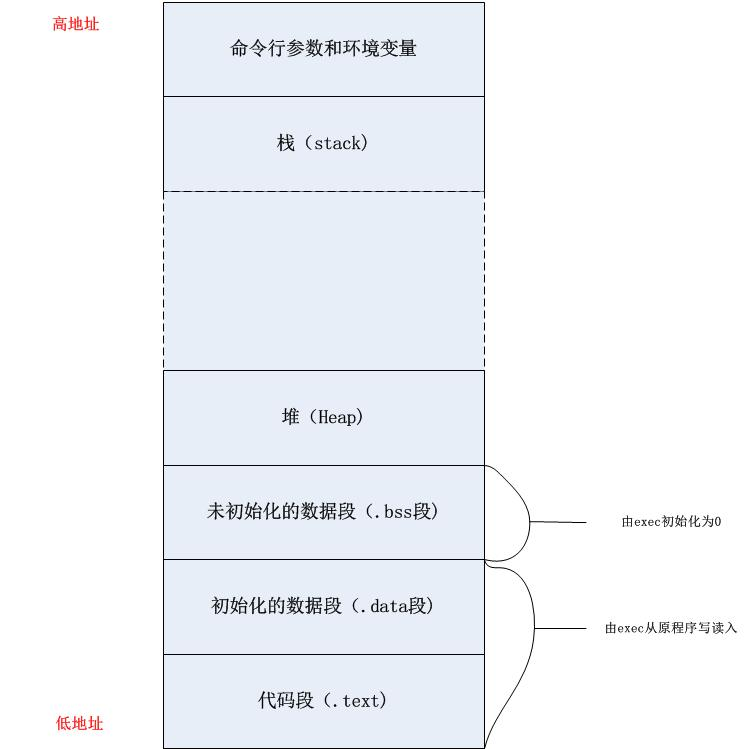
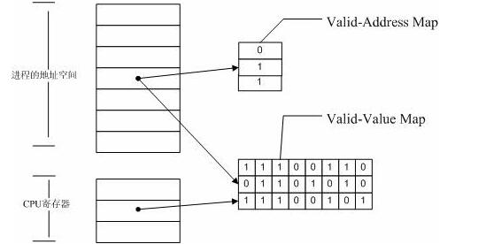
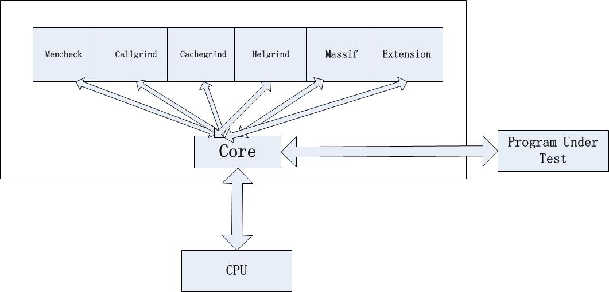
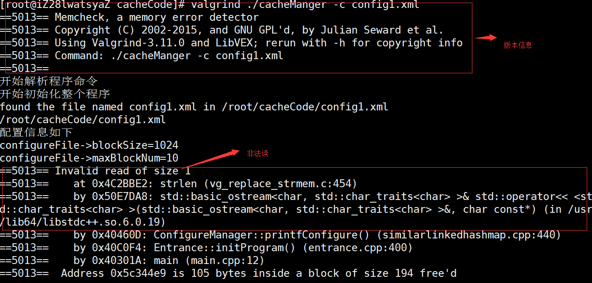
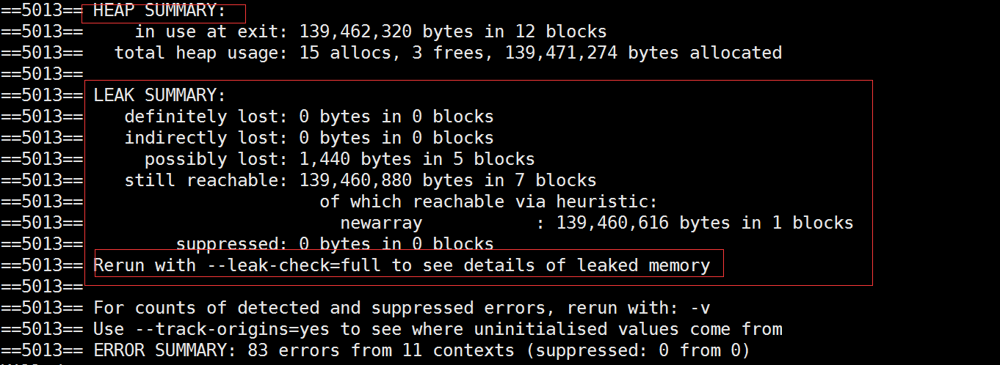
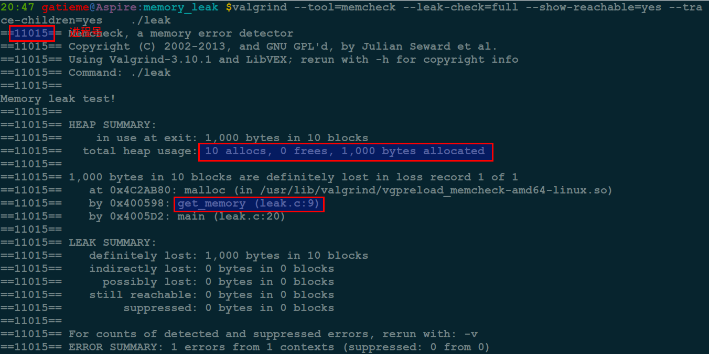

# Linux下几款C++程序中的内存泄露检查工具

Linux下编写C或者C++程序，有很多工具，但是主要编译器仍然是gcc和g++。最近用到STL中的List编程，为了检测写的代码是否会发现内存泄漏，了解了一下相关的知识。

所有使用动态内存分配(dynamic memory allocation)的程序都有机会遇上内存泄露(memory leakage)问题，在Linux里有三种常用工具来检测内存泄露的情況，包括：

参见 http://elinux.org/Memory_Debuggers 

内存泄露检测工具比较

|工具|	描述|
|----|---|
|valgrind|	一个强大开源的程序检测工具|
|mtrace|	GNU扩展，用来跟踪malloc，mtrace为内存分配函数(malloc,rellaoc,memalign,free)安装hook函数|
|dmalloc|	用于检查C/C++内存泄漏的工具，即是检查是否存在程序运行结束还没有释放的内存，以一个运行库发布|
|memwatch|	和dmalloc一样，它能检测未释放的内存、同一段内存被释放多次、位址存取错误及不当使用未分配之内存区域|
|mpatrol|	一个跨平台的 C++ 内存泄漏检测器|
|dbgmem|	也是一个动态库发布的形式，优点类似dmalloc，但是相比之下，可能特点少了一些|
|Electric Fence|	不仅仅能够跟踪malloc()和free(),同时能够检查读访问以及写入，能够准确指出导致错误的指令|
## Linux程序内存空间布局

- 代码段(.text):这里存放的是CPU要执行的指令，代码是可共享的，相同的代码在内存中只有一份拷贝，同时这个段是只读的，防止程序由于错误而修改自身指令
- 初始化数据段（.data）。这里存放的是程序中需要明确赋初始值的变量，例如位于所有函数之外的全局变量：int val=100。需要强调的是，以上两段都是位于程序的可执行文件中，内核在调用exec函数启动该程序时从源程序文件中读入。
- 未初始化数据段（.bss）。位于这一段中的数据，内核在执行该程序前，将其初始化为0或者null。例如出现在任何函数之外的全局变量：int sum;以及未初始化或初值为0的全局变量和静态局部变量
- 堆（Heap）。这个段用于在程序中进行动态内存申请，例如经常用到的malloc，new系列函数就是从这个段中申请内存。
- 已初始化且初值非0的全局变量和静态局部变量
- 栈（Stack）。函数中的局部变量以及在函数调用过程中产生的临时变量都保存在此段中。可执行代码、字符串字面值、只读变量。
## 内存检查原理
Memcheck检测内存问题的原理图：

### 1.Valid-value表：
对于进程的整个地址空间中的每一字节(byte),都有与之对应的8个bits，对于CPU的每个寄存器，也有一个与之对应的bit向量。这些bits负责记录该字节或者寄存器值是否具有有效 的、已经初始化的值
### 2.Valid-Address表
对于进程整个地址空间中的 么一个字节（byte),还有与 之对应的1bit，负责记录该地址是否能够被读写。
### 检测原理
当要读写内存中的某个字节时，首先检查这个字节对应的A bit。如果该A bit显示该位置是无效位置，memcheck则报告读写错误。

内核（core）类似于一个虚拟的CPU的环境，这样当内存中的某个字节被加载到真实的CPU中时，该字节对应的V bit也被加载到虚拟的CPU环境中，一旦寄存器中的值，被用来产生内存地址，或者该值能够影响程序的输出，则memcheck会检查对应的vbits，如果该值尚未初始化，则会报告使用未初始化内存错误。

## Valgrind

Valgrind包括以下一些工具：
- Memcheck:这是valgrind应用最广泛的工具，一个重量级的内存检查器，能够给发现开发中绝大多数的内存错误使用的情况，比如：使用未初始化
- callgrind：它主要用来检查程序中函数中调用过程中出现的问题
- cachegrind：它主要用来检查程序中缓存使用出现的问题
- Helgrind：它主要用来检查多线程中出现的竞争问题
- Massif:它主要用来检查程序中堆栈使用中出现的问题
- Extension:可以使用core提供的 功能，自己编写特定的内存调试工具

### 安装
[下载地址](http://valgrind.org/downloads/current.html#current)
- 解压安装包
`tar -jxvf valgrind-3.11.0.tar.bz2  -C /usr/local/src`
- 进入目录安装
`cd /usr/local/src/valgrind-3.11.0`
- 运行./autogen.sh设置环境（需要标准的autoconf工具）
`./autogen.sh`
- 配置Valgrind，生成MakeFile文件
`./configure --prefix=/usr/local`
- 编译和安装valgrind
`make  && make install`

安装后，输入 
`valgrind ls -l`
验证一下该工具是否工作正常（这是README里面的方法，实际上是验证一下对ls -l命令的内存检测），如果你看到一堆的信息说明你的工具可以使用了。

### 使用
准备好程序
>为了valgrind发现的错误更精确，如能够定位到源代码的行，建议在编译时加上-g参数，编译优化选项选择O0(不要优化)

在valgrind下，运行可执行程序

>利用valgrind调试内存问题，不需要重新编译源程序，它的输入就是二进制的可执行程序。调用Valgrind的通用格式是：valgrind [valgrind-options] your-prog [your-prog-options]>

Valgrind 的参数分为两类，一类是 core 的参数，它对所有的工具都适用；另外一类就是具体某个工具如 memcheck 的参数。Valgrind 默认的工具就是 memcheck，也可以通过“–tool=tool name”指定其他的工具。Valgrind 提供了大量的参数满足你特定的调试需求，具体可参考其用户手册。



#### 编译程序
```
g++ -g -o leak leak.c 
```

被检测程序加入 –g -fno-inline 编译选项保留调试信息, 否则后面的valgrind不能显示到出错行号。

valgrind被设计成非侵入式的，它直接工作于可执行文件上，因此在检查前不需要重新编译、连接和修改你的程序。要检查一个程序很简单，只需要执行下面的命令就可以了。
```
valgrind --tool=tool_name program_name
```
比如我们要对ls -l命令做内存检查，只需要执行下面的命令就可以了
```
valgrind --tool=memcheck ls -l
```

小提示

如果不知道有哪些参数, 可以先输入valgrind –tool=, 然后狂按两次tab, 会输出linux系统的只能提示, 同样,如果你输入了valgrind –tool=mem再狂按两次tab,linux系统会为你自动补全

#### 使用valgrind检测Memcheck

下面我们就可以用valgrind对我们的程序检测leak
```
valgrind --tool=memcheck --leak-check=full --show-reachable=yes --trace-children=yes    ./leak
```
其中–leak-check=full 指的是完全检查内存泄漏，
- –show-reachable=yes是显示内存泄漏的地点，
- –trace-children=yes是跟入子进程。

当程序正常退出的时候valgrind自然会输出内存泄漏的信息原理：


## mtrace检测内存泄露
mtrace其实是GNU扩展函数，用来跟踪malloc。
mtrace为内存分配函数（malloc, realloc, memalign, free）安装hook函数。这些hook函数记录内存的申请和释放的trace信息。 
在程序中，这些trace信息可以被用来发现内存泄漏和释放不是申请的内存。 
当调用mtrace，mtrace会检查环境变量MALLOC_TRACE。该环境变量应该包含记录trace信息的文件路径。如果文件可以被成功打开，它的大小被截断为0。 
如果MALLOC_TRACE没有设置，或者设置的文件不可用或者不可写，那么将不会安装hook函数，mtrace不生效。
详细说明可参考man page：man 3 mtrace
### mtrace使用

mtrace能监测程序是否内存泄露

在程序的起始处包含头文件
```
#include <mcheck.h>
```
更改环境变量：export MALLOC_TRACE=”mtrace.out”可以加入如下代码
```
setenv("MALLOC_TRACE", "mtrace.out", 1);
```
调用函数mtrace()
```
mtrace()
```
编译程序带上 -g 选项
```
gcc -g -c leak_mtrace.c -o leak_mtrace.o  -std=gnu9x -Wall
```
运行程序一次，尽量调用所有程序内的函数。这时调试信息就已经被写入我们指定的mtrace.out文件中
```
./leak_mtrace 
mtrace a.out mtrace.out查看内存监测情况
mtrace a.out  mtrace.out
```
## dmalloc

dmalloc是一种用于检查C/C++内存泄露(leak)的工具，即检查是否存在直到程序运行结束还没有释放的内存，并且能够精确指出在哪个源文件的第几行。

## Linux内核的Kmemleak

### Kmemleak检测工具介绍

Kmemleak工作于内核态是内核自带的内核泄露检测工具, 其源代码位于mm/kmemleak.c

Kmemleak工作于内核态，Kmemleak 提供了一种可选的内核泄漏检测，其方法类似于跟踪内存收集器。当独立的对象没有被释放时，其报告记录在 /sys/kernel/debug/kmemleak中，Kmemcheck能够帮助定位大多数内存错误的上下文。

### Kmemleak使用过程概述

首先`CONFIG_DEBUG_KMEMLEAK在Kernel hacking中被使能.

查看内核打印信息详细过程如下：
- 挂载debugfs文件系统 
```
mount -t debugfs nodev /sys/kernel/debug/
```
- 开启内核自动检测线程 
```
echo scan > /sys/kernel/debug/kmemleak
```
- 查看打印信息 
```
cat /sys/kernel/debug/kmemleak
```
- 清除内核检测报告，新的内存泄露报告将重新写入/sys/kernel/debug/kmemleak 
```
echo clear > /sys/kernel/debug/kmemleak
```
内存扫描参数可以进行修改通过向/sys/kernel/debug/kmemleak 文件写入。

 参数使用如下

- off 禁用kmemleak（不可逆）
- stack=on 启用任务堆栈扫描(default)
- stack=off 禁用任务堆栈扫描
- scan=on 启动自动记忆扫描线程(default)
- scan=off 停止自动记忆扫描线程
- scan=<secs> 设置n秒内自动记忆扫描
- scan 开启内核扫描
- clear 清除内存泄露报告
- dump=<addr> 转存信息对象在<addr>

通过“kmemleak = OFF”，也可以在启动时禁用Kmemleak在内核命令行。在初始化kmemleak之前，内存的分配或释放这些动作被存储在一个前期日志缓冲区。这个缓冲区的大小通过配CONFIG_DEBUG_KMEMLEAK_EARLY_LOG_SIZE设置。

### Kmemleak动态检测原理

通过的kmalloc、vmalloc、kmem_cache_alloc等内存分配会跟踪其指针，连同其他的分配大小和堆栈跟踪信息，存储在PRIO搜索树。相应的释放函数调用跟踪和指针就会从kmemleak数据结构中移除。 

分配的内存块，被认为是独立的，如果没有指针指向它起始地址或块的内部的任何位置，可以发现扫描内存（包括已保存的寄存器）。这意味着，有可能没有办法为内核通过所分配的地址传递块到一个释放函数，因此，该块被认为是一个内存泄漏。

扫描算法步骤： 

- 标记的所有分配对象为白色（稍后将剩余的白色物体考虑独立的）
- 扫描存储器与所述数据片段和栈开始，检查对地址的值存储在PRIO搜索树。如果一个白色的对象的指针被发现，该对象将被添加到灰名单
- 扫描的灰色对象匹配的地址（一些白色物体可以变成灰色，并添加结束时的灰名单），直到黑色集结束
- 剩下的白色物体被认为是独立儿，并报告写入/sys/kernel/debug/kmemleak。 

一些分配的内存块的指针在内核的内部数据结构和它们不能被检测为孤儿。对避免这种情况，kmemleak也可以存储的数量的值，指向一个内的块的地址范围内的地址，需要找到使块不被认为是泄漏.

### kmem相关函数

从kernel源代码中的目录include /linux/kmemleak.h中可查看函数原型的头

|函数|	功能|
|----|-----|
|kmemleak_init|	初始化kmemleak|
|kmemleak_alloc|	一个内存块分配的通知|
|kmemleak_alloc_percpu|	通知的一个percpu的内存块分配|
|kmemleak_free|	通知的内存块释放|
|kmemleak_free_part|	通知释放部分内存块|
|kmemleak_free_percpu|	一个percpu内存块释放的通知|
|kmemleak_not_leak|	当不是泄露时，标记对象|
|kmemleak_ignore|	当泄漏时不扫描或报告对象|
|kmemleak_scan_area|	添加扫描区域内的内存块|
|kmemleak_no_scan|	不扫描的内存块|
|kmemleak_erase|	删除一个指针变量的旧值|
|kmemleak_alloc_recursive|	为kmemleak_alloc，只检查递归|
|kmemleak_free_recursive|	为kmemleak_free，只检查递归|