[TOC]
# Go语言简介-01

Go语言（或 Golang）起源于 2007 年，并在 2009 年正式对外发布。Go 是非常年轻的一门语言，它的主要目标是“兼具 Python 等动态语言的开发速度和 C/C++ 等编译型语言的性能与安全性”。

Go语言是编程语言设计的又一次尝试，是对类C语言的重大改进，它不但能让你访问底层操作系统，还提供了强大的网络编程和并发编程支持。Go语言的用途众多，可以进行网络编程、系统编程、并发编程、分布式编程。

Go语言的推出，旨在不损失应用程序性能的情况下降低代码的复杂性，具有“部署简单、并发性好、语言设计良好、执行性能好”等优势，目前国内诸多 IT 公司均已采用Go语言开发项目。

Go语言有时候被描述为“C 类似语言”，或者是“21 世纪的C语言”。Go 从C语言继承了相似的表达式语法、控制流结构、基础数据类型、调用参数传值、指针等很多思想，还有C语言一直所看中的编译后机器码的运行效率以及和现有操作系统的无缝适配。

因为Go语言没有类和继承的概念，所以它和 Java 或 C++ 看起来并不相同。但是它通过接口（interface）的概念来实现多态性。Go语言有一个清晰易懂的轻量级类型系统，在类型之间也没有层级之说。因此可以说Go语言是一门混合型的语言。

此外，很多重要的开源项目都是使用Go语言开发的，其中包括 Docker、Go-Ethereum、Thrraform 和 Kubernetes。

## 一、Go语言创始人
对语言进行评估时，明白设计者的动机以及语言要解决的问题很重要。Go语言出自 Ken Thompson 和 Rob Pike、Robert Griesemer 之手，他们都是计算机科学领域的重量级人物。
#### 1) Ken Thompson
贝尔实验室 Unix 团队成员，C语言、Unix 和 Plan 9 的创始人之一，在 20 世纪 70 年代，设计并实现了最初的 UNIX 操作系统，仅从这一点说，他对计算机科学的贡献怎么强调都不过分。他还与 Rob Pike 合作设计了 UTF-8 编码方案。
#### 2) Rob Pike
Go语言项目总负责人，贝尔实验室 Unix 团队成员，除帮助设计 UTF-8 外，还帮助开发了分布式多用户操作系统 Plan 9、Inferno 操作系统和 Limbo 编程语言，并与人合著了《The Unix Programming Environment》，对 UNIX 的设计理念做了正统的阐述。
#### 3) Robert Griesemer
就职于 Google，参与开发 Java HotSpot 虚拟机，对语言设计有深入的认识，并负责 Chrome 浏览器和 Node.js 使用的 Google V8 JavaScript 引擎的代码生成部分。

这些计算机科学领城的重量级人物设计Go语言的初衷是满足 Google 的需求。设计此语言花费了两年的时间，融入了整个团队多年的经验及对编程语言设计的深入认识。设计团队借鉴了 Pascal、Oberon 和C语言的设计智慧，同时让Go语言具备动态语言的便利性。因此，Go语言体现了经验丰富的计算机科学家的语言设计理念，是为全球最大的互联网公司之一设计的。

Go语言的所有设计者都说，设计Go语言是因为 C++ 给他们带来了挫败感。在 Google I/O 2012 的 Go 设计小组见面会上，Rob Pike 是这样说的：

>我们做了大量的 C++ 开发，厌烦了等待编译完成，尽管这是玩笑，但在很大程度上来说也是事实。

### Go 是编译型语言
Go 使用编译器来编译代码。编译器将源代码编译成二进制（或字节码）格式；在编译代码时，编译器检查错误、优化性能并输出可在不同平台上运行的二进制文件。要创建并运行 Go 程序，程序员必须执行如下步骤。
- 使用文本编辑器创建 Go 程序；
- 保存文件；
- 编译程序；
- 运行编译得到的可执行文件。

这不同于 Python、Ruby 和 JavaScript 等语言，它们不包含编译步骤。Go 自带了编译器，因此无须单独安装编译器。

### 为什么要学习Go语言
如果你要创建系统程序，或者基于网络的程序，Go语言是很不错的选择。作为一种相对较新的语言，它是由经验丰富且受人尊敬的计算机科学家设计的，旨在应对创建大型并发网络程序面临的挑战。

在Go语言出现之前，开发者们总是面临非常艰难的抉择，究竟是使用执行速度快但是编译速度并不理想的语言（如：C++），还是使用编译速度较快但执行效率不佳的语言（如：.NET、Java），或者说开发难度较低但执行速度一般的动态语言呢？显然，Go语言在这 3 个条件之间做到了最佳的平衡：快速编译，高效执行，易于开发。

Go语言支持交叉编译，比如说你可以在运行 Linux 系统的计算机上开发可以在 Windows 上运行的应用程序。这是第一门完全支持 UTF-8 的编程语言，这不仅体现在它可以处理使用 UTF-8 编码的字符串，就连它的源码文件格式都是使用的 UTF-8 编码。Go语言做到了真正的国际化！

### Go语言吉祥物
Go语言有一个吉祥物，在会议、文档页面和博文中，大多会包含下图所示的 Go Gopher，这是才华横溢的插画家 Renee French 设计的，她也是 Go 设计者之一 Rob Pike 的妻子。


## 二、Go语言的特性
Go语言也称为 Golang，是由 Google 公司开发的一种静态强类型、编译型、并发型、并具有垃圾回收功能的编程语言。

接下来从几个方面来具体介绍一下Go语言的特性。

### 语法简单
抛开语法样式不谈，单就类型和规则而言，Go 与 C99、C11 相似之处颇多，这也是Go语言被冠以“NextC”名号的重要原因。

Go语言的语法处于简单和复杂的两极。C语言简单到你每写下一行代码，都能在脑中想象出编译后的模样，指令如何执行，内存如何分配，等等。而 C 的复杂在于，它有太多隐晦而不着边际的规则，着实让人头疼。相比较而言，Go 从零开始，没有历史包袱，在汲取众多经验教训后，可从头规划一个规则严谨、条理简单的世界。

Go语言的语法规则严谨，没有歧义，更没什么黑魔法变异用法。任何人写出的代码都基本一致，这使得Go语言简单易学。放弃部分“灵活”和“自由”，换来更好的维护性，我觉得是值得的。

将“++”、“--”从运算符降级为语句，保留指针，但默认阻止指针运算，带来的好处是显而易见的。还有，将切片和字典作为内置类型，从运行时的层面进行优化，这也算是一种“简单”。
### 并发模型
时至今日，并发编程已成为程序员的基本技能，在各个技术社区都能看到诸多与之相关的讨论主题。在这种情况下Go语言却一反常态做了件极大胆的事，从根本上将一切都并发化，运行时用 Goroutine 运行所有的一切，包括 main.main 入口函数。

可以说，Goroutine 是 Go 最显著的特征。它用类协程的方式来处理并发单元，却又在运行时层面做了更深度的优化处理。这使得语法上的并发编程变得极为容易，无须处理回调，无须关注线程切换，仅一个关键字，简单而自然。

搭配 channel，实现 CSP 模型。将并发单元间的数据耦合拆解开来，各司其职，这对所有纠结于内存共享、锁粒度的开发人员都是一个可期盼的解脱。若说有所不足，那就是应该有个更大的计划，将通信从进程内拓展到进程外，实现真正意义上的分布式。
### 内存分配
将一切并发化固然是好，但带来的问题同样很多。如何实现高并发下的内存分配和管理就是个难题。好在 Go 选择了 tcmalloc，它本就是为并发而设计的高性能内存分配组件。

可以说，内存分配器是运行时三大组件里变化最少的部分。刨去因配合垃圾回收器而修改的内容，内存分配器完整保留了 tcmalloc 的原始架构。使用 cache 为当前执行线程提供无锁分配，多个 central 在不同线程间平衡内存单元复用。在更高层次里，heap 则管理着大块内存，用以切分成不同等级的复用内存块。快速分配和二级内存平衡机制，让内存分配器能优秀地完成高压力下的内存管理任务。

在最近几个版本中，编译器优化卓有成效。它会竭力将对象分配在栈上，以降低垃圾回收压力，减少管理消耗，提升执行性能。可以说，除偶尔因性能问题而被迫采用对象池和自主内存管理外，我们基本无须参与内存管理操作。
### 垃圾回收
垃圾回收一直是个难题。早年间，Java 就因垃圾回收低效被嘲笑了许久，后来 Sun 连续收纳了好多人和技术才发展到今天。可即便如此，在 Hadoop 等大内存应用场景下，垃圾回收依旧捉襟见肘、步履维艰。

相比 Java，Go 面临的困难要更多。因指针的存在，所以回收内存不能做收缩处理。幸好，指针运算被阻止，否则要做到精确回收都难。

每次升级，垃圾回收器必然是核心组件里修改最多的部分。从并发清理，到降低 STW 时间，直到 Go 的 1.5 版本实现并发标记，逐步引入三色标记和写屏障等等，都是为了能让垃圾回收在不影响用户逻辑的情况下更好地工作。尽管有了努力，当前版本的垃圾回收算法也只能说堪用，离好用尚有不少距离。
### 静态链接
Go 刚发布时，静态链接被当作优点宣传。只须编译后的一个可执行文件，无须附加任何东西就能部署。这似乎很不错，只是后来风气变了。连着几个版本，编译器都在完善动态库 buildmode 功能，场面一时变得有些尴尬。

暂不说未完工的 buildmode 模式，静态编译的好处显而易见。将运行时、依赖库直接打包到可执行文件内部，简化了部署和发布操作，无须事先安装运行环境和下载诸多第三方库。这种简单方式对于编写系统软件有着极大好处，因为库依赖一直都是个麻烦。
### 标准库
功能完善、质量可靠的标准库为编程语言提供了充足动力。在不借助第三方扩展的情况下，就可完成大部分基础功能开发，这大大降低了学习和使用成本。最关键的是，标准库有升级和修复保障，还能从运行时获得深层次优化的便利，这是第三方库所不具备的。

Go 标准库虽称不得完全覆盖，但也算极为丰富。其中值得称道的是 net/http，仅须简单几条语句就能实现一个高性能 Web Server，这从来都是宣传的亮点。更何况大批基于此的优秀第三方 Framework 更是将 Go 推到 Web/Microservice 开发标准之一的位置。

当然，优秀第三方资源也是语言生态圈的重要组成部分。近年来崛起的几门语言中，Go 算是独树一帜，大批优秀作品频繁涌现，这也给我们学习 Go 提供了很好的参照。
### 工具链
完整的工具链对于日常开发极为重要。Go 在此做得相当不错，无论是编译、格式化、错误检查、帮助文档，还是第三方包下载、更新都有对应的工具。其功能未必完善，但起码算得上简单易用。

内置完整测试框架，其中包括单元测试、性能测试、代码覆盖率、数据竞争，以及用来调优的 pprof，这些都是保障代码能正确而稳定运行的必备利器。

除此之外，还可通过环境变量输出运行时监控信息，尤其是垃圾回收和并发调度跟踪，可进一步帮助我们改进算法，获得更佳的运行期表现。

## 三、Go语言为并发而生
在早期 CPU 都是以单核的形式顺序执行机器指令。Go语言的祖先C语言正是这种顺序编程语言的代表。顺序编程语言中的顺序是指：所有的指令都是以串行的方式执行，在相同的时刻有且仅有一个 CPU 在顺序执行程序的指令。

随着处理器技术的发展，单核时代以提升处理器频率来提高运行效率的方式遇到了瓶颈，单核 CPU 发展的停滞，给多核 CPU 的发展带来了机遇。相应地，编程语言也开始逐步向并行化的方向发展。

虽然一些编程语言的框架在不断地提高多核资源使用效率，例如 Java 的 Netty 等，但仍然需要开发人员花费大量的时间和精力搞懂这些框架的运行原理后才能熟练掌握。

作为程序员，要开发出能充分利用硬件资源的应用程序是一件很难的事情。现代计算机都拥有多个核，但是大部分编程语言都没有有效的工具让程序可以轻易利用这些资源。编程时需要写大量的线程同步代码来利用多个核，很容易导致错误。

Go语言正是在多核和网络化的时代背景下诞生的原生支持并发的编程语言。Go语言从底层原生支持并发，无须第三方库，开发人员可以很轻松地在编写程序时决定怎么使用 CPU 资源。

Go语言的并发是基于 goroutine 的，goroutine 类似于线程，但并非线程。可以将 goroutine 理解为一种虚拟线程。Go语言运行时会参与调度 goroutine，并将 goroutine 合理地分配到每个 CPU 中，最大限度地使用 CPU 性能。

多个 goroutine 中，Go语言使用通道（channel）进行通信，通道是一种内置的数据结构，可以让用户在不同的 goroutine 之间同步发送具有类型的消息。这让编程模型更倾向于在 goroutine 之间发送消息，而不是让多个 goroutine 争夺同一个数据的使用权。

程序可以将需要并发的环节设计为生产者模式和消费者的模式，将数据放入通道。通道另外一端的代码将这些数据进行并发计算并返回结果，如下图所示。

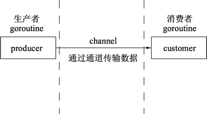
>提示：Go语言通过通道可以实现多个 goroutine 之间内存共享。


【实例】生产者每秒生成一个字符串，并通过通道传给消费者，生产者使用两个 goroutine 并发运行，消费者在 main() 函数的 goroutine 中进行处理。
```go
package main

import (
        "fmt"
        "math/rand"
        "time"
)

// 数据生产者
func producer(header string, channel chan<- string) {
     // 无限循环, 不停地生产数据
     for {
            // 将随机数和字符串格式化为字符串发送给通道
            channel <- fmt.Sprintf("%s: %v", header, rand.Int31())
            // 等待1秒
            time.Sleep(time.Second)
        }
}

// 数据消费者
func customer(channel <-chan string) {
     // 不停地获取数据
     for {
            // 从通道中取出数据, 此处会阻塞直到信道中返回数据
            message := <-channel
            // 打印数据
            fmt.Println(message)
        }
}

func main() {
    // 创建一个字符串类型的通道
    channel := make(chan string)
    // 创建producer()函数的并发goroutine
    go producer("cat", channel)
    go producer("dog", channel)
    // 数据消费函数
    customer(channel)
}
```
运行结果：
```
dog: 2019727887
cat: 1298498081
dog: 939984059
cat: 1427131847
cat: 911902081
dog: 1474941318
dog: 140954425
cat: 336122540
cat: 208240456
dog: 646203300
```
对代码的分析：
- 第 03 行，导入格式化（fmt）、随机数（math/rand）、时间（time）包参与编译。
- 第 10 行，生产数据的函数，传入一个标记类型的字符串及一个只能写入的通道。
- 第 13 行，for{} 构成一个无限循环。
- 第 15 行，使用 rand.Int31() 生成一个随机数，使用 fmt.Sprintf() 函数将 header 和随机数格式化为字符串。
- 第 18 行，使用 time.Sleep() 函数暂停 1 秒再执行这个函数。如果在 goroutine 中执行时，暂停不会影响其他 goroutine 的执行。
- 第 23 行，消费数据的函数，传入一个只能写入的通道。
- 第 26 行，构造一个不断消费消息的循环。
- 第 28 行，从通道中取出数据。
- 第 31 行，将取出的数据进行打印。
- 第 35 行，程序的入口函数，总是在程序开始时执行。
- 第 37 行，实例化一个字符串类型的通道。
- 第 39 行和第 40 行，并发执行一个生产者函数，两行分别创建了这个函数搭配不同参数的两个 goroutine。
- 第 42 行，执行消费者函数通过通道进行数据消费。

整段代码中，没有线程创建，没有线程池也没有加锁，仅仅通过关键字 go 实现 goroutine，和通道实现数据交换。

## 三、哪些项目使用Go语言开发
所有的编程语言都反映了语言设计者对编程哲学的反思，通常包括之前的语言所暴露的一些不足地方的改进。Go语言从发布 1.0 版本以来备受众多开发者关注并得到广泛使用，Go语言的简单、高效、并发特性吸引了众多传统语言开发者的加入，而且人数越来越多。

使用Go语言开发的开源项目非常多。早期的Go语言开源项目只是通过Go语言与传统项目进行C语言库绑定实现，例如 Qt、Sqlite 等；后期的很多项目都使用Go语言进行重新原生实现，这个过程相对于其他语言要简单一些，这也促成了大量使用Go语言原生开发项目的出现。

下面列举的是原生使用Go语言进行开发的部分项目。
### 1) Docker
Docker 是一种操作系统层面的虚拟化技术，可以在操作系统和应用程序之间进行隔离，也可以称之为容器。Docker 可以在一台物理服务器上快速运行一个或多个实例。例如，启动一个 CentOS 操作系统，并在其内部命令行执行指令后结束，整个过程就像自己在操作系统一样高效。

项目链接：https://github.com/docker/docker
### 2) Go语言
Go语言自己的早期源码使用C语言和汇编语言写成。从 Go 1.5 版本后，完全使用Go语言自身进行编写。Go语言的源码对了解Go语言的底层调度有极大的参考意义，建议希望对Go语言有深入了解的读者读一读。

项目链接：https://github.com/golang/go
### 3) Kubernetes
Google 公司开发的构建于 Docker 之上的容器调度服务，用户可以通过 Kubernetes 集群进行云端容器集群管理。系统会自动选取合适的工作节点来执行具体的容器集群调度处理工作。其核心概念是 Container Pod（容器仓）。

项目链接：https://github.com/kubernetes/kubernetes
### 4) etcd
一款分布式、可靠的 KV 存储系统，可以快速进行云配置。由 CoreOS 开发并维护键值存储系统，它使用Go语言编写，并通过 Raft 一致性算法处理日志复制以保证强一致性。

项目链接：https://github.com/coreos/etcd
### 5) beego
beego 是一个类似 Python 的 Tornado 框架，采用了 RESTFul 的设计思路，使用Go语言编写的一个极轻量级、高可伸缩性和高性能的 Web 应用框架。

项目链接：https://github.com/astaxie/beego
### 6) martini
一款快速构建模块化的 Web 应用的Go语言框架。

项目链接：https://github.com/go-martini/martini
### 7) codis
国产的优秀分布式 Redis 解决方案。可以将 codis 理解成为 Web 服务领域的 Nginx，它实现了对 Redis 的反向代理和负载均衡。

项目链接：https://github.com/CodisLabs/codis
### 8) delve
Go语言强大的调试器，被很多集成环境和编辑器整合。

项目链接：https://github.com/derekparker/delve

## 四、哪些大公司正在使用Go语言
Go语言是谷歌在 2009 年发布的一款编程语言，自面世以来它以高效的开发效率和完美的运行速度迅速风靡全球，被誉为“21 世纪的C语言”。

现在越来越多的公司开始使用Go语言开发自己的服务，同时也诞生了很多使用Go语言开发的服务和应用，比如 Docker、k8s 等，下面我们来看一下，有哪些大公司在使用Go语言。
### 1) Google
作为创造了Go语言的 google 公司，当然会力挺Go语言了。Google 有很多基于 Go 开发的开源项目，比如 kubernets，docker，大家可以参考《哪些项目使用Go语言开发》一节了解更多的Go语言开源项目。
### 2) Facebook
Facebook 也在使用Go语言，为此他们还专门在 Github 上建立了一个开源组织 facebookgo。大家可以通过 https://github.com/facebookgo 访问查看 facebook 开源的项目，其中最具代表性的就是著名平滑重启工具 grace。
### 3) 腾讯
腾讯在 15 年就已经做了 Docker 万台规模的实践。因为腾讯主要的开发语言是 C/C++ ，所以在使用Go语言方面会方便很多，也有很多优势，不过日积月累的 C/C++ 代码很难改造，也不敢动，所以主要在新业务上尝试使用 Go。
### 4) 百度
百度主要在运维方面使用到了Go语言，比如百度运维的一个 BFE 项目，主要负责前端流量的接入，其次就是百度消息通讯系统的服务器端也使用到了Go语言。
### 5) 七牛云
七牛云算是国内第一家选Go语言做服务端的公司。早在 2011 年，当Go语言的语法还没完全稳定下来的情况下，七牛云就已经选择将 Go 作为存储服务端的主体语言。
### 6) 京东
京东云消息推送系统、云存储，以及京东商城的列表页等都是使用Go语言开发的。
### 7) 小米
小米对Go语言的支持，在于运维监控系统的开源，它的官方网址是 http://open-falcon.org/
此外，小米互娱、小米商城、小米视频、小米生态链等团队都在使用Go语言。
### 8) 360
360 对Go语言的使用也不少，比如开源的日志搜索系统 Poseidon，大家可以通过 https://github.com/Qihoo360/poseidon 查看，还有 360 的推送团队也在使用Go语言。

除了上面提到的，还有很多公司开始尝试使用Go语言，比如美团、滴滴、新浪等。

Go语言的强项在于它适合用来开发网络并发方面的服务，比如消息推送、监控、容器等，所以在高并发的项目上大多数公司会优先选择 Golang 作为开发语言。

## 五、Go语言的性能如何
根据 Go 开发团队和基本的算法测试，Go语言与C语言的性能差距大概在 10%~20% 之间。虽然没有官方的性能标准，但是与其它各个语言相比已经拥有非常出色的表现。

时下流行的语言大都是运行在虚拟机上，如：Java 和 Scala 使用的 JVM，C# 和 VB.NET 使用的 .NET CLR。尽管虚拟机的性能已经有了很大的提升，但任何使用 JIT 编译器和脚本语言解释器的编程语言（Ruby、Python、Perl 和 JavaScript）在 C 和 C++ 的绝对优势下甚至都无法在性能上望其项背。

这里以国外的一个编程语言性能测试网站 http://benchmarksgame.alioth.debian.org/ 为测试基准和数据源。这个网站可以对常见的编程语言进行性能比较，网站使用都是最新的语言版本和常见的一些算法。

通过对 C(gcc)、C++、Java、JavaScript 和Go语言的测试。性能比较如下表所示，表中数据的单位为秒，数值越小表明运行性能越好。
<table>
<caption>
常见编程语言的运行性能比较</caption>
<tbody>
<tr>
<th>
编程语言↓ / 测试用例→</th>
<th>
reverse-complement</th>
<th>
pidigits</th>
<th>
fannkuch-redux</th>
<th>
fasta</th>
<th>
spectral-norm</th>
<th>
n-body</th>
<th>
k-nucleotide</th>
<th>
mandelbrot</th>
<th>
binary-trees</th>
<th>
regex-redux</th>
</tr>
<tr>
<th>
C语言</th>
<td>
0.42</td>
<td>
1.73</td>
<td>
8.97</td>
<td>
1.33</td>
<td>
1.99</td>
<td>
9.96</td>
<td>
5.38</td>
<td>
1.65</td>
<td>
2.38</td>
<td>
1.45</td>
</tr>
<tr>
<th>
C++</th>
<td>
0.6</td>
<td>
1.89</td>
<td>
10.35</td>
<td>
1.48</td>
<td>
1.99</td>
<td>
9.31</td>
<td>
7.18</td>
<td>
1.73</td>
<td>
2.36</td>
<td>
17.14</td>
</tr>
<tr>
<th>
Go</th>
<td>
0.49</td>
<td>
2.02</td>
<td>
14.49</td>
<td>
2.17</td>
<td>
3.96</td>
<td>
21.47</td>
<td>
14.79</td>
<td>
5.46</td>
<td>
35.18</td>
<td>
29.29</td>
</tr>
<tr>
<th>
Java</th>
<td>
1.13</td>
<td>
3.12</td>
<td>
15.09</td>
<td>
2.32</td>
<td>
4.25</td>
<td>
22.56</td>
<td>
8.38</td>
<td>
6.08</td>
<td>
8.58</td>
<td>
10.38</td>
</tr>
<tr>
<th>
JavaScript</th>
<td>
4.3</td>
<td>
N/A</td>
<td>
81.49</td>
<td>
9.79</td>
<td>
16.17</td>
<td>
28.74</td>
<td>
66.07</td>
<td>
19.04</td>
<td>
53.64</td>
<td>
4.44</td>
</tr>
</tbody>
</table>
通过上表可以看出，Go语言在性能上更接近于 Java 语言，虽然在某些测试用例上不如经过多年优化的 Java 语言，但毕竟 Java 语言已经经历了多年的积累和优化。Go语言在未来的版本中会通过不断的版本优化提高单核运行性能。

## 六、Go语言标准库强大
学习编程语言，早已不是学一点语法规则那么简单。现在更习惯称作选择 Ecosystem（生态圈），而这其中标准库的作用和分量尤为明显。

在Go语言的安装文件里包含了一些可以直接使用的包，即标准库。Go语言的标准库（通常被称为语言自带的电池），提供了清晰的构建模块和公共接口，包含 I/O 操作、文本处理、图像、密码学、网络和分布式应用程序等，并支持许多标准化的文件格式和编解码协议。

在 Windows 下，标准库的位置在Go语言根目录下的子目录 pkg\windows_amd64 中；在 Linux 下，标准库在Go语言根目录下的子目录 pkg\linux_amd64 中（如果是安装的是 32 位，则在 linux_386 目录中）。一般情况下，标准包会存放在 $GOROOT/pkg/$GOOS_$GOARCH/ 目录下。

Go语言的编译器也是标准库的一部分，通过词法器扫描源码，使用语法树获得源码逻辑分支等。Go语言的周边工具也是建立在这些标准库上。在标准库上可以完成几乎大部分的需求。

Go语言的标准库以包的方式提供支持，下表列出了Go语言标准库中常见的包及其功能。
<table border="1">
<caption>
Go语言标准库常用的包及功能</caption>
<tbody>
<tr>
<th>
Go语言标准库包名</th>
<th>
功 &nbsp;能</th>
</tr>
<tr>
<td>
bufio</td>
<td>
带缓冲的 I/O 操作</td>
</tr>
<tr>
<td>
bytes</td>
<td>
实现字节操作</td>
</tr>
<tr>
<td>
container</td>
<td>
封装堆、列表和环形列表等容器</td>
</tr>
<tr>
<td>
crypto</td>
<td>
加密算法</td>
</tr>
<tr>
<td>
database</td>
<td>
数据库驱动和接口</td>
</tr>
<tr>
<td>
debug</td>
<td>
各种调试文件格式访问及调试功能</td>
</tr>
<tr>
<td>
encoding</td>
<td>
常见算法如 JSON、XML、Base64 等</td>
</tr>
<tr>
<td>
flag</td>
<td>
命令行解析</td>
</tr>
<tr>
<td>
fmt</td>
<td>
格式化操作</td>
</tr>
<tr>
<td>
go</td>
<td>
Go语言的词法、语法树、类型等。可通过这个包进行代码信息提取和修改</td>
</tr>
<tr>
<td>
html</td>
<td>
HTML 转义及模板系统</td>
</tr>
<tr>
<td>
image</td>
<td>
常见图形格式的访问及生成</td>
</tr>
<tr>
<td>
io</td>
<td>
实现 I/O 原始访问接口及访问封装</td>
</tr>
<tr>
<td>
math</td>
<td>
数学库</td>
</tr>
<tr>
<td>
net</td>
<td>
网络库，支持 Socket、HTTP、邮件、RPC、SMTP 等</td>
</tr>
<tr>
<td>
os</td>
<td>
操作系统平台不依赖平台操作封装</td>
</tr>
<tr>
<td>
path</td>
<td>
兼容各操作系统的路径操作实用函数</td>
</tr>
<tr>
<td>
plugin</td>
<td>
Go 1.7 加入的插件系统。支持将代码编译为插件，按需加载</td>
</tr>
<tr>
<td>
reflect</td>
<td>
语言反射支持。可以动态获得代码中的类型信息，获取和修改变量的值</td>
</tr>
<tr>
<td>
regexp</td>
<td>
正则表达式封装</td>
</tr>
<tr>
<td>
runtime</td>
<td>
运行时接口</td>
</tr>
<tr>
<td>
sort</td>
<td>
排序接口</td>
</tr>
<tr>
<td>
strings</td>
<td>
字符串转换、解析及实用函数</td>
</tr>
<tr>
<td>
time</td>
<td>
时间接口</td>
</tr>
<tr>
<td>
text</td>
<td>
文本模板及 Token 词法器</td>
</tr>
</tbody>
</table>
当然，优秀第三方资源也是语言生态圈的重要组成部分。近年来崛起的几门语言中，Go 算是独树一帜，大批优秀作品频繁涌现，这也给我们学习 Go 提供了很好的参照。
## 七、Go语言上手简单
Go语言语法简单易懂，学习曲线平缓，不需要像 C/C++ 语言动辄需要两到三年的学习期。Go语言被称为“互联网时代的C语言”。互联网的短、频、快特性在Go语言中体现得淋漓尽致。一个熟练的开发者只需要短短的一周时间就可以从学习阶段转到开发阶段，并完成一个高并发的服务器开发。

Go语言是 Google 公司开发的一种静态型、编译型并自带垃圾回收和并发的编程语言。所以它是一门类型安全的语言，加上通过构建到本地代码，程序的执行速度也非常快。

Go语言的主要目标是将静态语言的安全性和高效性与动态语言的易开发性进行有机结合，达到完美平衡，从而使编程变得更加有乐趣，而不是在艰难抉择中痛苦前行。

Go语言在拥有一些动态语言的特性的同时，其语法风格类似于C语言。在C语言的基础上进行了大幅的简化，去掉了不需要的表达式括号，循环也只有 for 一种表示方法，就可以实现数值、键值等各种遍历。因此，Go语言上手非常容易。

很多读者表示自己是在看了介绍后才开始了解这门语言的，他们一般也会使用两到三门编程语言。Go语言对于他们来说，也就是一到两天的熟悉过程，之后就可以开始使用Go语言解决具体问题了，大约一周左右已经可以使用Go语言完成既定的任务了。

Go语言这种从零开始使用到解决问题的速度，在其他语言中是完全不可想象的。学过 C++ 的朋友都知道，一到两年大强度的理论学习和实战操练也只能学到这门语言的皮毛，以及知道一些基本的避免错误的方法。

那么，Go语言到底有多么简单？下面通过实现一个 HTTP 服务器来了解一下。

【实例】HTTP 文件服务器是常见的 Web 服务之一。开发阶段为了测试，需要自行安装 Apache 或 Nginx 服务器，下载安装配置需要大量的时间。使用Go语言实现一个简单的 HTTP 服务器只需要几行代码，如下所示。
```go
package main

import (
    "net/http"
)

func main() {
    http.Handle("/", http.FileServer(http.Dir(".")))
    http.ListenAndServe(":8080", nil)
}
```
下面是代码说明：
- 第 1 行，标记当前文件为 main 包，main 包也是 Go 程序的入口包。
- 第 3~5 行，导入 net/http 包，这个包的作用是 HTTP 的基础封装和访问。
- 第 7 行，程序执行的入口函数 main()。
- 第 8 行，使用 http.FileServer 文件服务器将当前目录作为根目录（/目录）的处理器，访问根目录，就会进入当前目录。
- 第 9 行，默认的 HTTP 服务侦听在本机 8080 端口。

把这个源码保存为 main.go（Go语言的源文件后缀就是.go），安装Go语言的开发包（后续我们会讲解如何安装），在命令行输入如下命令：
```go
$ go run main.go
```
在浏览器里输入http://127.0.0.1:8080
即可浏览文件，这些文件正是当前目录在HTTP服务器上的映射目录。

### Go语言工程结构简单
Go语言的源码无须头文件，编译的文件都来自于后缀名为.go的源码文件。

Go语言无须解决方案、工程文件和 Make File，只要将工程文件按照 GOPATH 的规则进行填充，即可使用 go build/go install 进行编译，编译完成的二进制可执行文件统一放在 bin 文件夹下。

后面的章节会介绍 GOPATH 及 go build/go install 的详细使用方法。
### Go语言编译速度快
Go语言可以利用自己的特性实现并发编译，并发编译的最小元素是包。从 Go 1.9 版本开始，最小并发编译元素缩小到函数，整体编译速度提高了 20%。

另外，Go语言语法简单，具有严谨的工程结构设计、没有头文件、不允许包的交叉依赖等规则，在很大程度上加速了编译的过程。

## 八、Go语言代码风格清晰、简单
Go语言语法类似于C语言，因此熟悉C语言及其派生语言（C++、C#、Objective-C 等）的人都会迅速熟悉这门语言。

C语言的有些语法会让代码可读性降低甚至发生歧义。Go语言在C语言的基础上取其精华，弃其糟粕，将C语言中较为容易发生错误的写法进行调整，做出相应的编译提示。

### 1) 去掉循环冗余括号
Go语言在众多大师的丰富实战经验的基础上诞生，去除了C语言语法中一些冗余、烦琐的部分。下面的代码是C语言的数值循环：
```c
// C语言的for数值循环
for(int a = 0;a<10;a++){
    // 循环代码
}
```
在Go语言中，这样的循环变为：
```go
for a := 0;a<10;a++{
    // 循环代码
}
```
for 两边的括号被去掉，int 声明被简化为:=，直接通过编译器右值推导获得 a 的变量类型并声明。
### 2) 去掉表达式冗余括号
同样的简化也可以在判断语句中体现出来，以下是C语言的判断语句：
```c
if (表达式){
    // 表达式成立
}
```
在Go语言中，无须添加表达式括号，代码如下：
```go
if 表达式{
    // 表达式成立
}
```
### 3) 强制的代码风格
Go语言中，左括号必须紧接着语句不换行。其他样式的括号将被视为代码编译错误。这个特性刚开始会使开发者有一些不习惯，但随着对Go语言的不断熟悉，开发者就会发现风格统一让大家在阅读代码时把注意力集中到了解决问题上，而不是代码风格上。

同时Go语言也提供了一套格式化工具。一些Go语言的开发环境或者编辑器在保存时，都会使用格式化工具对代码进行格式化，让代码提交时已经是统一格式的代码。
### 4) 不再纠结于 i++ 和 ++i
C语言非常经典的考试题为：
```c
int a, b;
a = i++;
b = ++i;
```
这种题目对于初学者简直摸不着头脑。为什么一个简单的自增表达式需要有两种写法？

在Go语言中，自增操作符不再是一个操作符，而是一个语句。因此，在Go语言中自增只有一种写法：
```go
i++
```
如果写成前置自增++i，或者赋值后自增a=i++都将导致编译错误。

## 九、下载Go语言开发包
### windows安装
可以在Go语言官网
（https://golang.google.cn/dl/）
下载 Windows 系统下的Go语言开发包，如下图所示。
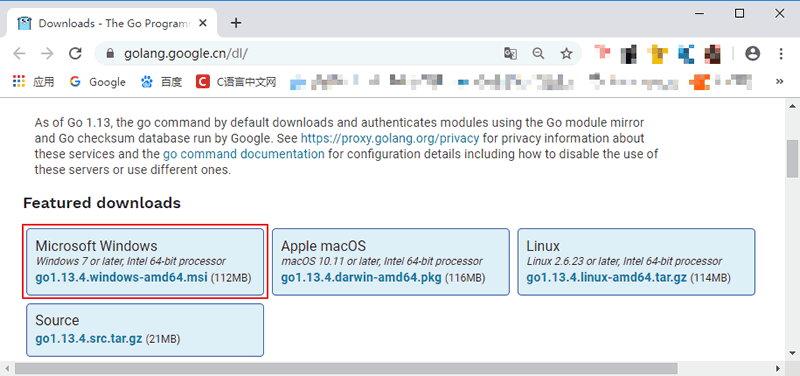
这里我们下载的是 64 位的开发包，如果读者的电脑是 32 位系统的话，则需要下载 32 位的开发包，在上图所示页面中向下滚动即可找到 32 位开发包的下载地址，如下图所示。
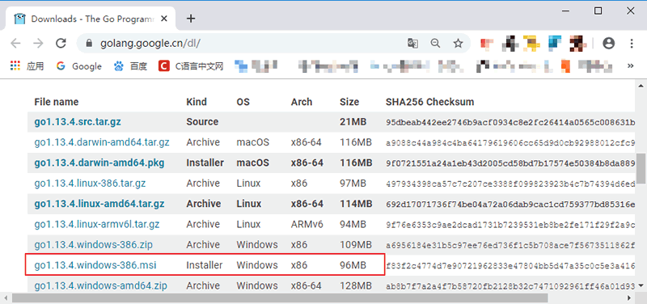
>注意：下载 Windows 版本的Go语言开发包时尽量选择 MSI 格式，因为它可以直接安装到系统，不需要额外的操作。

安装Go语言开发包
双击我们下载好的Go语言开发包即可启动安装程序，如下图所示，这是Go语言的用户许可协议，无需管它，直接勾选“I accept ...”然后点击“Next”即可。
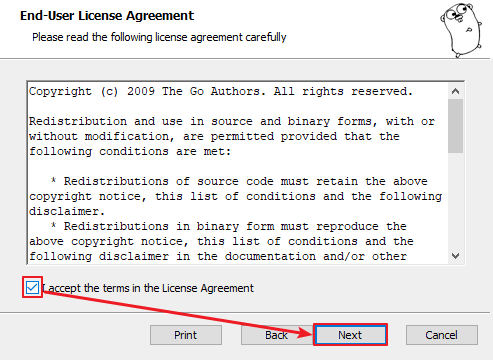
在 Windows 系统下Go语言开发包会默认安装到 C 盘的 Go 目录下，推荐在这个目录下安装，使用起来较为方便。当然，你也可以选择其他的安装目录，确认无误后点击“Next”，如下图所示：
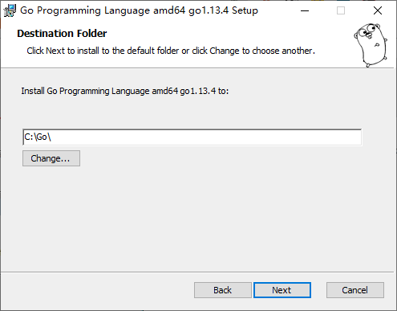
Go语言开发包的安装没有其他需要设置的选项，点击“Install”即可开始安装，如下图所示：

等待程序完成安装，然后点击“Finish”退出安装程序。

安装完成后，在我们所设置的安装目录下将生成一些目录和文件，如下图所示：
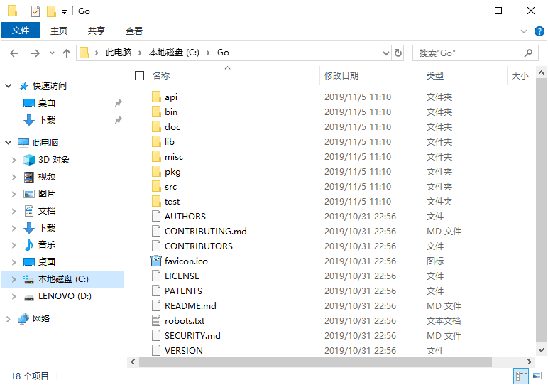
这个目录的结构遵守 GOPATH 规则，后面的章节会提到这个概念。目录中各个文件夹的含义如下表所示。
<table>
<caption>
Go 开发包的安装目录的功能及说明</caption>
<tbody>
<tr>
<th>
目录名</th>
<th>
说明</th>
</tr>
<tr>
<td>
api</td>
<td>
每个版本的 api 变更差异</td>
</tr>
<tr>
<td>
bin</td>
<td>
go 源码包编译出的编译器（go）、文档工具（godoc）、格式化工具（gofmt）</td>
</tr>
<tr>
<td>
doc</td>
<td>
英文版的 Go 文档</td>
</tr>
<tr>
<td>
lib</td>
<td>
引用的一些库文件</td>
</tr>
<tr>
<td>
misc</td>
<td>
杂项用途的文件，例如 <a href="/android/" target="_blank">Android</a> 平台的编译、git 的提交钩子等</td>
</tr>
<tr>
<td>
pkg</td>
<td>
Windows 平台编译好的中间文件</td>
</tr>
<tr>
<td>
src</td>
<td>
标准库的源码</td>
</tr>
<tr>
<td>
test</td>
<td>
测试用例</td>
</tr>
</tbody>
</table>
开发时，无须关注这些目录。如果读者希望深度了解底层原理，可以通过上面的介绍继续探索。
设置环境变量
开发包安装完成后，我们还需要配置一下GOPATH 环境变量，之后才可以使用Go语言进行开发。GOPATH 是一个路径，用来存放开发中需要用到的代码包。

在桌面或者资源管理器右键“此电脑”（或者“我的电脑”）→“属性”→“高级系统设置”→“环境变量”，如下图所示。
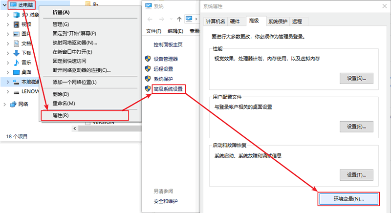
在弹出的菜单里找到 GOPATH 对应的选项点击编辑之后就可以修改了，没有的话可以选择新建，并将变量名填写为 GOPATH，变量值设置为任意目录均可（尽量选择空目录），例如 D:\Go。

>提示：填写完成后，每个打开的窗口都需要点击“确定”来保存设置。

其它的环境变量安装包均会进行自动设置。在默认情况下，Go 将会被安装在目录 c:\go 下，但如果你在安装过程中修改安装目录，则可能需要手动修改所有的环境变量的值。
环境变量设置好后，可以通过go env 命令来进行测试。
```bat
C:\Users\Administrator>go env
set GO111MODULE=
set GOARCH=amd64
set GOBIN=
set GOCACHE=C:\Users\Administrator\AppData\Local\go-build
set GOENV=C:\Users\Administrator\AppData\Roaming\go\env
set GOEXE=.exe
set GOFLAGS=
set GOHOSTARCH=amd64
set GOHOSTOS=windows
set GONOPROXY=
set GONOSUMDB=
set GOOS=windows
set GOPATH=C:\Users\Administrator\go
set GOPRIVATE=
set GOPROXY=https://proxy.golang.org,direct
set GOROOT=c:\go
```
上面只显示了部分结果，如果执行go env 命令后，出现类似上面的结果，说明我们的Go开发包已经安装成功了。

### linux安装

>注意：开发包有 32 位和 64 位两个版本，需要根据读者电脑的情况选择不同的版本。

复制Go语言开发包的下载链接（https://dl.google.com/go/go1.13.4.linux-amd64.tar.gz）。
然后，在终端使用cd 命令进入你用来存放安装包的目录中（这里使用的是 /usr/local/ 目录，读者也可以使用其它目录）。
```shell
cd /usr/local/
wget https://dl.google.com/go/go1.13.4.linux-amd64.tar.gz
tar -C /usr/local -xzf go1.13.4.linux-amd64.tar.gz 
go version
```
#### 配置环境变量
我们需要配置 2 个环境变量分别是 GOROOT 和 PATH。
GOROOT 的值应该为Go语言的当前安装目录：export GOROOT=/usr/local/go
PATH 为了方便使用Go语言命令和 Go 程序的可执行文件，需要追加其值：export PATH=$PATH:$GOROOT/bin:$GOBIN

为了方便以后的使用，需要把这几个环境变量添加 profile 文件中（~/.bash_profile 或 /etc/profile）。如果是单用户使用，可以将环境变量添加在 home 目录下的 bash_profile 文件中，如果是多用户使用，需要添加在 /etc/profile 文件。（推荐大家在 /etc/profile 文件中设置环境变量）

使用vi /etc/profile 命令打开 profile 文件，并将环境变量添加到文件末尾。
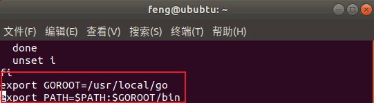
添加完成后使用:wq 命令保存并退出。

然后，使用 source /etc/profile 命令使配置文件生效，现在就可以在任意目录使用Go语言命令了。

#### 验证安装
在任意目录下使用终端执行 go env 命令，输出如下结果说明Go语言开发包已经安装成功。
```shell
go env
GO111MODULE=""
GOARCH="amd64"
GOBIN=""
GOCACHE="/home/feng/.cache/go-build"
GOENV="/home/feng/.config/go/env"
GOEXE=""
GOFLAGS=""
GOHOSTARCH="amd64"
GOHOSTOS="linux"
GONOPROXY=""
GONOSUMDB=""
GOOS="linux"
GOPATH="/home/feng/go"
GOPRIVATE=""
GOPROXY="https://proxy.golang.org,direct"
GOROOT="/usr/local/go"
GOSUMDB="sum.golang.org"
GOTMPDIR=""
. . .
```
### MAC OS安装
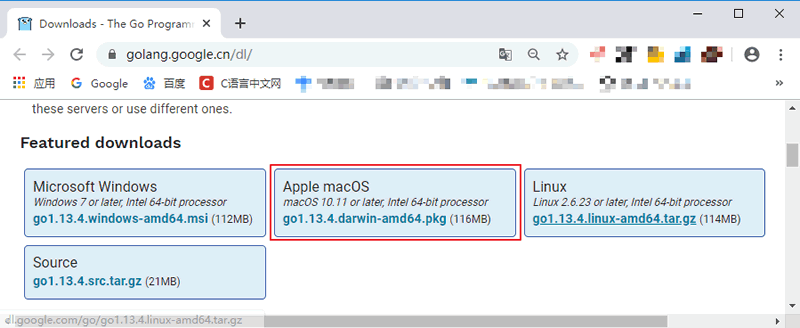
Mac OS 的Go语言开发包是 .pkg 格式的，双击我们下载的安装包即可开始安装。
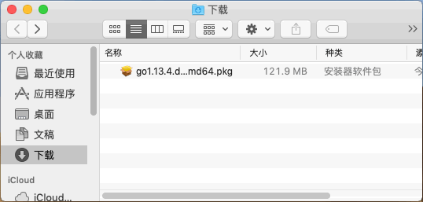
一路点击“继续”即可.

安装包会默认安装在 /usr/local 目录下，如下所示。
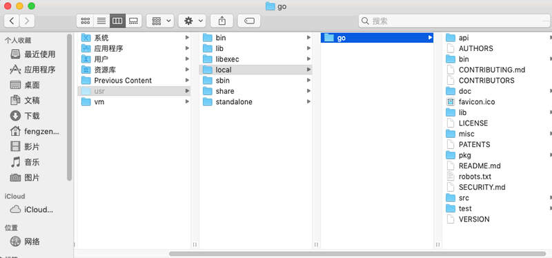
安装完成之后，在终端运行 go version，如果显示类似下面的信息，表明安装成功。
go version go1.13.4 darwin/amd64

#### 设置 GOPATH 环境变量
开始写 go 项目代码之前，需要我们先配置好环境变量。编辑 ~/.bash_profile（在终端中运行 vi ~/.bash_profile 即可）来添加下面这行代码（如果你找不到 .bash_profile，那自己创建一个就可以了）
```shell
export GOPATH=$HOME/go
```
保存然后退出你的编辑器。然后在终端中运行下面命令
```shell
source ~/.bash_profile
```
提示：$HOME 是每个电脑下的用户主目录，每个电脑可能不同，可以在终端运行 echo $HOME 获取

GOROOT 也就是 Go 开发包的安装目录默认是在 /usr/local/go，如果没有，可以在 bash_profile 文件中设置。
```shell
export GOROOT=/usr/local/go
```
然后保存并退出编辑器，运行 source ~/.bash_profile 命令即可。
## 十、Go语言集成开发环境（IDE）大汇总
介绍几款强大的Go语言集成开发环境（Integrated Development Environment，IDE）和编辑器。

如何挑选合适的编辑器或集成开发环境呢？下面列举了一些Go语言集成开发环境或编辑器应该具备的特性：
- 语法高亮是必不可少的功能，这也是为什么每个开发工具都提供配置文件来实现自定义配置的原因。
- 拥有较好的项目文件纵览和导航能力，可以同时编辑多个源文件并设置书签，能够匹配括号，能够跳转到某个函数或类型的定义部分。
- 完美的查找和替换功能，替换之前最好还能预览结果。
- 当有编译错误时，双击错误提示可以跳转到发生错误的位置。
- 跨平台，能够在 Linux、Mac OS X 和 Windows 下工作，这样就可以专注于一个开发环境。
- 能够通过插件架构来轻易扩展和替换某个功能。
- 拥有断点、检查变量值、单步执行、逐过程执行标识库中代码的能力。
- 能够方便的存取最近使用过的文件或项目。
- 拥有对包、类型、变量、函数和方法的智能代码补全的功能。
- 能够方便地在不同的 Go 环境之间切换。
- 针对一些特定的项目有项目模板，如：Web 应用，App Engine 项目，从而能够更快地开始开发工作。

### 1) Goland
Goland 是由 JetBrains 公司开发的一个新的商业 IDE，旨在为 Go 开发者提供的一个符合人体工程学的新的商业 IDE。Goland 整合了 IntelliJ 平台（一个用于 java 语言开发的集成环境，也可用于其他开发语言），提供了针对Go语言的编码辅助和工具集成。
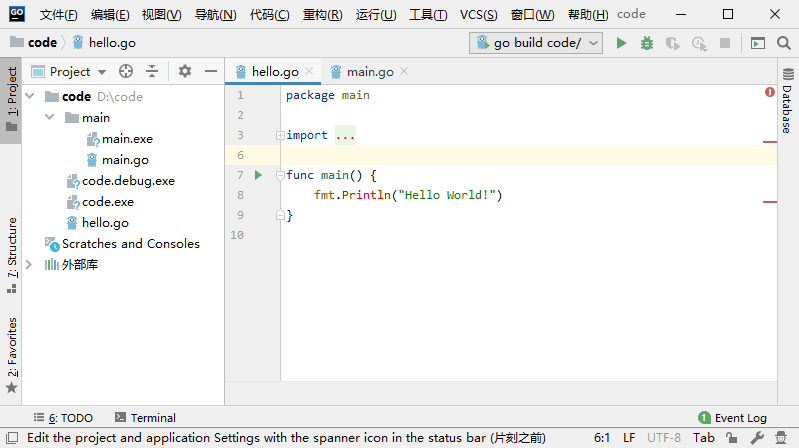
### 2) LiteIDE
LiteIDE是一款专门针对 Go 开发的集成开发环境，在编辑、编译和运行 Go 程序和项目方面都有非常好的支持。同时还包括了对源代码的抽象语法树视图和一些内置工具（此开发环境由国人 vfc 大叔开发）。
LiteIDE 是一款非常好用的轻量级 Go 集成开发环境（基于 QT、Kate 和 SciTE），包含了跨平台开发及其它必要的特性，对代码编写、自动补全和运行调试都有极佳的支持。它采用了 Go 项目的概念来对项目文件进行浏览和管理，它还支持在各个 Go 开发环境之间随意切换以及交叉编译的功能。
同时，它具备了抽象语法树视图的功能，可以清楚地纵览项目中的常量、变量、函数、不同类型以及他们的属性和方法。

### 3) Sublime Text
一个革命性的跨平台（Linux、Mac OS X、Windows）文本编辑器，它支持编写非常多的编程语言代码。对于 Go 而言，它有一个插件叫做 GoSublime 来支持代码补全和代码模版。
### 4) GoClipse
是一款 Eclipse IDE 的插件，拥有非常多的特性以及通过 GoCode 来实现代码补全功能。其依附于著名的 Eclipse 这个大型开发环境，虽然需要安装 JVM 运行环境，但却可以很容易地享有 Eclipse 本身所具有的诸多功能。这是一个非常好的编辑器，完善的代码补全、抽象语法树视图、项目管理和程序调试功能。
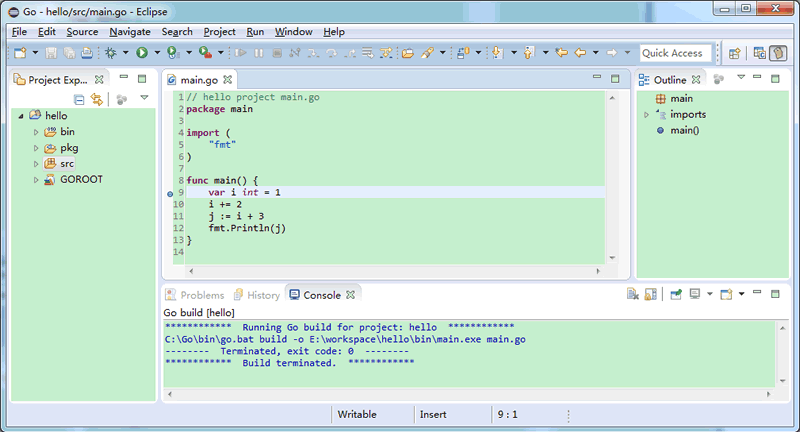
如果你对集成开发环境都不是很熟悉，那就使用 LiteIDE 吧，另外使用 GoClipse 或者 IntelliJ Idea Plugin 也是不错的选择。
代码补全一般都是通过内置 GoCode 实现的（如：LiteIDE、GoClipse），如果需要手动安装 GoCode，在命令行输入指令 go get -u github.com/nsf/gocode 即可（务必事先配置好 Go 环境变量） 。
### 5) Visual Studio Code（简称VS Code）
是一款由微软公司开发的，能运行在 Mac OS X、Windows 和 Linux 上的跨平台开源代码编辑器。
VS Code 使用 JSON 格式的配置文件进行所有功能和特性的配置，同时它还可以通过扩展程序为编辑器实现编程语言高亮、参数提示、编译、调试、文档生成等各种功能。
## 十一、Go语言工程结构详述
一般的编程语言往往对工程（项目）的目录结构是没有什么规定的，但是Go语言却在这方面做了相关规定，本节我们就来聊聊Go语言在工程结构方面的有关知识。
我们前面讲搭建Go语言开发环境时提到的环境变量 GOPATH，项目的构建主要是靠它来实现的。这么说吧，如果想要构建一个项目，就需要将这个项目的目录添加到 GOPATH 中，多个项目之间可以使用;分隔。
如果不配置 GOPATH，即使处于同一目录，代码之间也无法通过绝对路径相互调用。
目录结构
一个Go语言项目的目录一般包含以下三个子目录：
- src 目录：放置项目和库的源文件；
- pkg 目录：放置编译后生成的包/库的归档文件；
- bin 目录：放置编译后生成的可执行文件。

三个目录中我们需要重点关注的是 src 目录，其他两个目录了解即可，下面来分别介绍一下这三个目录。
### src 目录
用于以包（package）的形式组织并存放 Go 源文件，这里的包与 src 下的每个子目录是一一对应。例如，若一个源文件被声明属于 log 包，那么它就应当保存在 src/log 目录中。

并不是说 src 目录下不能存放 Go 源文件，一般在测试或演示的时候也可以把 Go 源文件直接放在 src 目录下，但是这么做的话就只能声明该源文件属于 main 包了。正常开发中还是建议大家把 Go 源文件放入特定的目录中。

包是Go语言管理代码的重要机制，其作用类似于Java中的 package 和 C/C++ 的头文件。Go 源文件中第一段有效代码必须是package <包名> 的形式，如 package hello。

另外需要注意的是，Go语言会把通过go get 命令获取到的库源文件下载到 src 目录下对应的文件夹当中。
### pkg 目录
用于存放通过go install 命令安装某个包后的归档文件。归档文件是指那些名称以“.a”结尾的文件。

该目录与 GOROOT 目录（也就是Go语言的安装目录）下的 pkg 目录功能类似，区别在于这里的 pkg 目录专门用来存放项目代码的归档文件。

编译和安装项目代码的过程一般会以代码包为单位进行，比如 log 包被编译安装后，将生成一个名为 log.a 的归档文件，并存放在当前项目的 pkg 目录下。
### bin 目录
与 pkg 目录类似，在通过go install 命令完成安装后，保存由 Go 命令源文件生成的可执行文件。在类 Unix 操作系统下，这个可执行文件的名称与命令源文件的文件名相同。而在 Windows 操作系统下，这个可执行文件的名称则是命令源文件的文件名加 .exe 后缀。
### 源文件
上面我们提到了命令源文件和库源文件，它们到底是什么呢？
- 命令源文件：如果一个 Go 源文件被声明属于 main 包，并且该文件中包含 main 函数，则它就是命令源码文件。命令源文件属于程序的入口，可以通过Go语言的go run 命令运行或者通过go build 命令生成可执行文件。
- 库源文件：库源文件则是指存在于某个包中的普通源文件，并且库源文件中不包含 main 函数。

不管是命令源文件还是库源文件，在同一个目录下的所有源文件，其所属包的名称必须一致的。

## 十二、第一个Go语言程序
在控制台输出“Hello World!”非常简单，仅需要几行代码就可以搞定，如下所示：
```go
package main    // 声明 main 包

import (
    "fmt"       // 导入 fmt 包，打印字符串是需要用到
)

func main() {   // 声明 main 主函数
    fmt.Println("Hello World!") // 打印 Hello World!
}
```
### package（创建包）
Go语言以“包”作为管理单位，每个 Go 源文件必须先声明它所属的包，所以我们会看到每个 Go 源文件的开头都是一个 package 声明，格式如下：
```go
package name
```
其中 package 是声明包名的关键字，name 为包的名字。

Go语言的包与文件夹是一一对应的，它具有以下几点特性：
- 一个目录下的同级文件属于同一个包。
- 包名可以与其目录名不同。
- main 包是Go语言程序的入口包，一个Go语言程序必须有且仅有一个 main 包。如果一个程序没有 main 包，那么编译时将会出错，无法生成可执行文件。

### import（导入包）
在包声明之后，是 import 语句，用于导入程序中所依赖的包，导入的包名使用双引号""包围，格式如下：
```go
import "name"
```
其中 import 是导入包的关键字，name 为所导入包的名字。

代码第 4 行导入了 fmt 包，这行代码会告诉 Go 编译器，我们需要用到 fmt 包中的函数或者变量等，fmt 包是Go语言标准库为我们提供的，用于格式化输入输出的内容（类似于C语言中的 stdio.h 头文件），类似的还有 os 包、io 包等，后面我们会详细介绍。

另外有一点需要注意，导入的包中不能含有代码中没有使用到的包，否则Go编译器会报编译错误，例如 imported and not used: "xxx"，"xxx" 表示包名。

也可以使用一个 import 关键字导入多个包，此时需要用括号( )将包的名字包围起来，并且每个包名占用一行，也就是写成下面的样子：
```go
import(
    "name1"
    "name2"
)
```
main 函数
代码的第 7 行创建了一个 main 函数，它是Go语言程序的入口函数，也即程序启动后运行的第一个函数。main 函数只能声明在 main 包中，不能声明在其他包中，并且，一个 main 包中也必须有且仅有一个 main 函数。
>C/C++ 程序的入口函数也是 main()，一个 C/C++ 程序有且只能有一个 main() 函数。

main 函数是自定义函数的一种，在Go语言中，所有函数都以关键字 func 开头的，定义格式如下所示：
```go
func 函数名 (参数列表) (返回值列表){
    函数体
}
```
格式说明如下：
- 函数名：由字母、数字、下画线_组成，其中，函数名的第一个字母不能为数字，并且，在同一个包内，函数名称不能重名。
- 参数列表：一个参数由参数变量和参数类型组成，例如func foo( a int, b string )。
- 返回值列表：可以是返回值类型列表，也可以是参数列表那样变量名与类型的组合，函数有返回值时，必须在函数体中使用 return 语句返回。
- 函数体：能够被重复调用的代码片段。

注意：Go语言函数的左大括号{必须和函数名称在同一行，否则会报错。
### 打印 Hello World
代码的第 8 行fmt.Println("Hello World!")中，Println 是 fmt 包中的一个函数，它用来格式化输出数据，比如字符串、整数、小数等，类似于C语言中的 printf 函数。这里我们使用 Println 函数来打印字符串，也就是( )里面使用""包裹的部分。
>注意，Println 函数打印完成后会自动换行，ln是 line 的缩写。

点号.是Go语言运算符的一种，这里表示调用 fmt 包中的 Println 函数。

另外，代码fmt.Println("Hello World!")的结尾，不需要使用;来作为结束符，Go 编译器会自动帮我们添加，当然，在这里加上;也是可以的。
## 十三、Go语言程序的编译和运行
Go语言是编译型的静态语言（和C语言一样），所以在运行Go语言程序之前，先要将其编译成二进制的可执行文件。

可以通过Go语言提供的go build或者go run命令对Go语言程序进行编译：
- go build命令可以将Go语言程序代码编译成二进制的可执行文件，但是需要我们手动运行该二进制文件；
- go run命令则更加方便，它会在编译后直接运行Go语言程序，编译过程中会产生一个临时文件，但不会生成可执行文件，这个特点很适合用来调试程序。

下面就来演示一下，如何运行我们上一节中编写的Go语言程序。

因为之前我们已经配置好了环境变量，所以可以直接使用 Windows 自带的命令行工具（也叫 CMD 窗口或者命令提示符）来编译Go语言程序。微软后来对命令行工具进行了一次升级，并更名为 Powershell，power 是更加强大的意思。

打开命令行工具的方式多种多样，下面列出了比较常用的两种：
- 可以在开始菜单中打开命令行工具，然后 cd 到 Go 源文件所在的目录。
- 也可以在 Go 源文件所在目录的空白处按住 Shift 键并单击鼠标右键，然后在弹出菜单中选择“在此处打开命令行窗口”或者“在此处打开 Powershell 窗口”，这样会自动 cd 到 Go 源文件所在的目录，如下图所示。这种方式更加方便，推荐大家使用。

>提示：cd 是命令行工具的一个命令，用来改变当前所在的目录，是 change directory 的缩写。

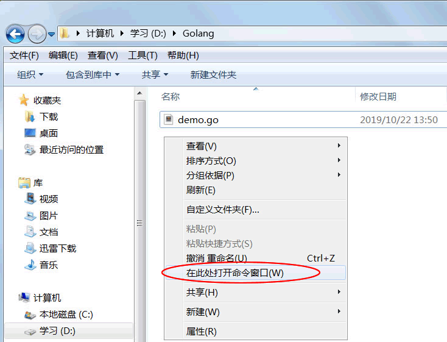
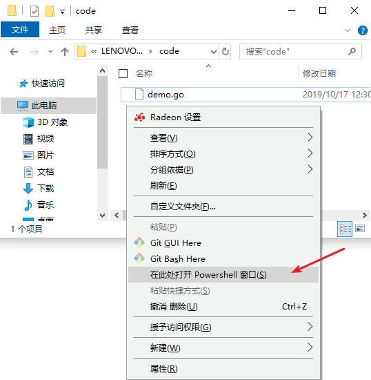
### go build 命令
go build命令用来启动编译，它可以将Go语言程序与相关依赖编译成一个可执行文件，其语法格式如下。
```shell
go build fileName
```
其中 fileName 为所需要的参数，可以是一个或者多个 Go 源文件名（当有多个参数时需要使用空格将两个相邻的参数隔开），也可以省略不写。

使用 go build 命令进行编译时，不同参数的执行结果也是不同的。
#### 1) 当参数不为空时
如果 fileName 为同一 main 包下的所有源文件名（可能有一个或者多个），编译器将生成一个与第一个 fileName 同名的可执行文件（如执行go build abc.go def.go ...会生成一个 abc.exe 文件）；如果 fileName 为非 main 包下的源文件名，编译器将只对该包进行语法检查，不生成可执行文件。
#### 2) 当参数为空时
如果当前目录下存在 main 包，则会生成一个与当前目录名同名的“目录名.exe”可执行文件（如在 hello 目录中执行go build命令时，会生成 hello.exe 文件）；如果不存在 main 包，则只对当前目录下的程序源码进行语法检查，不会生成可执行文件。

使用go build命令对我们上一节编写的程序进行编译，运行结果如下所示：
```shell
D:\code> go build .\demo.go
D:\code> .\demo.exe
Hello World!
```
其中D:\code>对应的是当前目录，也就是 D 盘下的 code 文件夹，它是命令行工具自动添加的，不属于编译命令的一部分。

第 1 行go build命令后面的参数中，.\表示当前目录。在Windows 系统中，当前目录使用.\表示；在类 Unix 系统（例如 Linux、MacOS 等）中，当前目录使用./表示。
>注意，这里的go build命令中.\可以省略不写，不会影响编译。

另外，go build命令只有在执行出错的情况下才会有返回信息，执行成功的话是没有返回信息的，但是会在当前目录生成一个与 main 包文件同名的 .exe 可执行文件，如下图所示。
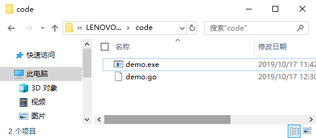
第 2 行中的.\demo.exe表示执行当前目录下的 demo.exe 程序。

第 3 行则是 demo.exe 程序的运行结果。
### go run 命令
除了使用go build命令外，Go语言还为我们提供了go run命令，go run命令将编译和执行指令合二为一，会在编译之后立即执行Go语言程序，但是不会生成可执行文件。

go run命令的语法格式如下：
```shell
go run fileName
```
其中 fileName 为所需要的参数，参数必须是同一 main 包下的所有源文件名，并且不能为空。

使用go run命令对我们上一节编写的程序进行编译，运行结果如下所示：
```shell
D:\code> go run demo.go
Hello World!
```
可以看到第 1 行的go run命令执行后，直接在第 2 行输出了程序的运行结果。