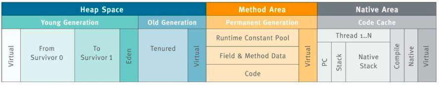
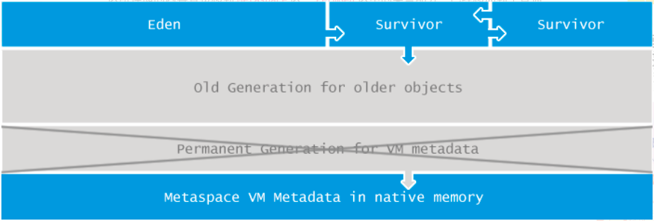
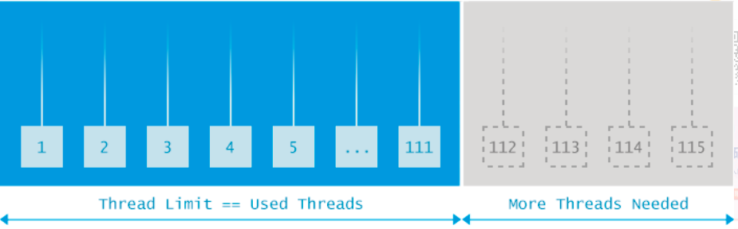
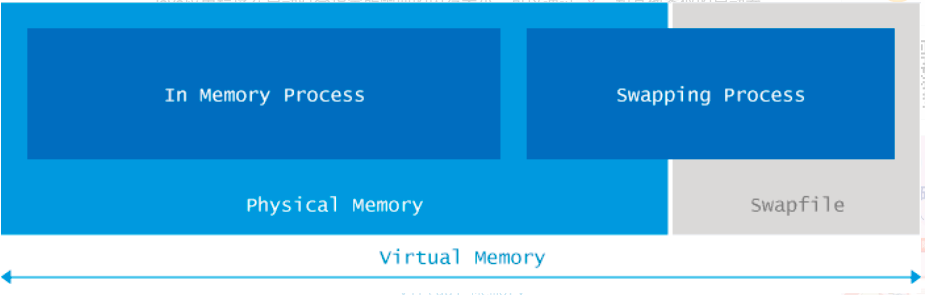
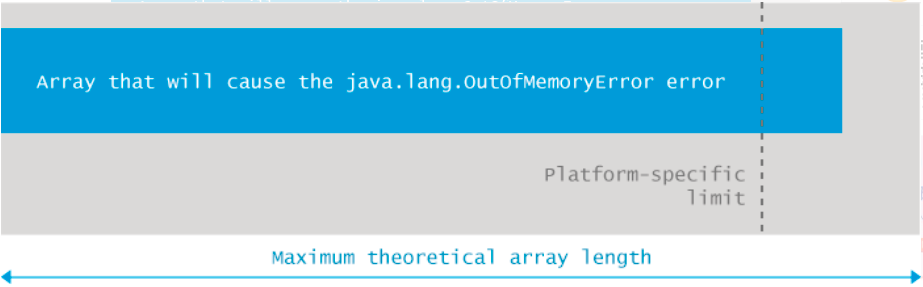

# Java内存溢出OOM异常完全指南

## 1、java.lang.OutOfMemoryError:Java heap space

Java应用程序在启动时会指定所需要的内存大小，它被分割成两个不同的区域：Heap space（堆空间）和Permgen（永久代）：

这两个区域的大小可以在JVM（Java虚拟机）启动时通过参数-Xmx和-XX:MaxPermSize设置，如果你没有显式设置，则将使用特定平台的默认值。

当应用程序试图向堆空间添加更多的数据，但堆却没有足够的空间来容纳这些数据时，将会触发java.lang.OutOfMemoryError: Java heap space异常。需要注意的是：即使有足够的物理内存可用，只要达到堆空间设置的大小限制，此异常仍然会被触发。

### 原因分析

触发java.lang.OutOfMemoryError: Java heap space最常见的原因就是应用程序需要的堆空间是XXL号的，但是JVM提供的却是S号。解决方法也很简单，提供更大的堆空间即可。除了前面的因素还有更复杂的成因：

- 流量/数据量峰值：应用程序在设计之初均有用户量和数据量的限制，某一时刻，当用户数量或数据量突然达到一个峰值，并且这个峰值已经超过了设计之初预期的阈值，那么以前正常的功能将会停止，并触发java.lang.OutOfMemoryError: Java heap space异常。
- 内存泄漏：特定的编程错误会导致你的应用程序不停的消耗更多的内存，每次使用有内存泄漏风险的功能就会留下一些不能被回收的对象到堆空间中，随着时间的推移，泄漏的对象会消耗所有的堆空间，最终触发java.lang.OutOfMemoryError: Java heap space错误。

### 示例

#### ①、简单示例

首先看一个非常简单的示例，下面的代码试图创建2 x 1024 x 1024个元素的整型数组，当你尝试编译并指定12M堆空间运行时（java -Xmx12m OOM）将会失败并抛出java.lang.OutOfMemoryError: Java heap space错误，而当你指定13M堆空间时，将正常的运行。
```
class OOM {
    static final int SIZE=2*1024*1024;
    public static void main(String[] a) {
        int[] i = new int[SIZE];
    }
}
```

运行如下：
```
D:\>javac OOM.java
D:\>java -Xmx12m OOM
Exception in thread "main" java.lang.OutOfMemoryError: Java heap space
        at OOM.main(OOM.java:4)
D:\>java -Xmx13m OOM
```
#### ②、内存泄漏示例

在Java中，当开发者创建一个新对象（比如：new Integer(5)）时，不需要自己开辟内存空间，而是把它交给JVM。在应用程序整个生命周期类，JVM负责检查哪些对象可用，哪些对象未被使用。未使用对象将被丢弃，其占用的内存也将被回收，这一过程被称为垃圾回收。JVM负责垃圾回收的模块集合被称为垃圾回收器（GC）。

Java的内存自动管理机制依赖于GC定期查找未使用对象并删除它们。Java中的内存泄漏是由于GC无法识别一些已经不再使用的对象，而这些未使用的对象一直留在堆空间中，这种堆积最终会导致java.lang.OutOfMemoryError: Java heap space错误。

我们可以非常容易的写出导致内存泄漏的Java代码：
```
public class KeylessEntry {
    
    static class Key {
        Integer id;
        
        Key(Integer id) {
            this.id = id;
        }
        
        @Override
        public int hashCode() {
            return id.hashCode();
        }
    }
public static void main(String[] args) {
        Map<Key,String> m = new HashMap<Key,String>();
        while(true) {
            for(int i=0;i<10000;i++) {
                if(!m.containsKey(new Key(i))) {
                    m.put(new Key(i), "Number:" + i);
                }
            }
        }
    }
}
```

代码中HashMap为本地缓存，第一次while循环，会将10000个元素添加到缓存中。后面的while循环中，由于key已经存在于缓存中，缓存的大小将一直会维持在10000。但事实真的如此吗？由于Key实体没有实现equals()方法，导致for循环中每次执行m.containsKey(new Key(i))结果均为false，其结果就是HashMap中的元素将一直增加。

随着时间的推移，越来越多的Key对象进入堆空间且不能被垃圾收集器回收（m为局部变量，GC会认为这些对象一直可用，所以不会回收），直到所有的堆空间被占用，最后抛出java.lang.OutOfMemoryError:Java heap space。

上面的代码直接运行可能很久也不会抛出异常，可以在启动时使用-Xmx参数，设置堆内存大小，或者在for循环后打印HashMap的大小，执行后会发现HashMap的size一直再增长。

解决方法也非常简单，只要Key实现自己的equals方法即可：
```
Override
public boolean equals(Object o) {
    boolean response = false;
    if (o instanceof Key) {
        response = (((Key)o).id).equals(this.id);
    }
    return response;
}
```
### 解决方案

第一个解决方案是显而易见的，你应该确保有足够的堆空间来正常运行你的应用程序，在JVM的启动配置中增加如下配置：
```
-Xmx1024m
```
上面的配置分配1024M堆空间给你的应用程序，当然你也可以使用其他单位，比如用G表示GB，K表示KB。下面的示例都表示最大堆空间为1GB：
```
java -Xmx1073741824 com.mycompany.MyClass
java -Xmx1048576k com.mycompany.MyClass
java -Xmx1024m com.mycompany.MyClass
java -Xmx1g com.mycompany.MyClass
```
然后，更多的时候，单纯地增加堆空间不能解决所有的问题。如果你的程序存在内存泄漏，一味的增加堆空间也只是推迟java.lang.OutOfMemoryError: Java heap space错误出现的时间而已，并未解决这个隐患。除此之外，垃圾收集器在GC时，应用程序会停止运行直到GC完成，而增加堆空间也会导致GC时间延长，进而影响程序的吞吐量。

如果你想完全解决这个问题，那就好好提升自己的编程技能吧，当然运用好Debuggers, profilers, heap dump analyzers等工具，可以让你的程序最大程度的避免内存泄漏问题。

## 2、java.lang.OutOfMemoryError:GC overhead limit exceeded

Java运行时环境（JRE）包含一个内置的垃圾回收进程，而在许多其他的编程语言中，开发者需要手动分配和释放内存。

Java应用程序只需要开发者分配内存，每当在内存中特定的空间不再使用时，一个单独的垃圾收集进程会清空这些内存空间。垃圾收集器怎样检测内存中的某些空间不再使用已经超出本文的范围，但你只需要相信GC可以做好这些工作即可。

默认情况下，当应用程序花费超过98%的时间用来做GC并且回收了不到2%的堆内存时，会抛出java.lang.OutOfMemoryError:GC overhead limit exceeded错误。具体的表现就是你的应用几乎耗尽所有可用内存，并且GC多次均未能清理干净。
### 原因分析

java.lang.OutOfMemoryError:GC overhead limit exceeded错误是一个信号，示意你的应用程序在垃圾收集上花费了太多时间但却没有什么卵用。默认超过98%的时间用来做GC却回收了不到2%的内存时将会抛出此错误。那如果没有此限制会发生什么呢？GC进程将被重启，100%的CPU将用于GC，而没有CPU资源用于其他正常的工作。如果一个工作本来只需要几毫秒即可完成，现在却需要几分钟才能完成，我想这种结果谁都没有办法接受。

所以java.lang.OutOfMemoryError:GC overhead limit exceeded也可以看做是一个fail-fast（快速失败）实战的实例。

### 示例

下面的代码初始化一个map并在无限循环中不停的添加键值对，运行后将会抛出GC overhead limit exceeded错误：
```
public class Wrapper {
    public static void main(String args[]) throws Exception {
        Map map = System.getProperties();
        Random r = new Random();
        while (true) {
            map.put(r.nextInt(), "value");
        }
    }
}
```

正如你所预料的那样，程序不能正常的结束，事实上，当我们使用如下参数启动程序时：
```
java -Xmx100m -XX:+UseParallelGC Wrapper
```
我们很快就可以看到程序抛出java.lang.OutOfMemoryError: GC overhead limit exceeded错误。但如果在启动时设置不同的堆空间大小或者使用不同的GC算法，比如这样：
```
java -Xmx10m -XX:+UseParallelGC Wrapper
```
我们将看到如下错误：
```
Exception in thread "main" java.lang.OutOfMemoryError: Java heap space
    at java.util.Hashtable.rehash(Unknown Source)
    at java.util.Hashtable.addEntry(Unknown Source)
    at java.util.Hashtable.put(Unknown Source)
    at cn.moondev.Wrapper.main(Wrapper.java:12)
```
使用以下GC算法：-XX:+UseConcMarkSweepGC或者-XX:+UseG1GC，启动命令如下：
```
java -Xmx100m -XX:+UseConcMarkSweepGC Wrapper
java -Xmx100m -XX:+UseG1GC Wrapper
```
得到的结果是这样的：
```
Exception: java.lang.OutOfMemoryError thrown from 
the UncaughtExceptionHandler in thread "main"
```
错误已经被默认的异常处理程序捕获，并且没有任何错误的堆栈信息输出。

以上这些变化可以说明，在资源有限的情况下，你根本无法无法预测你的应用是怎样挂掉的，什么时候会挂掉，所以在开发时，你不能仅仅保证自己的应用程序在特定的环境下正常运行。

### 解决方案

首先是一个毫无诚意的解决方案，如果你仅仅是不想看到java.lang.OutOfMemoryError:GC overhead limit exceeded的错误信息，可以在应用程序启动时添加如下JVM参数：
```
-XX:-UseGCOverheadLimit
```
但是强烈建议不要使用这个选项，因为这样并没有解决任何问题，只是推迟了错误出现的时间，错误信息也变成了我们更熟悉的java.lang.OutOfMemoryError: Java heap space而已。

另一个解决方案，如果你的应用程序确实内存不足，增加堆内存会解决GC overhead limit问题，就如下面这样，给你的应用程序1G的堆内存：
```
java -Xmx1024m com.yourcompany.YourClass
```
但如果你想确保你已经解决了潜在的问题，而不是掩盖java.lang.OutOfMemoryError: GC overhead limit exceeded错误，那么你不应该仅止步于此。你要记得还有profilers和memory dump analyzers这些工具，你需要花费更多的时间和精力来查找问题。还有一点需要注意，这些工具在Java运行时有显著的开销，因此不建议在生产环境中使用。

## 3、java.lang.OutOfMemoryError:Permgen space

Java中堆空间是JVM管理的最大一块内存空间，可以在JVM启动时指定堆空间的大小，其中堆被划分成两个不同的区域：新生代（Young）和老年代（Tenured），新生代又被划分为3个区域：Eden、From Survivor、To Survivor，如下图所示。

java.lang.OutOfMemoryError: PermGen space错误就表明持久代所在区域的内存已被耗尽。

### 原因分析

要理解java.lang.OutOfMemoryError: PermGen space出现的原因，首先需要理解Permanent Generation Space的用处是什么。持久代主要存储的是每个类的信息，比如：类加载器引用、运行时常量池（所有常量、字段引用、方法引用、属性）、字段(Field)数据、方法(Method)数据、方法代码、方法字节码等等。我们可以推断出，PermGen的大小取决于被加载类的数量以及类的大小。

因此，我们可以得出出现java.lang.OutOfMemoryError: PermGen space错误的原因是：太多的类或者太大的类被加载到permanent generation（持久代）。

### 示例
#### ①、最简单的示例
正如前面所描述的，PermGen的使用与加载到JVM类的数量有密切关系，下面是一个最简单的示例：
```
import javassist.ClassPool;
public class MicroGenerator {
    public static void main(String[] args) throws Exception {
        for (int i = 0; i < 100_000_000; i++) {
            generate("cn.moondev.User" + i);
        }
    }
public static Class generate(String name) throws Exception {
        ClassPool pool = ClassPool.getDefault();
        return pool.makeClass(name).toClass();
    }
}
```
运行时请设置JVM参数：-XX:MaxPermSize=5m，值越小越好。需要注意的是JDK8已经完全移除持久代空间，取而代之的是元空间（Metaspace），所以示例最好的JDK1.7或者1.6下运行。

代码在运行时不停的生成类并加载到持久代中，直到撑满持久代内存空间，最后抛出java.lang.OutOfMemoryError:Permgen space。代码中类的生成使用了javassist库。

#### ②、Redeploy-time

更复杂和实际的一个例子就是Redeploy（重新部署，你可以想象一下你开发时，点击eclipse的reploy按钮或者使用idea时按ctrl + F5时的过程）。在从服务器卸载应用程序时，当前的classloader以及加载的class在没有实例引用的情况下，持久代的内存空间会被GC清理并回收。如果应用中有类的实例对当前的classloader的引用，那么Permgen区的class将无法被卸载，导致Permgen区的内存一直增加直到出现Permgen space错误。

不幸的是，许多第三方库以及糟糕的资源处理方式（比如：线程、JDBC驱动程序、文件系统句柄）使得卸载以前使用的类加载器变成了一件不可能的事。反过来就意味着在每次重新部署过程中，应用程序所有的类的先前版本将仍然驻留在Permgen区中，你的每次部署都将生成几十甚至几百M的垃圾。

就以线程和JDBC驱动来说说。很多人都会使用线程来处理一下周期性或者耗时较长的任务，这个时候一定要注意线程的生命周期问题，你需要确保线程不能比你的应用程序活得还长。否则，如果应用程序已经被卸载，线程还在继续运行，这个线程通常会维持对应用程序的classloader的引用，造成的结果就不再多说。多说一句，开发者有责任处理好这个问题，特别是如果你是第三方库的提供者的话，一定要提供线程关闭接口来处理清理工作。

让我们想象一个使用JDBC驱动程序连接到关系数据库的示例应用程序。当应用程序部署到服务器上的时：服务器创建一个classloader实例来加载应用所有的类（包含相应的JDBC驱动）。根据JDBC规范，JDBC驱动程序（比如：com.mysql.jdbc.Driver）会在初始化时将自己注册到java.sql.DriverManager中。该注册过程中会将驱动程序的一个实例存储在DriverManager的静态字段内，代码可以参考：
```
// com.mysql.jdbc.Driver源码
package com.mysql.jdbc;
public class Driver extends NonRegisteringDriver implements java.sql.Driver {
    public Driver() throws SQLException {
    }
    static {
        try {
            DriverManager.registerDriver(new Driver());
        } catch (SQLException var1) {
            throw new RuntimeException("Can\'t register driver!");
        }
    }
}
// // // // // // // // // //
// 再看下DriverManager对应代码
private final static CopyOnWriteArrayList<DriverInfo> registeredDrivers = new CopyOnWriteArrayList<>();
public static synchronized void registerDriver(java.sql.Driver driver,DriverAction da) throws SQLException {
    if(driver != null) {
        registeredDrivers.addIfAbsent(new DriverInfo(driver, da));
    } else {
        throw new NullPointerException();
    }
}
```
现在，当从服务器上卸载应用程序的时候，java.sql.DriverManager仍将持有那个驱动程序的引用，进而持有用于加载应用程序的classloader的一个实例的引用。这个classloader现在仍然引用着应用程序的所有类。如果此程序启动时需要加载2000个类，占用约10MB永久代（PermGen）内存，那么只需要5~10次重新部署，就会将默认大小的永久代（PermGen）塞满，然后就会触发java.lang.OutOfMemoryError: PermGen space错误并崩溃。

### 解决方案
#### ① 解决初始化时的OutOfMemoryError

当在应用程序启动期间触发由于PermGen耗尽引起的OutOfMemoryError时，解决方案很简单。 应用程序需要更多的空间来加载所有的类到PermGen区域，所以我们只需要增加它的大小。 为此，请更改应用程序启动配置，并添加（或增加，如果存在）-XX：MaxPermSize参数，类似于以下示例：
```
java -XX:MaxPermSize=512m com.yourcompany.YourClass
```
#### ② 解决Redeploy时的OutOfMemoryError

分析dump文件：首先，找出引用在哪里被持有；其次，给你的web应用程序添加一个关闭的hook，或者在应用程序卸载后移除引用。你可以使用如下命令导出dump文件：
```
jmap -dump:format=b,file=dump.hprof <process-id>
```
如果是你自己代码的问题请及时修改，如果是第三方库，请试着搜索一下是否存在"关闭"接口，如果没有给开发者提交一个bug或者issue吧。
#### ③ 解决运行时OutOfMemoryError

首先你需要检查是否允许GC从PermGen卸载类，JVM的标准配置相当保守，只要类一创建，即使已经没有实例引用它们，其仍将保留在内存中，特别是当应用程序需要动态创建大量的类但其生命周期并不长时，允许JVM卸载类对应用大有助益，你可以通过在启动脚本中添加以下配置参数来实现：
```
-XX:+CMSClassUnloadingEnabled
```

默认情况下，这个配置是未启用的，如果你启用它，GC将扫描PermGen区并清理已经不再使用的类。但请注意，这个配置只在UseConcMarkSweepGC的情况下生效，如果你使用其他GC算法，比如：ParallelGC或者Serial GC时，这个配置无效。所以使用以上配置时，请配合：
```
-XX:+UseConcMarkSweepGC
```
如果你已经确保JVM可以卸载类，但是仍然出现内存溢出问题，那么你应该继续分析dump文件，使用以下命令生成dump文件：
```
jmap -dump:file=dump.hprof,format=b <process-id>
```
当你拿到生成的堆转储文件，并利用像Eclipse Memory Analyzer Toolkit这样的工具来寻找应该卸载却没被卸载的类加载器，然后对该类加载器加载的类进行排查，找到可疑对象，分析使用或者生成这些类的代码，查找产生问题的根源并解决它。
## 4、java.lang.OutOfMemoryError:Metaspace

前文已经提过，PermGen区域用于存储类的名称和字段，类的方法，方法的字节码，常量池，JIT优化等，但从Java8开始，Java中的内存模型发生了重大变化：引入了称为Metaspace的新内存区域，而删除了PermGen区域。请注意：不是简单的将PermGen区所存储的内容直接移到Metaspace区，PermGen区中的某些部分，已经移动到了普通堆里面。

OOM-example-metaspace

### 原因分析

Java8做出如此改变的原因包括但不限于：
- 应用程序所需要的PermGen区大小很难预测，设置太小会触发PermGen OutOfMemoryError错误，过度设置导致资源浪费。
- 提升GC性能，在HotSpot中的每个垃圾收集器需要专门的代码来处理存储在PermGen中的类的元数据信息。从PermGen分离类的元数据信息到Metaspace，由于Metaspace的分配具有和Java Heap相同的地址空间，因此Metaspace和Java Heap可以无缝的管理，而且简化了FullGC的过程，以至将来可以并行的对元数据信息进行垃圾收集，而没有GC暂停。
- 支持进一步优化，比如：G1并发类的卸载，也算为将来做准备吧

正如你所看到的，元空间大小的要求取决于加载的类的数量以及这种类声明的大小。 所以很容易看到java.lang.OutOfMemoryError: Metaspace主要原因：太多的类或太大的类加载到元空间。

### 示例

正如上文中所解释的，元空间的使用与加载到JVM中的类的数量密切相关。 下面的代码是最简单的例子：
```
public class Metaspace {
    static javassist.ClassPool cp = javassist.ClassPool.getDefault();
public static void main(String[] args) throws Exception{
        for (int i = 0; ; i++) { 
            Class c = cp.makeClass("eu.plumbr.demo.Generated" + i).toClass();
            System.out.println(i);
        }
    }
}
```

程序运行中不停的生成新类，所有的这些类的定义将被加载到Metaspace区，直到空间被完全占用并且抛出java.lang.OutOfMemoryError:Metaspace。当使用-XX：MaxMetaspaceSize = 32m启动时，大约加载30000多个类时就会死机。
```
31023
31024
Exception in thread "main" javassist.CannotCompileException: by java.lang.OutOfMemoryError: Metaspace
    at javassist.ClassPool.toClass(ClassPool.java:1170)
    at javassist.ClassPool.toClass(ClassPool.java:1113)
    at javassist.ClassPool.toClass(ClassPool.java:1071)
    at javassist.CtClass.toClass(CtClass.java:1275)
    at cn.moondev.book.Metaspace.main(Metaspace.java:12)
    .....
```
### 解决方案

第一个解决方案是显而易见的，既然应用程序会耗尽内存中的Metaspace区空间，那么应该增加其大小，更改启动配置增加如下参数：
```
// 告诉JVM：Metaspace允许增长到512，然后才能抛出异常
-XX：MaxMetaspaceSize = 512m
```
另一个方法就是删除此参数来完全解除对Metaspace大小的限制（默认是没有限制的）。默认情况下，对于64位服务器端JVM，MetaspaceSize默认大小是21M（初始限制值），一旦达到这个限制值，FullGC将被触发进行类卸载，并且这个限制值将会被重置，新的限制值依赖于Metaspace的剩余容量。如果没有足够空间被释放，这个限制值将会上升，反之亦然。在技术上Metaspace的尺寸可以增长到交换空间，而这个时候本地内存分配将会失败（更具体的分析，可以参考：Java PermGen 去哪里了?）。

你可以通过修改各种启动参数来“快速修复”这些内存溢出错误，但你需要正确区分你是否只是推迟或者隐藏了java.lang.OutOfMemoryError的症状。如果你的应用程序确实存在内存泄漏或者本来就加载了一些不合理的类，那么所有这些配置都只是推迟问题出现的时间而已，实际也不会改善任何东西。

## 5、java.lang.OutOfMemoryError:Unable to create new native thread
一个思考线程的方法是将线程看着是执行任务的工人，如果你只有一个工人，那么他同时只能执行一项任务，但如果你有十几个工人，就可以同时完成你几个任务。就像这些工人都在物理世界，JVM中的线程完成自己的工作也是需要一些空间的，当有足够多的线程却没有那么多的空间时就会像这样：

出现java.lang.OutOfMemoryError:Unable to create new native thread就意味着Java应用程序已达到其可以启动线程数量的极限了。

### 原因分析

当JVM向OS请求创建一个新线程时，而OS却无法创建新的native线程时就会抛出Unable to create new native thread错误。一台服务器可以创建的线程数依赖于物理配置和平台，建议运行下文中的示例代码来测试找出这些限制。总体上来说，抛出此错误会经过以下几个阶段：
- 运行在JVM内的应用程序请求创建一个新的线程
- JVM向OS请求创建一个新的native线程
- OS尝试创建一个新的native线程，这时需要分配内存给新的线程
- OS拒绝分配内存给线程，因为32位Java进程已经耗尽内存地址空间（2-4GB内存地址已被命中）或者OS的虚拟内存已经完全耗尽
- Unable to create new native thread错误将被抛出
### 示例

下面的示例不能的创建并启动新的线程。当代码运行时，很快达到OS的线程数限制，并抛出Unable to create new native thread错误。
```
while(true){
    new Thread(new Runnable(){
        public void run() {
            try {
                Thread.sleep(10000000);
            } catch(InterruptedException e) { }        
        }    
    }).start();
}
```
### 解决方案

有时，你可以通过在OS级别增加线程数限制来绕过这个错误。如果你限制了JVM可在用户空间创建的线程数，那么你可以检查并增加这个限制：
```
// macOS 10.12上执行
$ ulimit -u
709
```
当你的应用程序产生成千上万的线程，并抛出此异常，表示你的程序已经出现了很严重的编程错误，我不觉得应该通过修改参数来解决这个问题，不管是OS级别的参数还是JVM启动参数。更可取的办法是分析你的应用是否真的需要创建如此多的线程来完成任务？是否可以使用线程池或者说线程池的数量是否合适？是否可以更合理的拆分业务来实现.....

## 6、java.lang.OutOfMemoryError:Out of swap space?
Java应用程序在启动时会指定所需要的内存大小，可以通过-Xmx和其他类似的启动参数来指定。在JVM请求的总内存大于可用物理内存的情况下，操作系统会将内存中的数据交换到磁盘上去。

Out of swap space?表示交换空间也将耗尽，并且由于缺少物理内存和交换空间，再次尝试分配内存也将失败。
### 原因分析

当应用程序向JVM native heap请求分配内存失败并且native heap也即将耗尽时，JVM会抛出Out of swap space错误。该错误消息中包含分配失败的大小（以字节为单位）和请求失败的原因。

Native Heap Memory是JVM内部使用的Memory，这部分的Memory可以通过JDK提供的JNI的方式去访问，这部分Memory效率很高，但是管理需要自己去做，如果没有把握最好不要使用，以防出现内存泄露问题。JVM 使用Native Heap Memory用来优化代码载入（JTI代码生成），临时对象空间申请，以及JVM内部的一些操作。

这个问题往往发生在Java进程已经开始交换的情况下，现代的GC算法已经做得足够好了，当时当面临由于交换引起的延迟问题时，GC暂停的时间往往会让大多数应用程序不能容忍。

java.lang.OutOfMemoryError:Out of swap space?往往是由操作系统级别的问题引起的，例如：
- 操作系统配置的交换空间不足。
- 系统上的另一个进程消耗所有内存资源。

还有可能是本地内存泄漏导致应用程序失败，比如：应用程序调用了native code连续分配内存，但却没有被释放。
### 解决方案

解决这个问题有几个办法，通常最简单的方法就是增加交换空间，不同平台实现的方式会有所不同，比如在Linux下可以通过如下命令实现：
```
# 原作者使用，由于我手里并没有Linux环境，所以并未测试
# 创建并附加一个大小为640MB的新交换文件
swapoff -a 
dd if=/dev/zero of=swapfile bs=1024 count=655360
mkswap swapfile
swapon swapfile
```
Java GC会扫描内存中的数据，如果是对交换空间运行垃圾回收算法会使GC暂停的时间增加几个数量级，因此你应该慎重考虑使用上文增加交换空间的方法。

如果你的应用程序部署在JVM需要同其他进程激烈竞争获取资源的物理机上，建议将服务隔离到单独的虚拟机中

但在许多情况下，您唯一真正可行的替代方案是：
- 升级机器以包含更多内存
- 优化应用程序以减少其内存占用

当您转向优化路径时，使用内存转储分析程序来检测内存中的大分配是一个好的开始。

## 7、java.lang.OutOfMemoryError:Requested array size exceeds VM limit
Java对应用程序可以分配的最大数组大小有限制。不同平台限制有所不同，但通常在1到21亿个元素之间。


当你遇到Requested array size exceeds VM limit错误时，意味着你的应用程序试图分配大于Java虚拟机可以支持的数组。

### 原因分析
该错误由JVM中的native code抛出。 JVM在为数组分配内存之前，会执行特定于平台的检查：分配的数据结构是否在此平台中是可寻址的。

你很少见到这个错误是因为Java数组的索引是int类型。 Java中的最大正整数为2 ^ 31 - 1 = 2,147,483,647。 并且平台特定的限制可以非常接近这个数字，例如：我的环境上(64位macOS，运行Jdk1.8)可以初始化数组的长度高达2,147,483,645（Integer.MAX_VALUE-2）。如果再将数组的长度增加1到Integer.MAX_VALUE-1会导致熟悉的OutOfMemoryError：
```
Exception in thread "main" java.lang.OutOfMemoryError: Requested array size exceeds VM limit
```
但是，在使用OpenJDK 6的32位Linux上，在分配具有大约11亿个元素的数组时，您将遇到Requested array size exceeded VM limit的错误。 要理解你的特定环境的限制，运行下文中描述的小测试程序。
### 示例
```
for (int i = 3; i >= 0; i--) {
    try {
        int[] arr = new int[Integer.MAX_VALUE-i];
        System.out.format("Successfully initialized an array with %,d elements.\n", Integer.MAX_VALUE-i);
    } catch (Throwable t) {
        t.printStackTrace();
    }
}
```
该示例重复四次，并在每个回合中初始化一个长原语数组。 该程序尝试初始化的数组的大小在每次迭代时增加1，最终达到Integer.MAX_VALUE。 现在，当使用Hotspot 7在64位Mac OS X上启动代码片段时，应该得到类似于以下内容的输出：
```
java.lang.OutOfMemoryError: Java heap space
    at eu.plumbr.demo.ArraySize.main(ArraySize.java:8)
java.lang.OutOfMemoryError: Java heap space
    at eu.plumbr.demo.ArraySize.main(ArraySize.java:8)
java.lang.OutOfMemoryError: Requested array size exceeds VM limit
    at eu.plumbr.demo.ArraySize.main(ArraySize.java:8)
java.lang.OutOfMemoryError: Requested array size exceeds VM limit
    at eu.plumbr.demo.ArraySize.main(ArraySize.java:8)
```
注意，在出现Requested array size exceeded VM limit之前，出现了更熟悉的java.lang.OutOfMemoryError: Java heap space。 这是因为初始化2 ^ 31-1个元素的数组需要腾出8G的内存空间，大于JVM使用的默认值。
### 解决方案
java.lang.OutOfMemoryError:Requested array size exceeds VM limit可能会在以下任一情况下出现：
- 数组增长太大，最终大小在平台限制和Integer.MAX_INT之间
- 你有意分配大于2 ^ 31-1个元素的数组

在第一种情况下，检查你的代码库，看看你是否真的需要这么大的数组。也许你可以减少数组的大小，或者将数组分成更小的数据块，然后分批处理数据。

在第二种情况下，记住Java数组是由int索引的。因此，当在平台中使用标准数据结构时，数组不能超过2 ^ 31-1个元素。事实上，在编译时就会出错：error：integer number too large。

## 8、Out of memory:Kill process or sacrifice child

为了理解这个错误，我们需要补充一点操作系统的基础知识。操作系统是建立在进程的概念之上，这些进程在内核中作业，其中有一个非常特殊的进程，名叫“内存杀手（Out of memory killer）”。当内核检测到系统内存不足时，OOM killer被激活，然后选择一个进程杀掉。哪一个进程这么倒霉呢？选择的算法和想法都很朴实：谁占用内存最多，谁就被干掉。如果你对OOM Killer感兴趣的话，建议你阅读参考资料2中的文章。

当可用虚拟虚拟内存(包括交换空间)消耗到让整个操作系统面临风险时，就会产生Out of memory:Kill process or sacrifice child错误。在这种情况下，OOM Killer会选择“流氓进程”并杀死它。

### 原因分析

默认情况下，Linux内核允许进程请求比系统中可用内存更多的内存，但大多数进程实际上并没有使用完他们所分配的内存。这就跟现实生活中的宽带运营商类似，他们向所有消费者出售一个100M的带宽，远远超过用户实际使用的带宽，一个10G的链路可以非常轻松的服务100个(10G/100M)用户，但实际上宽带运行商往往会把10G链路用于服务150人或者更多，以便让链路的利用率更高，毕竟空闲在那儿也没什么意义。

Linux内核采用的机制跟宽带运营商差不多，一般情况下都没有问题，但当大多数应用程序都消耗完自己的内存时，麻烦就来了，因为这些应用程序的内存需求加起来超出了物理内存（包括 swap）的容量，内核（OOM killer）必须杀掉一些进程才能腾出空间保障系统正常运行。就如同上面的例子中，如果150人都占用100M的带宽，那么总的带宽肯定超过了10G这条链路能承受的范围。
### 示例

当你在Linux上运行如下代码：
```
public static void main(String[] args){
    List<int[]> l = new java.util.ArrayList();
    for (int i = 10000; i < 100000; i++) {
        try {
            l.add(new int[100000000]);
        } catch (Throwable t) {
            t.printStackTrace();
        }
    }
}
```
在Linux的系统日志中/var/log/kern.log会出现以下日志：
```
Jun  4 07:41:59 plumbr kernel: [70667120.897649] Out of memory: Kill process 29957 (java) score 366 or sacrifice child
Jun  4 07:41:59 plumbr kernel: [70667120.897701] Killed process 29957 (java) total-vm:2532680kB, anon-rss:1416508kB, file-rss:0kB
```
注意：你可能需要调整交换文件和堆大小，否则你将很快见到熟悉的Java heap space异常。在原作者的测试用例中，使用-Xmx2g指定的2g堆，并具有以下交换配置：
```
# 注意：原作者使用，由于我手里并没有Linux环境，所以并未测试
swapoff -a 
dd if=/dev/zero of=swapfile bs=1024 count=655360
mkswap swapfile
swapon swapfile
```
### 解决方案

解决这个问题最有效也是最直接的方法就是升级内存，其他方法诸如：调整OOM Killer配置、水平扩展应用，将内存的负载分摊到若干小实例上..... 我们不建议的做法是增加交换空间，具体原因已经在前文说过。