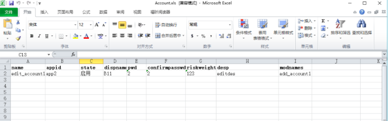
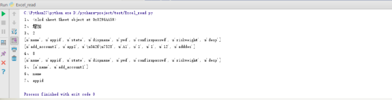

# Python读写Excel文件

## 一、使用xlrd module从Excel读取数据

- 1. 表格的内容如下：

- 2. 对Excel读取操作
```
# -*- coding: utf-8 -*-
import xlrd
xlsfile = r"C:\Users\Administrator\Desktop\test\Account.xls"# 打开指定路径中的xls文件
book = xlrd.open_workbook(xlsfile)#得到Excel文件的book对象，实例化对象
sheet0 = book.sheet_by_index(0) # 通过sheet索引获得sheet对象
print "1、",sheet0
sheet_name = book.sheet_names()[0]# 获得指定索引的sheet表名字
print "2、",sheet_name
sheet1 = book.sheet_by_name(sheet_name)# 通过sheet名字来获取，当然如果知道sheet名字就可以直接指定
nrows = sheet0.nrows    # 获取行总数
print "3、",nrows
#循环打印每一行的内容
for i in range(nrows):
    print sheet1.row_values(i)
ncols = sheet0.ncols    #获取列总数
print "4、",ncols
row_data = sheet0.row_values(0)     # 获得第1行的数据列表
print row_data
col_data = sheet0.col_values(0)     # 获得第1列的数据列表
print "5、",col_data
# 通过坐标读取表格中的数据
cell_value1 = sheet0.cell_value(0, 0)
print "6、",cell_value1
cell_value2 = sheet0.cell_value(0, 1)
print "7、",cell_value2

```
- 3. 执行的结果：


## 二、使用xlwt module将数据写入Excel表格

```
# -*- coding: utf-8 -*-
#导入xlwt模块
import xlwt
# 创建一个Workbook对象，这就相当于创建了一个Excel文件
book = xlwt.Workbook(encoding='utf-8', style_compression=0)
'''
Workbook类初始化时有encoding和style_compression参数
encoding:设置字符编码，一般要这样设置：w = Workbook(encoding='utf-8')，就可以在excel中输出中文了。
默认是ascii。当然要记得在文件头部添加：
#!/usr/bin/env python
# -*- coding: utf-8 -*-
style_compression:表示是否压缩，不常用。
'''
#创建一个sheet对象，一个sheet对象对应Excel文件中的一张表格。
# 在电脑桌面右键新建一个Excel文件，其中就包含sheet1，sheet2，sheet3三张表
sheet = book.add_sheet('test', cell_overwrite_ok=True)
# 其中的test是这张表的名字,cell_overwrite_ok，表示是否可以覆盖单元格，其实是Worksheet实例化的一个参数，默认值是False
# 向表test中添加数据
sheet.write(0, 0, 'EnglishName')  # 其中的'0-行, 0-列'指定表中的单元，'EnglishName'是向该单元写入的内容
sheet.write(1, 0, 'Marcovaldo')
txt1 = '中文名字'
sheet.write(0, 1, txt1.decode('utf-8'))  # 此处需要将中文字符串解码成unicode码，否则会报错
txt2 = '马可瓦多'
sheet.write(1, 1, txt2.decode('utf-8'))
# 最后，将以上操作保存到指定的Excel文件中
book.save(r'e:\test1.xls')  # 在字符串前加r，声明为raw字符串，这样就不会处理其中的转义了。否则，可能会报错
```