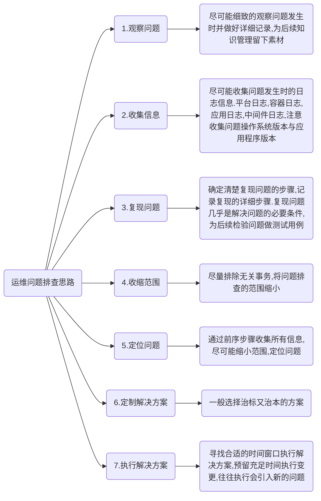

# 运维问题排查


## 一、常见的方法
### 1、确定故障现象并初判问题影响
在处理故障前，运维人员首先要知道故障现象，故障现象直接决定故障应急方案的制定，这依赖于运维人员需要对应用系统的整体功能有一定的熟悉程度。
确认了故障现象后，才能指导运维人员初判断故障影响。
### 2、应急恢复
运维最基本的指标就是系统可用性，应急恢复的时效性是系统可用性的关键指标。
有了上述故障现象与影响的判断后，就可以制定故障应急操作，故障应急有很多，比如：
- 服务整体性能下降或异常，可以考虑重启服务；
- 应用做过变更，可以考虑是否需要回切变更；
- 资源不足，可以考虑应急扩容；
- 应用性能问题，可以考虑调整应用参数、日志参数；
- 数据库繁忙，可以考虑通过数据库快照分析，优化SQL；
- 应用功能设计有误，可以考虑紧急关闭功能菜单；
- 还有很多……

另外，需要补充的是，在故障应急前，在有条件的情况需要保存当前系统场景，比如在杀进程前，可以先抓个CORE文件或数据库快照文件。
### 3、快速定位故障原因
#### 1）是否为偶发性、是否可重现
故障现象是否可以重现，对于快速解决问题很重要，能重现说明总会有办法或工具帮助我们定位到问题原因，而且能重现的故障往往可能是服务异常、变更等工作导致的问题。
但如果故障是偶发性的，是有极小概率出现的，则比较难排查，这依赖于系统是否有足够的故障期间的现场信息来决定是否可以定位到总是原因。
是否进行过相关变更。
大部份故障是由于变更导致，确定故障现象后，如果有应的变更，有助于从变更角度出现分析是否是变更引起，进而快速定位故障并准备好回切等应急方案。

#### 2）是否进行过相关变更
大部份故障是由于变更导致，确定故障现象后，如果有应的变更，有助于从变更角度出现分析是否是变更引起，进而快速定位故障并准备好回切等应急方案。
#### 3）是否可缩小范围
一方面应用系统提倡解耦，一支交易会流经不同的应用系统及模块；另一方面，故障可能由于应用、系统软件、硬件、网络等环节的问题。在排查故障原因时应该避免全面性的排查，建议先把问题范围缩小到一定程序后再开始协调关联团队排查。
关联方配合分析问题
与第（3）点避免同时各关联团队同时无头绪的排查的同时，对于牵头方在缩小范围后需要开放的态度去请求关联方配合定位，而对于关联方则需要有积极配合的工作态度。
#### 4）是否有足够的日志
定位故障原因，最常用的方法就是分析应用日志，对运维人员不仅需要知道业务功能对应哪个服务进程，还要知道这个服务进程对应的哪些应用日志，并具备一些简单的应用日志异常错误的判断能力。
#### 5）是否有core或dump等文件
故障期间的系统现场很重要，这个在故障应急前建议在有条件的情况下留下系统现场的文件，比如 CORE\DUMP，或TRACE采集信息等，备份好一些可能被覆盖的日志等。
上述是一般性的故障常见的方法，在重大故障或多方处理的故障出现时，往往小范围的排查不利于快速解决，需要启动紧急处理的流程，建议可以考虑以下沟通：
- 召集相关人员
- 描述故障现状
- 说明正常应用逻辑流程
- 陈述变更
- 排查进展，展示信息
- 领导决策

## 二、完善监控
### 1、从监控可视化上完善
完善的监控策略需要有统一的可视化操作界面，在制定完善的监控策略后，故障处理人员需要能够快速的看到相应的运行数据，比如：能够看到一段时间的趋势、故障期间的数据表现、性能分析的情况等等数据，且这些数据可以提前制定好策略直接推出分析结果给故障处理人员，这样就大大提高了故障的处理效率，以呼叫中心系统为例，需要提前配置好以下实时交易数据，以便故障定位：
- 交易性能数据：平均交易耗时、系统内部模块交易耗时（IVR交易耗时、接口总线交易耗时）、关联系统交易耗时（核心交易耗时、工单系统交易耗时等）
- 重要交易指标数据：交易量、IVR交易量、话务量、座席通话率、核心交易笔数、工单等系统交易量
- 交易异常情况数据：交易成功率、失败率、错误码最多交易
- 按服务器分析交易数据：按server统计各服务交易处理笔数，交易总耗时

有了以上交易数据，并通过监控按一定频率统计，运维人员在出现故障时，通过鼠标即点击即可看到故障什么时候开始，是系统内部有问题还是关联系统有问题，最突出的交易是哪一支，各服务器交易量是否均衡等情况。
### 2、从监控面上完善
监控最基本的工作就是实现对负载均衡设备、网络设备、服务器、存储设备、安全设备、数据库、中间件及应用软件等IT资源的全面监控管理。在应用软件类的监控工作中，不仅需要有服务进程、端口等监控，还需要有业务、交易层的监控。
全面性的应用监控可以让故障提前预警，并保存了影响应用运行环境的数据，以缩短故障处理时间。
### 3、从监控告警上完善
完善的监控策略需要有清晰的监控告警提示，值班人员要以根据监控告警即可作出简单的问题定位与应急处理方案。比如类似以下的监控短信：
```
22时，【理财应用系统】中【应用服务器LC_APPsvrA 10.2.111.111】的【前置应用模块】出现【应用端口：9080】不存在，该端口作用【提供理财应用处理（负载均衡部署）】，原因可能为【SERVER1服务异常停止】，监控系统己进行以下应急处理【自动执行端口进程启动】，该事件紧急程度【高】。
```
管理员可以通过短信内容看到哪个系统、哪个应用、哪个模块出了什么问题，可能是什么原因，对业务有什么影响，是否需要马上处理（比如凌晨出现此预警是否可以延迟到次日处理）等信息。
### 4、从监控分析上完善
完善的监控策略不仅需要有实时的数据告警，也要有汇总数据的分析告警,实时数据分析的告警的重要性不用多说，对于汇总分析的数据则能发现潜在风险，同时也为分析疑难杂症提供帮忙。
### 5、从监控主动性上完善
监控不仅仅是报警，它还可以做得更多，只要我们想办法赋予它主动解决事件的规则，它便有为管理员处理故障的能力。
## 三、应急方案
提前制定好故障应急方案是很有必要的，但在日常工作过程中我们的应急方案遇到一些问题：
- 应急方案缺乏持续维护，缺乏演练，信息不及时、不准确；
- 应急方案过于追求大而全，导致不利于阅读与使用；
- 应急方案形式大于实际使用效果，方案针对性不强；
- 只关注应急方案的内容，但没有关注运维人员对方案的理解；

针对上述常见问题，应急方案需要做到以下几点：
### 1、内容精简
很多人可能会认为故障出现的形式各种各样，所以应急方案需要涉及到方方面面。但实际的故障处理过程中，我们可以发现其实我们的应急措施往往重复使用几个常用的步骤，所以我认为应急方案要有重点，如果一个应急方案可以应对平时故障处理80%的场景，那这个应急手册应该是合格的。过于追求影响应用系统方方面面的内容，会导致这个方案可读性变差，最终变更一个应付检查的文档。以下是我觉得应用系统应急方案应该有的内容：
#### 1）系统级
能知道当前应用系统在整个交易中的角色，当前系统出现问题或上下游出现问题时，可以知道如何配合上下游分析问题，比如：上下游系统如何通讯，通讯是否有唯一的关键字等。
另外，系统级里还涉及一些基本应急操作，比如扩容、系统及网络参数调整等。
#### 2）服务级
能知道这个服务影响什么业务，服务涉及的日志、程序、配置文件在哪里，如何检查服务是否正常，如何重启服务，如何调整应用级参数等。
#### 3）交易级
能知道如何查到某支或某类交易出现了问题，是大面积、局部，还是偶发性问题，能用数据说明交易影响的情况，能定位到交易报错的信息。这里最常用的方法就是数据库查询或工具的使用。
知道最重要的交易如何检查是否正常，重要的定时任务的应急处理方案，比如开业、换日、对账的时间要求及应急措施。
#### 4）辅助工具的使用
有时候，需要借助一些工具或自动化工具辅助分析并应急，这时需要有辅助工具如何使用的方法。
#### 5）沟通方案
沟通方案涉及通讯录，包括上下游系统、第三方单位、业务部门等渠道。
#### 6）其它
上述5点内容如何都完备，相信这个应急手册己可以解决80%的故障恢复工作。
### 2、应急方案是一项持续的工作
有了应急方案，如何让运维人员持续去更新是难点。我认为要解决这个难点，需要先让运维人员经常使用这个手册。如果一个手册没有场景可以用，那就需要管理者为运维人员创造机会去使用这个手册，比如应急演练。
### 3、关注运维人员对应用关键信息的认识
前两点关注了手册，最后一点我觉得有必要关注使用这个手册的人。有些运维人员认为应用运维人员没有能力去把应用系统本身的内容了解得很透彻，所以应用运维人员在故障处理过程中的地位很尴尬，运维人员掌握操作权，但却不知道应该操作什么。
对此，我认同应用运维人员不需要掌握应用系统的业务功能，但我觉得就对应用系统本身来讲应用运维人员需要具备以下最基本的能力：
- 知道应用系统这个是干什么的，基本的业务是什么；
- 知道应用架构部署、上下游系统逻辑关系；
- 知道应用下的服务的作用、端口、服务级的应急处理，日志等数据信息如何找到并简单定位；
- 知道应用系统重要的时间点及任务，比如开业、停业、换日、定时任务的时间点以及如何判断这些任务是否正确；
- 知道最重要的几支交易的流程；
- 知道常见数据库表结构，并能使用。

## 四、智能化事件处理
处理方法如下图（详细的智能化涉及监控、规则引擎、配置工具、CMDB、应用配置库等模块协同工作）。
