# 取证神器之使用volatility分析window内存

## 取证神器 简单    安全杂项

### 描述    

volatility分析window内存

### 附件

[取证2.tar.bz2](file/取证2.tar.bz2)

### 解题步骤：

#### 1. 先解压得到的tar.bz2压缩包（使用工具解压或者命令都可以）
```
#新建一个test目录
mkdir test
#解压文件到test中，否则解压文件到当前目录
tar jxvf 取证2.tar.bz2 -C ./test
```
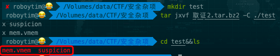

这时候我们会得到两个文件，mem.vmem  suspicion。。。。

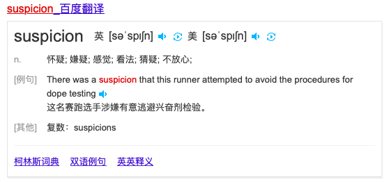

英语比较菜，先百度一下什么意思。。。

知道字面意思也不知道是什么意思。。。话不多说，先搞这个vmem文件吧

#### 2. 使用volatility分析vmem

##### 2.1 volatility下载与安装

介绍：volatility 是一款内存取证和分析工具，可以对 Procdump 等工具 dump 出来的内存进行分析，并提取内存中的文件。该工具支持 Windows 和 Linux，Kali 下面默认已经安装。

volatility 的许多功能由其内置的各种插件来实现，例如查看当前的网络连接，命令行中的命令，记事本中的内容等等。

方法1:

下载kali linux，系统中会自带这个工具

PS:请下载最新版本的，历史版本可能没有。。。。

方法2:

[Github volatility](https://github.com/volatilityfoundation/volatility)

[Download volatility](https://www.volatilityfoundation.org/26)

可能需要梯子。。。

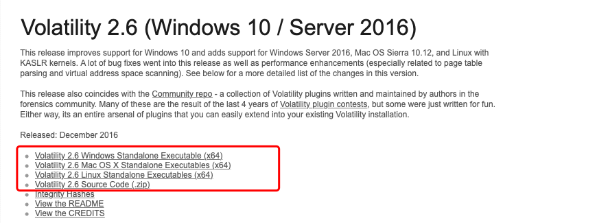

选择自己对应的版本下载即可。

本人使用mac平台，以这个为例，附安装步骤吧，其他的自行百度。

下载volatility_2.6_mac64_standalone.zip，解压

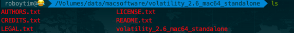

尝试运行

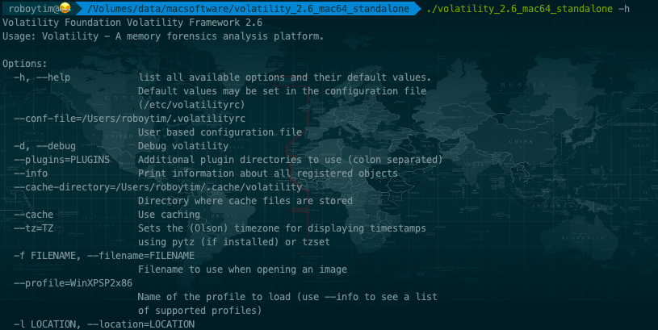

为了方便后续使用，在环境变量中(~/.bash_profile)，添加

```
#volatility ''中替换为自己工具的绝对路径
alias volatility='/Volumes/data/macsoftware/volatility_2.6_mac64_standalone/volatility_2.6_mac64_standalone'
source ~/.bash_profile
```

这样后续在任意目录下直接使用volatility命令就行了。

##### 2.2 volatility的使用

基本使用：

```
volatility -f <文件名> –profile=<配置文件> <插件> [插件参数]
```

完整的使用方法，以后有时间再另行整理，先看看本次我们需要用到的一些命令（有兴趣的话，可以先-h 获取使用帮助）。

```
# imageinfo 获取基本信息
volatility -f mem.vmem imageinfo
```

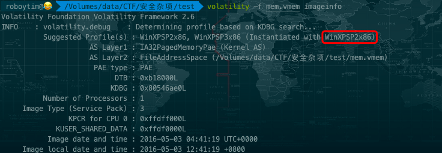

这里最关键的就是获取profile的类型，因为不同的系统数据结构啥的不一样，所以得用--profile=来指定。

这里自动猜解可能的系统类型，一般情况下第一个是正确的，我们后续就用--profile=WinXPSP2x86 这个配置文件，来使用插件。

```
#获取进程信息
volatility -f mem.vmem --profile=WinXPSP2x86 pslist
pslist、pstree、psxview可以查看隐藏进程
```

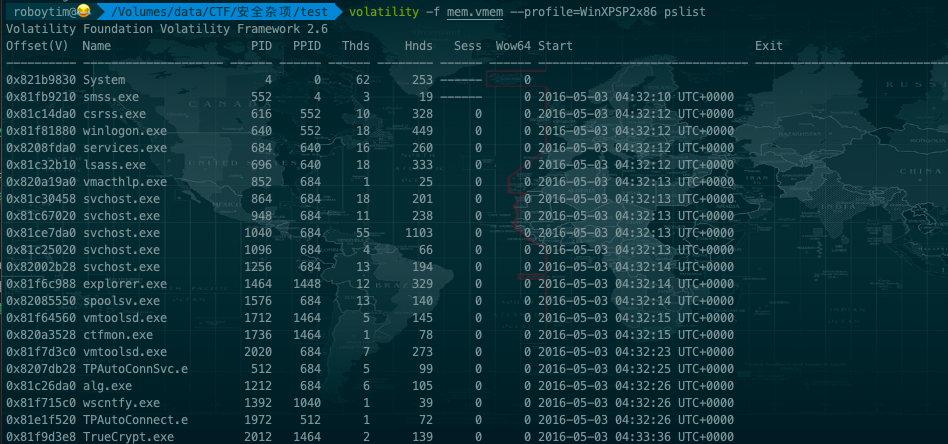

获取到的进程中并没有notepad之类的能够记录flag文字信息的进程，但是看到了TrueCrypt.exe

```
0x81f9d3e8 TrueCrypt.exe          2012   1464      2      139      0      0 2016-05-03 04:33:36 UTC+0000
```

TrueCrypy.exe是一款加密程序，而我们可以推出，suspicion为加密的结果。 

我们需要从内存dump出key来。 

(我是新手，上面这个不是我推断出的，而是百度到的……捂脸，羞羞)

```
#获取进程中的信息 -p 进程号（使用pslist查到的）-D dump文件保存路径
volatility -f mem.vmem --profile=WinXPSP2x86 memdump -p 1464 -D ./
#这里需要注意的是，并不是获取TrueCrypt进程的信息，而是explorer.exe进程的（explorer.exe是Windows程序管理器或者文件资源管理器，它用于管理Windows图形壳，包括桌面和文件管理），估计这也是题目中是window，而不是windows的原因 - -！
```
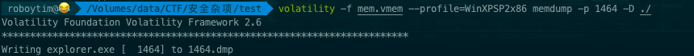

稍等片刻即可获得名叫1464.dmp的文件。

##### 2.3 获得最终的flag

这里就又需要使用到另外一款名叫Elcomsoft Forensic Disk Decryptor（Elcomsoft硬盘取证解密器，简称为EFDD）的工具了，目的是获取加密用的key和破解加密文件。这个工具目前只找到了win版的，mac下还未找到同类工具，没办法，只能上虚拟机了。（老规矩，自行百度下载，这个软件不难找）

安装破解好之后运行。

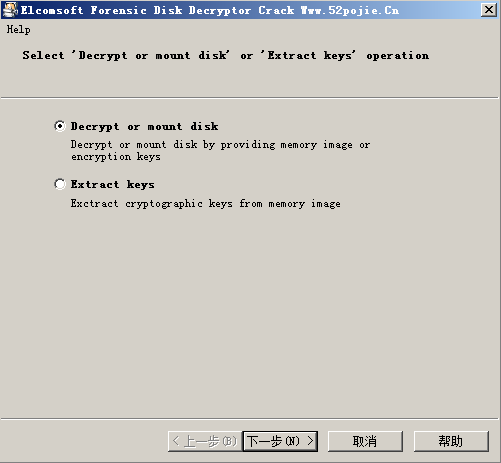

直接下一步。

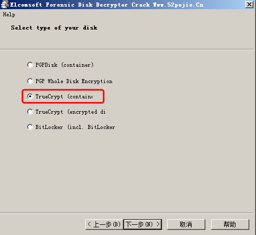

选择第三项TrueCrypt(container),下一步。

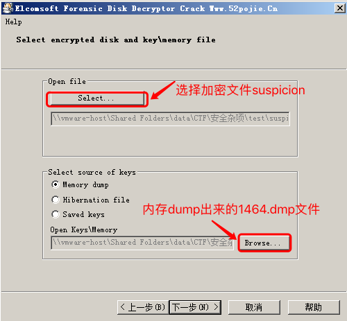

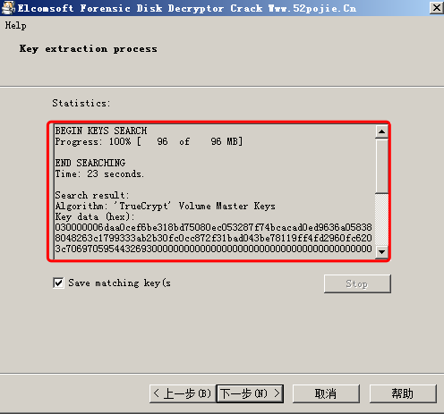

等待破解完成，得到一个key，并保存该文件。

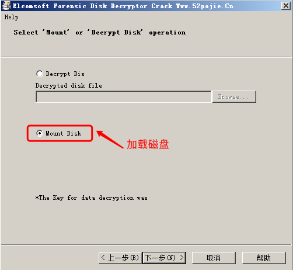

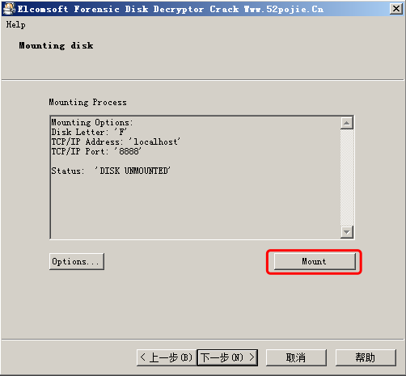

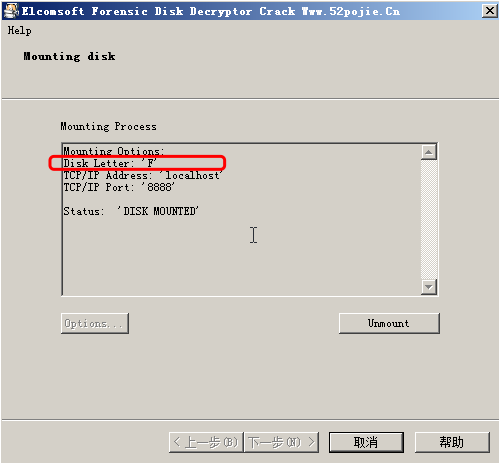

打开F盘，获得flag

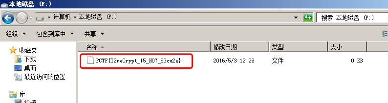