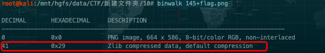
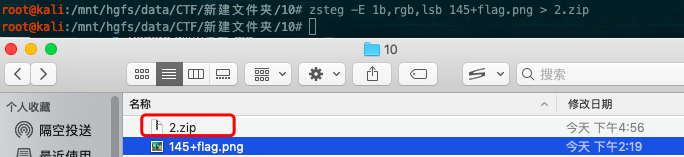
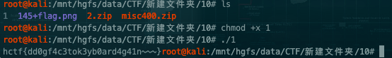

# 图片隐写术之教练我想打CTF

## 题目：

flag格式为hctf{字符串}

## 附件：

[145+flag.png.zip](file/145+flag.png.zip)

## 解题步骤：

下载附件解压之后得到一张图片。


使用binwalk分析文件是否存在多重文件。



发现图片中存在zip的隐藏文件，安装zsteg，kali下的安装方法：

```
gem install zsteg
```

用命令将图片中的zip压缩包提取出来并命名为2.zip

```
zsteg -E 1b,rgb,lsb 145+flag.png > 2.zip
```



执行完命令之后，会在当前目录下找到一个zip文件，解压会得到一个名为1的可行文件。

```
chmod +x 1
./1
```

得到flag。



### Binwalk介绍

Binwalk是用于搜索给定二进制镜像文件以获取嵌入的文件和代码的工具。 具体来说,它被设计用于识别嵌入固件镜像内的文件和代码。 Binwalk使用libmagic库,因此它与Unix文件实用程序创建的魔数签名兼容。 Binwalk还包括一个自定义魔数签名文件,其中包含常见的诸如压缩/存档文件,固件头,Linux内核,引导加载程序,文件系统等的固件映像中常见文件的改进魔数签名。

#### 下载与安装

```
$ sudo su //然后输入密码，获取root权限，避免后期执行命令时出现权限不够的情况。
$ sudo apt-get remove binwalk //卸载原有的旧版binwalk（如果有的话），采用git的方式进行安装，以便得到更好的更新。
$ sudo apt-get update //更新软件
$ sudo apt-get install build-essential autoconf git //获取开发工具git
$ git clone https://github.com/devttys0/binwalk //从git上获取binwalk的源代码
$ cd binwalk //进入binwalk文件夹
$ sudo python setup.py install //导入python环境
#如果自己linux上的python是2.x版的，则紧接着还需要执行下面这步导入python-lzma模块：
$ sudo apt-get install python-lzma

//如果执行命令的中途出现了“无法获得锁之类的情况”，执行下面命令即可
sudo rm /var/lib/dpkg/lock
或
sudo rm /var/lib/apt/lists/lock  //把lock文件删了
```

#### 功能

##### 扫描选项: 

- -B,-- signature 扫描目标文件的常见文件签名 
- -R,--raw = <str>扫描目标文件的指定字符序列 
- -A,--opcodes扫描目标文件中常见可执行代码 
- -m,--magic = <file> 指定要使用的自定义魔数签名文件 
- -b,--dumb 禁用智能签名关键字 
- -I,--invalid显示结果标记为无效 
- -x,--exclude = <str>排除与<str>匹配的结果 
- -y,--include = <str>只显示匹配<str>的结果

##### 提取选项: 

- -e,--extract自动提取已知的文件类型 
- -D,--dd = <type:ext:cmd>提取<type>签名,为文件扩展名为<ext>,然后执行<cmd> 
- -M,--matryoshka 递归扫描提取的文件 
- -d,--depth = <int>限制matryoshka递归深度(默认值:8级深) 
- -C,--directory = <str>将文件/文件夹提取到自定义目录(默认值:当前工作目录) 
- -j,--size = <int> 限制每个提取的文件的大小 
- -n,--count = <int>限制提取文件的数量 
- -r,--rm 提取后删除刻录文件 
- -z,--carve从文件中读取数据,但不执行提取实用程序 

##### 熵分析选项: 

- -E,--entropy 计算文件熵 
- -F,--fast计算更快,但不太详细的熵分析 
- -J,--save将熵图保存为PNG图像 
- -Q,--nlegend 从熵图图中省略图例 
- -N,--nplot 不生成熵图 
- -H,--high = <float>设置上升沿熵触发阈值(默认值:0.95) 
- -L,--low = <float> 设置下降沿熵触发阈值(默认值:0.85) 

##### 原始压缩选项: 

- -X, --deflate扫描原始deflate压缩流 
- -Z, --lzma 扫描原始LZMA压缩流 
- -P, --partial浅度扫描,速度更快 
- -S, --stop 找到第一个结果后停止扫描 

##### 二进制差异选项: 

- -W,--hexdump 执行文件或文件的hexdump/diff 
- -G,--green 只显示包含所有文件中相同字节的行 
- -i,--red 仅显示包含所有文件中不同字节的行 
- -U,--blue只显示一些文件中包含不同字节的行 
- -w,--terse 只显示第一个文件的十六进制转储 

##### 一般选项: 
- -l,--length = <int>要扫描的字节数 
- -o,--offset = <int>以此偏移开始扫描 
- -O,--base = <int>向所有打印的偏移量添加基址 
- -K,--block = <int> 设置文件块大小 
- -g,--swap = <int>扫描前每n个字节反转一次 
- -f,--log = <file>将结果记录到文件 
- -c,--csv 将结果记录到CSV格式的文件中 
- -t,--term格式化输出以适合终端窗口 
- -q,--quiet 禁止输出 
- -v,--verbose 详细输出 
- -h,--help显示帮助 
- -a,--finclude = <str>只扫描名称与此正则表达式匹配的文件 
- -p,--fexclude = <str>不扫描名称与此正则表达式匹配的文件 
- -s,--status = <int>启用指定端口上的状态服务器 

