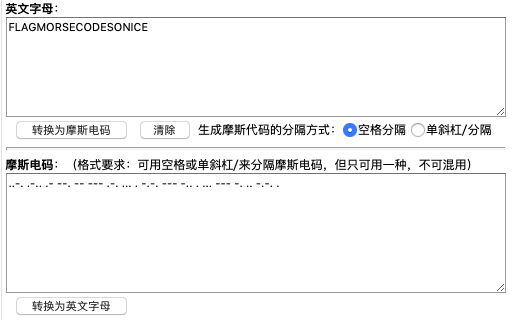

# 密码学之摩斯电码

## 摩斯电码 简单    密码学

### 描述    

你知道点点杠杠已经起源好久了吗？（flag为字符串，无前缀）..-. .-.. .- --. -- --- .-. ... . -.-. --- -.. . ... --- -. .. -.-. .

### 解题步骤：

这个题并不难，先来普及一下知识点。。。。

#### 摩尔斯电码

摩尔斯电码（又译为摩斯密码，Morse code）是一种时通时断的信号代码，通过不同的排列顺序来表达不同的英文字母、数字和标点符号。

摩尔斯电码定义了包括：英文字母A-Z（无大小写区分）十进制数字0-9，以及“？”“/”“（）”“－”“．”很适合英语的通信。至今仍有很多地方在使用。在业余无线电通信中，他是全世界运用统一的电码。下面列出的是基本码表：

##### 字母
<table width="100%" border="0" cellpadding="0" cellspacing="0" class="bx"><tbody><tr><th><strong>字符</strong></th><td><strong>电码符号</strong></td><th><strong>字符</strong></th><td><strong>电码符号</strong></td><th><strong>字符</strong></th><td><strong>电码符号</strong></td><th><strong>字符</strong></th><td><strong>电码符号</strong></td></tr><tr><th>A</th><td>．━</td><th>B</th><td>━ ．．．</td><th>C</th><td>━ ．━ ．</td><th>D</th><td>━ ．．</td></tr><tr><th>E</th><td>．</td><th>F</th><td>．．━ ．</td><th>G</th><td>━ ━ ．</td><th>H</th><td>．．．．</td></tr><tr><th>I</th><td>．．</td><th>J</th><td>．━ ━ ━</td><th>K</th><td>━ ．━</td><th>L</th><td>．━ ．．</td></tr><tr><th>M</th><td>━ ━</td><th>N</th><td>━ ．</td><th>O</th><td>━ ━ ━</td><th>P</th><td>．━ ━ ．</td></tr><tr><th>Q</th><td>━ ━ ．━</td><th>R</th><td>．━ ．</td><th>S</th><td>．．．</td><th>T</th><td>━</td></tr><tr><th>U</th><td>．．━</td><th>V</th><td>．．．━</td><th>W</th><td>．━ ━</td><th>X</th><td>━ ．．━</td></tr><tr><th>Y</th><td>━ ．━ ━</td><th>Z</th><td>━ ━ ．．</td><th>　</th><td>　</td><th>　</th><td>　</td></tr></tbody></table>

##### 数字
<table width="100%" border="0" cellpadding="0" cellspacing="0" class="bx"><tbody><tr><th><strong>字符</strong></th><td><strong>电码符号</strong></td><th><strong>字符</strong></th><td><strong>电码符号</strong></td><th><strong>字符</strong></th><td><strong>电码符号</strong></td><th><strong>字符</strong></th><td><strong>电码符号</strong></td></tr><tr><th>0</th><td>━ ━ ━ ━ ━</td><th>1</th><td>．━ ━ ━ ━</td><th>2</th><td>．．━ ━ ━</td><th>3</th><td>．．．━ ━</td></tr><tr><th>4</th><td>．．．．━</td><th>5</th><td>．．．．．</td><th>6</th><td>━ ．．．．</td><th>7</th><td>━ ━ ．．．</td></tr><tr><th>8</th><td>━ ━ ━ ．．</td><th>9</th><td>━ ━ ━ ━ ．</td><th>　</th><td>　</td><th>　</th><td>　</td></tr></tbody></table>

##### 标点符号
<table width="100%" border="0" cellpadding="0" cellspacing="0" class="bx"><tbody><tr><th><strong>字符</strong></th><td><strong>电码符号</strong></td><th><strong>字符</strong></th><td><strong>电码符号</strong></td><th><strong>字符</strong></th><td><strong>电码符号</strong></td><th><strong>字符</strong></th><td><strong>电码符号</strong></td></tr><tr><th>0</th><td>━ ━ ━ ━ ━</td><th>1</th><td>．━ ━ ━ ━</td><th>2</th><td>．．━ ━ ━</td><th>3</th><td>．．．━ ━</td></tr><tr><th>4</th><td>．．．．━</td><th>5</th><td>．．．．．</td><th>6</th><td>━ ．．．．</td><th>7</th><td>━ ━ ．．．</td></tr><tr><th>8</th><td>━ ━ ━ ．．</td><th>9</th><td>━ ━ ━ ━ ．</td><th>　</th><td>　</td><th>　</th><td>　</td></tr></tbody></table>

##### 非英语字符
<table width="100%" border="0" cellpadding="0" cellspacing="0" class="bx"><tbody><tr><th><strong>字符</strong></th><td><strong>电码符号</strong></td><th><strong>字符</strong></th><td><strong>电码符号</strong></td><th><strong>字符</strong></th><td><strong>电码符号</strong></td><th><strong>字符</strong></th><td><strong>电码符号</strong></td></tr><tr><th>à或å</th><td>．━ ━ ．━</td><th>ä或æ</th><td>．━ ．━</td><th>ch</th><td>━ ━ ━ ━</td><th>ç或ĉ</th><td>━ ．━ ．．</td></tr><tr><th>ð</th><td>．．━ ━ ．</td><th>é</th><td>．．━ ．．</td><th>è</th><td>．━ ．．━</td><th>ĝ</th><td>━ ━ ．━ ．</td></tr><tr><th>ĥ</th><td>━ ．━ ━ ．</td><th>ĵ</th><td>．━ ━ ━ ．</td><th>ñ</th><td>━ ━ ．━ ━</td><th>ö或ø</th><td>━ ━ ━ ．</td></tr><tr><th>ŝ</th><td>．．．━ ．</td><th>þ</th><td>．━ ━ ．．</td><th>ü或ŭ</th><td>．．━ ━</td><th>　</th><td>　</td></tr></tbody></table>

##### 特殊符号
<table width="100%" border="0" cellpadding="0" cellspacing="0" class="bx"><tbody><tr><th><strong>字符</strong></th><td><strong>电码符号</strong></td><th><strong>字符</strong></th><td><strong>电码符号</strong></td><th><strong>字符</strong></th><td><strong>电码符号</strong></td><th><strong>字符</strong></th><td><strong>电码符号</strong></td></tr><tr><th title="停止（消息结束）">AR</th><td title="停止（消息结束）">．━ ．━ ．</td><th title="等待">AS</th><td title="等待">．━ ．．．</td><th title="邀请发射信号（一般跟随AR，表示“该你了”）">K</th><td title="邀请发射信号（一般跟随AR，表示“该你了”）">━ ．━ </td><th title="终止（联络结束）">SK</th><td title="终止（联络结束）">．．．━ ．━ </td></tr><tr><th title="分隔符">BT</th><td title="分隔符">━ ．．．━ </td><th>　</th><td>　</td><th>　</th><td>　</td><th>　</th><td>　</td></tr></tbody></table>

既然咱们现在已经知道对应的字符了，按照对应的表格即可获得正确的密码，所以我们。。。。

当然不可能一个一个去对照着翻译了，直接在线解密就好了啊。。。。

[在线摩斯密码加密,摩斯密码解密](http://www.zhongguosou.com/zonghe/moErSiCodeConverter.aspx)



是不是很简单，不过既然咱们有了码表，不妨用python写一个。
```
#!/usr/bin/python
# -*- coding: UTF-8 -*-
import sys
a = "..-. .-.. .- --. -- --- .-. ... . -.-. --- -.. . ... --- -. .. -.-. ."
s = a.split(" ")
dict = {'.-': 'A',
        '-...': 'B',
        '-.-.': 'C',
        '-..':'D',
        '.':'E',
        '..-.':'F',
        '--.': 'G',
        '....': 'H',
        '..': 'I',
        '.---':'J',
        '-.-': 'K',
        '.-..': 'L',
        '--': 'M',
        '-.': 'N',
        '---': 'O',
        '.--.': 'P',
        '--.-': 'Q',
        '.-.': 'R',
        '...': 'S',
        '-': 'T',
        '..-': 'U',
        '...-': 'V',
        '.--': 'W',
        '-..-': 'X',
        '-.--': 'Y',
        '--..': 'Z',
        '.----': '1',
        '..---': '2',
        '...--': '3',
        '....-': '4',
        '.....': '5',
        '-....': '6',
        '--...': '7',
        '---..': '8',
        '----.': '9',
        '-----': '0',
        '..--..': '?',
        '-..-.': '/',
        '-.--.-': '()',
        '-....-': '-',
        '.-.-.-': '.'
        };
for i in s:
    sys.stdout.write(dict[i])
    #python3 使用 print (dict[i],end='')输出即可
```