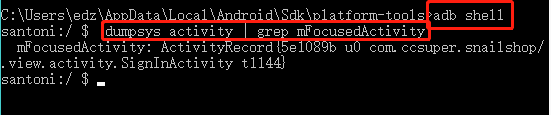
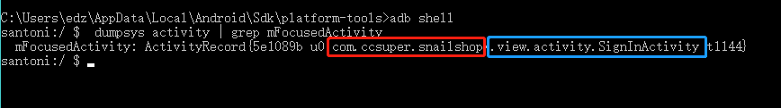
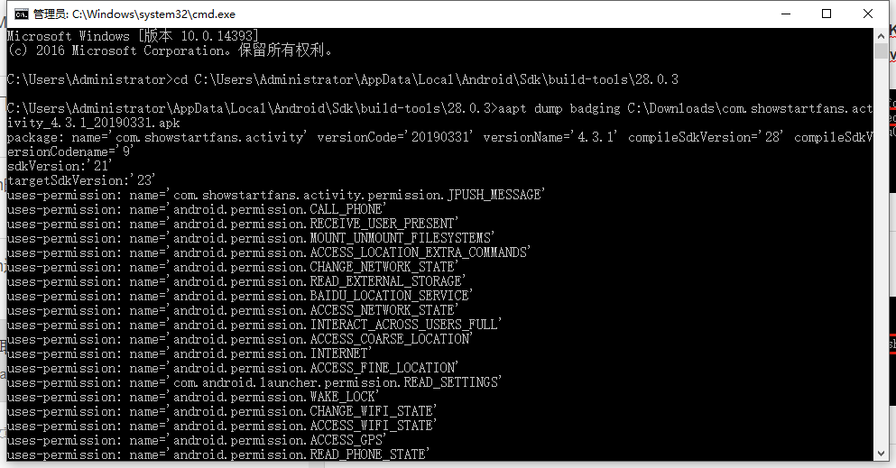
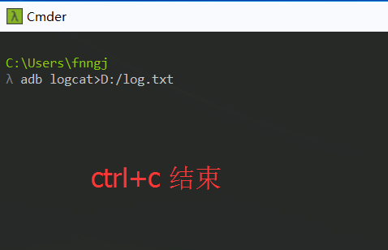
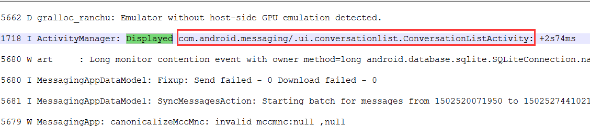
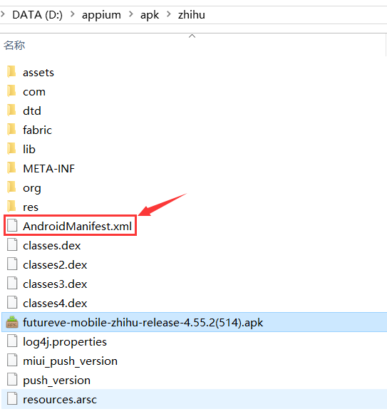
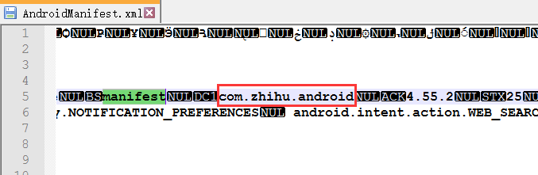
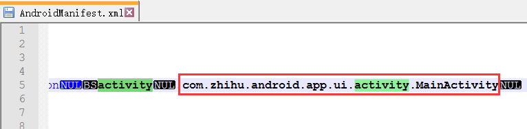

# Appium之获取appPackage和appActivity

appPackage和appActivity是desired capabilities中非常重要的两个参数，在使用appium进行自动化测试时我们常常会用到这两个参数，那么如何获取这两个参数呢？

## 一、使用adb shell
首先要通过USB将手机与电脑连接，注意将手机的调试模式打开，打开Android SDK的platform-tools的文件夹，在上方地址栏输入cmd，进入cmd后首先输入adb shell ，出现$后输入 dumpsys activity | grep mFocusedActivity（如图）



其中红框的即为appPackage，蓝框的即为appActivity



```
adb dumpsys  activity activities | grep mFocusedActivity # 8.0以下
adb shell dumpsys activity activities | grep mResumedActivity # 8.0
```

## 二、使用aact

首先要通过USB将手机与电脑连接，注意将手机的调试模式打开，打开Android SDK的build-tools的文件夹，在上方地址栏输入cmd，进入cmd后输入aact dump badging +存放apk的地址（如图）



package:name 就是appPackage

launchable-activity: name 就是appActivity

## 三、通过查看log文件获取

1.打开APP。

2.执行> adb logcat>D:/log.txt



3.胡乱的对APP做一些操作。

4.Ctrl+c 结束adb命令。

5.打开log.txt文件，搜索：Displayed


```
appPackage:   com.android.messaging
appActivity：.ui.conversationlist.ConversationListActivity
```

## 四、通过apk程序包获取

1.通过解压工具，解压apk程序包。



2.通过notepad++ 打开AndroidManifest.xml 文件，在里面搜索：manifest对应的就是appPackage。



3.搜索：activity对应的就是appActivity。（activity关键字很多，你要注意辨别。）


