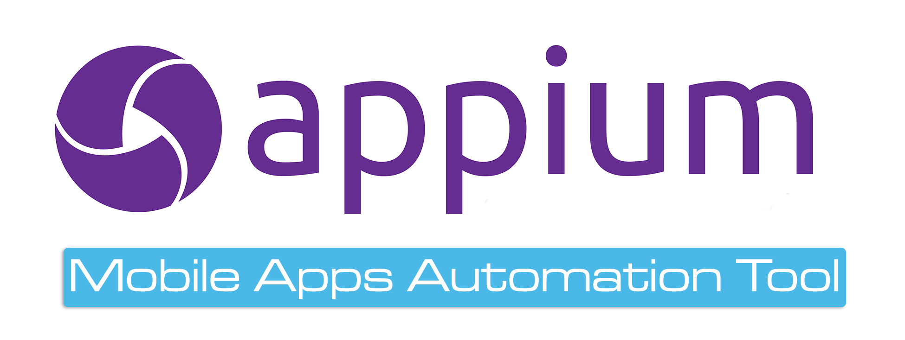

# Appium

Appium是一个开源、跨平台的测试框架，可以用来测试原生及混合的移动端应用。Appium支持IOS、Android及FirefoxOS平台。Appium使用WebDriver的json wire协议，来驱动Apple系统的UIAutomation库、Android系统的UIAutomator框架。Appium对IOS系统的支持得益于Dan Cuellar’s对于IOS自动化的研究。Appium也集成了Selendroid，来支持老android版本。

Appium支持Selenium WebDriver支持的所有语言，如java、Object-C、JavaScript、Php、Python、Ruby、C#、Clojure，或者Perl语言，更可以使用Selenium WebDriver的Api。Appium支持任何一种测试框架。如果只使用Apple的UIAutomation，我们只能用javascript来编写测试用例，而且只能用Instruction来运行测试用例。同样，如果只使用Google的UIAutomation，我们就只能用java来编写测试用例。Appium实现了真正的跨平台自动化测试。
