# Github入门

GitHub是基于git实现的代码托管。git是目前最好用的版本控制系统了，非常受欢迎，比之svn更好。

GitHub可以免费使用，并且快速稳定。即使是付费帐户，每个月不超过10美刀的费用也非常便宜。

利用GitHub，你可以将项目存档，与其他人分享交流，并让其他开发者帮助你一起完成这个项目。优点在于，他支持多人共同完成一个项目，因此你们可以在同一页面对话交流。

创建自己的项目，并备份，代码不需要保存在本地或者服务器，GitHub做得非常理想。

学习Git也有很多好处。他被视为一个预先维护过程，你可以按自己的需要恢复、提交出现问题,或者您需要恢复任何形式的代码，可以避免很多麻烦。Git最好的特性之一是能够跟踪错误，这让使用Github变得更加简单。Bugs可以公开，你可以通过Github评论，提交错误。

在GitHub页面，你可以直接开始，而不需要设置主机或者DNS。

## 一、注册安装

去官网注册一个账号 https://github.com/

## 二、创建 repository(仓库)
看到右上角 "+" 没? 点击选择 "New repository"

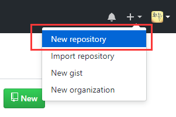

下面是创建仓库信息，只有名字是必填项
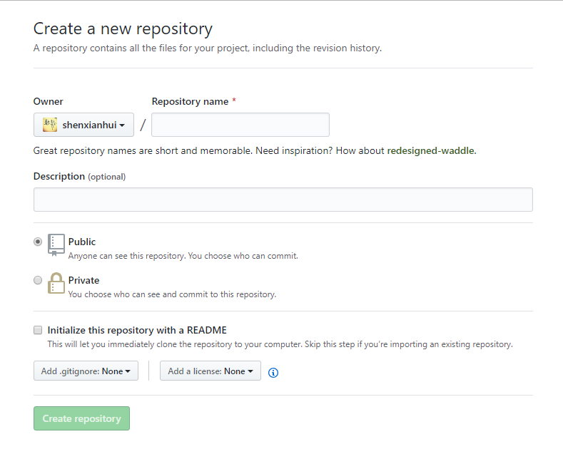

创建成功后，可以看到自己的仓库地址。它还介绍了github仓库的常用指令, 这个指令需要在本地安装 git 客户端
```
   git init // 把这个目录变成Git可以管理的仓库
　　git add README.md // 文件添加到仓库
　　git add . // 不但可以跟单一文件，还可以跟通配符，更可以跟目录。一个点就把当前目录下所有未追踪的文件全部add了 
　　git commit -m "first commit" // 把文件提交到仓库
　　git remote add origin git@github.com:wangjiax9/practice.git // 关联远程仓库
　　git push -u origin master // 把本地库的所有内容推送到远程库上
```
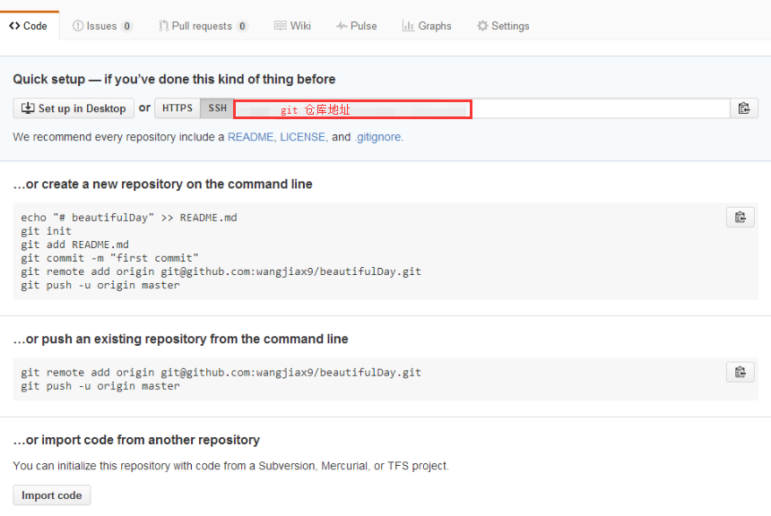

## 三、安装 git 客户端
1. 下载 git https://git-scm.com/

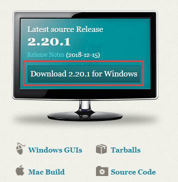

2. 安装客户端

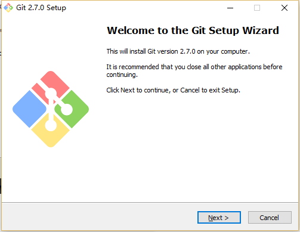
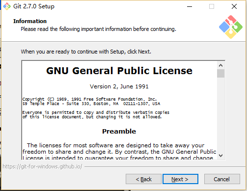

选择安装路径，千万别选带中文的路径，有时候会引起不必要的误会

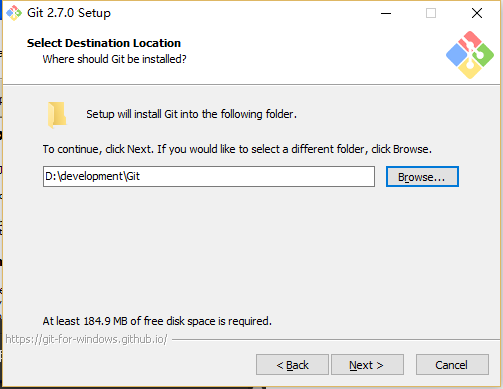

选择安装组件，按默认的来就好了
1）图标组件(Addition icons) : 选择是否创建快速启动栏图标 或者 是否创建桌面快捷方式;
2）桌面浏览(Windows Explorer integration) : 浏览源码的方法, 单独的上下文浏览 只使用bash 或者 只用Git GUI工具; 高级的上下文浏览方法 使用git-cheetah plugin插件;
3）关联配置文件(Associate .git*) : 是否关联git配置文件, 该配置文件主要显示文本编辑器的样式;
4）关联shell脚本文件(Associate .sh) : 是否关联Bash命令行执行的脚本文件;
5）使用TrueType编码 : 在命令行中是否使用TruthType编码, 该编码是微软和苹果公司制定的通用编码;

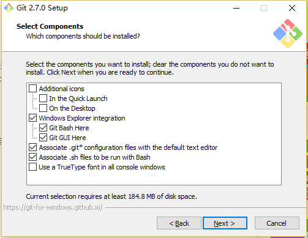

设置开始菜单中快捷方式的目录名称，默认就好，下一步吧

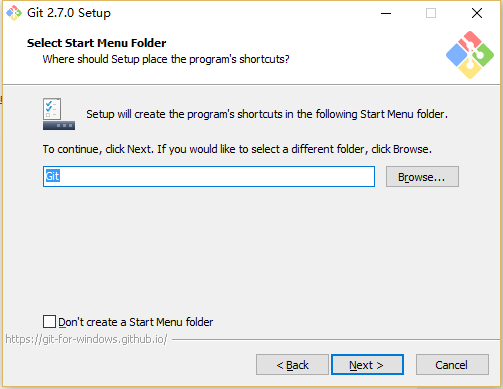

设置环境变量 : 选择使用什么样的命令行工具, 一般情况下我们默认使用Git Bash即可, 默认选择;
1）Git自带 : 使用Git自带的Git Bash命令行工具;
2）系统自带CMD : 使用Windows系统的命令行工具;
3）二者都有 : 上面二者同时配置, 但是注意, 这样会将windows中的find.exe 和 sort.exe工具覆盖, 如果不懂这些尽量不要选择;

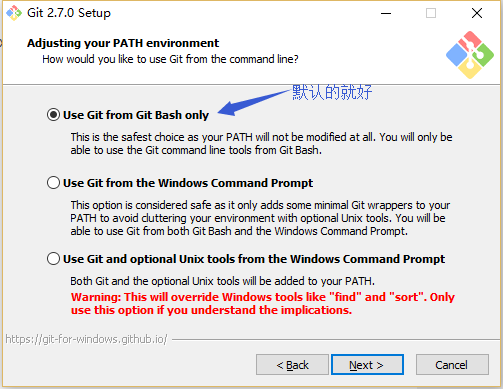

选择换行格式 ，依然是默认就好。
1）检查出windows格式转换为unix格式 : 将windows格式的换行转为unix格式的换行在进行提交;
2）检查出原来格式转为unix格式 : 不管什么格式的, 一律转为unix格式的换行在进行提交;
3）不进行格式转换 : 不进行转换, 检查出什么, 就提交什么;

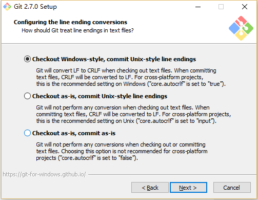

选择终端模拟器，依然默认就好
1）使用MinTTY，就是在Windows开了一个简单模拟Linux命令环境的窗口Git Bash
2）使用windows的系统的命令行程序cmd.exe

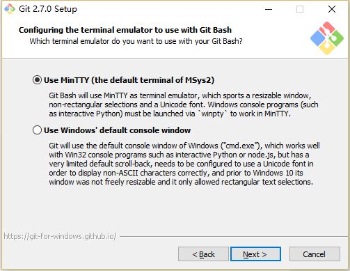

选择默认就好，不用文件系统缓存

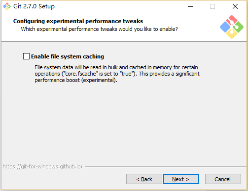

安装成功

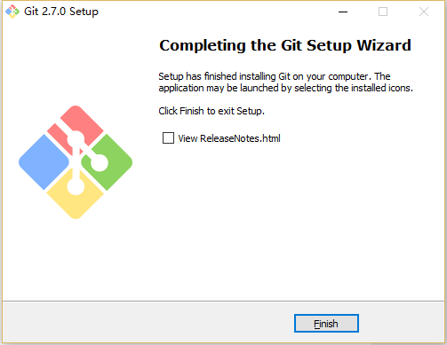

3. 绑定用户

打开git-bash.exe，在桌面快捷方式/开始菜单/安装目录中
因为Git是分布式版本控制系统，所以需要填写用户名和邮箱作为一个标识，用户和邮箱为你github注册的账号和邮箱
```
git config --global user.name "Your Name"
git config --global user.email "your_email@example.com"
```
注: your_email@example.com 的部分请改成你在创建账户时用的邮箱地址

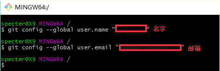

这个命令会在 C:\Users\Administator （Administator为电脑用户名，每个人不同）目录下生成 .gitconfig 文件
PS: 下面代码是为了记住用户名和密码, 不用每次都输入, 需要的直接添加保存即可
```
[credential]
    helper = store
```
当然, 还有其他方法保存, 可以直接在git bash 中执行命令：
```
记住密码十五分钟
git config --global credential.helper cache
自定义记住的时间 (单位: 秒)
git config credential.helper 'cache --timeout=3600'
永久记住
git config --global credential.helper store
```
最后再输入一次账号密码就可以保存了

## 四、为 Github 账户设置 SSH key
众所周知 ssh key 是加密传输。

加密传输的算法有好多，git 使用 rsa，rsa 要解决的一个核心问题是，如何使用一对特定的数字，使其中一个数字可以用来加密，而另外一个数字可以用来解密。这两个数字就是你在使用 git 和 github 的时候所遇到的 public key 也就是公钥以及 private key 私钥。

其中，公钥就是那个用来加密的数字，这也就是为什么你在本机生成了公钥之后，要上传到 github 的原因。从 github 发回来的，用那公钥加密过的数据，可以用你本地的私钥来还原。

如果你的 key 丢失了，不管是公钥还是私钥，丢失一个都不能用了，解决方法也很简单，重新再生成一次，然后在 github.com 里再设置一次就行

1. 生成 SSH Key

首先检查是否已生成密钥 cd ~/.ssh
ls 如果有3个文件，则密钥已经生成，id_rsa.pub 就是公钥

如果没有生成，那么通过 $ ssh-keygen -t rsa

输入文件名的地方输入可以输入自定义文件名，默认是id_rsa，然后一路回车...... 
注意如果自定义文件名的话，需要加一个config文件，下文有介绍。
最后，输入
`ssh -T git@github.com`
或者下面的命令, 区别就是会多打印日志.
`ssh -Tv git@github.com`
如果没有报错，再尝试输出就应该有了
```
cat ~/.ssh/id_rsa.pub      # 控制台上输出内容
pbcopy < ~/.ssh/id_rsa.pub # 自动拷贝到粘贴板
```
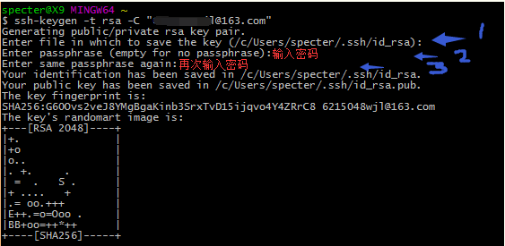

1）是路径确认，直接按回车存默认路径即可
2）直接回车键，这里我们不使用密码进行登录, 用密码太麻烦;
3）直接回车键

生成成功后，去对应目录,打开 id_rsa.pub，得到 ssh key公钥

2. 为 github 账号配置 ssh key

切换到 github，展开个人头像的小三角，点击settings

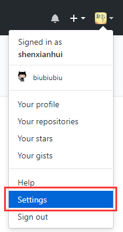

然后打开 SSH and GPG keys 菜单， 点击 New SSH key 新增密钥

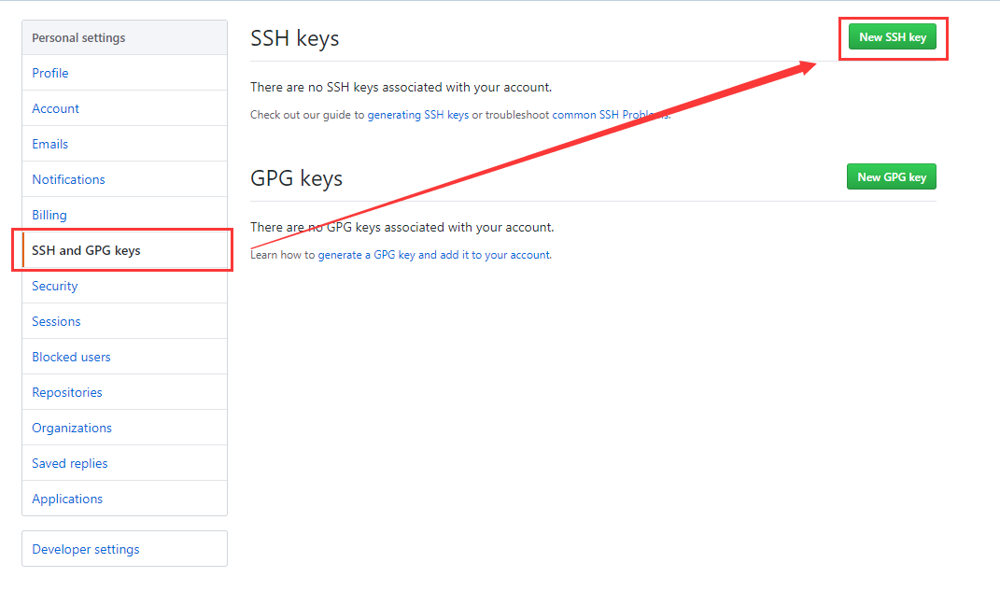

接着将 id_rsa.pub 文件中 key 粘贴到此，最后 Add SSH key 生成密钥

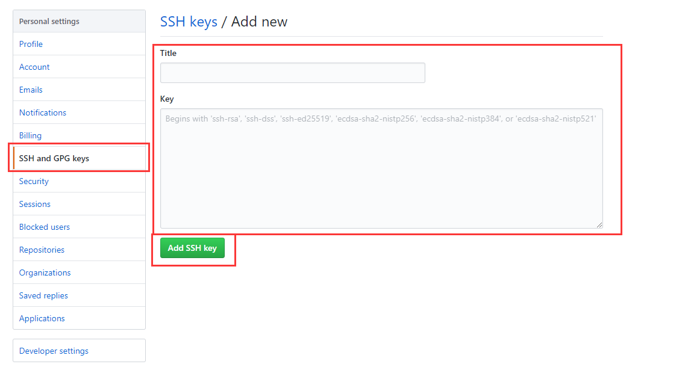

如此，github账号的SSH keys配置完成

## 五、上传本地项目到github

首先，进入到项目目录，执行`git init`

初始化成功后你会发现项目里多了一个隐藏文件夹.git

这个目录是Git用来跟踪管理版本库的，没事千万不要手动修改这个目录里面的文件，不然改乱了，就把Git仓库给破坏了。

接着，将所有文件添加到仓库,执行指令：`git add .`

然后把文件提交到仓库，双引号内是提交注释,执行指令：`git commit -m "提交文件"`

如此本地仓库建立好了.

### 关联 github 仓库

执行指令：`git remote add origin git@github.com:mike0564/KnowledgeLib.git`


### 上传本地代码

执行指令：`git push -u origin master`

敲一个：yes， 然后回车,到此，本地代码已经推送到github仓库了
```
# 执行指令添加文件->提交文件->推送文件
git add .
git commit -m "commit"
git push -u origin master
```

## 六、Git建立+解除关联相关操作
1. 查看本地仓库与远程仓库的关联详情
```
$ git remote -v
```
2. 建立关联并提交代码
```
git remote add origin https://xxxxxxx/wangdong/helloworld.git
git push -u origin master
```
3. 解除关联--如果本地代码，已经关联了远程分支，则需要先解除关联
```
git remote remove origin
```