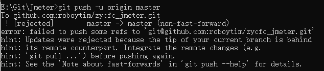
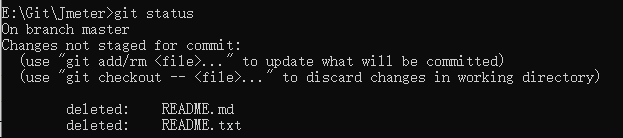
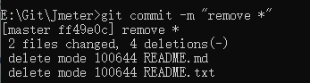

# Git常见报错与解决方案

#### git添加远程库git remote add origin git@github.com:roboytim/zycfc_jmeter.git报错：“fatal: remote origin already exists.”

解决步骤：

1. 先删除	
  `$ git remote rm origin`
2. 再次执行添加就可以了。

#### git push -u origin master报错“[rejected] master -> master (non-fast-forward)”



解决步骤：

1. git pull origin master --allow-unrelated-histories //把远程仓库和本地同步，消除差异
2. 重新add和commit相应文件
```
	git add filename
	git commit -m "first commit"
```
3. git push origin master
4. 此时就能够上传成功了

#### Git删除文件方法

##### 方法一：

步骤：
1. 在本地库中删除对应文件
2. 使用git status查看文件

3. git rm filename,从版本库中删除文件

4. git commit -m "remove filename"，提交确认删除


##### 方法二：

步骤：
1. git init
2. cd “你的本地仓库地址”
3. git pull origin master	(#将远程仓库里面的项目拉下来)
4. dir	(#查看有哪些文件夹)
5. git rm -r --cached	“你要删除的文件名”
6. git commit -m 	'备注更改信息'
7. git push -u origin master 	（#更新状态）