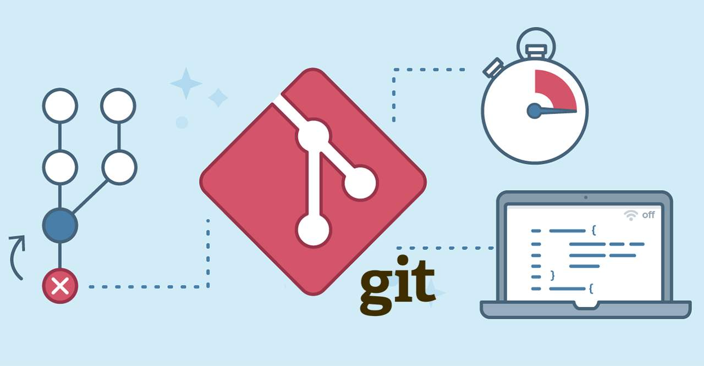

# Git

Git(读音为/gɪt/)是一个开源的分布式版本控制系统，可以有效. 高速地处理从很小到非常大的项目版本管理。 [1]  Git 是 Linus Torvalds 为了帮助管理 Linux 内核开发而开发的一个开放源码的版本控制软件。

## Git的功能特性：

从一般开发者的角度来看，git有以下功能：

1. 从服务器上克隆完整的Git仓库（包括代码和版本信息）到单机上。
2. 在自己的机器上根据不同的开发目的，创建分支，修改代码。
3. 在单机上自己创建的分支上提交代码。
4. 在单机上合并分支。
5. 把服务器上最新版的代码fetch下来，然后跟自己的主分支合并。
6. 生成补丁（patch），把补丁发送给主开发者。
7. 看主开发者的反馈，如果主开发者发现两个一般开发者之间有冲突（他们之间可以合作解决的冲突），就会要求他们先解决冲突，然后再由其中一个人提交。如果主开发者可以自己解决，或者没有冲突，就通过。
8. 一般开发者之间解决冲突的方法，开发者之间可以使用pull 命令解决冲突，解决完冲突之后再向主开发者提交补丁。

从主开发者的角度（假设主开发者不用开发代码）看，git有以下功能：

1. 查看邮件或者通过其它方式查看一般开发者的提交状态。
2. 打上补丁，解决冲突（可以自己解决，也可以要求开发者之间解决以后再重新提交，如果是开源项目，还要决定哪些补丁有用，哪些不用）。
3. 向公共服务器提交结果，然后通知所有开发人员。