# Jmeter+Ant安装配置使用

## 一、环境准备：

1、Jdk1.6或以上：http://www.oracle.com/technetwork/java/javase/downloads/index.html

命令行输入：java -version，出现如下提示说明安装成功
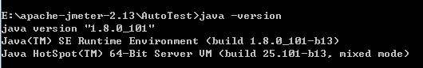
2、ANT下载：http://ant.apache.org/bindownload.cgi 

设置Ant环境变量
```
ANT_HOME=E:\apache-ant-1.9.7;
CLASSPATH=E:\apache-ant-1.9.7;
Path=%ANT_HOME%\bin;
```
命令行输入：ant -v，出现如下提示说明安装成功
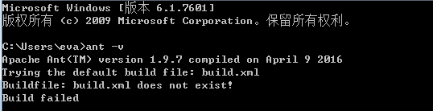
3、将 JMeter的extras目录中ant-jmeter-1.1.1.jar包拷贝至ant安装目录下的lib目录中
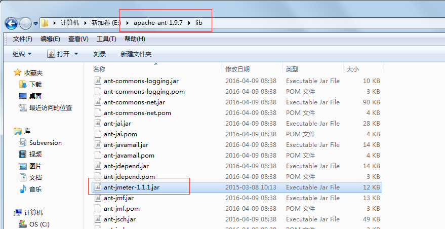
4、修改JMeter的bin目录下jmeter.properties文件的配置：jmeter.save.saveservice.output_format=xml
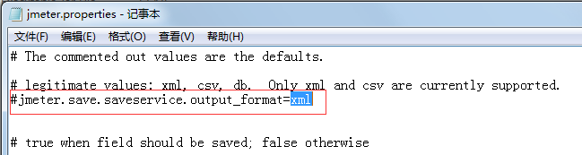
5、任意新建一个脚本存放目录：E:\apache-jmeter-2.13\AutoTest，以及报告存放目录report，将Login_test.jmx(已经调试OK的脚本)拷贝此目录
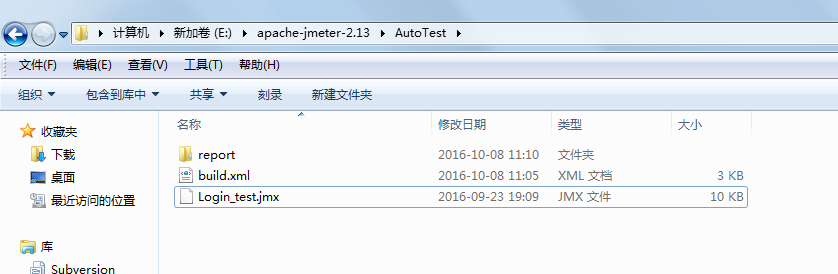
## 二、构建脚本配置：

在E:\apache-jmeter-2.13\AutoTest目录下，新建一个build.xml文件（Ant自动构建文件）
```
<?xml version="1.0" encoding="GB2312"?>
<project name="ant-jmeter-test" default="run" basedir=".">
    <!-- 需要改成自己本地的 Jmeter 目录-->  
    <property name="jmeter.home" value="E:\apache-jmeter-2.13" />
    <property name="report.title" value="SZSG_三国"/>
    <!-- jmeter生成jtl格式的结果报告的路径--> 
    <property name="jmeter.result.jtl.dir" value="E:\apache-jmeter-2.13\AutoTest\report" />
    <!-- jmeter生成html格式的结果报告的路径-->
    <property name="jmeter.result.html.dir" value="E:\apache-jmeter-2.13\AutoTest\report" />
    <!-- 生成的报告的前缀-->  
    <property name="ReportName" value="thinkive" />
    <property name="jmeter.result.jtlName" value="${jmeter.result.jtl.dir}/${ReportName}.jtl" />
    <property name="jmeter.result.htmlName" value="${jmeter.result.html.dir}/${ReportName}.html" />

    <target name="run">
        <antcall target="test" />
        <antcall target="report" />
    </target>
    
    <target name="test">
        <taskdef name="jmeter" classname="org.programmerplanet.ant.taskdefs.jmeter.JMeterTask" />
        <jmeter jmeterhome="${jmeter.home}" resultlog="${jmeter.result.jtlName}">
            <!-- 声明要运行的脚本"*.jmx"指包含此目录下的所有jmeter脚本-->
            <testplans dir="E:\apache-jmeter-2.13\AutoTest" includes="Login_test.jmx" />
            
            <property name="jmeter.save.saveservice.output_format" value="xml"/>
        </jmeter>
    </target>
        
    <path id="xslt.classpath">
        <fileset dir="${jmeter.home}/lib" includes="xalan*.jar"/>
        <fileset dir="${jmeter.home}/lib" includes="serializer*.jar"/>
    </path>


    <target name="report">
        <tstamp> <format property="report.datestamp" pattern="yyyy/MM/dd HH:mm" /></tstamp>
        <xslt 
              classpathref="xslt.classpath"
              force="true"
              in="${jmeter.result.jtlName}"
              out="${jmeter.result.htmlName}"
              style="${jmeter.home}/extras/jmeter-results-detail-report_21.xsl">
              <param name="dateReport" expression="${report.datestamp}"/>
              <param name="titleReport" expression="${report.title}:${report.datestamp}"/>

       </xslt>

                <!-- 因为上面生成报告的时候，不会将相关的图片也一起拷贝至目标目录，所以，需要手动拷贝 --> 
        <copy todir="${jmeter.result.html.dir}">
            <fileset dir="${jmeter.home}/extras">
                <include name="collapse.png" />
                <include name="expand.png" />
            </fileset>
        </copy>
    </target>

</project>
```
## 三、配置过程中的问题总结：
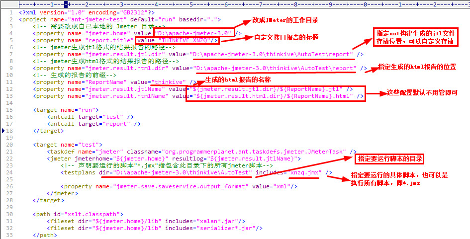
1.提示build.xml:2字节的UTF-8 序列的字节 2 无效，如图：
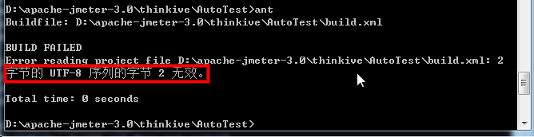
解决方案：
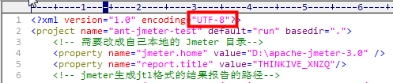
将build.xml默认配置中的字符编码UTF-8改成GB2312即可解决，同时报告标题也可以写中文

2、测试报告中三个指标为NaN。

这个问题也是一个坑，我找了好久才找到原因。

需要从Jmeter的lib包里把xalan-2.7.2.jar和serializer-2.7.2.jar copy到Ant的lib包里。

## 四、Ant构建运行脚本：

1、cmd进入脚本目录：E:\apache-jmeter-2.13\AutoTest。（即build.xml所在的目录）

2、输入：ant  或 ant run(run为build.xml中的task名)，执行结果：
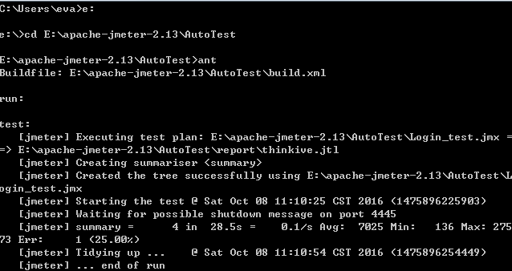
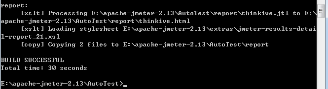
3、测试报告目录：E:\apache-jmeter-2.13\AutoTest\report
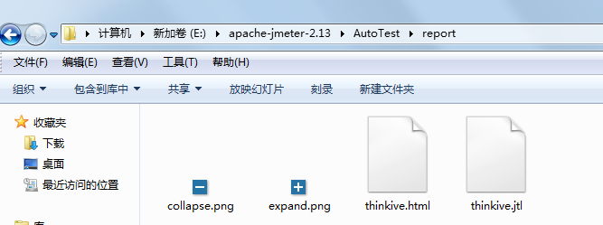
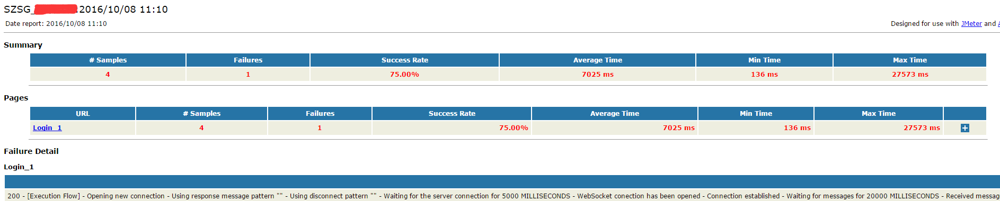
