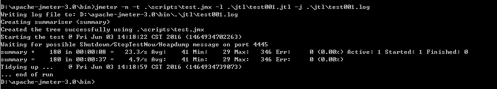
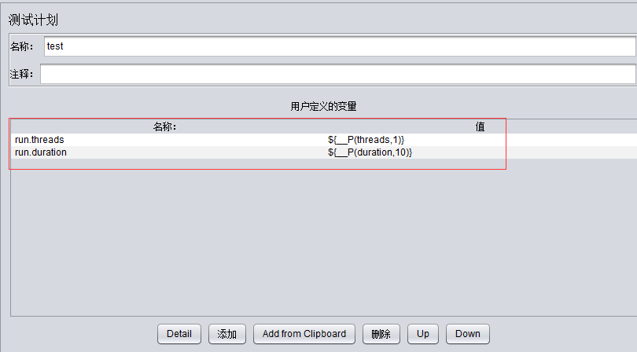
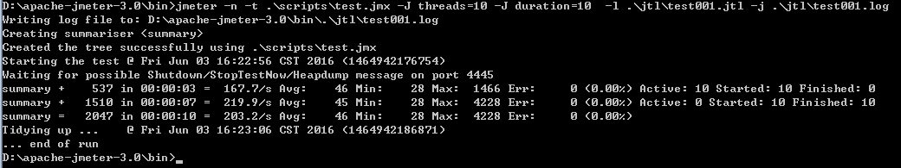

# Jmeter之Non-GUIMode

Jmeter是一个纯JAVA的应用，用GUI模式进行压力测试时，对客户端的资源消耗比较高，一般在进行正式的压测时使用Non-GUI模式运行。下面就来说说详细的使用。

1. 设置好JAVA_HOME，这个大家应该都知道的吧。 
2. 既然使用Non-GUI模式运行，那么就需要先了解下Non-GUI模式下的命令参数，下面是Non-GUI模式下常用的一些参数：
```
-n  This specifies JMeter is to run in non-gui mode
#以Non-GUI模式运行
-t  [name of JMX file that contains the Test Plan].
#要执行的JMeter脚本
-l  [name of JTL file to log sample results to].
#采样器的log文件，一般以.jtl结尾
-j  [name of JMeter run log file].
#指定记录JMeter log的文件，默认为bin目录下的jmeter.log。
-r  Run the test in the servers specified by the JMeter property "remote_hosts"
#启动远程server（在jmeter.properties中定义好的remote_hosts）
-R  [list of remote servers] Run the test in the specified remote servers
#启动远程server（如果使用此参数，将会忽略jmeter.properties中定义的remote_hosts）
-H  proxyHost <argument>    [proxy server hostname or ip address]
#代理服务器地址
-P  [proxy server port]
#代理服务器端口
-u  username <argument>  Set username for proxy server that JMeter is to use
 #代理服务器用户名
-a  password <argument>  Set password for proxy server that JMeter is to use
#代理服务器密码
-J  jmeterproperty <argument>=<value>    Define additional JMeter properties
#JMeter属性，Non_GUI模式时传入参数使用。
-L  loglevel <argument>=<value>        [category=]level e.g. jorphan=INFO or jmeter.util=DEBUG
#定义JMeter运行时的日志级别
-X  remoteexit        Exit the remote servers at end of test (non-GUI)
#测试结束后，退出（在Non-GUI模式下）
```

3. 了解以上参数后，就可以开始我们的Non-GUI模式的测试了。

开始—运行—cmd，进入到命令行模式；

cd到JMeter的bin目录下，（如果配置过JMeter的环境变量，在任意目录下都可以执行）； 

4. 执行命令：

`jmeter -n -t .\scripts\test.jmx -l .\jtl\test001.jtl -j .\jtl\test001.log`

这里是指定使用1个线程运行10s，执行结果：



以上，是不是很简单呢？ 

那么现在有这样一个问题：那如果要使用10个线程，执行10s，怎么操作呢？是不是需要修改脚本，然后再执行呢？如果还有更多场景，是不是每次都要修改脚本呢？ 

其实没这么麻烦，参数中有个 -J 参数【Non_GUI模式时传入参数使用】，我们可以使用这个参数来传参，详细步骤如下： 

    1. 参数化脚本中的Number of Threads(users)【线程数】和Durations(seconds)【持续时间（）秒】。 
    2. 我们在测试计划中添加如下参数：
    参数说明： ${__P(threads,1)} ，threads为执行脚本时传参的名称，1为默认值，如果threads为空的时候，取值1。格式一定是：${__P(参数名,默认值)}，注意中间是两个下划线。



执行脚本的时候传入参数，用 -J 参数名=value 的形式传入。

`jmeter -n -t .\scripts\test.jmx -J threads=10 -J duration=10  -l .\jtl\test001.jtl -j .\jtl\test001.log`

5. 执行结果： 

