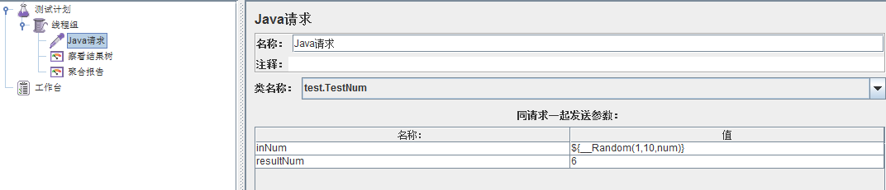
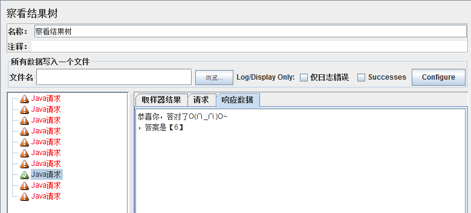
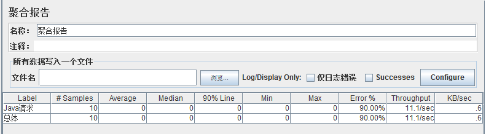

# Jmeter使用自定义编写代码

我们在做性能测试时,有时需要自己编写测试脚本,很多测试工具都支持自定义编写测试脚本,比如LoadRunner就有很多自定义脚本的协议,比如"C Vuser","Java Vuser"等协议。

同样,Jmeter也支持自定义编写的测试代码,不过与LoadRunner不同的是,Jmeter没有自带编译器,需要借助第三方编译器才能实现。

下面举一个简单的Java自定义测试代码例子,使用Java编译器编写测试代码(Java编译器可以用Eclipse,JBulider等),实现功能为:

***判断输入的数字是否等于你指定的数，如果等于，则返回成功，如果小于，则提示该输入数字太小，如果大于，则提示该数字太大，如果不为数字，提示输入数字。***

然后在放到Jmeter中模拟10个用户测试,同时运行这段代码,具体实现如下:

## 一、开始编写前的准备

1. 打开Java编译器，新建一个项目TestNumber，然后新建一个包test。
2. 从Jmeter的安装目录lib/ext中拷贝两个文件ApacheJMeter_core.jar和ApacheJMeter_java.jar到TestNumber项目中，然后引入这两个JAR包。
3. 在test包中新建一个类，类名为TestNum，该类继承AbstractJavaSamplerClient类，AbstractJavaSamplerClient存在于ApacheJMeter_java.jar这个JAR包中，引用即可调用。
4. TestNum类在继承AbstractJavaSamplerClient类的时候，需要实现四个方法，分别是
        setupTest()：初始化方法，用于初始化性能测试时的每个线程；
        getDefaultParameters()：主要用于设置传入的参数；
        runTest()：为性能测试时的线程运行体；
        teardownTest()：测试结束方法，用于结束性能测试中的每个线程。

## 二、具体的代码实现
```
package test;
  
  import org.apache.jmeter.config.Arguments;
  import org.apache.jmeter.protocol.java.sampler.AbstractJavaSamplerClient;
  import org.apache.jmeter.protocol.java.sampler.JavaSamplerContext;
  import org.apache.jmeter.samplers.SampleResult;
  
  public class TestNum extends AbstractJavaSamplerClient{
      
      private SampleResult results;
      
      /**
       * 输入的数字
       */
      private String inNum;
      
      /**
       * 需要匹配的数字
       */
      private String resultNum;
  
      /**
       * 初始化方法，初始化性能测试时的每个线程
       * 实际运行时每个线程仅执行一次，在测试方法运行前执行，类似于LoadRunner中的init方法
       */
      public void setupTest(JavaSamplerContext jsc) {
          results = new SampleResult();
          
          inNum = jsc.getParameter("inNum", "");
          resultNum = jsc.getParameter("resultNum", "");
          
          if (inNum != null && inNum.length() > 0){
              results.setSamplerData(inNum);
          }
          
          if (resultNum != null && resultNum.length() > 0){
              results.setSamplerData(resultNum);
          }
      }
      
      /**
       * 设置传入参数
       * 可以设置多个，已设置的参数会显示到Jmeter参数列表中
       */
      public Arguments getDefaultParameters() {
          Arguments params = new Arguments();
          params.addArgument("inNum","");
          params.addArgument("resultNum", "66");
          return params;
      }
  
      /**
       * 性能测试时的线程运行体
       * 测试执行的循环体，根据线程数和循环次数的不同可执行多次，类似于Loadrunner中的Action方法
       */
      public SampleResult runTest(JavaSamplerContext arg0) {
          boolean flag = false;
          //定义一个事务，表示这是事务的起始点，类似于Loadrunner中的lr.start_transaction
          results.sampleStart();
          
          for (int i = inNum.length();--i >= 0;){
              if (!Character.isDigit(inNum.charAt(i))){
                  flag = false;
              }else{
                  flag = true;
              }
          }
          
          for (int j = resultNum.length();--j >= 0;){
              if (!Character.isDigit(resultNum.charAt(j))){
                  flag = false;
              }else{
                  flag = true;
              }
          }
          //定义一个事务，表示这是事务的结束点，类似于Loadrunner中的lr.end_transaction
          results.sampleEnd();
          
          if (flag){
              Integer num = Integer.parseInt(inNum);
              Integer rsNum = Integer.parseInt(resultNum);
              
              if (num == rsNum){
                  results.setDataEncoding("UTF-8");//因为响应的数据有中文，所以最好先设置编码
                  results.setResponseData("恭喜你，答对了O(∩_∩)O~\n答案是【"+resultNum+"】");//响应数据，对应结果树，其他response code等可以自己点出来
                  results.setSuccessful(true);//告诉系统返回正确还是错误
              } else if (num > rsNum){
                  results.setDataEncoding("UTF-8");
                  results.setResponseData("好像大了点~~~~(>_<)~~~~ \n您输入的是【"+inNum+"】");
                  results.setSuccessful(false);
              }else {
                  results.setDataEncoding("UTF-8");
                  results.setResponseData("好像小了点~~~~(>_<)~~~~ \n您输入的是【"+inNum+"】");
                  results.setSuccessful(false);
              }
              
          }else{
              results.setDataEncoding("UTF-8");
              results.setResponseData("请输入数字：~~~~(>_<)~~~~ \n您输入的inNum是【"+inNum+"】，resultNum是【"+resultNum+"】");
              results.setSuccessful(false);
          }
          
          return results;
      }
  
      /**
       * 测试结束方法，结束测试中的每个线程
       * 实际运行时，每个线程仅执行一次，在测试方法运行结束后执行，类似于Loadrunner中的End方法
       */
      public void teardownTest(JavaSamplerContext arg0) {
      }
  
  }
```
## 三、Jmeter运行分析

1. 将上述代码打包成jar包，生成的包名称为TestNumber.jar，将jar包拷贝到Jmeter的安装目录lib/ext下面。
2. 运行Jmeter，添加线程组及java请求，显示如下：



其中，inNum为我们输入的值，因为需要用到多个用户，避免填写的麻烦，我们用随机数函数来随机抽取数字验证，resultNum为匹配的结果。
3. 添加监听器，这里我们添加查看结果树和聚合报告就好。
4. 结果显示如下图：

查看结果树：



我们可以看到，10个请求中，有一个请求回答正确，响应数据对应了我们的代码，表示执行成功。

聚合报告：



可以看到如上信息，请求用户为10个，因为我们的代码基本上没有任何含义，执行速度很快，所以其他值基本为0。

通过上面的例子我们可以发现,使用Jmeter自定义Java测试代码,配合Jmeter自带的函数,就可以实现出LoadRunner中"Java Vuser"协议的绝大多数功能,而且是没有用户数限制和完全免费的。

上面的例子非常简单,而且没有任何实际意义,只是一个简单的Jmeter测试代码示例,用于抛砖引玉,希望大家一起交流,共同 进步。
