# Jmeter压力测试简单教程

网上关于Jmeter的资料有很多但是大多千篇一律，要么简单弄个页面测试一下，要么全篇都是介绍很多和Jmeter无关的第三方工具，看起来很专业高深，但是作为测试小白来说，看到这样的东西确实头疼。我只是想好好了解一下Jmeter的使用啊，能不能完整的介绍一下啊？我不需要了解那么多其他的第三方工具啊？能不能截个图说的清楚一点啊？这个步骤里的参数是干嘛的啊？对应的什么啊？你的这一步我怎么出现问题了啊？怎么不说解决方法啊。。。这应该是我前段时间查找Jmeter资料内心最多的问题了，真是哔了狗了（我是一个优雅的程序猿，很少讲粗话啦~嘿嘿）。对于使用某种新的东西，我的习惯往往是先把流程完整的跑一遍，记住，是完整，清晰，好歹别人看了之后对应着自己的需求也能照搬着实现，吐槽了够多了，开始进入正题，我把我遇到的坑都说清楚，包括后来怎么从坑里爬出来的。。。

## 步骤一  安装Jmeter
我用的版本是3.1版本，为什么是3.1，因为3.2有问题，我也是跑了一段时间后才知道3.2版本太新了还是什么的，有些功能就是不行，在此建议大家，不要轻易使用最新版本，次新版本就可以了。安装好了之后Jmeter的bin目录下有个Jmeter.bat文件，双击就能运行了。

**注：最新的版本5.1.1，在请求报文过长时，例如请求中需要以流方式传输图片时，会出现结果树中的请求点击无反应的情况，更换为3.\*版本即可**

## 步骤二  使用Jmeter测试未登录页面

运行软件之后，我们当然要找个链接测试一下啦，这里我们以百度为例

我们右击“测试计划”——“添加”——“Threads(Users)——线程组”，这样就建了一个线程组了，这是干嘛，当然是跑线程用的啊。

有了线程组之后，我们再右击线程组，“添加”——“配置元件”——“http请求默认值”，这个默认值是干嘛的？里面可以设置一些常用的默认的设置（这不是废话嘛~）。

在http请求默认值面板里面，我们可以输入要测试的服务器的IP或者域名，这里我们输入“www.baidu.com”，协议是“https”。

你要测试的网址如果是http开头那就填“http”，其他默认不管了，这时候点击左上角保存会弹出一个保存框，这是让你保存你现在所做的测试配置，以后需要再测试的话的直接打开保存的jmx文件就行了。

保存完了之后，我们再右击“线程组”——“添加”——“Sampler”——“http请求”，哎，刚刚不是添加过了吗？刚刚那个不是哦，刚刚那个只是默认值，只是用来设置一些默认配置，真正发起请求的是“http请求”。

在http请求里面我们在“路径”里面输入斜杠“/”就行啦，表示默认路径，IP那一栏就不用输入了，为什么呢？因为在http请求默认值里面已经输过啦，以后可以新建多个http请求，只要修改路径就行了，这样就可以访问同一个网站的不同页面，这就是“http请求默认值”的意义所在，把一些共用的设置写一遍就好了。

接着，我们再右击“线程组”——“添加”——“监听器”——“察看结果数”，在这里可以查看到http请求和结果。每次新建组件和修改配置信息都要点击保存。

好了，页面配置图如下所示：

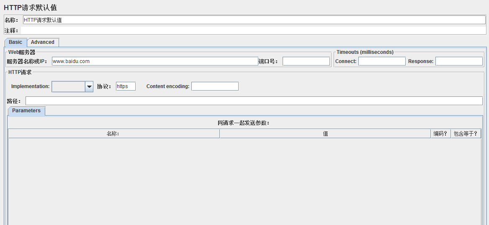
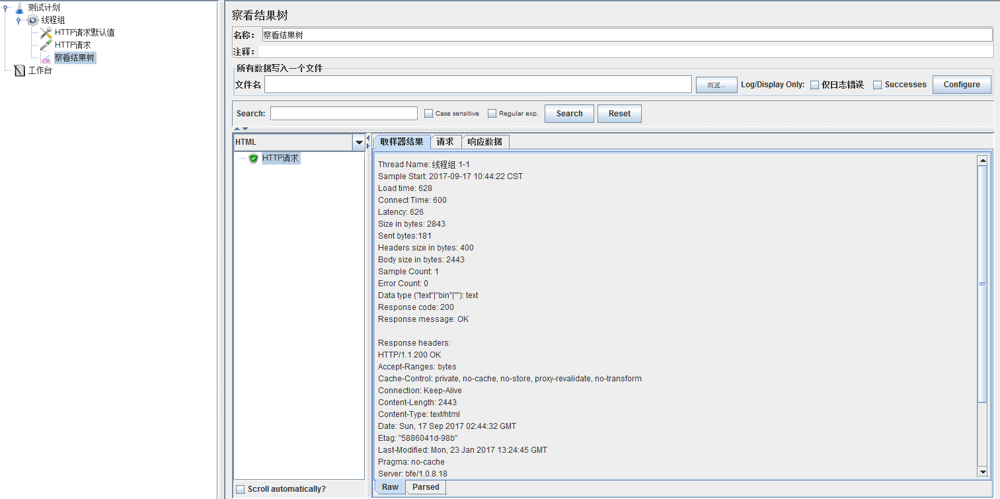
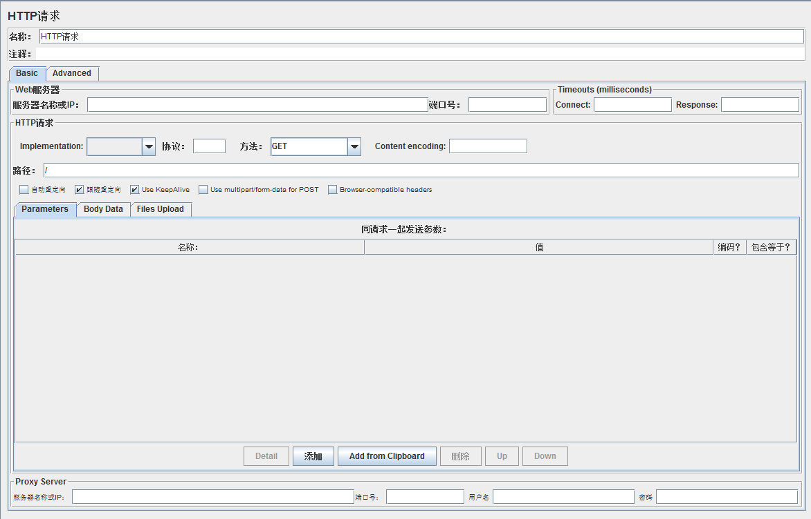

现在我们点击工具栏的绿色运行按钮，就可以在“察看结果树”中看到结果了

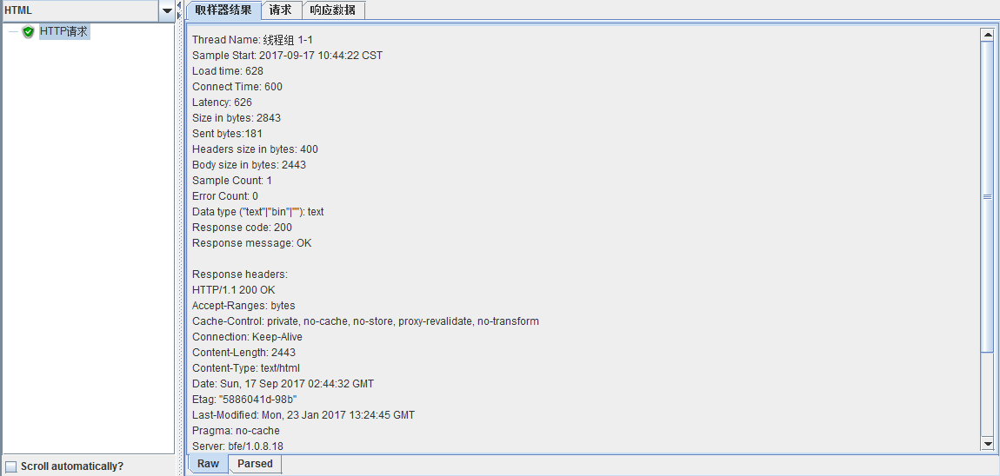

我们新建的“http请求”返回结果200，表明请求成功，从绿色打钩也能看出，上图中的下拉列表框可以选择显示格式，我们选择HTML，切换到“响应数据”就可以看到返回页面，也就是百度首页。

## 步骤三  设置线程并发数

我们点击“线程组”可以看到线程组的设置页面，默认设置1个线程，1秒启动，循环1次。

线程数表示启动多少个线程，Ramp-Up Period表示花多长时间启动所有线程，循环次数表示每个线程的执行次数。

例如，我设置线程数10，Ramp-Up Period为10，循环次数2，表示软件将在10秒内启动10个线程，也就是1秒启动1个线程，每个线程执行两次请求。

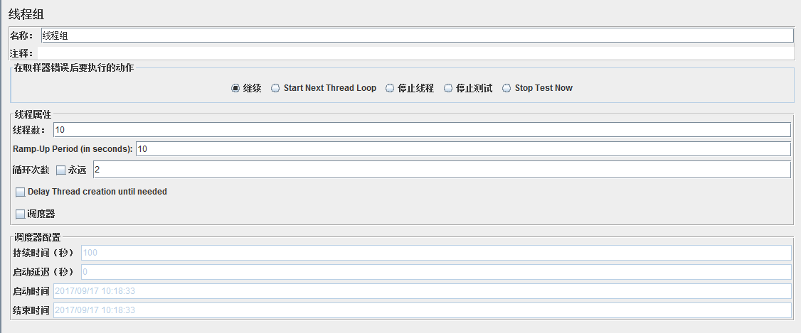

还可以勾选“调度器”，比如填入持续时间100，启动延迟0，将循环次数勾选“永远”，表示线程立即启动，执行100秒后停止。

注意，如果设置了持续时间和启动延迟，那么下面的启动时间和结束时间就不起作用了，也就不用管了，点击运行即可。

## 步骤四  设置其他监听器

之前我们仅仅设置了“察看结果树”这个监听器，我们右击“线程组”——“添加”——“监听器”，里面有好多监听器可供选择。

比如图形结果，用表格查看结果，聚合报告等等，这些都是反映测试过程的指标数据。

图形结果以图形的形式显示吞吐量、偏移、平均值等信息，表格结果显示每一次请求的时间，返回，发送字节数，连接时间等等，聚合报告里面显示总体请求的吞吐量，错误率等等。下图为表格结果的样式。

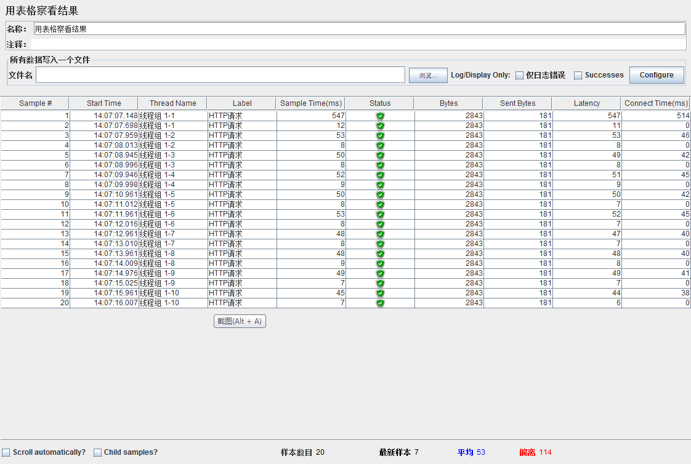

可以看出，图中显示了20个Http请求，分别由10个线程执行，每个线程执行两次，正好符合我们对于线程组的设置。

图中每一列的含义分别表示请求序号，开始时间，线程序号，请求名，请求所花的时间，请求状态，请求字节数，发送字节数，等待时长，连接时间。

聚合报告如下图所示，每一列的含义分别表示请求名称，请求总数，请求的平均响应时间（毫秒），50%的请求的响应时间，90%的请求的响应时间，95%的请求的响应时间，99%的请求的响应时间，最小的响应时间，最大的响应时间，错误的请求率（错误请求数/总的请求数），吞吐量（每秒处理的请求数），接收的字节速率，发送的字节速率。

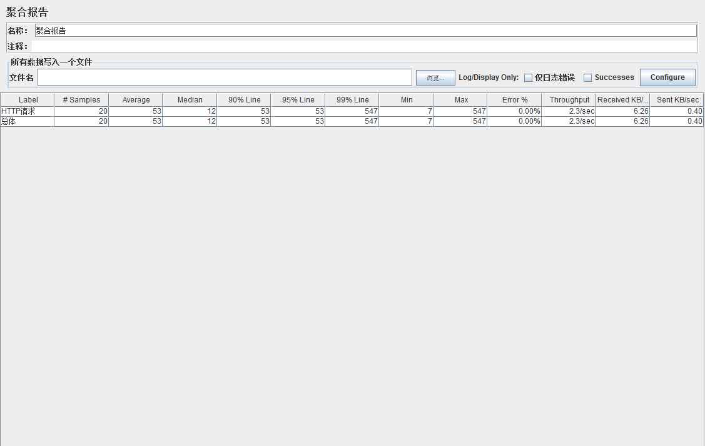

## 步骤五  登录测试

前面我们测试的页面是不需要登录的，现在我们来测试一下登录操作，由于登录操作涉及到具体的内部网址和参数，我这里就用一般网址和参数代替，但是方法是一样的，例如，我们内网IP是1.1.1.1，登录页面是1.1.1.1/login.do，我们将1.1.1.1填入“http请求默认值”，将/login.do填入“http请求”的路径里面，关于登录需要的参数我要特别说明一下，一般来说就是用户名和密码，但是往往还需要其他参数，我们可以通过抓包工具Fiddler进行抓包，我们在网站中进行一次正常登录，可以在Fiddler中看到登录需要的post参数，例如Fiddler中显示登录操作post参数有username,password,type，那么需要在“http请求”里面填入，下图所示。

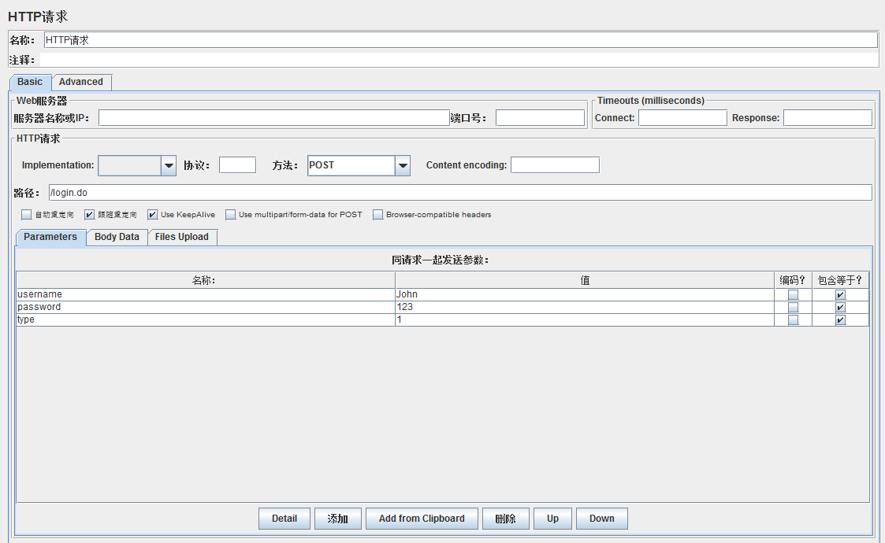

点击“添加”按钮就可以添加参数了，保存好后，我们点击运行，就可以在察看结果树中看到登录成功后的页面了，具体的操作和前面一样的。

## 步骤六  会话保持

我们进入登录后的页面后，我还想访问例如“我的账户”，“我的信息”等模块怎么办，这些网页需要登录成功后才能访问到，这里我们就需要进行会话的保持，我们右击“线程组”——“添加”——“配置元件”——“httpcookie管理器”，要添加的内容我们可以在察看结果树的“请求”选项卡里面看到，里面可以看到登录需要的cookie，例如JSESSIONID，我们将JSESSIONID填入cookie管理器的参数里面，如下

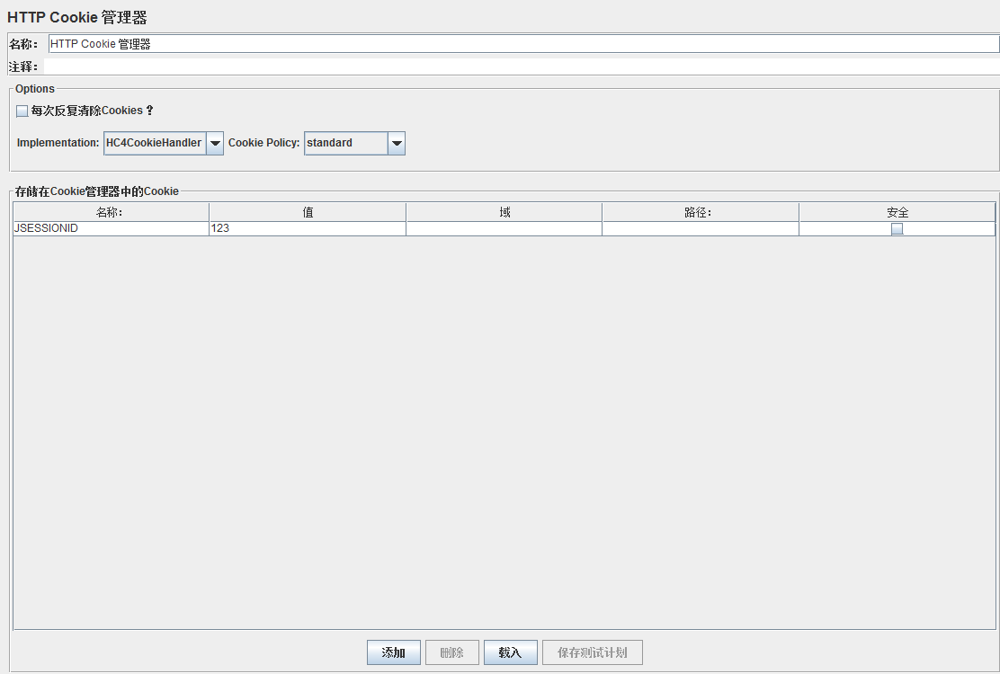

此时，我们在http请求里面输入登录后的页面网址，例如“我的信息”等等，就可以请求成功啦。

## 步骤七  文件读取网址

我们在“http请求”的路径里面填入的是我们要访问的网页，每次只能填一个，假如我想访问好几个网页，例如首页，通知页，公司介绍页等等，除了新建http请求外，我们还可以将这些网页的地址存储在TXT文件里，例如，我要访问1.1.1.1/index.do，1.1.1.1/information.do，1.1.1.1/company.do，我们可以这样

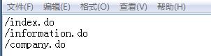

网址填入后，我们在Jmeter里面的“选项”——“函数助手对话框”——“StringFromFile”，将TXT的完整路径贴到图中位置，点击生成，可以在框里生成TXT文件的读取路径。

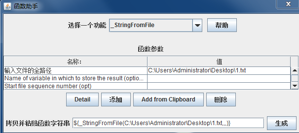

我们将$开头的那串路径贴到“http请求”的路径里面，就可以访问到TXT里面的所有网页啦，如图所示。

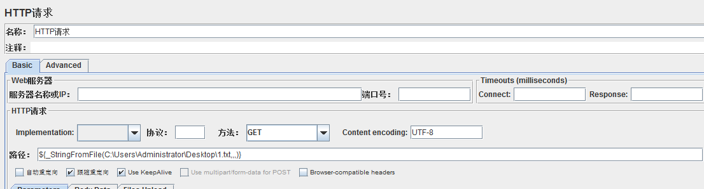

## 步骤八  服务器状态实时监听

上面我们介绍了几个Jmeter自带的监听器，不知你是否感觉到有一点点无力，因为里面显示的指标好像都不是你特别需要的，至少对于我来说，我更关心我的请求执行过程中服务器状态的改变，例如CPU，内存，磁盘，网络，TPS，响应时间图等等，因为这才是压力测试的目的所在，服务器状态随着请求增加的变化曲线才是我们更加需要看到的。想看到服务器变化的曲线图，我们需要下载JMeterPlugins-Extras.jar和JMeterPlugins-Standard.jar，将这两个jar包放入Jmeter的安装路径下的lib/ext/下面，重启Jmeter后，右击“线程组”——“添加”——“监听器”，我们可以看到多了好多监听器，大多数以“jp@gc”开头的监听器，我们选择“PerfMon Metrics Collector”，里面将会显示服务器的状态信息，现在还看不到，为什么，因为要测试的服务器需要安装一个包，叫ServerAgent.zip，比如我的服务器是linux，我们将ServerAgent在服务器中解压，运行里面的startAgent.sh就可以啦，启动起来后可以看到如下

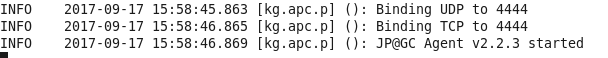

默认端口是4444，在这里我要插一句，我当时运行后通过Telnet始终ping不到4444端口导致显示不了，后来改成4445端口启动就可以了。

具体的服务器命令是ServerAgent-2.2.3/startAgent.sh--udp-port 4445 --tcp-port 4445，这样就表示将serverAgent在4445端口启动，你可以将4445换成其他端口，如果默认的4444端口不行的小伙伴可以试试其他端口哦。

好了，我们回到Jmeter软件，按下图填入服务器的地址和端口号，以及需要监控的硬件，如CPU，内存，磁盘，网络等等。

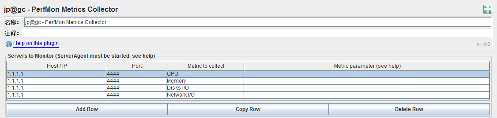

好了，我们点击运行，可以在chart下看到服务器的状态变化曲线啦。

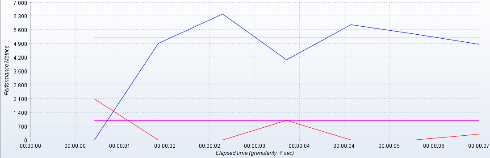

怎么样，是你想要的吧，其实监听器里面还有很多其他的曲线，看英文就知道，比如TPS曲线，响应时间曲线等等，这些你都可以自己添加，我就不赘述啦。