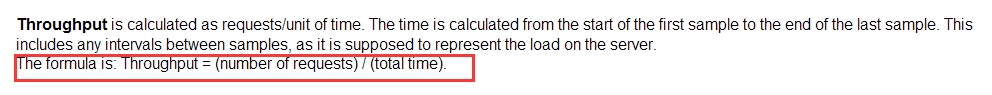
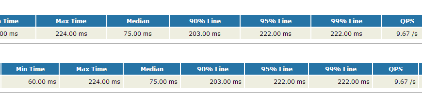

# Jmeter和Ant的html报告优化及DashboardReport介绍

通过Ant可以很方便的build执行Jmeter的jmx脚本，并且输出html报告，靠的就是Jmeter的xsl template模板，具体在build.xml是这样对jmeter-results-detail-report_21.xsl进行调用：
```
<target name="xslt-report" depends="_message_xalan">
        <tstamp><format property="report.datestamp" pattern="yyyy/MM/dd HH:mm"/></tstamp>
        <xslt
            classpathref="xslt.classpath"
            force="true"
            in="${testpath}/report/jtl/${test}${time}.jtl"
            out="${testpath}/report/html/${test}${time}.html"
            style="${jmeter.home}/extras/jmeter-results-detail-report${style_version}.xsl">
            <param name="showData" expression="${show-data}"/>
            <param name="titleReport" expression="${report.title}"/>
            <param name="dateReport" expression="${report.datestamp}"/>
        </xslt>
</target>
```
## 90% Line Time

默认调用的jmeter-results-detail-report_21.xsl报告模板是不带有90% Line时间的，以下是生成的报告样例：

我们可以动手进行一些改造，首先我们需要明白2个原理：
- （1）90% Line的意思是：一组数由小到大进行排列，找到它的第90%个数；
- （2）Jmeter html报告生成是使用xxx.jtl文件通过xsl模板生成的，因此要在html报告中显示90% line，就需要修改xsl模板文件（jmeter-results-detail-report_21.xsl）

下面开始改造：
- 1、第一步就是在jmeter-results-detail-report_21.xsl添加xsl template，可以模拟Max Time模板（对比<xsl:template name="max">），直接在max模板下新建一个line模板，如下：
```
<!-- New add 90% line -->
<xsl:template name="line">
    <xsl:param name="nodes" select="/.." />
    <xsl:choose>
        <xsl:when test="not($nodes)">NaN</xsl:when>
        <xsl:otherwise>
            <xsl:for-each select="$nodes">
                <xsl:sort data-type="number" />
                <xsl:if test="position() = floor(last()*0.9)">
                    <xsl:value-of select="number(.)" />
                </xsl:if>
            </xsl:for-each>
        </xsl:otherwise>
    </xsl:choose>
</xsl:template>
```
这里需要注意的是：
  - （1）与max模板的区别就是sort方面，直接用顺序<xsl:sort data-type="number" />，而max模板用的是倒序<xsl:sort data-type="number" order="descending" />。为什么不能倒序，是由下面第（2）条决定的。
  - （2）position() = floor(last()*0.9)，其中last()返回当前上下文中的最后一个节点位置数，乘以0.9表示找到第90%个；floor(number) 表示返回不大于number的最大整数。
  - （3）number(object)使对象转换成数字。
- 2、有了以上的的90% Line模板，我们可以直接引用了。在Summary中添加90% Line。
```
<xsl:template name="summary">
	<h2>Summary</h2>
	<table align="center" class="details" border="0" cellpadding="5" cellspacing="2" width="95%">
		.........该处为一堆省略不显示的代码...........
			<xsl:variable name="allMaxTime">
				<xsl:call-template name="max">
					<xsl:with-param name="nodes" select="/testResults/*/@t" />
				</xsl:call-template>
			</xsl:variable>
			<!-- 以下New add 90% line -->
			<xsl:variable name="allLineTime">
    				<xsl:call-template name="line">
        				<xsl:with-param name="nodes" select="/testResults/*/@t" />
    				</xsl:call-template>
			</xsl:variable>
			<xsl:attribute name="class">
				<xsl:choose>
					<xsl:when test="$allFailureCount > 0">Failure</xsl:when>
				</xsl:choose>
			</xsl:attribute>
			.........该处为一堆省略不显示的代码...........
			<td align="center">
				<xsl:call-template name="display-time">
					<xsl:with-param name="value" select="$allMaxTime" />
				</xsl:call-template>
			</td>
			<!-- 以下添加 90% line 显示列-->
			<td align="center">
				<xsl:call-template name="display-time">
					<xsl:with-param name="value" select="$allLineTime" />
				</xsl:call-template>
			</td>
		</tr>
	</table>
</xsl:template>
```
- 3、在pagelist中添加90% Line
```
<xsl:template name="pagelist">
	<h2>Pages</h2>
	<table align="center" class="details" border="0" cellpadding="5" cellspacing="2" width="95%">
		.........该处为一堆省略不显示的代码...........
			<xsl:variable name="maxTime">
				<xsl:call-template name="max">
					<xsl:with-param name="nodes" select="../*[@lb = current()/@lb]/@t" />
				</xsl:call-template>
			</xsl:variable>
			<!-- 以下添加 90% line 节点-->
			<xsl:variable name="lineTime">
				<xsl:call-template name="line">
					<xsl:with-param name="nodes" select="../*[@lb = current()/@lb]/@t" />
				</xsl:call-template>
			</xsl:variable>
			<tr valign="top">
				.........该处为一堆省略不显示的代码...........
				<td align="right">
					<xsl:call-template name="display-time">
						<xsl:with-param name="value" select="$maxTime" />
					</xsl:call-template>
				</td>
				<!-- 以下添加 90% line 显示列-->
				<td align="right">
					<xsl:call-template name="display-time">
						<xsl:with-param name="value" select="$lineTime" />
					</xsl:call-template>
				</td>
				.........该处为一堆省略不显示的代码...........
                        </tr>
			
		</xsl:for-each>
	</table>
</xsl:template>
```
好了，这样就算修改完了，只要不出现手抖犯的错误，下面我们就能在报告中看到90% Line时间的列了，而且显示的时间跟Jmeter中聚合报告显示的是基本吻合的。

通过以上的过程，我们发现还可继续扩展在html报告中显示95%，99%等时间及其他指标。

## QPS扩展
Jmeter的具合报告有Throughput这个值，这个在loadrunner中是表示为吞吐量的，这里可以表示QPS或者TPS（在使用了事务的情况下），个人把这个称为QPS，因为更直观。

和%90Line同样的道理，首先必须知道这个值是怎么计算出来，经过查找资料和官网的比较，发现这个值是通过如下的公式计算出来的：

官网的截图：

Throughput = (number of requests) / (total time) 

total time = 测试结束时间 - 测试开始时间 

测试结束时间 = MAX(请求开始时间 + Elapsed Time) 

测试开始时间 = MIN(请求开始时间) 

知道了公式，那么计算就容易了，以下是关键代码：
```
<xsl:variable name="nodeThroughput">
       <xsl:call-template name="throughput">
             <xsl:with-param name="nodes" select="/testResults/*/@ts" />
             <xsl:with-param name="count" select="$allTpCount" />
       </xsl:call-template>
</xsl:variable>
```
说明：allTpCount = count(/testResults/*/@ts) div ($allTotalTime div 1000)
扩展后的结果如下：

## 吞吐量扩展
在loadrunner中吞吐量就是Throughput，在Jmeter的聚合报告中最后一列的值就是loadrunner中的Throughput，为了便于区分，我把这里的值称为Throughput，也就是吞吐量。

经过查找资料发现吞吐量的计算和QPS的计算公式是一样的，因为也就是如下的公式：

Throughput = (请求的总字节数) / (total time)

这里的total time计算和QPS是一样的，而总字节数直接把所有请求的加起来即可，关键代码如下：
```
<xsl:variable name="nodeKB">
      <xsl:call-template name="throughput">
             <xsl:with-param name="nodes" select="/testResults/*/@ts" />
             <xsl:with-param name="count" select="sum(/testResults/*/@by) div 1024" />
      </xsl:call-template>
</xsl:variable>
```
因为这里显示的字节，最后的结果我打算以KB的单位显示，因此这里需要除以1024，扩展后的结果如下：

## TPS扩展
TPS在Jmeter中虽然某些情况和QPS是一致的，但是还是有不一致的地方，因此这里也需要扩展，这样的结果看着更清晰明了。

首先和其他的参数扩展一样，需要知道计算公式，这里的计算公式和QPS也是一样的，只是数据的集合不一样，以下是扩展后的效果。

在扩展的过程中进一步发现Jmeter的聚合结果中最后的”总体“一行在某些情况下计算的数值是不准确的。如果脚本中不包含事务，那么这里的结果是准确的，如果都包含事务并且把Generate parent sample选中后这里的结果也是准确的，在脚本中有事务并且没有选中Generate parent sample，或者有些有事务有些没有时，这时的结果就不准确了，因为查看计算方式发现它把所有的请求都算进去了。

比如，一个jtl文件中即包含HTTP请求也包含事务，因为事务只是对之前请求的一个统计，本身是不发送请求的，所以计算总的吞吐量、QPS，TPS时是不能这么算的。

所以在扩展的过程中分成了两个样式表，一个样式表处理包含事务，或者没有事务的情况，这时的结果以QPS衡量；一个样式表处理全都是事务的情况，这时候的结果以TPS衡量，这样就准确了。

测试：扩展了好几个指标，这些指标的正确性如何呢？需要在多种情况下进行测试，经过测试后各个指标都是正确的。但是还没有在大的数据量级别下测试，本身这个基于Ant通过xls模块生成的报告适合接口测试或是小规模测试，而专门的性能测试还是推荐用Jmeter自带的Dashboard。

## Jmeter Dashboard

从Jmeter3.0开始就有了强大的CSV生成Html Dashboard报告的功能（很多人可能不知道），生成报告的方法也很简单：

在jmeter.properties或者user.properties确认如下配置项：
```
jmeter.save.saveservice.data_type=true
jmeter.save.saveservice.label=true
jmeter.save.saveservice.response_code=true
jmeter.save.saveservice.response_data.on_error=true
jmeter.save.saveservice.response_message=true
jmeter.save.saveservice.successful=true
jmeter.save.saveservice.thread_name=true
jmeter.save.saveservice.time=true
jmeter.save.saveservice.subresults=true
jmeter.save.saveservice.assertions=true
jmeter.save.saveservice.latency=true
jmeter.save.saveservice.connect_time=true
jmeter.save.saveservice.bytes=true
jmeter.save.saveservice.sent_bytes=true
jmeter.save.saveservice.thread_counts=true
jmeter.save.saveservice.idle_time=true
# Timestamp format - this only affects CSV output files
# legitimate values: none, ms, or a format suitable for SimpleDateFormat
jmeter.save.saveservice.timestamp_format=ms
jmeter.save.saveservice.timestamp_format=yyyy/MM/dd HH:mm:ss.SSS
```
如果希望在Errors报告中展示更详细数据，需要确保如下配置：
```
jmeter.save.saveservice.assertion_results_failure_message = true
```
如果使用了事务控制器(Transaction Controller)，确认Generate parent sample为未勾选状态。

以下是生成报告的方式：

### a. 在压力测试结束时报告
基本命令格式：
```
jmeter -n -t <test JMX file> -l <test log file> -e -o <Path to output folder>
```
样例：
```
jmeter -n -t F:\PerformanceTest\TestCase\script\rfApp接口.jmx -l testLogFile -e -o ./output
```
### b. 使用已有的压力测试CSV日志文件生成报告
基本命令格式：
```
jmeter -g <log file> -o <Path to output folder>
```
样例：
```
jmeter -g <log file> -o <Path to output folder>
```
当然也可以把相关命令放到bat或sh中做成批处理直接执行（CSV文件带上时间后缀，避免冲突），可以用相对路径来调用jmx脚本，并输出相对路径的CSV文件和html报告文件（需要说明一下html报告的文件夹不能先创建，否则报冲突，测试前可以加个清空文件夹的动作或者加个时间后缀让目录唯一）。

如以下命令（用以上xls报告一样的脚本测试）：
```
@echo off
set a=%time:~0,2%%time:~3,2%%time:~6,2%
set b=0%time:~1,1%%time:~3,2%%time:~6,2%
if %time:~0,2% leq 9 (set c=%b%)else set c=%a%
jmeterHome3.1\bin\jmeter -n -t rfApp接口.jmx -l DashReport\log-%Date:~0,4%%Date:~5,2%%Date:~8,2%%c%.csv -e -o DashReport\htmlReport-%Date:~5,2%%Date:~8,2%%c%
pause
```
产生的文件：

顺便再提供一份Linux版的Shell命令以供参考：
```
#!/bin/bash
Cur_Dir=$(cd "$(dirname "$0")"; pwd)
$Cur_Dir/jmeterHome3.2/bin/jmeter -n -t $Cur_Dir/rfAppTest.jmx -l $Cur_Dir/DashReport/log-$(date -d "today" +"%Y%m%d%H%M%S").csv -e -o $Cur_Dir/DashReport/htmlReport-$(date -d "today" +"%m%d%H%M%S")
```
最后上一下生成的报告，看着还是比较高大上的：


最后再提供一下Jmeter生成html报告的命令参数说明：

- -h 帮助 -> 打印出有用的信息并退出
- -n 非 GUI 模式 -> 在非 GUI 模式下运行 JMeter
- -t 测试文件 -> 要运行的 JMeter 测试脚本文件
- -l 日志文件 -> 记录结果的文件
- -r 远程执行 -> 启动all远程服务
- -R 远程执行 -> 启动指定远程服务
- -H 代理主机 -> 设置 JMeter 使用的代理主机
- -P 代理端口 -> 设置 JMeter 使用的代理主机的端口号
- -e 测试结束后，生成测试报告
- -o 指定测试报告的存放位置
