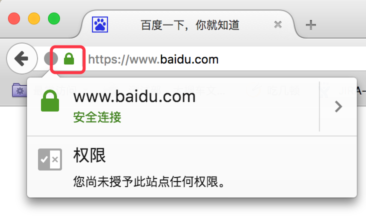
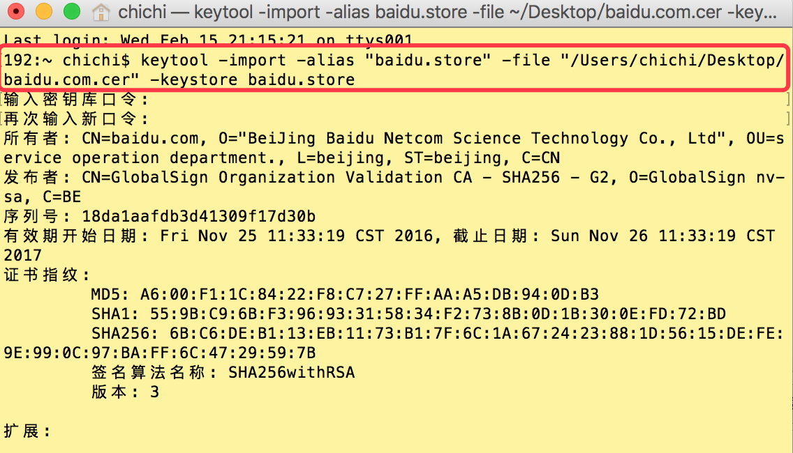
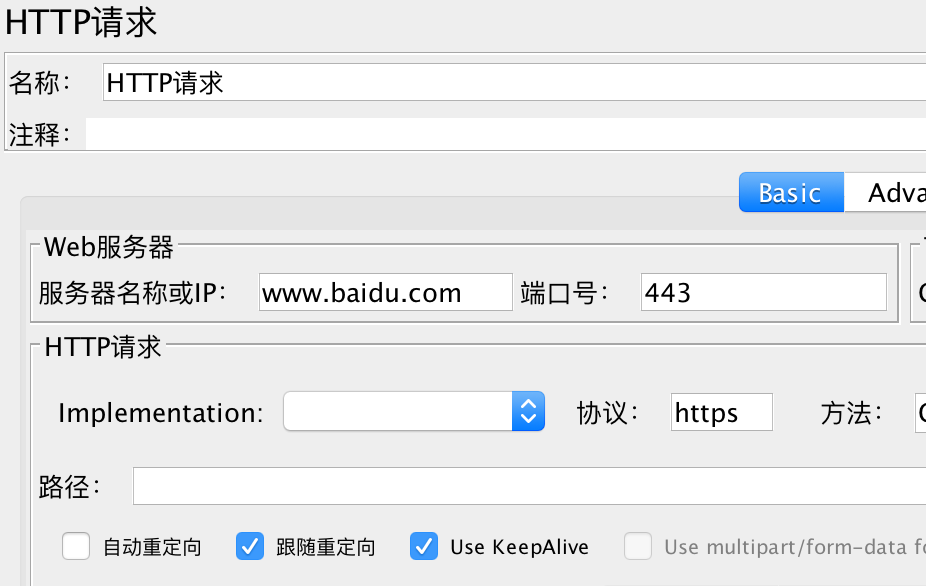
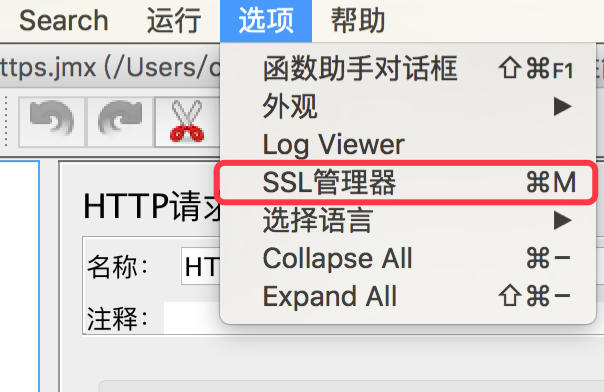
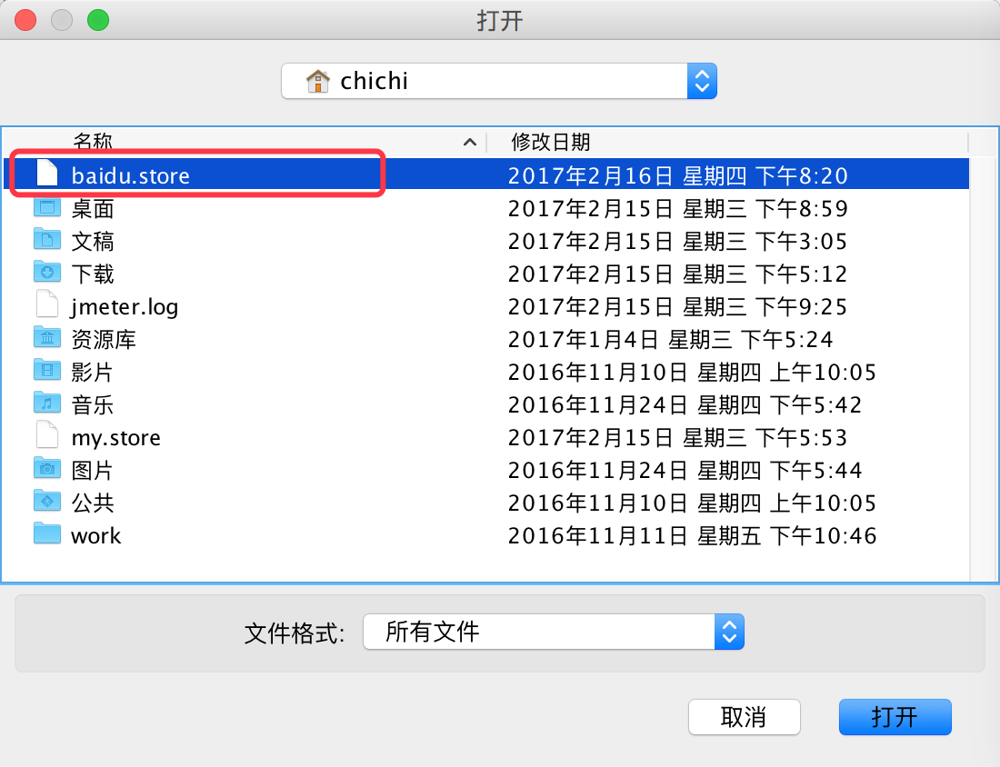

# Jmeter进行https协议的压测

## 一、HTTPS和HTTP的区别

超文本传输协议HTTP协议被用于在Web浏览器和网站服务器之间传递信息。HTTP协议以明文方式发送内容，不提供任何方式的数据加密，如果攻击者截取了Web浏览器和网站服务器之间的传输报文，就可以直接读懂其中的信息，因此HTTP协议不适合传输一些敏感信息，比如信用卡号、密码等。

为了解决HTTP协议的这一缺陷，需要使用另一种协议：安全套接字层超文本传输协议HTTPS。为了数据传输的安全，HTTPS在HTTP的基础上加入了SSL协议，SSL依靠证书来验证服务器的身份，并为浏览器和服务器之间的通信加密。

HTTPS和HTTP的区别主要为以下四点：

1. https协议需要到ca申请证书，一般免费证书很少，需要交费。
2. http是超文本传输协议，信息是明文传输，https 则是具有安全性的ssl加密传输协议。
3. http和https使用的是完全不同的连接方式，用的端口也不一样，前者是80，后者是443。
4. http的连接很简单，是无状态的；HTTPS协议是由SSL+HTTP协议构建的可进行加密传输、身份认证的网络，比http协议安全。

## 二、 方法

1.安全连接—更多信息—查看证书—详细信息—导出证书

2.生成.cer后缀的文件

3.把导出的证书转换成.store格式的文件
输入密码-添加信任

`keytool -import -alias "test.store" -file "test.cer" -keystore test.store`

4.在jmeter中端口号输入443，协议输入https

5.在ssl管理器中添加证书

6.调试脚本，运行场景，开始执行测试。