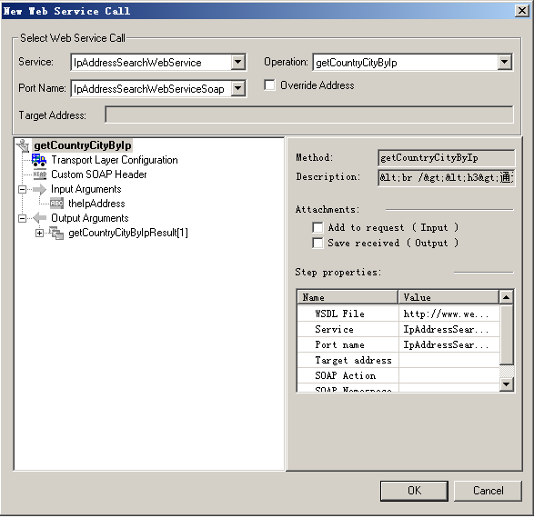

[TOC]

# LR测试脚本开发WebService

## 常用的调试工具

- WebService：SoapUI
- Http：Postman、Jmeter、Postwoman、Fiddler、Charles
- TCP：WireShark
- Socket：SocketTool（可以使用LR直接进行录制）

## WebService协议

### 什么是WebService

简书：


百度百科：


CSDN：


XML百度百科：


#### WebService到底是什么

　　一言以蔽之：WebService是一种跨编程语言和跨操作系统平台的远程调用技术。

　　所谓跨编程语言和跨操作平台，就是说服务端程序采用java编写，客户端程序则可以采用其他编程语言编写，反之亦然！跨操作系统平台则是指服务端程序和客户端程序可以在不同的操作系统上运行。

　　所谓远程调用，就是一台计算机a上 的一个程序可以调用到另外一台计算机b上的一个对象的方法，譬如，银联提供给商场的pos刷卡系统，商场的POS机转账调用的转账方法的代码其实是跑在银 行服务器上。再比如，amazon，天气预报系统，淘宝网，校内网，百度等把自己的系统服务以webservice服务的形式暴露出来，让第三方网站和程 序可以调用这些服务功能，这样扩展了自己系统的市场占有率，往大的概念上吹，就是所谓的SOA应用。

　　其实可以从多个角度来理解 WebService，从表面上看，WebService就是一个应用程序向外界暴露出一个能通过Web进行调用的API，也就是说能用编程的方法通过 Web来调用这个应用程序。我们把调用这个WebService的应用程序叫做客户端，而把提供这个WebService的应用程序叫做服务端。从深层次 看，WebService是建立可互操作的分布式应用程序的新平台，是一个平台，是一套标准。它定义了应用程序如何在Web上实现互操作性，你可以用任何 你喜欢的语言，在任何你喜欢的平台上写Web service ，只要我们可以通过Web service标准对这些服务进行查询和访问。 

　　WebService平台需要一套协议来实现分布式应用程序的创建。任何平台都有它的数据表示方法和类型系统。要实现互操作性，WebService平台 必须提供一套标准的类型系统，用于沟通不同平台、编程语言和组件模型中的不同类型系统。Web service平台必须提供一种标准来描述 Web service，让客户可以得到足够的信息来调用这个Web service。最后，我们还必须有一种方法来对这个Web service进行远 程调用,这种方法实际是一种远程过程调用协议(RPC)。为了达到互操作性，这种RPC协议还必须与平台和编程语言无关。

### WebService平台技术
  XML+XSD,SOAP和WSDL就是构成WebService平台的三大技术。

#### XML+XSD

　　WebService采用HTTP协议传输数据，采用XML格式封装数据（即XML中说明调用远程服务对象的哪个方法，传递的参数是什么，以及服务对象的 返回结果是什么）。XML是WebService平台中表示数据的格式。除了易于建立和易于分析外，XML主要的优点在于它既是平台无关的，又是厂商无关 的。无关性是比技术优越性更重要的：软件厂商是不会选择一个由竞争对手所发明的技术的。 

　　XML解决了数据表示的问题，但它没有定义一套标准的数据类型，更没有说怎么去扩展这套数据类型。例如，整形数到底代表什么？16位，32位，64位？这 些细节对实现互操作性很重要。XML Schema(XSD)就是专门解决这个问题的一套标准。它定义了一套标准的数据类型，并给出了一种语言来扩展这套数据类型。WebService平台就 是用XSD来作为其数据类型系统的。当你用某种语言(如VB.NET或C#)来构造一个Web service时，为了符合WebService标准，所 有你使用的数据类型都必须被转换为XSD类型。你用的工具可能已经自动帮你完成了这个转换，但你很可能会根据你的需要修改一下转换过程。

#### SOAP

   WebService通过HTTP协议发送请求和接收结果时，发送的请求内容和结果内容都采用XML格式封装，并增加了一些特定的HTTP消息头，以说明 HTTP消息的内容格式，这些特定的HTTP消息头和XML内容格式就是SOAP协议。SOAP提供了标准的RPC方法来调用Web Service。

  SOAP协议 = HTTP协议 + XML数据格式

  SOAP协议定义了SOAP消息的格式，SOAP协议是基于HTTP协议的，SOAP也是基于XML和XSD的，XML是SOAP的数据编码方式。打个比 喻：HTTP就是普通公路，XML就是中间的绿色隔离带和两边的防护栏，SOAP就是普通公路经过加隔离带和防护栏改造过的高速公路。

#### WSDL

　　好比我们去商店买东西，首先要知道商店里有什么东西可买，然后再来购买，商家的做法就是张贴广告海报。 WebService也一样，WebService客户端要调用一个WebService服务，首先要有知道这个服务的地址在哪，以及这个服务里有什么方 法可以调用，所以，WebService务器端首先要通过一个WSDL文件来说明自己家里有啥服务可以对外调用，服务是什么（服务中有哪些方法，方法接受 的参数是什么，返回值是什么），服务的网络地址用哪个url地址表示，服务通过什么方式来调用。

　　WSDL(Web Services Description Language)就是这样一个基于XML的语言，用于描述Web Service及其函数、参数和返回值。它是WebService客户端和服务器端都 能理解的标准格式。因为是基于XML的，所以WSDL既是机器可阅读的，又是人可阅读的，这将是一个很大的好处。一些最新的开发工具既能根据你的 Web service生成WSDL文档，又能导入WSDL文档，生成调用相应WebService的代理类代码。

　　WSDL 文件保存在Web服务器上，通过一个url地址就可以访问到它。客户端要调用一个WebService服务之前，要知道该服务的WSDL文件的地址。 WebService服务提供商可以通过两种方式来暴露它的WSDL文件地址：1.注册到UDDI服务器，以便被人查找；2.直接告诉给客户端调用者。
## HTTP协议

HTTP协议是Hyper Text Transfer Protocol（超文本传输协议）的缩写,是用于从万维网（WWW:World Wide Web ）服务器传输超文本到本地浏览器的传送协议。

HTTP是一个基于TCP/IP通信协议来传递数据（HTML 文件, 图片文件, 查询结果等）。


| 序号| 方法| 描述|
|:---|:---|:---|
|1|GET|请求指定的页面信息，并返回实体主体。|
|2|HEAD|类似于 GET 请求，只不过返回的响应中没有具体的内容，用于获取报头|
|3|POST|向指定资源提交数据进行处理请求（例如提交表单或者上传文件）。数据被包含在请求体中。POST 请求可能会导致新的资源的建立和/或已有资源的修改。|
|4|PUT|从客户端向服务器传送的数据取代指定的文档的内容。|
|5|DELETE|请求服务器删除指定的页面。|
|6|CONNECT|HTTP/1.1 协议中预留给能够将连接改为管道方式的代理服务器。|
|7|OPTIONS |允许客户端查看服务器的性能。|
|8|TRACE|回显服务器收到的请求，主要用于测试或诊断。|
|9|PATCH|是对 PUT 方法的补充，用来对已知资源进行局部更新 。|

*GET与POST的区别*

- GET和POST本质上就是TCP链接，并无差别
- GET在浏览器回退时是无害的，而POST会再次提交请求。
- GET产生的URL地址可以被Bookmark，而POST不可以。 
- GET请求会被浏览器主动cache，而POST不会，除非手动设置。 
- GET请求只能进行url编码，而POST支持多种编码方式。
- GET请求参数会被完整保留在浏览器历史记录里，而POST中的参数不会被保留。
- GET请求在URL中传送的参数是有长度限制的，而POST么有。 
- 对参数的数据类型，GET只接受ASCII字符，而POST没有限制。 
- GET比POST更不安全，因为参数直接暴露在URL上，所以不能用来传递敏感信息。 
- GET参数通过URL传递，POST放在Request body中。
- GET产生一个TCP数据包，POST产生两个TCP数据包。

*注意*

- GET与POST都有自己的语义，不能随便混用。
- 据研究，在网络环境好的情况下，发一次包的时间和发两次包的时间差别基本可以无视。而在网络环境差的情况下，两次包的TCP在验证数据包完整性上，有非常大的优点。
- 并不是所有浏览器都会在POST中发送两次包，Firefox就只发送一次。

```
Request Headers
GET / HTTP/1.1
Host: www.baidu.com
Connection: keep-alive
Cache-Control: max-age=0
Upgrade-Insecure-Requests: 1
User-Agent: Mozilla/5.0 (Windows NT 6.1; WOW64) AppleWebKit/537.36 (KHTML, like Gecko) Chrome/86.0.4240.198 Safari/537.36
Accept: text/html,application/xhtml+xml,application/xml;q=0.9,image/avif,image/webp,image/apng,*/*;q=0.8,application/signed-exchange;v=b3;q=0.9
Sec-Fetch-Site: none
Sec-Fetch-Mode: navigate
Sec-Fetch-User: ?1
Sec-Fetch-Dest: document
Accept-Encoding: gzip, deflate, br
Accept-Language: zh-CN,zh;q=0.9
Cookie: BIDUPSID=***; PSTM=1605274186; BAIDUID=***:FG=1; BD_UPN=12314353; BDORZ=***; COOKIE_SESSION=***; H_PS_645EC=***; BA_HECTOR=***; BD_HOME=1; H_PS_PSSID=***; BAIDUID_BFESS=***:FG=1

Response Headers
HTTP/1.1 200 OK
Bdpagetype: 1
Bdqid: 0xe499e36e0007aa38
Cache-Control: private
Connection: keep-alive
Content-Encoding: gzip
Content-Type: text/html;charset=utf-8
Date: Mon, 16 Nov 2020 10:00:53 GMT
Expires: Mon, 16 Nov 2020 10:00:48 GMT
Server: BWS/1.1
Set-Cookie: BDSVRTM=0; path=/
Set-Cookie: BD_HOME=1; path=/
Set-Cookie: H_PS_PSSID=***; path=/; domain=.baidu.com
Strict-Transport-Security: max-age=172800
Traceid: ***
X-Ua-Compatible: IE=Edge,chrome=1
Transfer-Encoding: chunked
```

## 测试脚本开发

### 使用web_service_call进行脚本开发

>前提：
>WSDL地址：http://www.webxml.com.cn/WebServices/IpAddressSearchWebService.asmx?wsdl
>功能：通过IP地址查询所在地

1. 在LR中新建WebService协议脚本。
2. 在Manage Services中，使用URL方式，导入WSDL。（如果有对应文件，使用File方式也可以）。
	
3. 添加对应的请求。
	
4. 根据实际情况，修改优化验证测试脚本。
	
	- 添加事务
	- 添加检查点、事务成功判断
```C
Action()
{
	web_service_call( "StepName=getCountryCityByIp_101",
		"SOAPMethod=IpAddressSearchWebService|IpAddressSearchWebServiceSoap|getCountryCityByIp",
		"ResponseParam=response",
		"Service=IpAddressSearchWebService",
		"ExpectedResponse=SoapResult",
		"Snapshot=t1605496282.inf",
		BEGIN_ARGUMENTS,
		"theIpAddress=172.168.5.9",
		END_ARGUMENTS,
		BEGIN_RESULT,
		"getCountryCityByIpResult=Result",
		END_RESULT,
		LAST);

	lr_output_message("%s",lr_eval_string("{Result}"));
	return 0;
}

```
### 使用soap_request进行脚本开发
>前提：
>URL请求地址:http://www.webxml.com.cn/WebServices/TranslatorWebService.asmx
>
>WDSL地址：http://www.webxml.com.cn/WebServices/TranslatorWebService.asmx?WDSL
>
>WebService页面查看具体请求：http://www.webxml.com.cn/WebServices/TranslatorWebService.asmx?op=getEnCnTwoWayTranslator
>

1. 在LR中新建WebService协议的脚本。
2. 将具体的请求拷贝下来，另存为xml文件。
	
	
3. 在LR脚本中，选择Import SOAP。
4. 选择刚才保存的xml文件后，点击load。
	
5. 填入对应的信息。
	
6. 根据实际情况修改、优化、验证测试脚本。
	
	- 添加事务
	- 添加检查点、事务判断
	- 添加报文头信息
	- 字符编码转码

```C
Action()
{
	web_add_header("Host","www.webxml.com.cn");
	web_add_header("Content-Type","text/xml; charset=utf-8");
	web_add_header("SOAPAction","\"http://WebXml.com.cn/getEnCnTwoWayTranslator\"");
	soap_request("StepName=SOAP Request",										
		"URL=http://www.webxml.com.cn/WebServices/TranslatorWebService.asmx",										
		"SOAPEnvelope="
		"<?xml version=\"1.0\" encoding=\"utf-8\"?>"
		"<soap:Envelope xmlns:soap=\"http://schemas.xmlsoap.org/soap/envelope/\" xmlns:xsi=\"http://www.w3.org/2001/XMLSchema-instance\" xmlns:xsd=\"http://www.w3.org/2001/XMLSchema\" "
		"xmlns:wsa=\"http://schemas.xmlsoap.org/ws/2004/03/addressing\">" 
		"<soap:Body><getEnCnTwoWayTranslator xmlns=\"http://WebXml.com.cn/\">"
		"<Word>hello</Word>"
		"</getEnCnTwoWayTranslator>"
		"</soap:Body></soap:Envelope>",					
		"ResponseParam=soap-response",									
		"Snapshot=t1605508031.inf",									    
		LAST);
	lr_convert_string_encoding(lr_eval_string("{soap-response}"),"UTF-8",NULL,"soap-response");
	lr_output_message("soap：%s",lr_eval_string("{soap-response}"));
	return 0;
}
```
### 使用web_custom_request进行脚本开发
1. 可以先行使用postman来协助进行脚本开发，验证请求地址、请求方法、请求报文头、请求报文体信息。
2. 在LR中新建HTTP协议的脚本
	- 使用web_reg_save_param函数进行关联，保存响应中的信息
	- 使用web_add_header函数进行请求报文头信息的添加
	- 使用web_custom_request函数来进行http请求的发送
	- 使用lr_convert_string_encoding函数进行对应的转码


```C
Action()
{
    web_reg_save_param("ReturnMsg","LB=","RB=",LAST);
	web_add_header("User-Agent","Apache-HttpClient/4.1.1 (java 1.5)");
	web_add_header("Content-Type","text/xml;charset=UTF-8");
	web_add_header("Accept-Encoding","gzip,deflate");
	web_add_header("SOAPAction","urn:queryIndex");
	web_add_header("Host","9.1.6.59:9080");
	web_custom_request("web_custom_request",
		"URL=http://9.1.6.59:9080/queryweb/services/ESBOfflineQueryService.ESBOfflineQueryServiceHttpSoap11Endpoint/",
		"Method=POST",
		"TargetFrame=",
		"Resource=0",
		"Referer=",
		"EncType=text/xml;charset=UTF-8",
		"Body=<soapenv:Envelope xmlns:soapenv=\"http://schemas.xmlsoap.org/soap/envelope/\" xmlns:ns=\"http://com.adtec.bdp.service.webservice//\" xmlns:xsd=\"http://webservice.service.bdp.adtec.com/xsd\">"
			"<soapenv:Header>"
			"<SvcCd>3007030010</SvcCd>"
			"<SvcScn>02</SvcScn>"
			"<CnsmrSysId>12</CnsmrSysId>"
			"<TxnDt>20170809</TxnDt>"
			"<TxnTm>11:43:40</TxnTm>"
			"<CnsmrSeqNo>202007300001</CnsmrSeqNo>"
			"<TxnChnlTp>12</TxnChnlTp>"
			"<ChnlDtl>17</ChnlDtl>"
			"<TxnTmlId>01</TxnTmlId>"
			"<CnsmrSvrId>13</CnsmrSvrId>"
			"<OrigCnsmrSeqNo>567</OrigCnsmrSeqNo>"
			"<OrigCnsmrId>100100</OrigCnsmrId>"
			"<OrigTmlId>1234</OrigTmlId>"
			"<OrigCnsmrSvrId>123</OrigCnsmrSvrId>"
			"<UsrLng>US</UsrLng>"
			"<FileFlg>Y</FileFlg>"
			"<TxnTlrId>456</TxnTlrId>"
			"<OrgId>123</OrgId>"
			"<TlrPwsd>45678</TlrPwsd>"
			"<TlrLvl>123456</TlrLvl>"
			"<TlrTp>3456</TlrTp>"
			"<AprvFlg>3456</AprvFlg>"
			"<AprvTlrInf>4537</AprvTlrInf>"
			"<AprvTlrId>12345</AprvTlrId>"
			"<AprvOrgId>12090</AprvOrgId>"
			"<AprvTlrLvl>3345</AprvTlrLvl>"
			"<AprvTlrTp>2343545</AprvTlrTp>"
			"<AprvTlrInf>32345</AprvTlrInf>"
			"<AhrFlg>234545</AhrFlg>"
			"<AhrTlrInf>234315</AhrTlrInf>"
			"<AhrTlrId>23456</AhrTlrId>"
			"<AhrOrgId>456</AhrOrgId>"
			"<AhrTlrPswd>3345</AhrTlrPswd>"
			"<AhrTlrLvl>2345</AhrTlrLvl>"
			"<AhrTlrTp>123789</AhrTlrTp>"
			"<AhrTlrInf>213455</AhrTlrInf>"
			"</soapenv:Header>"
			"<soapenv:Body>"
			"<REC_PAGE_DIR>1</REC_PAGE_DIR>"
			"<REC_PAGE_NUM>50</REC_PAGE_NUM>"
			"<QRY_EXP>{\"QRYID\":\"trd_dtl_idn_dqd\",\"HBTAB\":\"trd_dtl_idn_dqd\",\"HBCF\":\"c\",\"CONDT\":{\"\":{\"actno\":{\"EQ\":\"2707050101109031262864\"},\"mch_dt\":{\"LE\":\"2072-06-20\"},\"dtl_amttm\":{\"GE\":\"105\",\"LE\":\"217\"},\"sys_apltn\":{\"EQ\":\"CORE\"}}},\"RESP\":[\"trd_dt\",\"trd_tm\",\"trd_mchcd\",\"dbcrd_flg\",\"trd_amt\",\"the_trd_aft_bal\",\"trd_tlr_nbr\",\"abstc_abbr\"],\"LIMIT\":\"100\",\"OFFSET\":\"0\",\"ORDER\":{\"trd_tm\":\"ASC\"},\"ROUND\":{\"trd_amt\":2,\"the_trd_aft_bal\":2}}</QRY_EXP>"
			"</soapenv:Body>"
			"</soapenv:Envelope>",
		LAST);
	lr_convert_string_encoding(lr_eval_string("{ReturnMsg}"),"UTF-8",NULL,"ReturnMsg");
	lr_output_message("%s",lr_eval_string("{ReturnMsg}"));
	return 0;
}

```

### 脚本调试方法

	在脚本开发的过程中可能会遇到各种问题，较为常见的一种就是，开发使用Postman或者自己使用soapui工具发送请求，能够正常收到响应，但是自己写的脚本，却无法正常使用，返回500，或者其他报错，此时就需要用到wireshark工具，进行TCP数据包抓包对比分析，看看请求成功的数据包与请求失败的数据包的具体差异，然后做出对应的调整，再进行验证。一般都可以解决此类问题。
	该方法同样适用socket脚本调试，使用sockettool工具能够正常收到响应，但是测试脚本却收不到正确的响应。


## 问题
### 1.下列哪种工具能够简单直接的验证WebService接口以及报文

A.SocketTool	B.Jmeter	*C.SoapUI*	D.Postman

### 2.哪个工具可以用来对比TCP数据包的差异

A.Fiddler	B.Charles	C.Burpsuite	*D.Wireshark*

### 3.HTTP请求包含哪些

A.请求行	B.请求头	C.空行	D.请求体	*E.以上所有选项*

### 4.HTTP请求行中不包含的内容

A.请求方式	B.请求路径	C.协议版本号	*D.请求码*

### 5.响应码为500表示下列哪种状态

A.处理成功	B.重定向	C.客户端错误	*D.服务端错误*