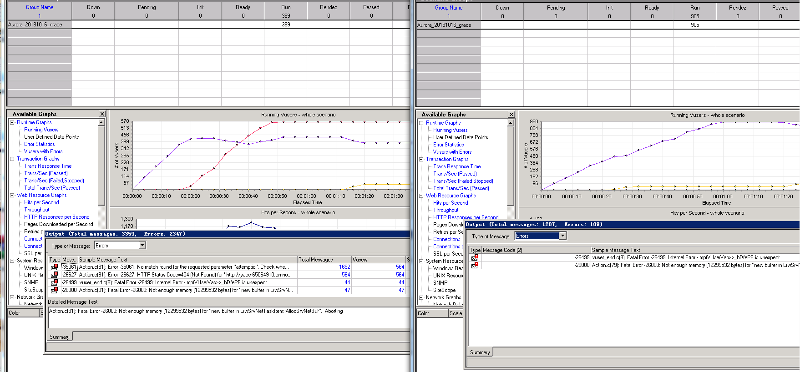
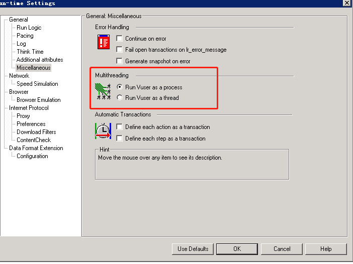

# LoadrunnerVuser进程线程两种运行方式

Loadrunner执行场景时出现如下报错：

报错原因：都消息内存，之前用户是按线程跑，一个进程开了多个线程，其中有部分内存是这些线程共享的，出错应该是内存出现冲突了不够用了。现在用户是按进程跑，内存应该是独立的了.

>>如果跑场景的时候老是报错内存不足，那么可以尝试修改loadrunner-F4的默认设置（线程改成--->进程)

## 解决方案：

变更这里的设置，其余设置不变。

## 说明

loadrunner controller将使用驱动程序mmdrv运行Vuser。用户可以在controller的run-time setting中选择Vuser的运行方式,是多进程方式or多线程方式。

如果选择以线程方式来运行虚拟用户：

在场景设置时，“是单行脚本，还是多行脚本”会决定系统启动的进程数的多少：

假设并发用户设置为30，如果是单行30个用户，系统只需启动一个进程；

假设并发用户设置为30，如果是多行，30行，每行一个用户，系统就需要启动30个进程；

如果选择以进程方式来运行虚拟用户：

那么无论脚本在场景组中怎么设置，是单行多用户还是多行少用户方式，系统需要启动的进程数是一定的，就是并发用户的总数；

### 进程方式和线程方式的优缺点

如果选择按照进程方式运行，每个用户都将启动一个mmdrv进程，多个mmdrv进程会占用大量内存及其他系统资源，这就限制了可以在任一负载生成器上运行的并发用户数的数量，因为负载机的资源（内存及其他系统资源）是有限的。

如果选择按照线程方式运行，在默认情况下，controller为每50个用户仅启动一个mmdrv进程，而每个用户都按线程方式来运行，这些线程用户将共享父进程的内存段，这就节省了大量内存空间，从而可以在一个负载生成器上运行更多的用户。（如果选择线程方式来运行用户，每个进程中会多出几个线程，例如是53个，多出来的进程可能是用于维护进程之间的运行的）

选择线程方式虽然可以减少启动的mmdrv进程数，减少了内存的占用，但是也容易出现一个问题，例如，同一个测试场景，用线程并发就会出现超时失败或报错，而用进程并发就没错。为什么呢？因为线程的资源是从进程资源中分配出来的，因此同一个进程中的多个线程会有共享的内存空间，假设a线程要用资源就必须等待b线程释放，而b线程也在等待其他资源释放才能继续，这样就会出现这个问题。

系统需要启动的mmdrv进程数与哪些因素有关：

与在controller的运行时设置中选择的是进程方式or线程方式来运行虚拟用户有关

进程方式：无论是单行or多行脚本，需要启动的进程数就是并发用户数；

线程方式：假设是单行脚本，每50个用户才启动一个进程；多行脚本，有几行（每行<50人）就启动几个进程，而不是每个用户启动一个进程。

如果选择了线程方式，需启动的进程数，进一步还与脚本是单行还是多行有关

单行脚本，多用户，假设少于50，只需启动一个进程，100个用户，只需启动2个进程，依此类推；

多行脚本，即使每行一个用户，也需要启动一个进程，多一行就需要多启动一个进程；不是每个用户启动一个进程，有几行（每行<50人）就需要启动几个进程。

在启动了IP欺骗功能后，所需启动的进程数，还与选择的是按进程还是按线程来分配IP地址有关

按进程分IP：每个ip（负载生成器）就需要多启动一个进程；

按线程分IP：每个ip（负载生成器）不需要多启动一个进程。

*一般来说 JAVA VUSER项目用进程模式,WEB用线程.但是如果WEB项目发现有线程冲突(TPS突然降低为0,而压力机、服务器等都无性能瓶颈时)，也需要改成以进程模式运行。*