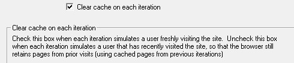

# Loadrunner中浏览器仿真器的缓存设置


## 路径：runtimesetting- > Browser- > Browser Emulation

## Simulate browser cache

### Cache URLs requiring content(HTMLs)

这个选项是指Vugen仅缓存网页的一些必要信息，这些信息可以是一些必须的验证信息、分析数据或者关联数据，当你勾选了这项后，这些信息自动被缓存（默认是启用）。

提示：为了减少虚拟用户的内存占用量，可以禁用该选项，除非它是一个明确规定的测试要求。

#### Cache URLs Requiring Content – Advanced 选项

在高级设置里可以设置指定类型的信息存储到cache中

注意：这里的高级设置时同时针对所有的用户组，而不能对单独用户组进行设置。

修改指定类型信息步骤：

- 1. 勾选Specify URLs requiring content in addition to HTML page。
- 2. 点“+”号，添加指定类型信息，如text/plain, text/xml, image/jpeg, and image/gif。
- 3. 点“-”号，从缓存中去除指定类型信息。

#### Check for newer versions of stored pages every visit to the page

这个选项是指浏览器会将存储在cache中的网页信息和最新浏览的页面进行比较  ，当你勾选此项时，vugen会增加'If-modified-since'到HTTP包头，在场景执行过程中这个选项可以显示最新的网页信息，但是也增加了更多的网络流量，通常配置这个选项是用来匹配浏览器设置来达到模拟浏览器的目的。

通常，默认不勾选。

### Download non-HTML resources

这个选项是指虚拟用户在回放期间访问网站时加载图片的过程，这里图片是指随着页面录制的图片和那些没有随页面录制下来的图片。当一个真实的用户访问网站，他们总是等待图片的加载。因此如果你想测试整个系统的时候（用户体验时间），可以勾选这项（默认勾选）；如果为了提高性能且不是模拟真实用户行为的话，可以不勾选这项。

提示：禁用此选项后，可能会遇到图片验证失败，因为在访问网站的时候有些图片是会发生变化的，如广告条。

【run-time-setting里面的Browser Emulation下的 download non html resources的勾去掉,

这样不会下载非html的资源了~~！简化脚本，请求少了，或许可以适当提高响应速度。

### Simulate a new uer on each iteration

#### Clear cache on each iteration



每次迭代过程后都清除浏览器中缓存来达到模拟一个真实用户第一次访问网页。取消勾选后，允许虚拟用户使用缓存来存储用户信息，来模拟一个已经访问过网页的用户。

亦可使用如下函数达到清除缓存的作用：
```
web_cleanup_cookies
web_remove_cookie
```