# Loadrunner使用初探


性能测试是利用产品、人员和流程来降低应用程序、升级程序或补丁程序部署风险的一种手段。性能测试的主要思想是通过模拟产生真实业务的压力对被测系统进行加压，验证被测系统在不同压力情况下的表现，找出其潜在的瓶颈。

性能测试原理如下图所示：


性能测试相关术语：响应时间、并发用户数、事务响应时间、吞吐量、TPS（每秒事务响应数）、性能计数器等。

性能测试方法：负载测试、压力测试、配置测试、并发测试、可靠性测试等。

应用领域：能力验证、规划能力、性能调优、缺陷发现。

性能测试工具架构一般包括：虚拟用户脚本产生器（Virtual User Generator）、压力产生器（player）、用户代理（Agent）、压力调度和监控系统（Controller）、压力结果分析工具（Analysis）。

## LoadRunner简介

LoadRunner是一种预测系统行为和性能的负载测试工具，通过模拟实际用户的操作行为进行实时性能监测，来帮助测试人员更快的查找和发现问题。LoadRunner适用于各种体系架构，能支持广泛的协议和技术，为测试提供特殊的解决方案。企业通过LoadRunner能最大限度地缩短测试时间，优化性能并加速应用系统的发布周期。 

LoadRunner提供了3大主要功能模块，既可以作为独立的工具完成各自的功能，又可以作为LoadRunner的一部分彼此衔接，与其他模块共同完成软件性能的整体测试，这3大模块分别是：

- Virtual User Generator —— 用于录制性能测试脚本
- LoadRunner Controller—— 用于创建、运行和监控场景
- LoadRunner Analysis —— 用于分析性能测试结果

## LoadRunner 常用术语:

1. 场景（Scenario）：即测试场景，在LoadRunner的Controller部件中，可以设计与执行用例的场景，设置场景的步骤主要包括：在Controller中选择虚拟用户脚本、设置虚拟用户数量、配置虚拟用户运行时的行为、选择负载发生器（Load Generator）、设置执行时间等。
2. 负载发生器（Load Generator）：用来产生压力的机器，受Controller控制，可以使用户脚本在不同的主机上执行。在性能测试工作中，通常由一个Controller控制多个Load Generator以对被测试系统进行加压。
3. 虚拟用户（Virtual User/Vuser）：对应于现实中的真实用户，使用LoadRunner模拟的用户称为虚拟用户。性能测试模拟多个用户操作可以理解为这些虚拟用户在跑脚本，以模拟多个真正用户的行为。
4. 虚拟用户脚本（Vuser script）：通过Vuser Generator录制或开发的脚本，这些脚本用来模拟用户的行为。 
5. 事务（Transaction）：测试人员可以将一个或多个操作步骤定义为一个事务，可以通俗的理解事务为“人为定义的一系列请求（请求可以是一个或者多个）”。在程序上，事务表现为被开始标记和结束标记圈定的一段代码区块。Loadrunner根据事务的开头和结尾标记，计算事务响应时间、成功/失败的事务数。
6. 思考时间（Think Time）：即请求间的停顿时间。实际中，用户在进行一个操作后往往会停顿然后再进行下一个操作，为了更真实的模拟这种用户行为而引进该概念。在虚拟用户脚本中用函数lr_think_time()来模拟用户处理过程，执行该函数时用户线程会按照相应的time值进行等待。
7. 集合点(Rendezvous)：设集合点是为了更好模拟并发操作。设了集合点后，运行过程中用户可以在集合点等待到一定条件后再一起发后续的请求。集合点在虚拟用户脚本中对应函数lr_rendezvous() 。
8. 事务响应时间：事务响应时间是一个统计量，是评价系统性能的重要参数。定义好事务后，在场景执行过程和测试结果分析中即可以看到对应事务的响应时间。通过对关键或核心事务的执行情况进行分析，以定位是否存在性能问题。 

## LoadRunner测试流程
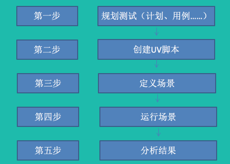
- 规划测试：确定测试要求，如并发用户数量、典型业务场景流程；测试计划；设计用例；……
- 创建Vuser脚本：使用Virtual User Generator录制、编辑和完善测试脚本。 
- 定义场景：使用LoadRunner Controller 设置测试场景。
- 运行场景：使用LoadRunner Controller 驱动、管理并监控场景的运行。
- 分析结果：使用LoadRunner Analysis 生成报告和图表并评估性能。

### 规划测试:

好的测试规划，能够指导整个测试过程，以更好的收集到测试目标要求的性能数据。规划可以包括测试的计划、用例的设计、场景的设计、性能计数器设置的设计等。

以下列出几点规划事项：

- 测试用例：测试用例一般根据需要测试的功能进行设计，如监控宝登陆，创建任务等
- 场景设计：一般情况会设计两种加压方式进行测试：瞬时加压（多人同时进行某项业务操作）与逐渐加压（多人先后进行某项业务操作，操作时间间隔根据计划设定）。
- 性能计数器方面：可以收集CPU时间、内存、硬盘、网络、数据库参数等。

### 创建Vuser脚本—准备:

Loadrunner脚本开发步骤分为：录制基本脚本->增强/编辑脚本->配置运行时设置->试运行脚本
#### 1. 启动LoadRunner：选择开始->程序->HPLoadRunner LoadRunner，打开HP LoadRunner11，如下图所示。

#### 2. 打开VuGen：在LoadRunner Launcher窗格中，单击Create/Edit Scripts，链接启动Virtual user Generator起始页。

#### 3. 创建一个空白Web脚本：选择File New菜单，或点击 按钮，打开New Virtual User对话框，显示可供选择脚本的协议。
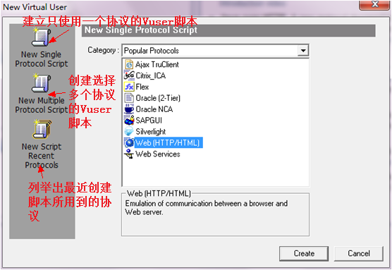
对于常用的应用软件，我们可以根据被测应用是B/S结构还是C/S结构来选择协议。如果是B/S结构，就要选择Web（HTTP/HTML）协议。如果是C/S结构，则可以根据后端数据库的类型来选择，如MS SQL Server协议用于测试后台数据库为SQL Server的应用；对于没有数据库的WINDOWS应用，可以选择Windows Sockets协议。

根据选择协议的不同，Virtual User Generator 会使用不同的方式和界面引导用户完成脚本的录制。

#### 4. 录制前的设置：选择Web（HTTP/HTML），点击Create按钮，打开Start Recording对话框。

选择的协议不同，打开的窗口就会不同，实例是针对Web录制的对话框。
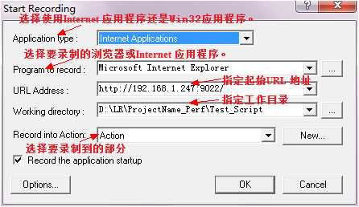
VuGen的脚本分为三个部分：Vuser_init，Action，Vuser_end。其中Vuser_init和Vuser_end都只能存在一个，而Action可分成无数多个部分，可以通过点击旁边的【new】按钮来创建Action。在迭代执行测试脚本时，Vuser_init和Vuser_end中的内容只会执行一次，迭代的是Action部分。

在Start Recording对话框，点击Options按钮，进入录制选项设置。一般要设置以下选项：

- 1.基于浏览器的应用程序推荐使用HTML-based script。
- 2.不是基于浏览器的应用程序推荐使用URL-based script。
- 3.基于浏览器的应用程序中包含了JavaScript，并且该脚本向服务器发送了请求，比如DataGrid的分页按钮等，推荐使用URL-based script。
- 4.基于浏览器的应用程序中使用了HTTPS安全协议，建议使用URL-based script。

Advanced Support charset中设置编码格式：UTF-8；

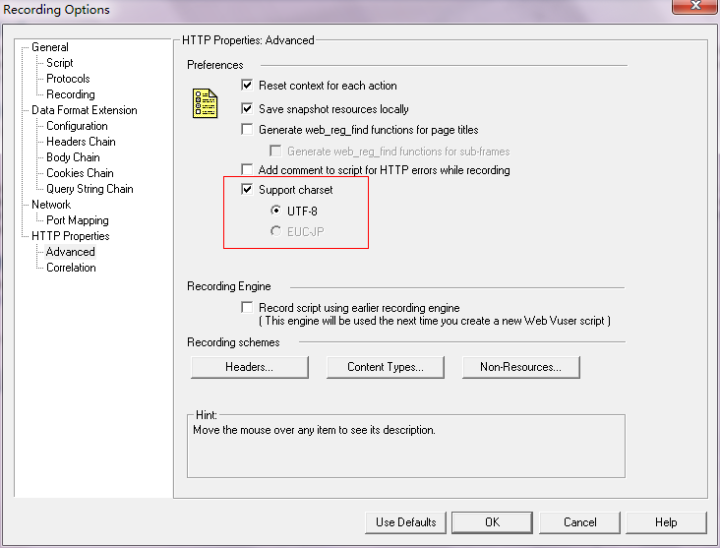

提示：录制Web脚本时，生成的脚本中存在乱码该如何解决？

- 1.新建脚本--->选择协议(Http)-->选项-->高级-->选择“支持字符集”并点选“UTF-8”。
- 2.在回放脚本之前：Vuser-->运行时设置-->浏览器-->浏览器仿真-->更改-->使用浏览器-->语言下来选择 “中文(中国)”
#### 5、录制：在Start Recording对话框，点击OK按钮，开始录制。系统自动弹出IE，加载营销系统的登录界面。在录制的过程中，屏幕上有一个悬浮的录制工具栏，是脚本录制过程中测试人员和VuGen交互的主要平台。

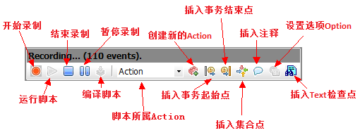

通过操作被测系统，操作的每一个步骤都被记录，在录制的过程中，可以在相应的步骤插入action、事务、检查点、集合点等信息。录制完成后单击按钮，Loadrunner开始生成脚本，生成的脚本如图所示。 

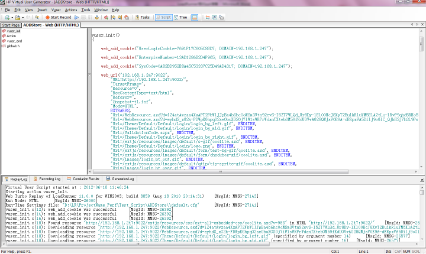

脚本有两种查看方式：
- 1.Script View 可以查看全部录制的脚本代码（下图）

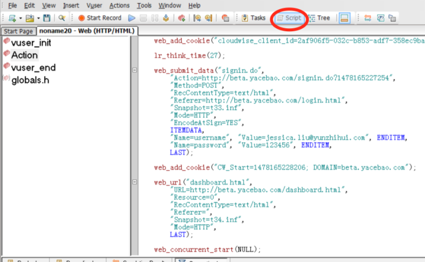

- 2.Tree View可以查看每个URL获取来的页面（下图）

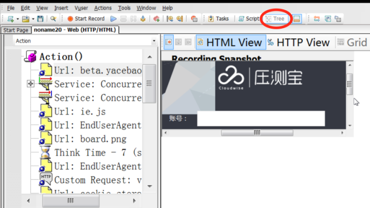

#### 创建Vuser脚本—增强/编辑脚本

参数化：参数化的作用是在进行场景执行的时候，每个不同的虚拟用户可以按照参数的读取策略读取到参数值，以模拟不同用户在提交或者读取不同的数据。

每个用户在界面上读取和提交的信息都不太相同，因此一般都需要参数化，其它与输入信息对应的比如用户id之类的信息也需要参数化；另外，录制环境绝大多数情况下与执行环境不一致，因此一般需要对IP、端口或者域名做参数化。

打开脚本后，首先要确定哪些常量需要参数化。

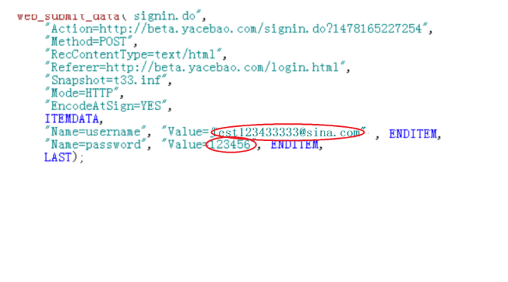

可以看出，在web_submit_data函数中，两条语句包含了两个常量：用户名和密码。
```
"Name=usernam", "Value=Test123433333@sina.com", ENDITEM, 
"Name=password", "Value=123456", ENDITEM,
```
当我们想模拟多个不同的用户来运行登录脚本的时候，需要对Value= Test123433333@sina.com和Value=123456进行参数化，以e号参数化为例，参数化过程如下：

- 1）选中Test123433333@sina.com  右击鼠标 在右键菜单上选择replace with a parameter。
- 2）在弹出窗口填写参数名称，或选择一个已经存在的参数名。

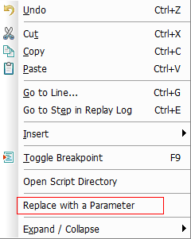
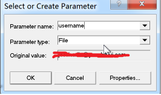
```
常用的参数类型：
Data/Time：使用当前日期/时间替换所选常量。
Group Name：使用Vuser组的名称替换所选常量。
Load Generator Name：使用Vuser脚本的负载发生器名替换所选常量。
Iteration Number：使用当前的迭代编号替换所选常量。
Random Number：使用一个随机生成的整数替换所选常量，可以通过参数属性设定参数的范围。
Unique Number：使用一个唯一编号替换所选常量，可以通过参数属性设定参数的第一个值和递增的规则。
Vuser ID：使用运行脚本的虚拟用户ID来代替选择的常量。
File：采用外部的数据来代替，可以使用单独的文件，也可以使用现成的数据库中获取数据。
User Defined Function：从用户开发的dll文件中获取数据。
```
- 3）单击窗口的properties按钮，设置parameter的properties。参数名称：Username；选择参数类型File，来写入已准备好的数据。

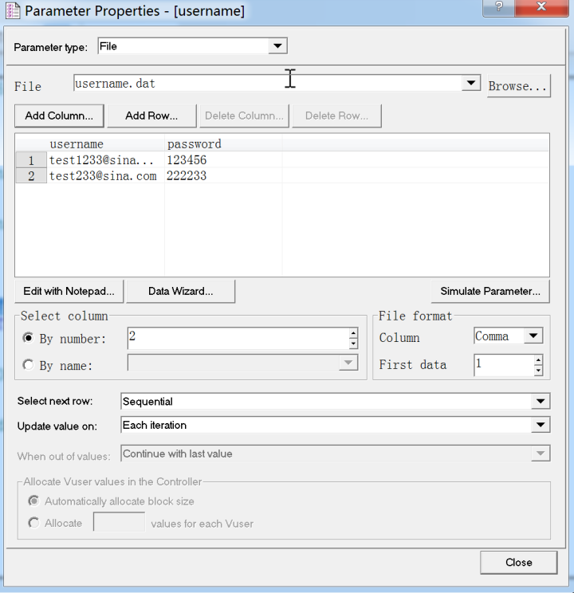

文件File：参数化结束后，脚本保存的根目录下会自动生成一个 以参数名称命名的 参数文件；也可以直接选择一个已准备好的参数文件。
选择参数列Select Column：
```
By number：以列号为参数列。
By name：以列名为参数列。
```

文件格式：
```
Column：参数之间的分隔符：逗号、空格、Tab。
First data：从第几行读取数据。
```
选择参数分配方法Select next row：
```
Sequential：顺序的分配Vuser参数值。当正在运行的Vuser访问数据表格时，它将会提取下一个可用的数据行。
Random：当脚本开始运行时，“随机”的为每个Vuser分配一个数据表格中的随机值。
Unique：为Vuser的参数分配一个“唯一”的顺序值。注意，参数数量一定要大于等于“Vuser量*迭代数量”。
```
选择参数更新方法Update value on：
```
Each iteration：脚本每次迭代都顺序的使用数据表格中的下一个新值。
Each occurrence：在迭代中只要遇到该参数就重新取值。
Once：在所有的迭代中都使用同一个值。
```
当超出范围时When out of values：（选择数据为unique时才可用到）
```
Abort Vuser：中止。
Continue in a cyclic manner：继续循环取值。
Continue with last value：取最后一个值。
```
设置完成后，被参数化的值会被参数名代替

关联：关联的含义是在脚本回放过程中，客户端发出请求，通过关联函数所定义的左右边界值（也就是关联规则），在服务器所响应的内容中查找，得到相应的值，以变量的形式替换录制时的静态值，从而向服务器发出正确的请求，最典型的是用于sessionID，常用的关联技术有三种：录制中关联、录制后关联、手动关联。
录制中关联：设置录制前的recording options correlation，可以勾选LR已有的关联规则，也可以新建规则；录制过程中，关联自动在脚本体现。
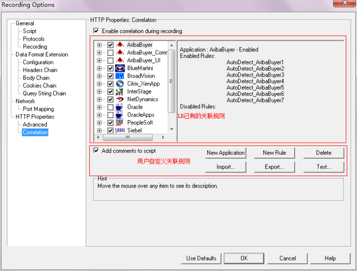
录制后关联：关联的使用可以在脚本录制完成后，回放一次脚本，然后在脚本的菜单的vuser scan script for correlations进行设置。

通过回放脚本和扫描关联，系统尝试找到录制与执行时服务器响应的差异部分，找到需要关联的数据，并建立关联。
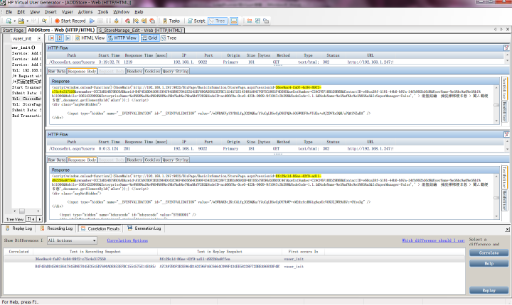
手动关联：录制前关联与录制后关联都属于自动关联的范畴，如果出现自动关联不能解决的问题，就需要使用手动关联的方法，手动关联的一般步骤如下：

        1）录制两份脚本，保证业务流程和使用的数据相同。
        2）使用WinTiff工具比较两份脚本，对两份脚本中不同的地方进行判断，找到需要关联的数据。
        3）找到左边界和右边界字符串，写出关联函数。
        4）在脚本中‘需要关联的数据’前面插入关联函数。
        5）用关联函数中定义的参数取代脚本中‘需要关联的数据’。

其他：前面讲解了插入事务、插入集合点、参数化、建立关联的方法，一般的脚本都需要做以上几项的修改工作。此外，还可以通过插入注释、插入检查点来完善脚本。另外脚本出现问题了，也可以通过打印信息来调试脚本。

插入注释：在脚本中插入注释，可以清晰找到需要修改的位置，增强脚本的可读性。

插入检查点：在脚本中设置检查点函数，将返回值的结果反映在Controller的状态面板上和Analysis统计结果中，由此可以判断数据传递的正确性。

#### 创建Vuser脚本—配置运行时设置

在VuGen中，选择 Vuser Run-time Settings，可以设定脚本回放过程的一些参数。如Iteration Count (迭代次数)、Think Time (思考时间)、Error Handling(错误处理)、Multithreading(运行方式)等。

##### 1、Iteration Count (迭代次数)

选择General：Run Logic

说明：设定每个Action的迭代次数。
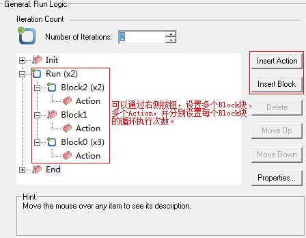
##### 2.Think Time (思考时间)

选择General：Think Time

说明：设定脚本回放时对思考时间的处理方式。

Ignore think time

脚本回放时，将不执行lr_think_time()函数，这样会给服务器产生更大的压力。

Replay think time

脚本回放时，执行lr_think_time()函数，具体执行方式有一下3种：
- 1)按照录制时获取的think time值回放。
- 2)按照录制时获取值的整数倍数回放脚本。
- 3)制定一个最大和最小的比例，按照两者之间的随机值回放脚本。

Limit think time to 选项，用于限制think time的最大值，脚本回放过程中，如果发现有超过这个值的，用这个最大值替代。

##### 3、Error Handling(错误处理)

选择General：Miscellaneous

说明：设定遇到错误时的处理方式

Continue on error：遇到错误时继续运行。

Fail open transactions on lr_error_message：执行到事务中调用的lr_error_message()函数时将事务的结果置为Failed。

Generate snapshot on error：对错误进行快照

##### 4.Multithreading(运行方式)

选择 General：Miscellaneous

说明：设定脚本是以多线程方式运行还是以多进程方式运行。

Run Vuser as a process：以多进程方式运行。

Run Vuser as a thread：以多线程方式运行。

这个根据实际情况而定，通常B/S通常用线程，C／S用进程。

#### 创建Vuser脚本—试运行脚本
- 1.脚本录制完毕后，按F5键，或点击菜单中的按钮，可以试运行脚本。回放过程中VuGen在下方同步打印日志。
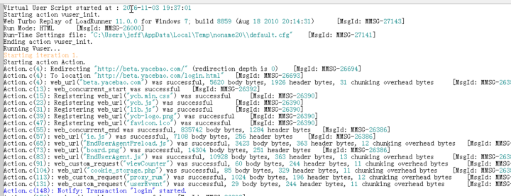
- 2.如果需要查看不同的日志形式，可以在脚本页面菜单的vuser runtime-settings log选择不同的项，回放脚本时将打印不同级别的日志。
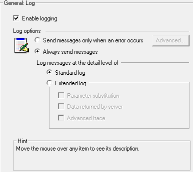
- 3.运行结束后，系统会给出相应的运行结果，可以通过View Test Results查看回放结果
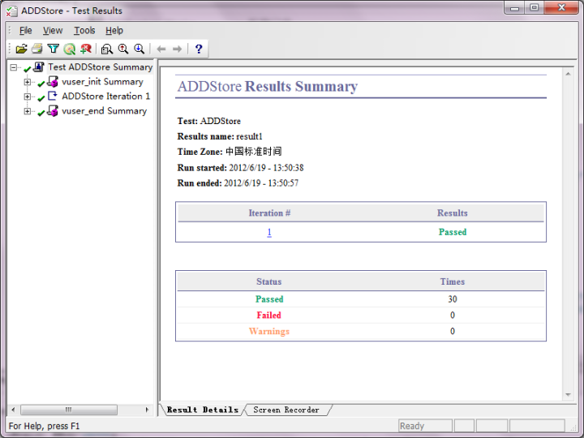
在VuGen中试运行脚本的作用，主要是查看录制的脚本能否正常通过，如果有问题，系统会给出提示信息，并定位到出错的行上，便于用户查找到错误，修改完善测试脚本。
### 定义场景

脚本准备完成后，可以根据场景用例设置场景。Controller控制器提供了手动和面向目标两种测试场景。

手动设计场景（Manual Scenario）最大的优点是能够更灵活地按照需求来设计场景模型，使场景能更好地接近用户的真实使用。一般情况下使用手动场景设计方法来设计场景。

面向目标场景（Goal Oriented Scenario）则是测试性能是否能达到预期的目标，在能力规划和能力验证的测试过程中经常使用。

Controller控制器可以从程序中打开，然后选择保存好的脚本；也可以从VuGen中直接连接到该脚本的控制场景。

实例从VuGen中启动Controller的步骤如下：

- 1、单击VuGen菜单栏的tools create controller scenario。
- 2、在弹出窗口选择虚拟用户数、运行结果保存目录（按照事先约定选择目录，结果文件的命名最好包含用户数/加压方式/场景名）、负载产生的负载机所在地。
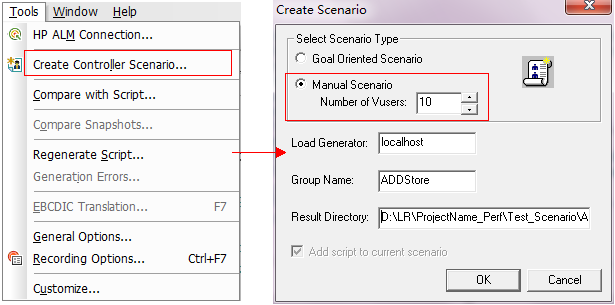
- 3、在Create Scenario窗口中点击OK，链接启动LoadRunner Controller。
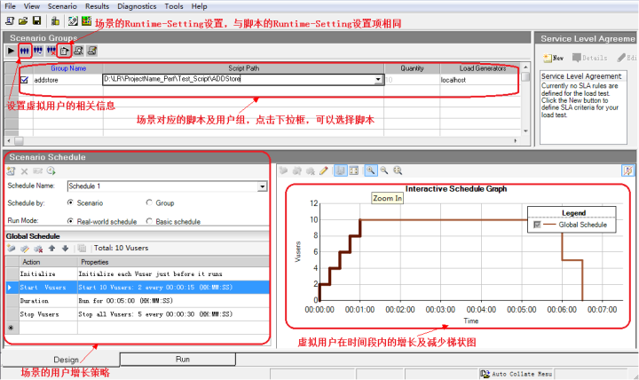
定义场景—设置Schedule

在Controller的Scenario Schedule中，可以设置场景的各项计划，如虚拟用户的加载方式、释放策略等。

#### 1.设置场景的基本信息

Schedule Name：设置场景名称。

Schedule by：选择按场景计划或按用户组计划。

Run Mode：
- real-world schedule 是真实场景模式，可以通过增加Action来增加多个用户。
- basic schedule 是我们以前用的‘经典模式’，只能设置一次负载的上升和下降。
#### 2.设置场景的各类参数：双击Global Schedule中的对应行，可以设置schedule的各类参数。
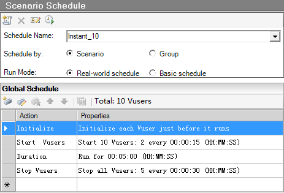
Initialize：初始化是指运行脚本中的Vuser_init操作，为测试准备Vuser和Load Generator。
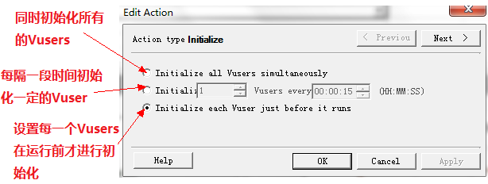
Start Vusers：设置场景Vuser加载方式。
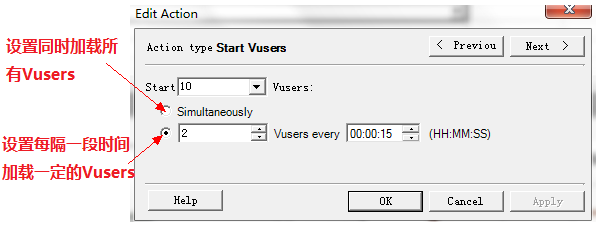
Duration：设置场景持续运行的情况。
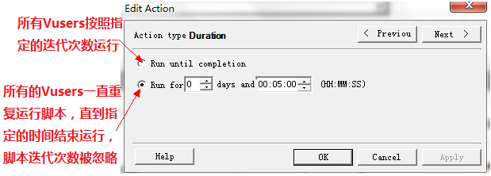
Stop Vusers：设置场景执行完成后虚拟用户释放的策略。
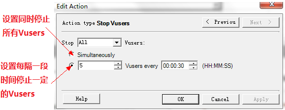
Start Time：设置场景启动时间。

场景设计完成后，单击Controller界面下方的Run选项卡，可以进入场景的执行界面。这个界面用于控制场景的执行，包括启动停止执行场景，观察执行时是否出错及出错信息、执行时用户情况、相关性能数据。

单击Start Scenario按钮，场景开始运行。一些即时的数据（比如用户数，等待数，成功事务数，失败事务数等）以及性能数据的折线图，会在Run的过程中显示。

执行完成后，执行结果以事先的命名默认保存在建立场景时设置的保存目录。如果涉及到调优，需要多次执行同一个场景，建议每次运行前先调整菜单的Results Results Settings，场景结果保存的名字建议包含重要调优参数值。调优参数比较多样，可以在具体的项目用附件约定。

测试期间，可以使用LoadRunner的联机监控器观察Web服务器在负载下的运行情况。特别是可以看到，负载的增加如何影响服务器对用户操作的响应时间（事务响应时间），以及如何引起错误的产生。

### 分析结果

LR的Analysis模块是分析系统的性能指标的一个主要工具，它能够直接打开场景的执行结果文件，将场景数据信息生成相关的图表进行显示。Analysis集成了强大的数据统计分析功能，允许测试员对图表进行比较和合并等多种操作，分析后的图表能够自动生成需要的测试报告文档。

通常测试报告需要给出“虚拟用户—用户响应时间”的折线图，这个折线图可以通过合并报表的形式生成，过程如下：选中Average Transaction Response Time报表，单击菜单栏的View Merge Graphs 然后选择与Running Vuser图合并，生成的折线图即为“虚拟用户—用户响应时间”。
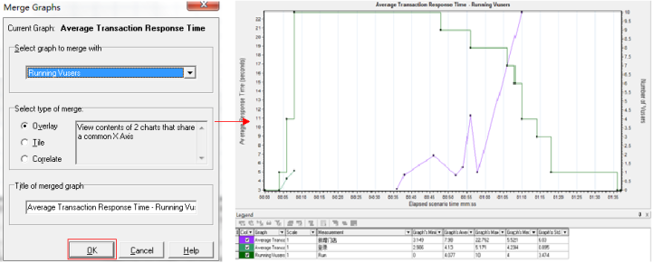
LoadRunner作为商业性能测试工具拥有强大的功能，License的价格也很高。还有一个Apache开发的开源免费性能测试工具Jmeter,互联网公司使用比较多。这些工具只适合应用后端的压力测试，使用时都是需要先安装才能使用，如果想模拟大并发，前期还需要准备大量的工作压力机，测试所占用的资源成本比较高，压测周期很长，越来越不适合移动应用产品敏捷开发、快速交付的需求。
