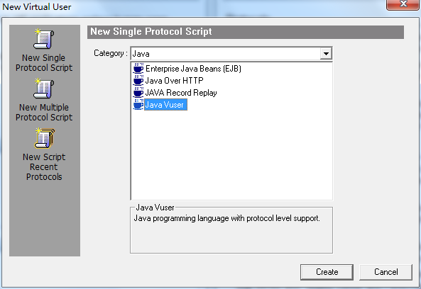
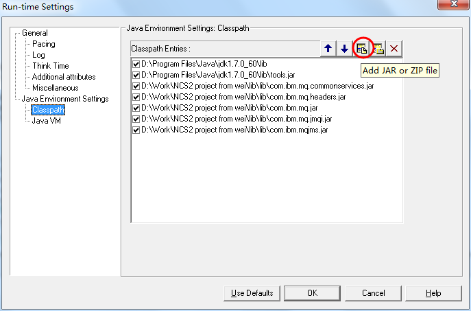
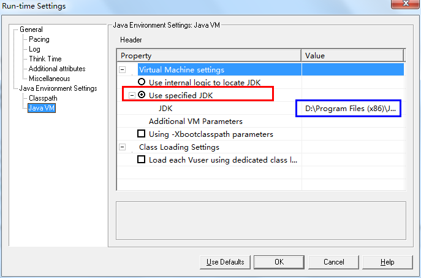

# Loadrunner对IBMMQ进行性能测试

## 一、概述

使用Loadrunner对IBM MQ进行性能测试，需要用到java vuser以及java编码知识。此次先介绍什么是IBM MQ，然后java vuser的使用与配置细节，最后介绍IBM MQ的测试脚本。

## 二、IBM MQ介绍

IBM MQ（IBM Message Queue）是IBM的一款商业消息中间产品，适用于分布式计算环境或异构系统之中。消息队列技术是分布式应用间交换信息的一种技术。消息队列可驻留在内存或磁盘上，队列存储消息直到它们被应用程序读走。

通过消息队列应用程序可独立地执行，它们不需要知道彼此的位或在继续执行前不需要等待接收程序接收此消息。

### 对列管理器

队列管理器是MQ系统中最上层的一个概念，由它为我们提供基于队列的消息服务。

### 对列

队列是消息的安全存放地，队列存储消息直到它被应用程序处理。

### 通道

通道是MQ系统中队列管理器之间传递消息的管道，它是建立在物理的网络连接之上的一个逻辑概念，也是MQ产品的精华。

在 MQ中，主要有三大类通道类型，即消息通道，MQI通道和Cluster通道。

消息通道是用于在MQ的服务器和服务器之间传输消息的，需要强调指出的是， 该通道是单向的，它又有发送(sender), 接收(receive), 请求者(requestor), 服务者(server)等不同类型，供用户在不同情况下使用。

MQI通道是MQ Client和MQ Server之间通讯和传输消息用的，与消息通道不同，它的传输是双向的。

群集(Cluster)通道是位于同一个MQ 群集内部的队列管理器之间通讯使用的。

### 消息

在MQ中，我们把应用程序交由MQ传输的数据定义为消息，我们可以定义消息的内容并对消息进行广义的理解，比如：用户的各种类型的数据文件，某个应用向其 它应用发出的处理请求等都可以作为消息。消息有两部分组成：消息描述符(Message Discription或Message Header)，描述消息的特征，如：消息的优先级、生命周期、消息Id等；消 息体(Message Body)，即用户数据部分。在MQ中，消息分为两种类型，非永久性(non-persistent)消息和永久性(persistent)消息，非永久 性消息是存储在内存中的，它是为了提高性能而设计的，当系统掉电或MQ队列管理器重新启动时，将不可恢复。当用户对消息的可靠性要求不高，而侧重系统的性 能表现时，可以采用该种类型的消息，如：当发布股票信息时，由于股票信息是不断更新的，我们可能每若干秒就会发布一次，新的消息会不断覆盖旧的消息。永久 性消息是存储在硬盘上，并且纪录数据日志的，它具有高可靠性，在网络和系统发生故障等情况下都能确保消息不丢、不重。

此外，在MQ中，还有逻辑消息和物理消息的概念。利用逻辑消息和物理消息，我们可以将大消息进行分段处理，也可以将若干个本身完整的消息在应用逻辑上归为一组进行处理。

## 三、Loadrunner java vuser的使用与配置

### 准备

    loadrunner 11
    jdk 1.6（32位）
    所需jar包名(安装MQ windows后，在安装目录中可以找到)
        com.ibm.mq.jar
        connector.jar  
        com.ibm.mq.jmqi.jar  
        com.ibm.mq.headers.jar
        com.ibm.mq.commonservices.jar 

### 创建

打开loadrunner选择新建Java Vuser，如下图所示：   



### 配置

开启Run-time Setting，导入之前准备好的jar，如下图所示：



配置Java VM，先选中红框所示单选框，然后输入本机所安装JDK位置，如下图所示：



## 四、测试脚本
以下为MQ发送测试脚本，利用此脚本只用根据相应测试需求，调整注释部分：
``` 
/*
 * LoadRunner Java script. (Build: _build_number_)
 *
 * Script Description: simple test harness to PUT messages on a MQ queue
 *
 */
 
import lrapi.lr;
import com.ibm.mq.*;
import java.util.HashMap;
import java.util.Random;
 
import java.io.FileInputStream;
import java.io.FileOutputStream;
import java.io.IOException;
 
public class Actions
{
 // 队列管理器
 String queueMgrName = "QMCCPS01";
 // 队列名
 String putQueueName = "CNAPS_BPH";
 // 通道名
 String channel = "SYSTEM.DEF.SVRCONN";
 // 消息
 String msgBody = "";
 // ip 地址
 String hostname = "10.40.2.16";
 // 端口号
 int port = 1601;
 // 字符集
 int CCSID = 819;
 
 MQQueueManager queueMgr = null;
 MQQueue getQueue = null;
 MQQueue putQueue = null;
 MQPutMessageOptions pmo = new MQPutMessageOptions();
 MQGetMessageOptions gmo = new MQGetMessageOptions();
 MQMessage requestMsg = new MQMessage();
 MQMessage responseMsg = new MQMessage();
 
 public int init() throws Throwable{
  // Open a connection to the queue manager and the put/get queues
  try {
// As values set in the MQEnvironment class take effect when the
// MQQueueManager constructor is called, you must set the values
// in the MQEnvironment class before you construct an MQQueueManager
// object.
MQEnvironment.hostname=hostname;
MQEnvironment.port=port;
MQEnvironment.CCSID =CCSID;
MQEnvironment.properties.put("transport", "MQSeries");
// MQEnvironment.channel = "SYSTEM.DEF.SVRCONN";
MQEnvironment.channel = channel;
queueMgr = new MQQueueManager(queueMgrName);
 
// Access the put/get queues. Note the open options used.
putQueue = queueMgr.accessQueue(putQueueName, 49);
// getQueue= queueMgr.accessQueue(getQueueName,
// MQC.MQOO_INPUT_AS_Q_DEF | MQC.MQOO_OUTPUT);
  } catch (Exception e) {
e.printStackTrace();
  }
  return 0;
 }
 
 public int action() throws Throwable{
  // This is an XML message that will be put on the queue. Could do some
  // fancy
  // things with XML classes here if necessary.
  // The message string can contain {parameters} if lr.eval_string() is
  // used.
  // Clear the message objects on each iteration.
  requestMsg.clearMessage();
  responseMsg.clearMessage();
//读取报文内容，并利用replace函数参数化报文编号
String req = read("G:\\大额贷记来账.xml");
String data_msg = "<data_msg>";
String msgBody = req.replace("<MsgId>2010101000000000</MsgId>", "<MsgId>20200117" + data_msg + "</MsgId>");
  // Create a message object and put it on the request queue
 
  try {
pmo.options = MQC.MQPMO_NEW_MSG_ID; // The queue manager replaces
// the contents of the MsgId
// field in MQMD with a new
// message identifier.
// should be put on this queue 
requestMsg.report = MQC.MQRO_PASS_MSG_ID; // If a report or reply is
// generated as a result
// of this message, the
// MsgId of this message
// is copied to the
// MsgId of the report
// or reply message.
requestMsg.format = MQC.MQFMT_STRING; // Set message format. The
  // application message data
  // can be either an SBCS
  // string (single-byte
  // character set), or a DBCS
  // string (double-byte
  // character set).
// requestMsg.messageType=MQC.MQMT_REQUEST; // The message is one
// that requires a reply.
lr.start_transaction("大额贷记来账");
requestMsg.writeString(msgBody); // message payload
MQMessage inMsg = new MQMessage();
inMsg.write(msgBody.getBytes("UTF-8"));
putQueue.put(inMsg,pmo);
lr.end_transaction("大额贷记来账",lr.PASS );
 
  } catch (Exception e) { 
e.printStackTrace();
  }
 
  /***
* // Get the response message object from the response queue try {
* responseMsg.correlationId = requestMsg.messageId; // The Id to be
* matched against when getting a message from a queue
* gmo.matchOptions=MQC.MQMO_MATCH_CORREL_ID; // The message to be
* retrieved must have a correlation identifier that matches the value
* of the CorrelId field in the MsgDesc parameter of the MQGET call.
* gmo.options=MQC.MQGMO_WAIT; // The application waits until a suitable
* message arrives. gmo.waitInterval=60000; // timeout in ms
* getQueue.get(responseMsg, gmo);
*
* // Check the message content byte[] responseMsgData =
* responseMsg.readStringOfByteLength
* (responseMsg.getTotalMessageLength()).getBytes(); String msg = new
* String(responseMsgData); lr.output_message(msg); // for debugging.
* Disable this for a load test. // TODO: add your own message checking
* here using string functions. // I have found that extracting XML
* fields and comparing them (rather than // comparing the whole message
* body or substrings) is more resistant to change. // If no match is
* found, then lr.error_message() and lr.exit(). } catch(Exception e) {
* e.printStackTrace(); lr.error_message("Error receiving message.");
* lr.exit(lr.EXIT_VUSER, lr.FAIL); }
*
* lr.end_transaction("test_message", lr.AUTO);
*/
  return 0;
 }// end of action
 
 public int end() throws Throwable{
  // Close all the connections
  try {
putQueue.close();
// getQueue.close();
queueMgr.close();
  } catch (Exception e) {
e.printStackTrace();
  }
  return 0;
 }// end of end
public static String read(String fileName){
  String req = "";
  FileInputStream in = null;
  try {
  in = new FileInputStream(fileName);
  int len = in.available();
  byte[] b = new byte[len];
  in.read(b);
  req = new String(b);
  in.close();
  } catch (IOException e) {
  e.printStackTrace();
  }
  return req;
 }
}
```