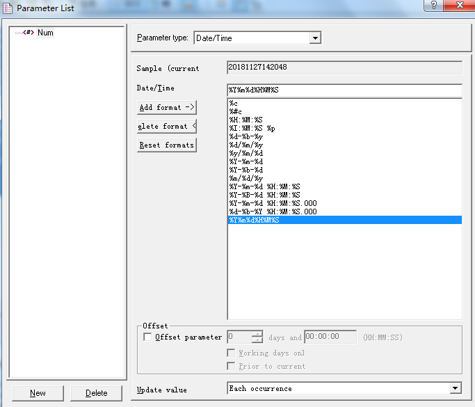
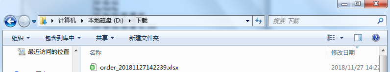

# Loadrunner对报表导出下载进行性能测试

几乎所有报表都提供导出下载功能，测试时为了模拟下载的场景，需要编写相关脚本。在HTTP中，没有任何一个方法或是动作能够标识“下载”这个动作，对HTTP来说，无论是下载文件或者请求页面，都只是发出一个GET请求，Loadrunner记录了客户端发出的对文件的请求，并能够收到文件内容。因此，完全可以通过关联的方法，从Loadrunner发出的请求的响应中获取到文件的内容，然后通过Loadrunner的操作方法，自行生成文件。

简单来说，只要实现对服务器返回所有内容保存到本地，就实现了“下载”的模拟，因此思路为：

### 1.针对所有返回内容保存到本地

这里采用关联函数可以实现web_reg_save_param

`web_reg_save_param("fcontent", "LB=", "RB=", "SEARCH=BODY", LAST);`

注意：由于参数SEARCH默认是针对消息头域和消息体，而我们保存目标仅在返回的body中，所以设置为body；

### 2.设置接受返回响应的参数大小

由于关联函数保存参数的参数值默认大小为1024字节，下载文件往往不止这个大小，所以在使用关联函数之前需要使用函数：web_set_max_html_param_len重新设置参数size

`web_set_max_html_param_len("9000000");`

### 3.把参数写入到本地文件

使用fwrite( const void *buffer, size_t size, size_t count, FILE *file_pointer );

- const void *buffer：要把关联函数找到的参数作为常量写入，因此使用lr_eval_string函数把参数转换为常量
- size_t size：指定缓冲区的大小，也就是服务器响应的大小，使用web_get_int_property函数取得，所以需要在导出请求后面加入：flen = web_get_int_property(HTTP_INFO_DOWNLOAD_SIZE);
- size_t count：指定数目，为1
- FILE *file_pointer：指定写入的文件路径：

创建文件路径，使用到long fopen( const char *filename, const char *access_mode );

- const char *filename参数为写入文件的路径和文件名，例如 d:\下载\order_20181127110251.xls
- const char *access_mode存储模式参数为：wb，w为写，b也就是二进制模式：

`filedes = fopen("D:\\下载\\order_20181127110251", "wb")`

完成该步骤以后：

`fwrite(lr_eval_string("{fcontent}"), flen, 1, filedes);`

### 4.关闭文件fclose(filedes); 

代码如下：

```
Action()
{
    
    int flen;   //文件大小    
    long  filedes;   //响应数据内容大小
    char filename[1024];    //文件名
	web_set_max_html_param_len("90000000");  //设置最大长度
	web_reg_save_param("fcontent","LB=","RB=","Search=Body",LAST); //将响应信息存放到fcontent变量
	lr_start_transaction("导出");
	web_url("exportOrderExcel.shtml", 
		"URL=http://10.201.60.110/receive-web/omsweb/fileController/exportOrderExcel.shtml&language=zh_cn", 
		"TargetFrame=", 
		"Resource=1", 
		"RecContentType=application/x-msdownload", 
		"Referer=http://10.201.60.110/receive-web/security/public/index.html", 
		"Snapshot=t38.inf", 
		LAST);
	lr_end_transaction("导出", LR_AUTO);
    flen = web_get_int_property(HTTP_INFO_DOWNLOAD_SIZE);    //获取响应中的文件长度
    strcpy(filename,"D:\\下载\\order_");      		 //生成随机的文件名称，便于并发
    strcat(filename,lr_eval_string("{Num}"));
    strcat(filename,".xlsx");
    if(flen > 0){
        //以写方式打开文件  
        if((filedes = fopen(filename, "wb")) == NULL){
            lr_output_message("Open File Failed!");
            return -1;
        }
        //写入文件内容
        fwrite(lr_eval_string("{fcontent}"), flen, 1, filedes);
        //关闭文件
        fclose(filedes);
    }
	return 0;
}
```

为了并发时生成的文件名不重复，因此增加一个参数表取当前时间戳作为文件名后缀，设置为每次迭代时更新，例如：

此时，执行脚本后，发现在本地电脑D:\下载目录下生成下载文件，如图：


这个脚本如果在controller中直接进行性能测试的话，跟实际还是会有点差距的，由于实际业务场景里面各个用户都是选择不一样的报表进行导出，因此再对导出请求中的两个报表名进行关联，ord属性配置为参数，让vuser每次选择不一样的报表进行导出，例如：
```
web_reg_save_param_ex(
"ParamName=CorrelationParameter_2",
"LB=\">",
"RB=",
"Ordinal={报表行数}",
SEARCH_FILTERS,
"Scope=Body",
"RequestUrl=*/CsgPlanDrawReportQuery.jsp*",
LAST);
```
最后，就实现了报表模块中，针对各个不同报表执行导出操作并下载到本地的性能测试目的。