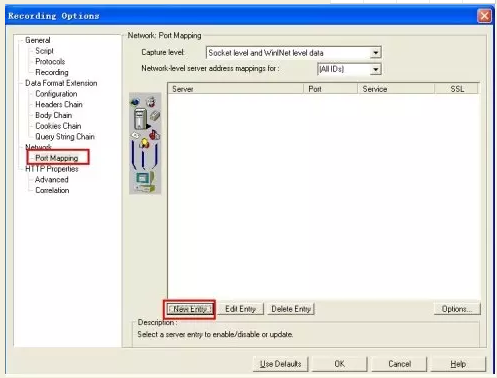
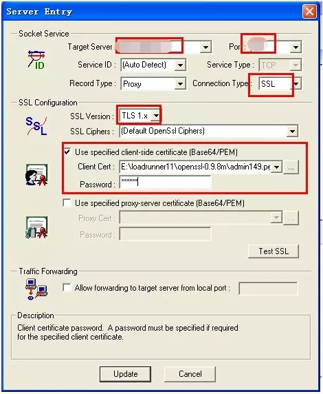

# Loadrunner录制https协议

## 一、最简单的方法：浏览器配置

打开浏览器，安装证书，配置完成后直接用http协议录制即可

（配置完成的标识就是打开网页，不显示安全提示）

## 二、LR配置修改

操作步骤如下：

### 1、证书的获取

ie选项-内容-证书，找到目标网站的证书选择导出，导出时选择base64的cer格式；

### 2、证书的准备（若为cer格式可忽略） 

常见的证书为：*.pfx格式，该种格式的证书可以通过双击运行安装到IE浏览器上。用户在访问的时候就可以使用到。

但这种证书并不是LoadRunner所使用的类型，因此需要对其进行转换。将其转换为*.pem格式。

***(.cer格式的证书不需要转换) ***

转换方法1如下：
- a) 安装openssl后
- b) 运行C:\<OpenSSL>/bin文件夹的openssl二进制文件，它将启动OpenSSL命令提示符
- c) 执行以下命令：pkcs12 -in D:\test1.pfx -out D:\test01.pem–nodes
- d) 执行后，将会在指定目录生成test01.pem文件，这个文件将会在下一个步骤，对LoadRunner进行配置的时候使用到。
转换方法2如下：
- a) 安装openssl后
- b) 运行C:\<OpenSSL>/out32dll文件夹的openssl二进制文件，它将启动OpenSSL命令提示符(或者 C:\<OpenSSL>/bin)
- c) 执行以下命令：openssl x509 -in mycert.crt -out mycert.pem -outform PEM  （用浏览器保存的*.crt 文件转为 *.pem 文件）
- c) 执行以下命令：pkcs12 -in D:\test1.pfx -out D:\admin149.pem–nodes

### 3．LR配置

1）启动LoadRunner，打开Recording Option选项。

network中，单击New Enty（如下图）



2）进入Entry配置窗口，进行配置，如下图所示：



红框中的配置为服务器的ip和端口号，按照测试所需要的实际地址进行配置就可以。配置后，将Use specified client-side certificate[Base64/PEM]钩选，为使用客户端证书访问。

单击...选择刚刚转换生成的客户端证书。

如果你为证书有设置密码，在这里也需要输入。

到此为止所有与http区别的配置就完成了。

### 4.其他设置

- 1）tools->recording options->port mapping 选择 第二项 winINet level data
- 2）runtime setting -> Internet protocol->perference 选中 WinInet replay instead of sockets.

### 5.完成上面4步后可以正常录制脚本。

配置完毕后，录制脚本，正常情况下，录制的脚本前面会出现证书信息，如下所示：

```
web_set_certificate_ex("CertFilePath=admin149.pem", 
     "CertFormat=PEM", 
     "KeyFilePath=admin149.pem", 
     "KeyFormat=PEM", 
     "Password=123456", 
     "CertIndex=1",
     LAST); 
```

## 三、请求开发协助 （仅限测试环境）

- 1）让开发把协议改成http;
- 2）使用http录制脚本；
- 3）让开发改回https;
- 4）脚本把http改成https;

最简单快捷的方法：脚本最前面加上web_set_sockets_option('SSL_VERSION','TLS');
