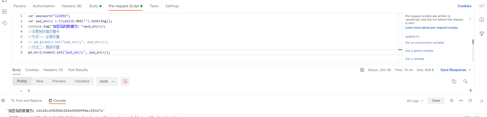

# Postman调试加密接口

Postman 是一款非常流行且易用的 API 调试工具，在接口调试或测试时经常被使用，针对普通 API 接口，我们可以直接在 Postman 中输入 URL、Query String、Header、Data 来模拟发送一个 HTTP 请求，但是，针对「 加密接口 」的调试及测试，我们怎么来做呢？

## CryptoJS 及 Pre-request Script
CryptoJS 是一个使用 JavaScript 实现的加密算法库
它支持的算法包含：

- Base64
- MD5
- SHA-1 和 SHA-256
- AES
- Rabbit
- MARC4
- HMAC、HMAC-MD5、HMAC-SHA1、HMAC-SHA256
- PBKDF2

在 Postman 中有一个 Tab 「 Pre-request Script 」，它能在请求之前做一些预处理
比如，可以使用 CryptoJS 先对变量进行加密，然后设置到变量中，最后在真实请求时使用这个变量。

```java
var password="123456";
var pwd_encry = CryptoJS.MD5("").toString();
console.log("加密后的数据为："+pwd_encry);
//设置到环境变量中
//方式一：全局变量
// pm.globals.set("pwd_encry", pwd_encry);
//方式二：局部变量
pm.environment.set("pwd_encry", pwd_encry);
```



Postman 可以借助 CryptoJS 完成大部分数据的加密，但是它并不支持 RSA 算法
这里可以使用另外一个算法库「 forgeJS 」来进行 RSA 的加解密
项目地址：https://github.com/digitalbazaar/forge