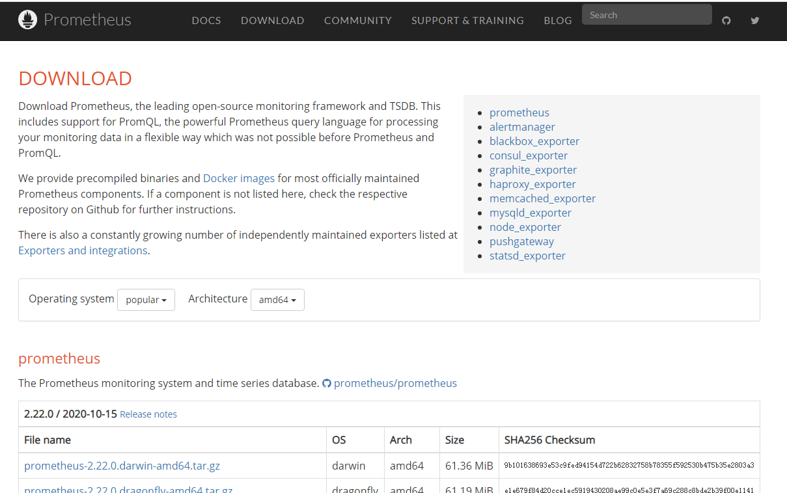
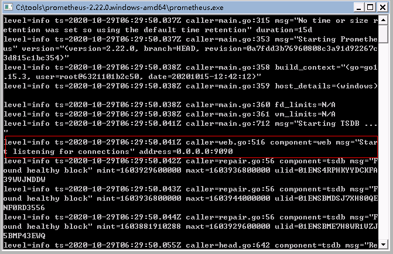
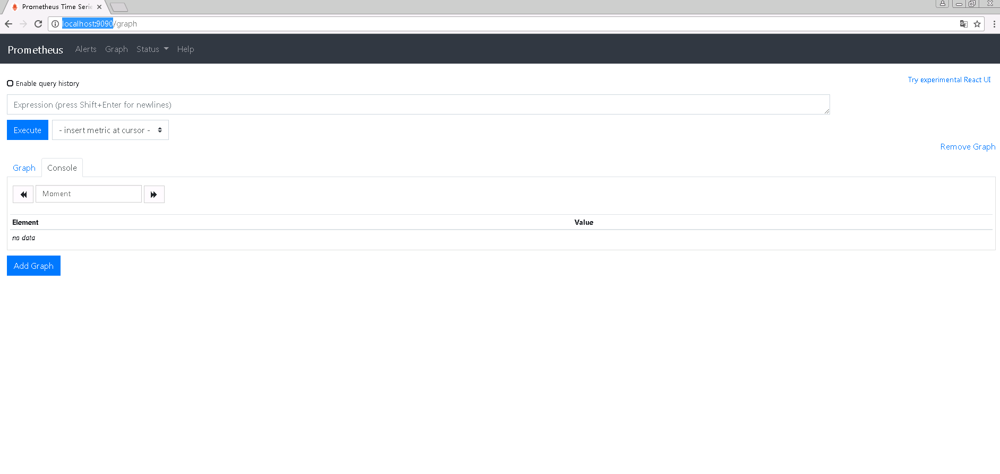
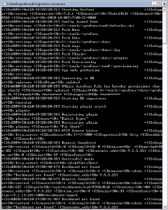
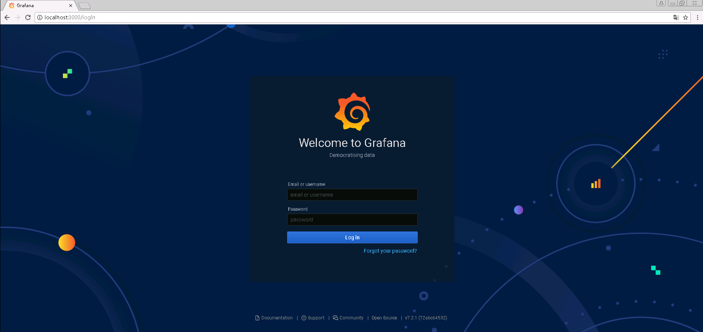

# Prometheus服务端部署

## 一、安装Prometheus

官网：https://prometheus.io/

根据自己的系统版本，下载对应的安装包或组件包。（Prometheus支持docker镜像）

由于使用Windows压力机作为服务器，因此本次选择prometheus-2.22.0.windows-amd64.tar.gz进行下载。

下载后，解压文件。

双击prometheus.exe运行

在本地打开浏览器，输入[http://localhost:9090](http://localhost:9090/)，出现如图界面，则安装Prometheus成功。

Prometheus自带的图形并不够强大，于是我们可以使用Grafana作为Prometheus的Dashboard。

## 二、安装Grafana

由于压缩包超过限制，无法上传，可自行下载，解压后，执行bin/grafana-server.exe

通过本地浏览器访问地址：[http://localhost:3000](http://localhost:3000/)，出现下图，则表示Grafana安装成功。

默认登录用户名密码均为admin，首次登录后需要修改密码。