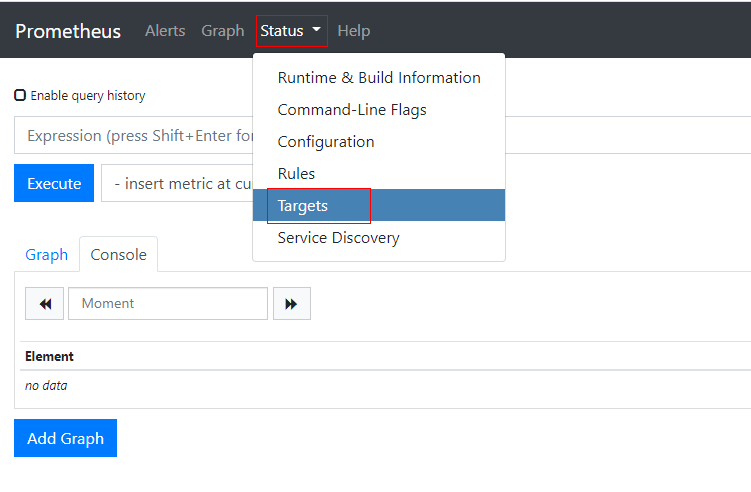
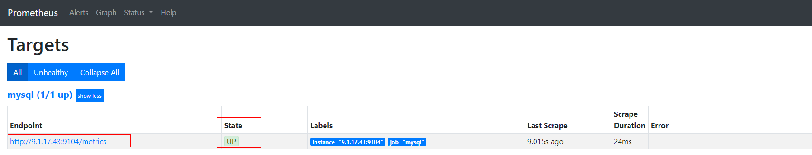
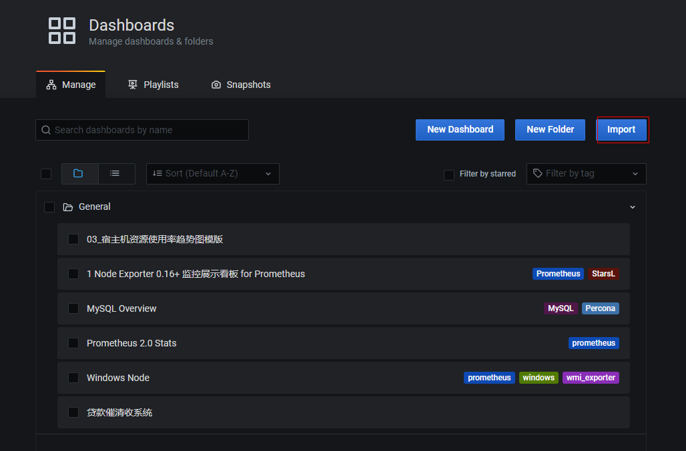
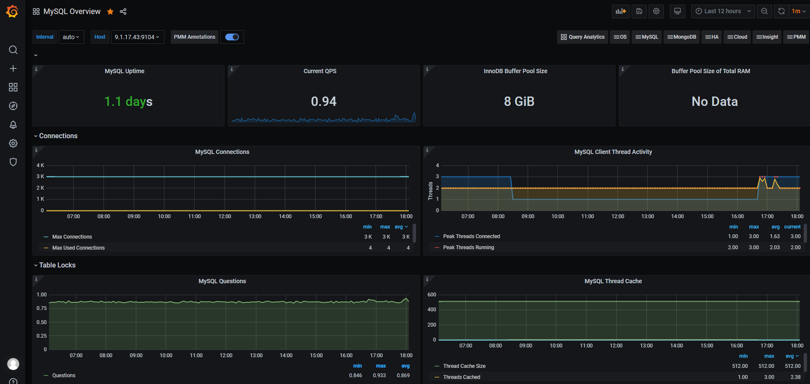

# Prometheus监控MySQL数据库

## 1.下载安装mysqld_exporter

mysqld_exporter-0.12.1.linux-amd64.tar.gz
mysqld_exporter-0.12.1.windows-amd64.tar.gz

根据服务器不同的操作系统，选择对应的版本。

本次以linux服务器为例。
```shell
tar -xvf mysqld_exporter-0.12.1.linux-amd64.tar.gz
cd mysqld_exporter-0.12.1.linux-amd64.tar.gz
chmod +x mysqld_exporter 
```
## 2.在数据库中添加对应的用户以及权限

因为mysqld_export需要通过连接数据库去获取监控数据，因此先给它创建一个用户，并赋予对应的权限。
```sql
GRANT REPLICATION CLIENT, PROCESS ON . TO 'exporter'@'localhost' identified by 'exporter';
GRANT SELECT ON performance_schema.* TO 'exporter'@'localhost';
flush privileges;
```
## 3.在同目录下，创建mysqld_export启动使用的配置文件
```shell
vim .my.cnf
```
内容如下：
```shell
[client]
user=exporter
password=exporter
```
## 4.执行mysqld_export
```shell
./mysqld_export -config.my_cfg=".my.cnf"
```
## 5.验证能否正常获取到监控数据

浏览器访问服务器ip:9104/metrics，能够正常看到数据即为正常。


## 6.Prometheus配置中添加数据库节点

修改prometheus.yml加入MySql节点：
```xml
\- job_name: 'mysql'
static_configs:
\- targets: ['9.1.17.43:9104']
```
保存文件后，重启Prometheus。

## 7.查看Prometheus能否获取到节点

打开Prometheus页面，默认服务器ip:9090





## 8.在Grafana添加对应的mysql监控模板

[mysql-overview_rev5.json](./images/mysql-overview_rev5.json)





选择刚才下载的json文件。

## 9.查看监控结果




# 其他：

## 1.配置alertmanager报警,添加prometheus配置：
```xml
alerting:
alertmanagers:
\- scheme: http
static_configs:
\- targets:
\- "10.100.110.171:9093"
rule_files:
\- /opt/prometheus/rules/mysql*.rules
```


## 2.制定mysql报警规则
```xml
groups:
\- name: MySQLStatsAlert
rules:
\- alert: MySQL is down
expr: mysql_up == 0
for: 1m
labels:
severity: critical
annotations:
summary: "Instance {{ $labels.instance }} MySQL is down"
description: "MySQL database is down. This requires immediate action!"
\- alert: open files high
expr: mysql_global_status_innodb_num_open_files > (mysql_global_variables_open_files_limit) * 0.75
for: 1m
labels:
severity: warning
annotations:
summary: "Instance {{ $labels.instance }} open files high"
description: "Open files is high. Please consider increasing open_files_limit."
\- alert: Read buffer size is bigger than max. allowed packet size
expr: mysql_global_variables_read_buffer_size > mysql_global_variables_slave_max_allowed_packet
for: 1m
labels:
severity: warning
annotations:
summary: "Instance {{ $labels.instance }} Read buffer size is bigger than max. allowed packet size"
description: "Read buffer size (read_buffer_size) is bigger than max. allowed packet size (max_allowed_packet).This can break your replication."
\- alert: Sort buffer possibly missconfigured
expr: mysql_global_variables_innodb_sort_buffer_size <256*1024 or mysql_global_variables_read_buffer_size > 4*1024*1024
for: 1m
labels:
severity: warning
annotations:
summary: "Instance {{ $labels.instance }} Sort buffer possibly missconfigured"
description: "Sort buffer size is either too big or too small. A good value for sort_buffer_size is between 256k and 4M."
\- alert: Thread stack size is too small
expr: mysql_global_variables_thread_stack <196608
for: 1m
labels:
severity: warning
annotations:
summary: "Instance {{ $labels.instance }} Thread stack size is too small"
description: "Thread stack size is too small. This can cause problems when you use Stored Language constructs for example. A typical is 256k for thread_stack_size."
\- alert: Used more than 80% of max connections limited
expr: mysql_global_status_max_used_connections > mysql_global_variables_max_connections * 0.8
for: 1m
labels:
severity: warning
annotations:
summary: "Instance {{ $labels.instance }} Used more than 80% of max connections limited"
description: "Used more than 80% of max connections limited"
\- alert: InnoDB Force Recovery is enabled
expr: mysql_global_variables_innodb_force_recovery != 0
for: 1m
labels:
severity: warning
annotations:
summary: "Instance {{ $labels.instance }} InnoDB Force Recovery is enabled"
description: "InnoDB Force Recovery is enabled. This mode should be used for data recovery purposes only. It prohibits writing to the data."
\- alert: InnoDB Log File size is too small
expr: mysql_global_variables_innodb_log_file_size < 16777216
for: 1m
labels:
severity: warning
annotations:
summary: "Instance {{ $labels.instance }} InnoDB Log File size is too small"
description: "The InnoDB Log File size is possibly too small. Choosing a small InnoDB Log File size can have significant performance impacts."
\- alert: InnoDB Flush Log at Transaction Commit
expr: mysql_global_variables_innodb_flush_log_at_trx_commit != 1
for: 1m
labels:
severity: warning
annotations:
summary: "Instance {{ $labels.instance }} InnoDB Flush Log at Transaction Commit"
description: "InnoDB Flush Log at Transaction Commit is set to a values != 1. This can lead to a loss of commited transactions in case of a power failure."
\- alert: Table definition cache too small
expr: mysql_global_status_open_table_definitions > mysql_global_variables_table_definition_cache
for: 1m
labels:
severity: page
annotations:
summary: "Instance {{ $labels.instance }} Table definition cache too small"
description: "Your Table Definition Cache is possibly too small. If it is much too small this can have significant performance impacts!"
\- alert: Table open cache too small
expr: mysql_global_status_open_tables >mysql_global_variables_table_open_cache * 99/100
for: 1m
labels:
severity: page
annotations:
summary: "Instance {{ $labels.instance }} Table open cache too small"
description: "Your Table Open Cache is possibly too small (old name Table Cache). If it is much too small this can have significant performance impacts!"
\- alert: Thread stack size is possibly too small
expr: mysql_global_variables_thread_stack < 262144
for: 1m
labels:
severity: page
annotations:
summary: "Instance {{ $labels.instance }} Thread stack size is possibly too small"
description: "Thread stack size is possibly too small. This can cause problems when you use Stored Language constructs for example. A typical is 256k for thread_stack_size."
\- alert: InnoDB Buffer Pool Instances is too small
expr: mysql_global_variables_innodb_buffer_pool_instances == 1
for: 1m
labels:
severity: page
annotations:
summary: "Instance {{ $labels.instance }} InnoDB Buffer Pool Instances is too small"
description: "If you are using MySQL 5.5 and higher you should use several InnoDB Buffer Pool Instances for performance reasons. Some rules are: InnoDB Buffer Pool Instance should be at least 1 Gbyte in size. InnoDB Buffer Pool Instances you can set equal to the number of cores of your machine."
\- alert: InnoDB Plugin is enabled
expr: mysql_global_variables_ignore_builtin_innodb == 1
for: 1m
labels:
severity: page
annotations:
summary: "Instance {{ $labels.instance }} InnoDB Plugin is enabled"
description: "InnoDB Plugin is enabled"
\- alert: Binary Log is disabled
expr: mysql_global_variables_log_bin != 1
for: 1m
labels:
severity: warning
annotations:
summary: "Instance {{ $labels.instance }} Binary Log is disabled"
description: "Binary Log is disabled. This prohibits you to do Point in Time Recovery (PiTR)."
\- alert: Binlog Cache size too small
expr: mysql_global_variables_binlog_cache_size < 1048576
for: 1m
labels:
severity: page
annotations:
summary: "Instance {{ $labels.instance }} Binlog Cache size too small"
description: "Binlog Cache size is possibly to small. A value of 1 Mbyte or higher is OK."
\- alert: Binlog Statement Cache size too small
expr: mysql_global_variables_binlog_stmt_cache_size <1048576 and mysql_global_variables_binlog_stmt_cache_size > 0
for: 1m
labels:
severity: page
annotations:
summary: "Instance {{ $labels.instance }} Binlog Statement Cache size too small"
description: "Binlog Statement Cache size is possibly to small. A value of 1 Mbyte or higher is typically OK."
\- alert: Binlog Transaction Cache size too small
expr: mysql_global_variables_binlog_cache_size <1048576
for: 1m
labels:
severity: page
annotations:
summary: "Instance {{ $labels.instance }} Binlog Transaction Cache size too small"
description: "Binlog Transaction Cache size is possibly to small. A value of 1 Mbyte or higher is typically OK."
\- alert: Sync Binlog is enabled
expr: mysql_global_variables_sync_binlog == 1
for: 1m
labels:
severity: page
annotations:
summary: "Instance {{ $labels.instance }} Sync Binlog is enabled"
description: "Sync Binlog is enabled. This leads to higher data security but on the cost of write performance."
\- alert: IO thread stopped
expr: mysql_slave_status_slave_io_running != 1
for: 1m
labels:
severity: critical
annotations:
summary: "Instance {{ $labels.instance }} IO thread stopped"
description: "IO thread has stopped. This is usually because it cannot connect to the Master any more."
\- alert: SQL thread stopped
expr: mysql_slave_status_slave_sql_running == 0
for: 1m
labels:
severity: critical
annotations:
summary: "Instance {{ $labels.instance }} SQL thread stopped"
description: "SQL thread has stopped. This is usually because it cannot apply a SQL statement received from the master."
\- alert: SQL thread stopped
expr: mysql_slave_status_slave_sql_running != 1
for: 1m
labels:
severity: critical
annotations:
summary: "Instance {{ $labels.instance }} Sync Binlog is enabled"
description: "SQL thread has stopped. This is usually because it cannot apply a SQL statement received from the master."
\- alert: Slave lagging behind Master
expr: rate(mysql_slave_status_seconds_behind_master[1m]) >30
for: 1m
labels:
severity: warning
annotations:
summary: "Instance {{ $labels.instance }} Slave lagging behind Master"
description: "Slave is lagging behind Master. Please check if Slave threads are running and if there are some performance issues!"
\- alert: Slave is NOT read only(Please ignore this warning indicator.)
expr: mysql_global_variables_read_only != 0
for: 1m
labels:
severity: page
annotations:
summary: "Instance {{ $labels.instance }} Slave is NOT read only"
description: "Slave is NOT set to read only. You can accidentally manipulate data on the slave and get inconsistencies..."
```
## 3.将mysqld_export添加为系统服务

添加系统服务：vi /usr/lib/systemd/system/mysql_exporter.service
```shell
[Unit]
Description=[https://prometheus.io](https://prometheus.io/)
[Service]
Restart=on-failureExecStart=/usr/local/mysql_exporter/mysqld_exporter --[config.my](http://config.my/)-cnf=.my.cnf
[Install]
WantedBy=multi-user.target
```


添加后可以使用
```shell
systemctl restart mysql_exporter.service 重启服务
systemctl stop mysql_exporter.service   停止服务
systemctl start mysql_exporter.service  启动服务
```