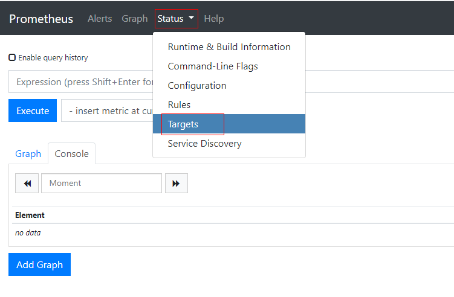
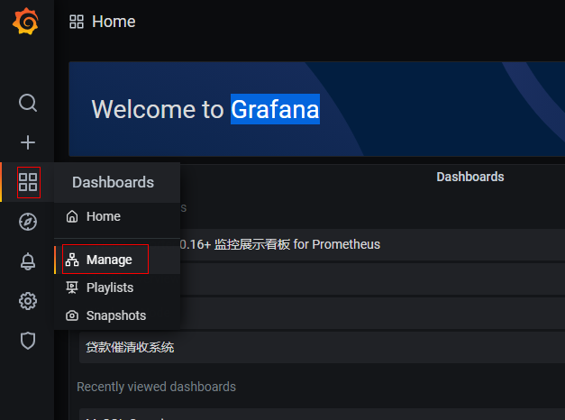
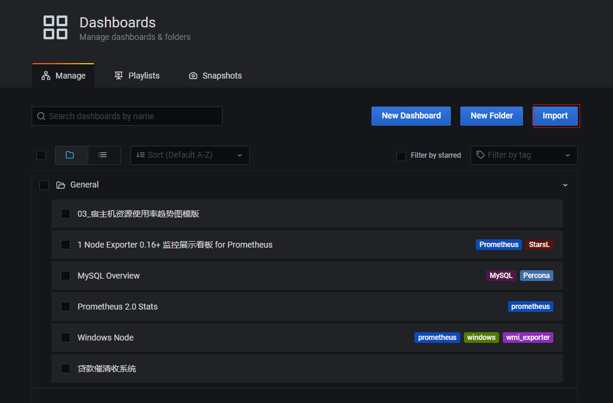
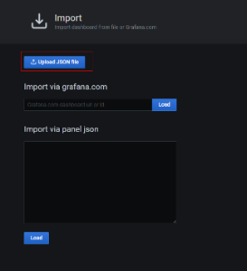

[TOC]
# Promethues监控工具
## 一、简介
[官网](https://prometheus.io/)

Prometheus 是一套开源的系统监控报警框架。它启发于 Google 的 borgmon 监控系统，由工作在 SoundCloud 的 google 前员工在 2012 年创建，作为社区开源项目进行开发，并于 2015 年正式发布。2016 年，Prometheus 正式加入 Cloud Native Computing Foundation，成为受欢迎度仅次于 Kubernetes 的项目。

作为新一代的监控框架，Prometheus 具有以下特点：

1. 强大的多维度数据模型：
    - 时间序列数据通过 metric 名和键值对来区分。
    - 所有的 metrics 都可以设置任意的多维标签。
    - 数据模型更随意，不需要刻意设置为以点分隔的字符串。
    - 可以对数据模型进行聚合，切割和切片操作。
    - 支持双精度浮点类型，标签可以设为全 unicode。
    - 灵活而强大的查询语句（PromQL）：在同一个查询语句，可以对多个 metrics 进行乘法、加法、连接、取分数位等操作。
2. 易于管理： Prometheus server 是一个单独的二进制文件，可直接在本地工作，不依赖于分布式存储。
3. 高效：平均每个采样点仅占 3.5 bytes，且一个 Prometheus server 可以处理数百万的 metrics。
4. 使用 pull 模式采集时间序列数据，这样不仅有利于本机测试而且可以避免有问题的服务器推送坏的 metrics。
5. 可以采用 push gateway 的方式把时间序列数据推送至 Prometheus server 端。
6. 可以通过服务发现或者静态配置去获取监控的 targets。
7. 有多种可视化图形界面。
8. 易于伸缩。


需要指出的是，由于数据采集可能会有丢失，所以 Prometheus 不适用对采集数据要 100% 准确的情形。但如果用于记录时间序列数据，Prometheus 具有很大的查询优势，此外，Prometheus 适用于微服务的体系架构。

### 1.1 Prometheus 组成及架构

Prometheus 生态圈中包含了多个组件，其中许多组件是可选的：

- Prometheus Server: 用于收集和存储时间序列数据。
- Client Library: 客户端库，为需要监控的服务生成相应的 metrics 并暴露给 Prometheus server。当 Prometheus server 来 pull 时，直接返回实时状态的 metrics。
- Push Gateway: 主要用于短期的 jobs。由于这类 jobs 存在时间较短，可能在 Prometheus 来 pull 之前就消失了。为此，这次 jobs 可以直接向 Prometheus server 端推送它们的 metrics。这种方式主要用于服务层面的 metrics，对于机器层面的 metrices，需要使用 node exporter。
- Exporters: 用于暴露已有的第三方服务的 metrics 给 Prometheus。
- Alertmanager: 从 Prometheus server 端接收到 alerts 后，会进行去除重复数据，分组，并路由到对收的接受方式，发出报警。常见的接收方式有：电子邮件，pagerduty，OpsGenie, webhook 等。


从上图可以看出，Prometheus 的主要模块包括：Prometheus server, exporters, Pushgateway, PromQL, Alertmanager 以及图形界面。

其大概的工作流程是：

- Prometheus server 定期从配置好的 jobs 或者 exporters 中拉 metrics，或者接收来自Pushgateway 发过来的 metrics，或者从其他的 Prometheus server 中拉 metrics。
- Prometheus server 在本地存储收集到的 metrics，并运行已定义好的 alert.rules，记录新的时间序列或者向 Alertmanager 推送警报。
- Alertmanager 根据配置文件，对接收到的警报进行处理，发出告警。
- 在图形界面中，可视化采集数据。
## 二、工具服务端部署
### 2.1 Prometheus Server 部署（常规部署）
[Promethues下载](https://github.com/prometheus/prometheus/releases/tag/v2.24.1)


根据自己的系统架构版本选择对应的安装包进行下载,可使用wget命令。

安装步骤：
1. tar zxvf prometheus-2.24.1.linux-amd64.tar.gz
2. 修改目录下的prometheus.yml文件，主要是targets下的IP地址。
3. ./prometheus执行即可，配合nohup command &后台执行。
4. 根据实际情况考虑是否添加对应的用户、组信息、开机是否自启等。
	- groupadd prometheus #添加 prometheus用户组
	- useradd -g prometheus -s /sbin/nologin prometheus	#添加prometheus用户到对应组
	- chown -R prometheus:prometheus /usr/local/prometheus/	#将对应路径用户修改为prometheus
	- mkdir -p /home/software/prometheus-data	#创建监控数据存放路径
	- chown -R prometheus:prometheus /home/software/prometheus-data	#对应路径赋权
	- 创建开机启动项
		-  touch /usr/lib/systemd/system/prometheus.service
		-  chown prometheus:prometheus /usr/lib/systemd/system/prometheus.service
		-  vim /usr/lib/systemd/system/prometheus.service
		```shell
[Unit]
Description=Prometheus
Documentation=https://prometheus.io/
After=network.target
[Service]
#Type设置为notify时，服务会不断重启
Type=simple
User=prometheus
#--storage.tsdb.path是可选项，默认数据目录在运行目录的./dada目录中
ExecStart=/usr/local/prometheus/prometheus --config.file=/usr/local/prometheus/prometheus.yml --storage.tsdb.path=/home/software/prometheus-data
Restart=on-failure
[Install]
WantedBy=multi-user.target
		```
		- systemctl enable prometheus	#打开开机自启项
		- systemctl start prometheus	#启动服务
		- systemctl status prometheus	#查看服务状态

*注：windows下直接prometheus-2.24.1.windows-amd64.zip，解压后修改prometheus.yml文件，运行prometheus.exe即可。*
### 2.2 Prometheus Server 部署（docker部署）
- docker search prometheus
- docker pull prometheus
- docker run --name prometheus -d -p 127.0.0.1:9090:9090 prom/prometheus


### 2.3 Grafana部署(rpm安装)
[Grafana下载](https://grafana.com/grafana/download?platform=linux)
```
wget https://dl.grafana.com/oss/release/grafana-7.3.7-1.x86_64.rpm
sudo yum install grafana-7.3.7-1.x86_64.rpm
#启动
service grafana-server start
#加入开机启动
/sbin/chkconfig --add grafana-server
```
### 2.4 Grafana部署(编译安装)
```
wget https://dl.grafana.com/oss/release/grafana-7.3.7.linux-amd64.tar.gz
tar -zxvf grafana-7.3.7.linux-amd64.tar.gz
#启动
./bin/grafana-server
#后台启动
nohup ./grafana-server >/dev/null 2>&1 &
```

### 2.5 Grafana部署(docker安装)
```
Docker(Alpine base image)
docker run -d --name=grafana -p 3000:3000 grafana/grafana
Docker(Ubuntu base image)
docker run -d --name=grafana -p 3000:3000 grafana/grafana:7.3.7-ubuntu
```

windows下选择msi安装包或者zip压缩包，安装/解压后执行grafana-server.exe即可
## 三、监控端服务部署
Exporter
负责数据汇报的程序统一叫Exporter，不同的Exporter负责不同的业务。其统一命名格式：xx_exporter

[目前已有的export](https://prometheus.io/docs/instrumenting/exporters/#exporters-and-integrations)

<h3 id="databases">Databases<a class="header-anchor" href="#databases" name="databases"></a>
</h3>

<ul>
<li><a href="https://github.com/aerospike/aerospike-prometheus-exporter">Aerospike exporter</a></li>
<li><a href="https://github.com/f1yegor/clickhouse_exporter">ClickHouse exporter</a></li>
<li>
<a href="https://github.com/prometheus/consul_exporter">Consul exporter</a> (<strong>official</strong>)</li>
<li><a href="https://github.com/blakelead/couchbase_exporter">Couchbase exporter</a></li>
<li><a href="https://github.com/gesellix/couchdb-exporter">CouchDB exporter</a></li>
<li><a href="https://github.com/opstree/druid-exporter">Druid Exporter</a></li>
<li><a href="https://github.com/justwatchcom/elasticsearch_exporter">ElasticSearch exporter</a></li>
<li><a href="https://github.com/marcinbudny/eventstore_exporter">EventStore exporter</a></li>
<li><a href="https://github.com/fagnercarvalho/prometheus-iotdb-exporter">IoTDB exporter</a></li>
<li><a href="https://github.com/KxSystems/prometheus-kdb-exporter">KDB+ exporter</a></li>
<li>
<a href="https://github.com/prometheus/memcached_exporter">Memcached exporter</a> (<strong>official</strong>)</li>
<li><a href="https://github.com/dcu/mongodb_exporter">MongoDB exporter</a></li>
<li><a href="https://github.com/raffis/mongodb-query-exporter">MongoDB query exporter</a></li>
<li><a href="https://github.com/awaragi/prometheus-mssql-exporter">MSSQL server exporter</a></li>
<li><a href="https://github.com/rluisr/mysqlrouter_exporter">MySQL router exporter</a></li>
<li>
<a href="https://github.com/prometheus/mysqld_exporter">MySQL server exporter</a> (<strong>official</strong>)</li>
<li><a href="https://github.com/cloudflare/opentsdb_exporter">OpenTSDB Exporter</a></li>
<li><a href="https://github.com/iamseth/oracledb_exporter">Oracle DB Exporter</a></li>
<li><a href="https://github.com/prometheus-community/pgbouncer_exporter">PgBouncer exporter</a></li>
<li><a href="https://github.com/wrouesnel/postgres_exporter">PostgreSQL exporter</a></li>
<li><a href="https://github.com/yahoojapan/presto_exporter">Presto exporter</a></li>
<li><a href="https://github.com/percona/proxysql_exporter">ProxySQL exporter</a></li>
<li><a href="https://github.com/marcinbudny/ravendb_exporter">RavenDB exporter</a></li>
<li><a href="https://github.com/oliver006/redis_exporter">Redis exporter</a></li>
<li><a href="https://github.com/oliver006/rethinkdb_exporter">RethinkDB exporter</a></li>
<li><a href="https://github.com/free/sql_exporter">SQL exporter</a></li>
<li><a href="https://github.com/tarantool/metrics">Tarantool metric library</a></li>
<li><a href="https://github.com/stuartnelson3/twemproxy_exporter">Twemproxy</a></li>
</ul>

<h3 id="hardware-related">Hardware related<a class="header-anchor" href="#hardware-related" name="hardware-related"></a>
</h3>

<ul>
<li><a href="https://github.com/mdlayher/apcupsd_exporter">apcupsd exporter</a></li>
<li><a href="https://github.com/ExpressenAB/bigip_exporter">BIG-IP exporter</a></li>
<li><a href="https://github.com/David-Igou/bsbmp-exporter">Bosch Sensortec BMP/BME exporter</a></li>
<li><a href="https://github.com/soundcloud/collins_exporter">Collins exporter</a></li>
<li><a href="https://github.com/galexrt/dellhw_exporter">Dell Hardware OMSA exporter</a></li>
<li><a href="https://github.com/bluecmd/fortigate_exporter">Fortigate exporter</a></li>
<li><a href="https://github.com/zhmcclient/zhmc-prometheus-exporter">IBM Z HMC exporter</a></li>
<li><a href="https://github.com/roman-vynar/edison_exporter">IoT Edison exporter</a></li>
<li><a href="https://github.com/soundcloud/ipmi_exporter">IPMI exporter</a></li>
<li><a href="https://github.com/RichiH/knxd_exporter">knxd exporter</a></li>
<li><a href="https://github.com/RichiH/modbus_exporter">Modbus exporter</a></li>
<li><a href="https://github.com/ickymettle/netgear_cm_exporter">Netgear Cable Modem Exporter</a></li>
<li><a href="https://github.com/DRuggeri/netgear_exporter">Netgear Router exporter</a></li>
<li><a href="https://github.com/DRuggeri/nut_exporter">Network UPS Tools (NUT) exporter</a></li>
<li>
<a href="https://github.com/prometheus/node_exporter">Node/system metrics exporter</a> (<strong>official</strong>)</li>
<li><a href="https://github.com/mindprince/nvidia_gpu_prometheus_exporter">NVIDIA GPU exporter</a></li>
<li><a href="https://github.com/dalance/prosafe_exporter">ProSAFE exporter</a></li>
<li><a href="https://github.com/mdlayher/unifi_exporter">Ubiquiti UniFi exporter</a></li>
<li><a href="https://github.com/jeremybz/waveplus_exporter">Waveplus Radon Sensor Exporter</a></li>
<li><a href="https://github.com/branttaylor/watchdog-prometheus-exporter">Weathergoose Climate Monitor Exporter</a></li>
<li><a href="https://github.com/prometheus-community/windows_exporter">Windows exporter</a></li>
</ul>

<h3 id="issue-trackers-and-continuous-integration">Issue trackers and continuous integration<a class="header-anchor" href="#issue-trackers-and-continuous-integration" name="issue-trackers-and-continuous-integration"></a>
</h3>

<ul>
<li><a href="https://github.com/AndreyVMarkelov/bamboo-prometheus-exporter">Bamboo exporter</a></li>
<li><a href="https://github.com/AndreyVMarkelov/prom-bitbucket-exporter">Bitbucket exporter</a></li>
<li><a href="https://github.com/AndreyVMarkelov/prom-confluence-exporter">Confluence exporter</a></li>
<li><a href="https://github.com/lovoo/jenkins_exporter">Jenkins exporter</a></li>
<li><a href="https://github.com/AndreyVMarkelov/jira-prometheus-exporter">JIRA exporter</a></li>
</ul>

<h3 id="messaging-systems">Messaging systems<a class="header-anchor" href="#messaging-systems" name="messaging-systems"></a>
</h3>

<ul>
<li><a href="https://github.com/messagebird/beanstalkd_exporter">Beanstalkd exporter</a></li>
<li><a href="https://github.com/nuvo/emq_exporter">EMQ exporter</a></li>
<li><a href="https://github.com/bakins/gearman-exporter">Gearman exporter</a></li>
<li><a href="https://github.com/ibm-messaging/mq-metric-samples/tree/master/cmd/mq_prometheus">IBM MQ exporter</a></li>
<li><a href="https://github.com/danielqsj/kafka_exporter">Kafka exporter</a></li>
<li><a href="https://github.com/nats-io/prometheus-nats-exporter">NATS exporter</a></li>
<li><a href="https://github.com/lovoo/nsq_exporter">NSQ exporter</a></li>
<li><a href="https://github.com/vynca/mirth_exporter">Mirth Connect exporter</a></li>
<li><a href="https://github.com/inovex/mqtt_blackbox_exporter">MQTT blackbox exporter</a></li>
<li><a href="https://github.com/hikhvar/mqtt2prometheus">MQTT2Prometheus</a></li>
<li><a href="https://github.com/kbudde/rabbitmq_exporter">RabbitMQ exporter</a></li>
<li><a href="https://github.com/deadtrickster/prometheus_rabbitmq_exporter">RabbitMQ Management Plugin exporter</a></li>
<li><a href="https://github.com/apache/rocketmq-exporter">RocketMQ exporter</a></li>
<li><a href="https://github.com/solacecommunity/solace-prometheus-exporter">Solace exporter</a></li>
</ul>

<h3 id="storage">Storage<a class="header-anchor" href="#storage" name="storage"></a>
</h3>

<ul>
<li><a href="https://github.com/digitalocean/ceph_exporter">Ceph exporter</a></li>
<li><a href="https://github.com/blemmenes/radosgw_usage_exporter">Ceph RADOSGW exporter</a></li>
<li><a href="https://github.com/ofesseler/gluster_exporter">Gluster exporter</a></li>
<li><a href="https://github.com/treydock/gpfs_exporter">GPFS exporter</a></li>
<li><a href="https://github.com/marcelmay/hadoop-hdfs-fsimage-exporter">Hadoop HDFS FSImage exporter</a></li>
<li><a href="https://github.com/HewlettPackard/lustre_exporter">Lustre exporter</a></li>
<li><a href="https://github.com/treydock/eseries_exporter">NetApp E-Series exporter</a></li>
<li><a href="https://github.com/syepes/sio2prom">ScaleIO exporter</a></li>
<li><a href="https://github.com/treydock/tsm_exporter">Tivoli Storage Manager/IBM Spectrum Protect exporter</a></li>
</ul>

<h3 id="http">HTTP<a class="header-anchor" href="#http" name="http"></a>
</h3>

<ul>
<li><a href="https://github.com/Lusitaniae/apache_exporter">Apache exporter</a></li>
<li>
<a href="https://github.com/prometheus/haproxy_exporter">HAProxy exporter</a> (<strong>official</strong>)</li>
<li><a href="https://github.com/knyar/nginx-lua-prometheus">Nginx metric library</a></li>
<li><a href="https://github.com/hnlq715/nginx-vts-exporter">Nginx VTS exporter</a></li>
<li><a href="https://github.com/stuartnelson3/passenger_exporter">Passenger exporter</a></li>
<li><a href="https://github.com/boynux/squid-exporter">Squid exporter</a></li>
<li><a href="https://github.com/igzivkov/tinyproxy_exporter">Tinyproxy exporter</a></li>
<li><a href="https://github.com/jonnenauha/prometheus_varnish_exporter">Varnish exporter</a></li>
<li><a href="https://github.com/mattbostock/webdriver_exporter">WebDriver exporter</a></li>
</ul>

<h3 id="apis">APIs<a class="header-anchor" href="#apis" name="apis"></a>
</h3>

<ul>
<li><a href="https://github.com/slok/ecs-exporter">AWS ECS exporter</a></li>
<li><a href="https://github.com/Jimdo/aws-health-exporter">AWS Health exporter</a></li>
<li><a href="https://github.com/jmal98/sqs_exporter">AWS SQS exporter</a></li>
<li><a href="https://github.com/FXinnovation/azure-health-exporter">Azure Health exporter</a></li>
<li><a href="https://github.com/greenstatic/bigbluebutton-exporter">BigBlueButton</a></li>
<li><a href="https://github.com/wehkamp/docker-prometheus-cloudflare-exporter">Cloudflare exporter</a></li>
<li><a href="https://github.com/nbarrientos/cryptowat_exporter">Cryptowat exporter</a></li>
<li><a href="https://github.com/metalmatze/digitalocean_exporter">DigitalOcean exporter</a></li>
<li><a href="https://github.com/infinityworksltd/docker-cloud-exporter">Docker Cloud exporter</a></li>
<li><a href="https://github.com/infinityworksltd/docker-hub-exporter">Docker Hub exporter</a></li>
<li><a href="https://github.com/peterbourgon/fastly-exporter">Fastly exporter</a></li>
<li><a href="https://github.com/infinityworksltd/github-exporter">GitHub exporter</a></li>
<li><a href="https://github.com/jamesread/prometheus-gmail-exporter/">Gmail exporter</a></li>
<li><a href="https://github.com/fcgravalos/instaclustr_exporter">InstaClustr exporter</a></li>
<li><a href="https://github.com/Jimdo/observatory-exporter">Mozilla Observatory exporter</a></li>
<li><a href="https://github.com/RichiH/openweathermap_exporter">OpenWeatherMap exporter</a></li>
<li><a href="https://github.com/foomo/pagespeed_exporter">Pagespeed exporter</a></li>
<li><a href="https://github.com/infinityworksltd/prometheus-rancher-exporter">Rancher exporter</a></li>
<li><a href="https://github.com/nlamirault/speedtest_exporter">Speedtest exporter</a></li>
<li><a href="https://github.com/lukasmalkmus/tankerkoenig_exporter">Tankerkönig API Exporter</a></li>
</ul>

<h3 id="logging">Logging<a class="header-anchor" href="#logging" name="logging"></a>
</h3>

<ul>
<li><a href="https://github.com/V3ckt0r/fluentd_exporter">Fluentd exporter</a></li>
<li><a href="https://github.com/google/mtail">Google's mtail log data extractor</a></li>
<li><a href="https://github.com/fstab/grok_exporter">Grok exporter</a></li>
</ul>

<h3 id="other-monitoring-systems">Other monitoring systems<a class="header-anchor" href="#other-monitoring-systems" name="other-monitoring-systems"></a>
</h3>

<ul>
<li><a href="https://github.com/ExpressenAB/cloudmonitor_exporter">Akamai Cloudmonitor exporter</a></li>
<li><a href="https://github.com/aylei/aliyun-exporter">Alibaba Cloudmonitor exporter</a></li>
<li>
<a href="https://github.com/prometheus/cloudwatch_exporter">AWS CloudWatch exporter</a> (<strong>official</strong>)</li>
<li><a href="https://github.com/RobustPerception/azure_metrics_exporter">Azure Monitor exporter</a></li>
<li><a href="https://github.com/cloudfoundry-community/firehose_exporter">Cloud Foundry Firehose exporter</a></li>
<li>
<a href="https://github.com/prometheus/collectd_exporter">Collectd exporter</a> (<strong>official</strong>)</li>
<li><a href="https://github.com/frodenas/stackdriver_exporter">Google Stackdriver exporter</a></li>
<li>
<a href="https://github.com/prometheus/graphite_exporter">Graphite exporter</a> (<strong>official</strong>)</li>
<li><a href="https://github.com/docker-infra/heka_exporter">Heka dashboard exporter</a></li>
<li><a href="https://github.com/imgix/heka_exporter">Heka exporter</a></li>
<li><a href="https://github.com/huaweicloud/cloudeye-exporter">Huawei Cloudeye exporter</a></li>
<li>
<a href="https://github.com/prometheus/influxdb_exporter">InfluxDB exporter</a> (<strong>official</strong>)</li>
<li><a href="https://github.com/rafal-szypulka/itm_exporter">ITM exporter</a></li>
<li><a href="https://github.com/fschlag/javamelody-prometheus-exporter">JavaMelody exporter</a></li>
<li>
<a href="https://github.com/prometheus/jmx_exporter">JMX exporter</a> (<strong>official</strong>)</li>
<li><a href="https://github.com/pvdh/munin_exporter">Munin exporter</a></li>
<li><a href="https://github.com/Griesbacher/Iapetos">Nagios / Naemon exporter</a></li>
<li><a href="https://github.com/mrf/newrelic_exporter">New Relic exporter</a></li>
<li><a href="https://github.com/robustperception/nrpe_exporter">NRPE exporter</a></li>
<li><a href="https://github.com/zwopir/osquery_exporter">Osquery exporter</a></li>
<li><a href="https://github.com/tiagoReichert/otc-cloudeye-prometheus-exporter">OTC CloudEye exporter</a></li>
<li><a href="https://github.com/giantswarm/prometheus-pingdom-exporter">Pingdom exporter</a></li>
<li><a href="https://github.com/tgulacsi/prometheus_scollector">scollector exporter</a></li>
<li><a href="https://github.com/reachlin/sensu_exporter">Sensu exporter</a></li>
<li><a href="https://github.com/svenstaro/site24x7_exporter">site24x7_exporter</a></li>
<li>
<a href="https://github.com/prometheus/snmp_exporter">SNMP exporter</a> (<strong>official</strong>)</li>
<li>
<a href="https://github.com/prometheus/statsd_exporter">StatsD exporter</a> (<strong>official</strong>)</li>
<li><a href="https://github.com/tencentyun/tencentcloud-exporter">TencentCloud monitor exporter</a></li>
<li><a href="https://github.com/sapcc/1000eyes_exporter">ThousandEyes exporter</a></li>
</ul>

<h3 id="miscellaneous">Miscellaneous<a class="header-anchor" href="#miscellaneous" name="miscellaneous"></a>
</h3>
<ul>
<li><a href="https://git.captnemo.in/nemo/prometheus-act-exporter">ACT Fibernet Exporter</a></li>
<li><a href="https://github.com/prometheus-community/bind_exporter">BIND exporter</a></li>
<li><a href="https://github.com/DRuggeri/bind_query_exporter">BIND query exporter</a></li>
<li><a href="https://github.com/LePetitBloc/bitcoind-exporter">Bitcoind exporter</a></li>
<li>
<a href="https://github.com/prometheus/blackbox_exporter">Blackbox exporter</a> (<strong>official</strong>)</li>
<li><a href="https://github.com/cloudfoundry-community/bosh_exporter">BOSH exporter</a></li>
<li><a href="https://github.com/google/cadvisor">cAdvisor</a></li>
<li><a href="https://github.com/ContaAzul/cachet_exporter">Cachet exporter</a></li>
<li><a href="https://github.com/virtualtam/ccache_exporter">ccache exporter</a></li>
<li><a href="https://github.com/lightningd/plugins/tree/master/prometheus">c-lightning exporter</a></li>
<li><a href="https://github.com/DRuggeri/dhcpd_leases_exporter">DHCPD leases exporter</a></li>
<li><a href="https://github.com/kumina/dovecot_exporter">Dovecot exporter</a></li>
<li><a href="https://github.com/google/dnsmasq_exporter">Dnsmasq exporter</a></li>
<li><a href="https://github.com/cloudflare/ebpf_exporter">eBPF exporter</a></li>
<li><a href="https://github.com/31z4/ethereum-prometheus-exporter">Ethereum Client exporter</a></li>
<li><a href="https://github.com/peimanja/artifactory_exporter">JFrog Artifactory Exporter</a></li>
<li><a href="https://github.com/Fundacio-i2CAT/hostapd_prometheus_exporter">Hostapd Exporter</a></li>
<li><a href="https://github.com/dgl/ircd_exporter">IRCd exporter</a></li>
<li><a href="https://github.com/ClusterLabs/ha_cluster_exporter">Linux HA ClusterLabs exporter</a></li>
<li><a href="https://github.com/johrstrom/jmeter-prometheus-plugin">JMeter plugin</a></li>
<li><a href="https://github.com/prometheus-community/json_exporter">JSON exporter</a></li>
<li><a href="https://github.com/apostvav/kannel_exporter">Kannel exporter</a></li>
<li><a href="https://github.com/giantswarm/prometheus-kemp-exporter">Kemp LoadBalancer exporter</a></li>
<li><a href="https://github.com/pjhampton/kibana-prometheus-exporter">Kibana Exporter</a></li>
<li><a href="https://github.com/kubernetes/kube-state-metrics">kube-state-metrics</a></li>
<li><a href="https://github.com/ContainerSolutions/locust_exporter">Locust Exporter</a></li>
<li><a href="https://atmospherejs.com/sevki/prometheus-exporter">Meteor JS web framework exporter</a></li>
<li><a href="https://github.com/Baughn/PrometheusIntegration">Minecraft exporter module</a></li>
<li><a href="https://gitlab.com/yakshaving.art/nomad-exporter">Nomad exporter</a></li>
<li><a href="https://github.com/Intrinsec/nftables_exporter">nftables exporter</a></li>
<li><a href="https://github.com/openstack-exporter/openstack-exporter">OpenStack exporter</a></li>
<li><a href="https://github.com/infraly/openstack_client_exporter">OpenStack blackbox exporter</a></li>
<li><a href="https://github.com/czerwonk/ovirt_exporter">oVirt exporter</a></li>
<li><a href="https://github.com/ContainerSolutions/pactbroker_exporter">Pact Broker exporter</a></li>
<li><a href="https://github.com/bakins/php-fpm-exporter">PHP-FPM exporter</a></li>
<li><a href="https://github.com/ledgr/powerdns_exporter">PowerDNS exporter</a></li>
<li><a href="https://github.com/ncabatoff/process-exporter">Process exporter</a></li>
<li><a href="https://github.com/mdlayher/rtorrent_exporter">rTorrent exporter</a></li>
<li><a href="https://github.com/phsmith/rundeck_exporter">Rundeck exporter</a></li>
<li><a href="https://github.com/msroest/sabnzbd_exporter">SABnzbd exporter</a></li>
<li><a href="https://github.com/adhocteam/script_exporter">Script exporter</a></li>
<li><a href="https://github.com/cloudfoundry-community/shield_exporter">Shield exporter</a></li>
<li><a href="https://github.com/SuperQ/smokeping_prober">Smokeping prober</a></li>
<li><a href="https://github.com/cherti/mailexporter">SMTP/Maildir MDA blackbox prober</a></li>
<li><a href="https://github.com/dalance/softether_exporter">SoftEther exporter</a></li>
<li><a href="https://github.com/treydock/ssh_exporter">SSH exporter</a></li>
<li><a href="https://github.com/hikhvar/ts3exporter">Teamspeak3 exporter</a></li>
<li><a href="https://github.com/metalmatze/transmission-exporter">Transmission exporter</a></li>
<li><a href="https://github.com/kumina/unbound_exporter">Unbound exporter</a></li>
<li><a href="https://github.com/MindFlavor/prometheus_wireguard_exporter">WireGuard exporter</a></li>
<li><a href="https://github.com/lovoo/xenstats_exporter">Xen exporter</a></li>
</ul>
<h2 id="software-exposing-prometheus-metrics">Software exposing Prometheus metrics<a class="header-anchor" href="#software-exposing-prometheus-metrics" name="software-exposing-prometheus-metrics"></a>
</h2>


<p>Some third-party software exposes metrics in the Prometheus format, so no
separate exporters are needed:</p>

<ul>
<li><a href="https://docs.ansible.com/ansible-tower/latest/html/administration/metrics.html">Ansible Tower (AWX)</a></li>
<li><a href="https://github.com/ot4i/ace-docker">App Connect Enterprise</a></li>
<li><a href="https://ballerina.io/">Ballerina</a></li>
<li><a href="https://github.com/baidu/bfe">BFE</a></li>
<li>
<a href="https://caddyserver.com/docs/metrics">Caddy</a> (<strong>direct</strong>)</li>
<li><a href="http://docs.ceph.com/docs/master/mgr/prometheus/">Ceph</a></li>
<li><a href="https://www.cockroachlabs.com/docs/stable/monitoring-and-alerting.html#prometheus-endpoint">CockroachDB</a></li>
<li><a href="https://collectd.org/wiki/index.php/Plugin:Write_Prometheus">Collectd</a></li>
<li><a href="https://concourse-ci.org/">Concourse</a></li>
<li>
<a href="https://github.com/rollerderby/scoreboard">CRG Roller Derby Scoreboard</a> (<strong>direct</strong>)</li>
<li><a href="https://docs.pushtechnology.com/docs/latest/manual/html/administratorguide/systemmanagement/r_statistics.html">Diffusion</a></li>
<li><a href="https://docs.docker.com/engine/reference/commandline/dockerd/#daemon-metrics">Docker Daemon</a></li>
<li>
<a href="https://github.com/youtube/doorman">Doorman</a> (<strong>direct</strong>)</li>
<li><a href="https://www.envoyproxy.io/docs/envoy/latest/operations/admin.html#get--stats?format=prometheus">Envoy</a></li>
<li>
<a href="https://github.com/coreos/etcd">Etcd</a> (<strong>direct</strong>)</li>
<li><a href="https://github.com/apache/flink">Flink</a></li>
<li><a href="https://www.freebsd.org/cgi/man.cgi?query=prometheus_sysctl_exporter&amp;apropos=0&amp;sektion=8&amp;manpath=FreeBSD+12-current&amp;arch=default&amp;format=html">FreeBSD Kernel</a></li>
<li><a href="https://docs.gitlab.com/ee/administration/monitoring/prometheus/gitlab_metrics.html">GitLab</a></li>
<li><a href="http://docs.grafana.org/administration/metrics/">Grafana</a></li>
<li><a href="https://github.com/javamelody/javamelody/wiki/UserGuideAdvanced#exposing-metrics-to-prometheus">JavaMelody</a></li>
<li><a href="https://github.com/Kong/kong-plugin-prometheus">Kong</a></li>
<li>
<a href="https://github.com/kubernetes/kubernetes">Kubernetes</a> (<strong>direct</strong>)</li>
<li><a href="https://github.com/BuoyantIO/linkerd">Linkerd</a></li>
<li><a href="https://github.com/purpleidea/mgmt/blob/master/docs/prometheus.md">mgmt</a></li>
<li><a href="https://github.com/midonet/midonet">MidoNet</a></li>
<li>
<a href="https://github.com/midonet/midonet-kubernetes">midonet-kubernetes</a> (<strong>direct</strong>)</li>
<li><a href="https://docs.minio.io/docs/how-to-monitor-minio-using-prometheus.html">Minio</a></li>
<li><a href="https://github.com/firehol/netdata">Netdata</a></li>
<li><a href="https://pretix.eu/">Pretix</a></li>
<li>
<a href="https://www.quobyte.com/">Quobyte</a> (<strong>direct</strong>)</li>
<li><a href="https://rabbitmq.com/prometheus.html">RabbitMQ</a></li>
<li><a href="https://robustirc.net/">RobustIRC</a></li>
<li><a href="https://github.com/scylladb/scylla">ScyllaDB</a></li>
<li><a href="https://github.com/zalando/skipper">Skipper</a></li>
<li>
<a href="https://github.com/skynetservices/skydns">SkyDNS</a> (<strong>direct</strong>)</li>
<li><a href="https://github.com/influxdata/telegraf/tree/master/plugins/outputs/prometheus_client">Telegraf</a></li>
<li><a href="https://github.com/containous/traefik">Traefik</a></li>
<li><a href="https://github.com/vernemq/vernemq">VerneMQ</a></li>
<li><a href="https://github.com/weaveworks/flux">Weave Flux</a></li>
<li>
<a href="https://www.xandikos.org/">Xandikos</a> (<strong>direct</strong>)</li>
<li><a href="https://github.com/openzipkin/zipkin/tree/master/zipkin-server#metrics">Zipkin</a></li>
</ul>

<p>The software marked <em>direct</em> is also directly instrumented with a Prometheus client library.</p>

<h2 id="other-third-party-utilities">Other third-party utilities<a class="header-anchor" href="#other-third-party-utilities" name="other-third-party-utilities"></a>
</h2>

<p>This section lists libraries and other utilities that help you instrument code
in a certain language. They are not Prometheus client libraries themselves but
make use of one of the normal Prometheus client libraries under the hood. As
for all independently maintained software, we cannot vet all of them for best
practices.</p>

<ul>
<li>Clojure: <a href="https://github.com/clj-commons/iapetos">iapetos</a>
</li>
<li>Go: <a href="https://github.com/armon/go-metrics">go-metrics instrumentation library</a>
</li>
<li>Go: <a href="https://github.com/peterbourgon/gokit">gokit</a>
</li>
<li>Go: <a href="https://github.com/mdlayher/prombolt">prombolt</a>
</li>
<li>Java/JVM: <a href="https://github.com/VitaNuova/eclipselinkexporter">EclipseLink metrics collector</a>
</li>
<li>Java/JVM: <a href="https://github.com/ahus1/prometheus-hystrix">Hystrix metrics publisher</a>
</li>
<li>Java/JVM: <a href="https://github.com/VitaNuova/jerseyexporter">Jersey metrics collector</a>
</li>
<li>Java/JVM: <a href="https://micrometer.io/docs/registry/prometheus">Micrometer Prometheus Registry</a>
</li>
<li>Python-Django: <a href="https://github.com/korfuri/django-prometheus">django-prometheus</a>
</li>
<li>Node.js: <a href="https://github.com/slanatech/swagger-stats">swagger-stats</a>
</li>
</ul>
### 3.1 服务器资源监控node_export
首先在Linux系统上安装一个探测器node explorer, 下载地址https://prometheus.io/docs/guides/node-exporter/

下载压缩包，并解压：
```shell
tar -zxvf node_exporter-1.0.1.linux-amd64.tar.gz
```
这个探测器会定期将linux系统的各项硬件指标和内核参数通过9100端口和url metrics暴露给外部。
```shell
#后台执行node_exporter
./node_exporter &
```

添加服务为系统服务：
```shell
#vim /usr/lib/systemd/system/node_exporter.service
[Unit]
Description=node_exporter
After=network.target
 
[Service]
Type=simple
User=prometheus
ExecStart=/usr/local/prometheus/node_exporter/node_exporter
Restart=on-failure
 
[Install]
WantedBy=multi-user.target
```
启动
```shell
#添加为开机自启
systemctl enable node_exporter.service
#启动服务
systemctl start node_exporter.service
```
浏览器里输入ip:9100/metrics，可以看到node explorer收集到的各项参数信息，则表示运行成功。


在Prometheus安装目录的prometheus.yml文件里定义一个job，指向Linux系统上运行的node explorer:
```json
- job_name: 'node'
  file_sd_configs:
      - files: ['./node/node.yml']
        refresh_interval: 5s
```
在同级目录下新建一个node文件夹，创建node.yml文件。
内容为：
```json
- targets:
  - 9.1.17.43:9100
```
或者直接添加如下内容：
```json
#vim /usr/local/prometheus/prometheus.yml
scrape_configs:
  - job_name: 'linux'
  static_configs:
    - targets: ['10.10.10.1:9100']
```
重启Prometheus，打开下面的url：http://PrometheusServerIP:9090/
输入node_cpu_seconds_total{mode="system"}，查询该服务器上所有CPU工作在系统态消耗的时间：

还可以指定时间窗口，只查询过去1分钟之内的CPU运行数据：
rate(node_cpu_seconds_total{mode="system"}[1m])

添加对应的模板，显示监控信息。

如果联网的话，直接输入dashboards的id，也可以添加。

> 添加dashboards
> 点击Create - Import，输入dashboards的id（推荐1860）

### 3.2 JVM监控jmx_exporter
[jmx_exporter下载地址](https://github.com/prometheus/jmx_exporter)

它是Prometheus官方组件，作为一个JAVA Agent来提供本地JVM的metrics，并通过http暴露出来。这也是官方推荐的一种方式，可以获取进程的信息，比如CPU和内存使用情况。

Jmx_exporter是以代理的形式收集目标应用的jmx指标，这样做的好处在于无需对目标应用做任何的改动。
#### 1、JMX Exporter配置
上传jar到应用服务器中，目录任意即可，此处为了方便演示以及后续配置为相对路径执行，将此工具包放在与应用服务jar包的同级目录。

配置文件（如果没有，可以使用vim进行创建，文件名称没有要求）：
```shell
vim config.yml
```
添加如下内容：
```json
lowercaseOutputLabelNames: true
lowercaseOutputName: true
whitelistObjectNames: ["java.lang:type=OperatingSystem"]
rules:
- pattern: 'java.lang<type=OperatingSystem><>((?!process_cpu_time)\w+):'
name: os_$1
type: GAUGE
attrNameSnakeCase: true
```

然后修改应用程序启动脚本，在启动参数中添加
```shell
-javaagent:./jmx_prometheus_javaagent-0.14.0.jar=3010:./jmx_exporter_config.yml
```

执行sh stop.sh停止服务后，重新启动 sh run.sh。
此时访问服务器IP地址:3010/metrics，应该可以看到JVM的监控数据信息。

#### 2、Prometheus配置
编辑prometheus.yml配置文件，添加节点信息。

1.使用node下的jvm.yml文件添加节点信息。
```json
- job_name: 'jvm'
file_sd_configs:
- files: ['./node/jvm.yml']
refresh_interval: 5s
```
jvm.yml文件内容如下：
```json
- targets:
- 9.1.12.204:3010
```


2.使用静态信息添加节点
```json
- job_name: 'java'
scrape_interval: 30s
static_configs:
- targets: ['9.1.12.204:3010']
```
添加完成后，重启Prometheus服务。打开Prometheus查看target信息，状态为UP则正常。
#### 3、Grafana配置

[jvm-dashboard_rev17.json](./images/jvm-dashboard_rev17.json)

下载此模板，导入对应信息即可。


至此，如果都没有问题的话，应该可以看到监控到的JVM信息了。


### 3.3 数据库监控
#### 3.3.1 mysql监控mysqld_exporter

##### 1、下载安装mysqld_exporter
[mysqld_exporter-0.12.1.linux-amd64.tar.gz]
[mysqld_exporter-0.12.1.windows-amd64.tar.gz]
根据服务器不同的操作系统，选择对应的版本。
本次以linux服务器为例。
```shell
tar -xvf mysqld_exporter-0.12.1.linux-amd64.tar.gz
cd mysqld_exporter-0.12.1.linux-amd64.tar.gz
chmod +x mysqld_exporter 
```

##### 2、在数据库中添加对应的用户以及权限

因为mysqld_export需要通过连接数据库去获取监控数据，因此先给它创建一个用户，并赋予对应的权限。
```sql
GRANT REPLICATION CLIENT, PROCESS ON . TO 'exporter'@'localhost' identified by 'exporter';
GRANT SELECT ON performance_schema.* TO 'exporter'@'localhost';
flush privileges;
```
##### 3、在同目录下，创建mysqld_export启动使用的配置文件
```shell
vim .my.cnf
```
内容如下：
```
[client]
user=exporter
password=exporter
```
##### 4、执行mysqld_export
```
./mysqld_export -config.my_cfg=".my.cnf"
```
##### 5、验证能否正常获取到监控数据
浏览器访问服务器ip:9104/metrics，能够正常看到数据即为正常。

##### 6、Prometheus配置中添加数据库节点
修改prometheus.yml加入MySql节点：
```json
- job_name: 'mysql'
static_configs:
- targets: ['9.1.17.43:9104']
```
保存文件后，重启Prometheus。

##### 7、查看Prometheus能否获取到节点
打开Prometheus页面，默认服务器ip:9090



##### 8、在Grafana添加对应的mysql监控模板
[mysql-overview_rev5.json](./images/mysql-overview_rev5.json)



选择刚才下载的json文件。

##### 9、查看监控结果

##### 10、其他
###### 1、配置alertmanager报警,添加prometheus配置：
```json
alerting:
alertmanagers:
- scheme: http
static_configs:
- targets:
- "10.100.110.171:9093"
rule_files:
- /opt/prometheus/rules/mysql*.rules
```


###### 2、制定mysql报警规则
```json
groups:
- name: MySQLStatsAlert
rules:
- alert: MySQL is down
expr: mysql_up == 0
for: 1m
labels:
severity: critical
annotations:
summary: "Instance {{ $labels.instance }} MySQL is down"
description: "MySQL database is down. This requires immediate action!"
- alert: open files high
expr: mysql_global_status_innodb_num_open_files > (mysql_global_variables_open_files_limit) * 0.75
for: 1m
labels:
severity: warning
annotations:
summary: "Instance {{ $labels.instance }} open files high"
description: "Open files is high. Please consider increasing open_files_limit."
- alert: Read buffer size is bigger than max. allowed packet size
expr: mysql_global_variables_read_buffer_size > mysql_global_variables_slave_max_allowed_packet
for: 1m
labels:
severity: warning
annotations:
summary: "Instance {{ $labels.instance }} Read buffer size is bigger than max. allowed packet size"
description: "Read buffer size (read_buffer_size) is bigger than max. allowed packet size (max_allowed_packet).This can break your replication."
- alert: Sort buffer possibly missconfigured
expr: mysql_global_variables_innodb_sort_buffer_size <256*1024 or mysql_global_variables_read_buffer_size > 4*1024*1024
for: 1m
labels:
severity: warning
annotations:
summary: "Instance {{ $labels.instance }} Sort buffer possibly missconfigured"
description: "Sort buffer size is either too big or too small. A good value for sort_buffer_size is between 256k and 4M."
- alert: Thread stack size is too small
expr: mysql_global_variables_thread_stack <196608
for: 1m
labels:
severity: warning
annotations:
summary: "Instance {{ $labels.instance }} Thread stack size is too small"
description: "Thread stack size is too small. This can cause problems when you use Stored Language constructs for example. A typical is 256k for thread_stack_size."
- alert: Used more than 80% of max connections limited
expr: mysql_global_status_max_used_connections > mysql_global_variables_max_connections * 0.8
for: 1m
labels:
severity: warning
annotations:
summary: "Instance {{ $labels.instance }} Used more than 80% of max connections limited"
description: "Used more than 80% of max connections limited"
- alert: InnoDB Force Recovery is enabled
expr: mysql_global_variables_innodb_force_recovery != 0
for: 1m
labels:
severity: warning
annotations:
summary: "Instance {{ $labels.instance }} InnoDB Force Recovery is enabled"
description: "InnoDB Force Recovery is enabled. This mode should be used for data recovery purposes only. It prohibits writing to the data."
- alert: InnoDB Log File size is too small
expr: mysql_global_variables_innodb_log_file_size < 16777216
for: 1m
labels:
severity: warning
annotations:
summary: "Instance {{ $labels.instance }} InnoDB Log File size is too small"
description: "The InnoDB Log File size is possibly too small. Choosing a small InnoDB Log File size can have significant performance impacts."
- alert: InnoDB Flush Log at Transaction Commit
expr: mysql_global_variables_innodb_flush_log_at_trx_commit != 1
for: 1m
labels:
severity: warning
annotations:
summary: "Instance {{ $labels.instance }} InnoDB Flush Log at Transaction Commit"
description: "InnoDB Flush Log at Transaction Commit is set to a values != 1. This can lead to a loss of commited transactions in case of a power failure."
- alert: Table definition cache too small
expr: mysql_global_status_open_table_definitions > mysql_global_variables_table_definition_cache
for: 1m
labels:
severity: page
annotations:
summary: "Instance {{ $labels.instance }} Table definition cache too small"
description: "Your Table Definition Cache is possibly too small. If it is much too small this can have significant performance impacts!"
- alert: Table open cache too small
expr: mysql_global_status_open_tables >mysql_global_variables_table_open_cache * 99/100
for: 1m
labels:
severity: page
annotations:
summary: "Instance {{ $labels.instance }} Table open cache too small"
description: "Your Table Open Cache is possibly too small (old name Table Cache). If it is much too small this can have significant performance impacts!"
- alert: Thread stack size is possibly too small
expr: mysql_global_variables_thread_stack < 262144
for: 1m
labels:
severity: page
annotations:
summary: "Instance {{ $labels.instance }} Thread stack size is possibly too small"
description: "Thread stack size is possibly too small. This can cause problems when you use Stored Language constructs for example. A typical is 256k for thread_stack_size."
- alert: InnoDB Buffer Pool Instances is too small
expr: mysql_global_variables_innodb_buffer_pool_instances == 1
for: 1m
labels:
severity: page
annotations:
summary: "Instance {{ $labels.instance }} InnoDB Buffer Pool Instances is too small"
description: "If you are using MySQL 5.5 and higher you should use several InnoDB Buffer Pool Instances for performance reasons. Some rules are: InnoDB Buffer Pool Instance should be at least 1 Gbyte in size. InnoDB Buffer Pool Instances you can set equal to the number of cores of your machine."
- alert: InnoDB Plugin is enabled
expr: mysql_global_variables_ignore_builtin_innodb == 1
for: 1m
labels:
severity: page
annotations:
summary: "Instance {{ $labels.instance }} InnoDB Plugin is enabled"
description: "InnoDB Plugin is enabled"
- alert: Binary Log is disabled
expr: mysql_global_variables_log_bin != 1
for: 1m
labels:
severity: warning
annotations:
summary: "Instance {{ $labels.instance }} Binary Log is disabled"
description: "Binary Log is disabled. This prohibits you to do Point in Time Recovery (PiTR)."
- alert: Binlog Cache size too small
expr: mysql_global_variables_binlog_cache_size < 1048576
for: 1m
labels:
severity: page
annotations:
summary: "Instance {{ $labels.instance }} Binlog Cache size too small"
description: "Binlog Cache size is possibly to small. A value of 1 Mbyte or higher is OK."
- alert: Binlog Statement Cache size too small
expr: mysql_global_variables_binlog_stmt_cache_size <1048576 and mysql_global_variables_binlog_stmt_cache_size > 0
for: 1m
labels:
severity: page
annotations:
summary: "Instance {{ $labels.instance }} Binlog Statement Cache size too small"
description: "Binlog Statement Cache size is possibly to small. A value of 1 Mbyte or higher is typically OK."
- alert: Binlog Transaction Cache size too small
expr: mysql_global_variables_binlog_cache_size <1048576
for: 1m
labels:
severity: page
annotations:
summary: "Instance {{ $labels.instance }} Binlog Transaction Cache size too small"
description: "Binlog Transaction Cache size is possibly to small. A value of 1 Mbyte or higher is typically OK."
- alert: Sync Binlog is enabled
expr: mysql_global_variables_sync_binlog == 1
for: 1m
labels:
severity: page
annotations:
summary: "Instance {{ $labels.instance }} Sync Binlog is enabled"
description: "Sync Binlog is enabled. This leads to higher data security but on the cost of write performance."
- alert: IO thread stopped
expr: mysql_slave_status_slave_io_running != 1
for: 1m
labels:
severity: critical
annotations:
summary: "Instance {{ $labels.instance }} IO thread stopped"
description: "IO thread has stopped. This is usually because it cannot connect to the Master any more."
- alert: SQL thread stopped
expr: mysql_slave_status_slave_sql_running == 0
for: 1m
labels:
severity: critical
annotations:
summary: "Instance {{ $labels.instance }} SQL thread stopped"
description: "SQL thread has stopped. This is usually because it cannot apply a SQL statement received from the master."
- alert: SQL thread stopped
expr: mysql_slave_status_slave_sql_running != 1
for: 1m
labels:
severity: critical
annotations:
summary: "Instance {{ $labels.instance }} Sync Binlog is enabled"
description: "SQL thread has stopped. This is usually because it cannot apply a SQL statement received from the master."
- alert: Slave lagging behind Master
expr: rate(mysql_slave_status_seconds_behind_master[1m]) >30
for: 1m
labels:
severity: warning
annotations:
summary: "Instance {{ $labels.instance }} Slave lagging behind Master"
description: "Slave is lagging behind Master. Please check if Slave threads are running and if there are some performance issues!"
- alert: Slave is NOT read only(Please ignore this warning indicator.)
expr: mysql_global_variables_read_only != 0
for: 1m
labels:
severity: page
annotations:
summary: "Instance {{ $labels.instance }} Slave is NOT read only"
description: "Slave is NOT set to read only. You can accidentally manipulate data on the slave and get inconsistencies..."
```
###### 3、将mysqld_export添加为系统服务
添加系统服务：vi /usr/lib/systemd/system/mysql_exporter.service
```shell
[Unit]
Description=https://prometheus.io
[Service]
Restart=on-failureExecStart=/usr/local/mysql_exporter/mysqld_exporter --config.my-cnf=.my.cnf
[Install]
WantedBy=multi-user.target
```
添加后可以使用
```shell
systemctl restart mysql_exporter.service 重启服务
systemctl stop mysql_exporter.service     停止服务
systemctl start mysql_exporter.service    启动服务
```
#### 3.3.2 oracle监控oracledb_exporter
##### 1、oracledb_exporter下载
https://github.com/iamseth/oracledb_exporter/releases
##### 2、export DATA_SOURCE_NAME=用户名/密码@ 数据库服务名
```shell
#export Oracle location:
export DATA_SOURCE_NAME=system/password@oracle-sid
#or using a complete url:
export DATA_SOURCE_NAME=user/password@//myhost:1521/service
```
例如：
```shell
export DATA_SOURCE_NAME=C##cwbase1_9999/test2020@//10.20.31.129:1521/orcl
```
*注意：某些字符在xshell中执行需要转义*
##### 3、运行oracle_exporter
```shell
nohup oracledb_exporter -log.level error -web.listen-address 0.0.0.0:9161 > out.log &
或
nohup ./oracledb_exporter &
```
默认地址：http://ip:9161/
注意：执行这步命令时会报错（ImportError: libclntsh.so.18.1: cannot open shared object file: No such file or directory），解决方案如下：
A.设置环境变量：
```shell
export ORACLE_BASE=/u19/app/oracle
export ORACLE_HOME=$ORACLE_BASE/product/19.3.0/dbhome_1
LD_LIBRARY_PATH=$ORACLE_HOME/lib
export LD_LIBRARY_PATH
```
B.编辑/etc/ld.so.conf，在最后一行输入获取的路径（（注意里面的路径要按照自己实际情况来写）），例如：
```
/u19/app/oracle/product/19.3.0/dbhome_1/lib/libclntsh.so.18.1
```
C.执行：
```shell
ldconfig
```
##### 4、prometheus 配置
```json
- job_name: oracle
    static_configs:
    - targets: ['10.20.31.129:9161']
      labels:
        instance: oracle-129-ospflow
```
##### 5、grafana 配置 dashboard
下载导入监控模板
[oracledb_rev1.json](https://grafana.com/grafana/dashboards/3333)
### 3.4 容器监控cAdvisor
[Github cadvisor](https://github.com/google/cadvisor)
Node Exporter (收集Host硬件和操作系统信息)
cAdvisor (负责收集Host上运行的容器信息)
#### 1、安装cAdvisor 来收集容器信息 所有节点运行以下命令来安装cAdvisor
```shell
#使用 docker pull 下载最新版本的 cadvisor
docker pull google/cadvisor:latest
#启动运行容器
docker run -d \
--volume=/:/rootfs:ro \
--volume=/var/run:/var/run:rw \
--volume=/sys:/sys:ro \
--volume=/var/lib/docker/:/var/lib/docker:ro \
--publish=8080:8080 \
--detach=true \
--name=cadvisor \
--net=host \
-v "/etc/localtime:/etc/localtime" \
google/cadvisor:latest
```
>注意：这里我们使用了 --net=host，这样 Prometheus Server 可以直接与 cAdvisor 通信。
当启动成功后，使用 docker ps 你会看到 cadvisor 的启动情况
访问 http://localhost:8080
访问http://localhost:8080/metrics 可以查看其暴露给 Prometheus 的所有数据
#### 2、prometheus配置
修改prometheus.yml文件，添加容器节点信息：
```json
- job_name: 'containers'
    static_configs:
    - targets: ['192.168.229.114:8080']
```
#### 3、grafana配置
下载导入监控模板
[docker-exporter-dashboard_rev1.json](https://grafana.com/grafana/dashboards/11558)
[docker-container_rev1.json](https://grafana.com/grafana/dashboards/11600)
### 3.5 Windows资源监控wmi_exporter
#### 1、wmi_exporter-0.3.3-amd64.msi下载
正常安装后，访问ip:9182/metrics进行验证，应该能正常看到监控数据。

注：
使用docker安装oralcedb_exporter
```
$docker run -d –name oracle -p 1521:1521 wnameless/oracle-xe-11g:16.04
$docker run -d –name oracledb_exporter –link=oracle -p 9161:9161 -e DATA_SOURCE_NAME=system/oracle@oracle/xe iamseth/oracledb_exporter
```

#### 2、prometheus配置
修改prometheus.yml文件，添加Windows节点信息：
```json
- job_name: 'windows165'
static_configs:
- targets: ['9.1.13.165:9182']
labels:
instance: windows165
```
#### 3、grafana配置dashboard
下载导入监控模板
[windows-node_rev3.json](https://grafana.com/grafana/dashboards/10467)
附：
[Grafana Dashboards模板下载](https://grafana.com/grafana/dashboards)