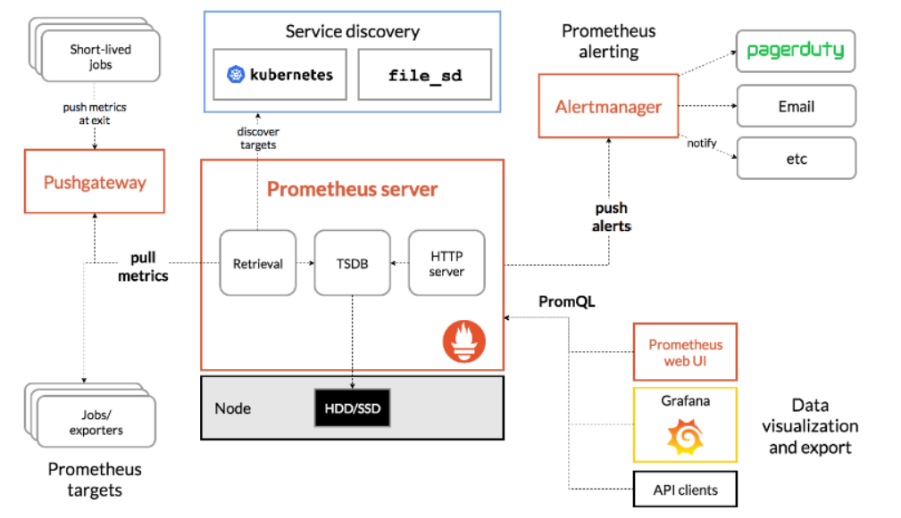
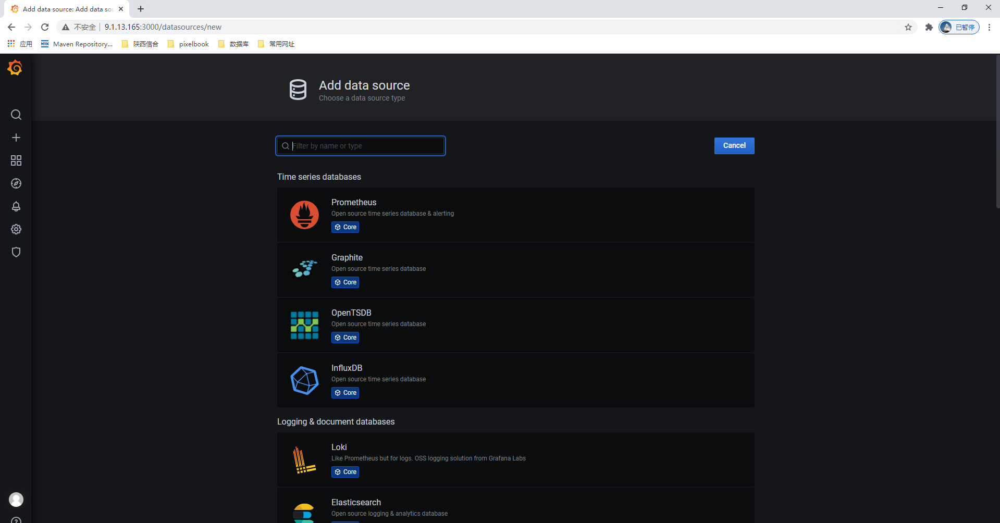

# Prometheus

Prometheus（普罗米修斯）是一套开源的监控&报警&时间序列数据库的组合.由SoundCloud公司开发。

Prometheus基本原理是通过HTTP协议周期性抓取被监控组件的状态，这样做的好处是任意组件只要提供HTTP接口就可以接入监控系统，不需要任何SDK或者其他的集成过程。这样做非常适合虚拟化环境比如VM或者Docker 。

Prometheus应该是为数不多的适合Docker、Mesos、Kubernetes环境的监控系统之一。近几年随着k8s的流行，prometheus成为了一个越来越流行的监控工具。

## Prometheus可以做什么

在业务层用作埋点系统 Prometheus支持各个主流开发语言（Go，java，python，ruby官方提供客户端，其他语言有第三方开源客户端）。我们可以通过客户端方面的对核心业务进行埋点。如下单流程、添加购物车流程。在应用层用作应用监控系统 一些主流应用可以通过官方或第三方的导出器，来对这些应用做核心指标的收集。如redis,mysql。在系统层用作系统监控 除了常用软件， prometheus也有相关系统层和网络层exporter,用以监控服务器或网络。集成其他的监控 prometheus还可以通过各种exporte，集成其他的监控系统，收集监控数据，如AWS CloudWatch,JMX，Pingdom等等。

## 不要用Prometheus做什么

prometheus也提供了Grok exporter等工具可以用来读取日志，但是prometheus是监控系统，不是日志系统。应用的日志还是应该走ELK等工具栈。

## grafana

一般配合grafana做前端展示

## Prometheus的特点：

1、多维数据模型（时序列数据由metric名和一组key/value组成）
2、在多维度上灵活的查询语言(PromQl)
3、不依赖分布式存储，单主节点工作.
4、通过基于HTTP的pull方式采集时序数据
5、可以通过中间网关进行时序列数据推送(pushing)
6、目标服务器可以通过发现服务或者静态配置实现
7、多种可视化和仪表盘支持

prometheus 相关组件，Prometheus生态系统由多个组件组成，其中许多是可选的：

1、Prometheus 主服务,用来抓取和存储时序数据
2、client library 用来构造应用或 exporter 代码 (go,java,python,ruby)
3、push 网关可用来支持短连接任务
4、可视化的dashboard (两种选择,promdash 和 grafana.目前主流选择是 grafana.)
4、一些特殊需求的数据出口(用于HAProxy, StatsD, Graphite等服务)
5、实验性的报警管理端(alartmanager,单独进行报警汇总,分发,屏蔽等 )

promethues 的各个组件基本都是用 golang 编写,对编译和部署十分友好.并且没有特殊依赖.基本都是独立工作。