# Kafka的存储架构

Kafka 的存储系统架构设计，说到存储系统，大家可能对 MySQL 比较熟悉，也知道 MySQL 是基于 B+ tree 来作为它的索引数据结构。

Kafka 又是基于什么机制来存储？为什么要设计成这样？它解决了什么问题？又是如何解决的？里面又用到了哪些高大上的技术？

带着这些疑问，我们就来和你聊一聊 Kafka 存储架构设计背后的深度思考和实现原理。

认真读完这篇文章，我相信你会对 Kafka 存储架构，有更加深刻的理解。也能有思路来触类旁通其他存储系统的架构。

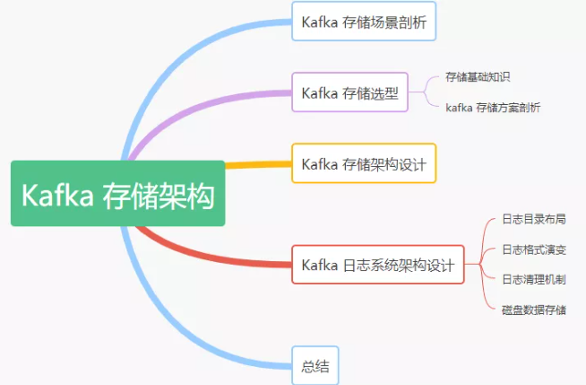

## **Kafka 存储场景剖析**

在讲解 Kafka 的存储方案之前，我们先来看看 Kafka 官网给的定义：

Apache Kafka is an open-source distributed event streaming platform used by thousands of companies for high-performance data pipelines, streaming analytics, data integration, and mission-critical applications.

翻译成中文如下：

Apache Kafka 是一个开源的分布式事件流处理平台，由成千上万的公司用于高性能的数据管道流分析、数据集成和关键任务的应用程序。

了解 Kafka 的老司机都知道它是从 Linkedin 内部孵化的项目，从一开始，Kafka 就是为了解决大数据的实时日志流而生的，每天要处理的日志量级在千亿规模。对于日志流的特点主要包括 1)、数据实时产生；2)、海量数据存储与处理，所以它必然要面临分布式系统遇到的高并发、高可用、高性能等三高挑战。

通过上面的背景可以得出：一切脱离业务场景谈架构设计都是耍流氓。

综上我们看对于 Kafka 的存储需求来说，要保证以下几点：

- 存储的主要是消息流（可以是简单的文本格式也可以是其他格式，对于 Broker 存储来说，它并不关心数据本身）
- 要支持海量数据的高效存储、高持久化（保证重启后数据不丢失）
- 要支持海量数据的高效检索（消费的时候可以通过 offset 或者时间戳高效查询并处理）
- 要保证数据的安全性和稳定性、故障转移容错性

## **Kafka 存储选型**

有了上面的场景需求分析后，我们接下来分析看看 Kafka 到底基于什么机制来存储的，能否直接用现有我们了解到的关系型数据库来实现呢？我们接着继续深度分析。

**存储基本知识**

我们先来了解下存储的基本知识或者常识，在我们的认知中，对于各个存储介质的速度大体同下图所示的，层级越高代表速度越快。很显然，磁盘处于一个比较尴尬的位置，然而，事实上磁盘可以比我们预想的要快，也可能比我们预想的要慢，这完全取决于我们如何使用它。

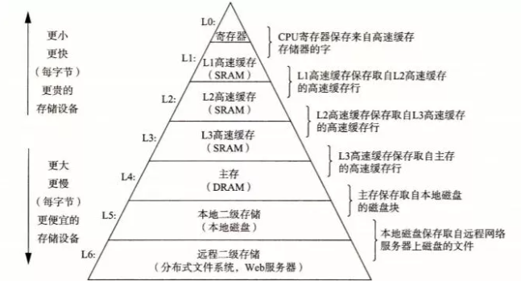

关于磁盘和内存的 IO 速度，我们可以从下图性能测试的结果看出普通机械磁盘的顺序 I/O 性能指标是 53.2M values/s，而内存的随机 I/O 性能指标是 36.7M values/s。由此似乎可以得出结论：磁盘的顺序 I/O 性能要强于内存的随机 I/O 性能。

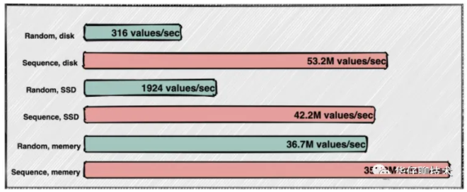

另外从整个数据读写性能方面，有不同的实现方式，要么提高读速度，要么提高写速度。

- 提高读速度：利用索引，来提高查询速度，但是有了索引，大量写操作都会维护索引，那么会降低写入效率。常见的如关系型数据库：MySQL 等。
- 提高写速度：这种一般是采用日志存储，通过顺序追加写的方式来提高写入速度，因为没有索引，无法快速查询，最严重的只能一行行遍历读取。常见的如大数据相关领域的基本都基于此方式来实现。

**Kafka 存储方案剖析**

上面从储基础知识，以及存储介质 IO 速度、读写性能方面剖析了存储类系统的实现方式，那么我们来看看 Kafka 的存储到底该采用哪种方式来实现呢？

对于 Kafka 来说，它主要用来处理海量数据流，这个场景的特点主要包括：

- 写操作：写并发要求非常高，基本得达到百万级 TPS，顺序追加写日志即可，无需考虑更新操作
- 读操作：相对写操作来说，比较简单，只要能按照一定规则高效查询即可（offset或者时间戳）

根据上面两点分析，对于写操作来说，直接采用顺序追加写日志的方式就可以满足 Kafka 对于百万TPS写入效率要求。但是如何解决高效查询这些日志呢？直接采用 MySQL 的 B+ tree 数据结构存储是否可以？我们来逐一分析下：

如果采用 B+ tree 索引结构来进行存储，那么每次写都要维护索引，还需要有额外空间来存储索引、更会出现关系型数据库中经常出现的“数据页分裂”等操作， 对于 Kafka 这种高并发的系统来说，这些设计都太重了，所以并不适合用。

但是在数据库索引中，似乎有一种索引看起来非常适合此场景，即：哈希索引【底层基于Hash Table 实现】，为了提高读速度，我们只需要在内存中维护一个映射关系即可，每次根据 Offset 查询消息的时候，从哈希表中得到偏移量，再去读文件就可以快速定位到要读的数据位置。但是哈希索引通常是需要常驻内存的，对于Kafka 每秒写入几百万消息数据来说，是非常不现实的，很容易将内存撑爆，造成 oom。

这时候我们可以设想把消息的 Offset 设计成一个有序的字段，这样消息在日志文件中也就有序存放了，也不需要额外引入哈希表结构，可以直接将消息划分成若干个块，对于每个块，我们只需要索引当前块的第一条消息的 Offset ，这个是不是有点二分查找算法的意思。即先根据 Offset 大小找到对应的块，然后再从块中顺序查找。如下图所示：

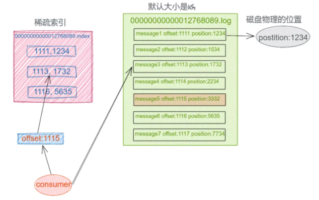

这样就可以快速定位到要查找的消息的位置了，在 Kafka 中，我们将这种索引结构叫做 “稀疏索引”。

## **Kafka 存储架构设计**

上面从 Kafka 诞生背景、存储场景分析、存储介质 IO 对比、以及 Kafka 存储方案选型等几个方面进行深度剖析，得出了 Kafka 最终的存储实现方案，即基于顺序追加写日志 + 稀疏哈希索引。

接下来我们来看看 Kafka 日志存储结构：

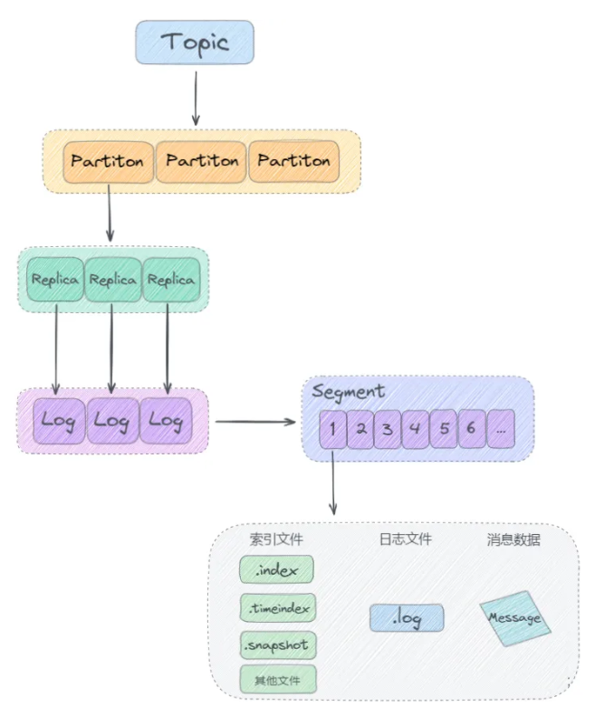

从上图可以看出来，Kafka 是基于「主题 + 分区 + 副本 + 分段 + 索引」的结构：

- Kafka 中消息是以主题 Topic 为基本单位进行归类的，这里的 Topic 是逻辑上的概念，实际上在磁盘存储是根据分区 Partition 存储的, 即每个 Topic 被分成多个 Partition，分区 Partition 的数量可以在主题 Topic 创建的时候进行指定。
- Partition 分区主要是为了解决 Kafka 存储的水平扩展问题而设计的，如果一个 Topic 的所有消息都只存储到一个 Kafka Broker 上的话， 对于 Kafka 每秒写入几百万消息的高并发系统来说，这个 Broker 肯定会出现瓶颈， 故障时候不好进行恢复，所以 Kafka 将 Topic 的消息划分成多个 Partition，然后均衡的分布到整个 Kafka Broker 集群中。
- Partition 分区内每条消息都会被分配一个唯一的消息 id，即我们通常所说的 偏移量 Offset，因此 Kafka 只能保证每个分区内部有序性，并不能保证全局有序性。
- 然后每个 Partition 分区又被划分成了多个 LogSegment，这是为了防止 Log 日志过大，Kafka 又引入了日志分段（LogSegment）的概念，将 Log 切分为多个 LogSegement，相当于一个巨型文件被平均分割为一些相对较小的文件，这样也便于消息的查找、维护和清理。这样在做历史数据清理的时候，直接删除旧的 LogSegement 文件就可以了。
- Log 日志在物理上只是以文件夹的形式存储，而每个 LogSegement 对应磁盘上的一个日志文件和两个索引文件，以及可能的其他文件（比如以".snapshot"为后缀的快照索引文件等）。

## **Kafka 日志系统架构设计**

了解了 Kafka 存储选型和存储架构设计后， 我们接下来再深度剖析下 Kafka 日志系统的架构设计。

根据上面的存储架构剖析，我们知道 Kafka 消息是按主题 Topic 为基础单位归类的，各个 Topic 在逻辑上是独立的，每个 Topic 又可以分为一个或者多个 Partition，每条消息在发送的时候会根据分区规则被追加到指定的分区中，如下图所示：

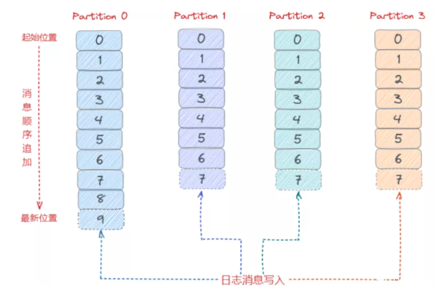

**日志目录布局**

那么 Kafka 消息写入到磁盘的日志目录布局是怎样的？接触过 Kafka 的老司机一般都知道 Log 对应了一个命名为 <topic>-<partition> 的文件夹。举个例子，假设现在有一个名为 “topic-order” 的 Topic，该 Topic 中有4个 Partition，那么在实际物理存储上表现为 “topic-order-0”、“topic-order-1”、“topic-order-2”、“topic-order-3” 这4个文件夹。

看上图我们知道首先向 Log 中写入消息是顺序写入的。但是只有最后一个 LogSegement 才能执行写入操作，之前的所有 LogSegement 都不能执行写入操作。为了更好理解这个概念，我们将最后一个 LogSegement 称为 “activeSegement”，即表示当前活跃的日志分段。随着消息的不断写入，当 activeSegement 满足一定的条件时，就需要创建新的 activeSegement，之后再追加的消息会写入新的 activeSegement。

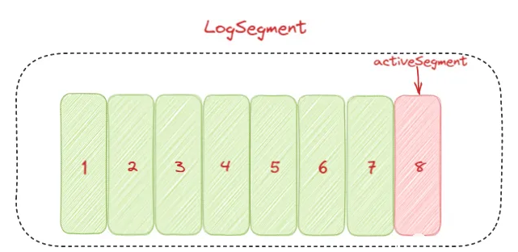

为了更高效的进行消息检索，每个 LogSegment 中的日志文件（以 “.log” 为文件后缀）都有对应的几个索引文件：偏移量索引文件（以 “.index” 为文件后缀）、时间戳索引文件（以 “.timeindex” 为文件后缀）、快照索引文件 （以 “.snapshot” 为文件后缀）。其中每个 LogSegment 都有一个 Offset 来作为基准偏移量（baseOffset），用来表示当前 LogSegment 中第一条消息的 Offset。偏移量是一个 64 位的 Long 长整型数，日志文件和这几个索引文件都是根据基准偏移量（baseOffset）命名的，名称固定为 20 位数字，没有达到的位数前面用0填充。比如第一个 LogSegment 的基准偏移量为 0，对应的日志文件为 00000000000000000000.log。

我们来举例说明，向主题 topic-order 中写入一定量的消息，某一时刻 topic-order-0 目录中的布局如下所示：

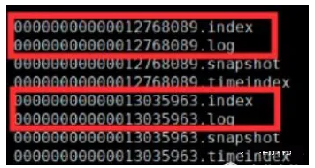

上面例子中 LogSegment 对应的基准位移是 12768089，也说明了当前 LogSegment 中的第一条消息的偏移量为 12768089，同时可以说明当前 LogSegment 中共有12768089条消息（偏移量从 0 至 12768089 的消息）。

注意每个 LogSegment 中不只包含 “.log”、“.index”、“.timeindex” 这几种文件，还可能包含 “.snapshot”、“.txnindex”、“leader-epoch-checkpoint” 等文件, 以及 “.deleted”、“.cleaned”、“.swap” 等临时文件。

另外 消费者消费的时候，会将提交的位移保存在 Kafka 内部的主题__consumer_offsets 中，下面我们来看一个整体的日志目录结构图：

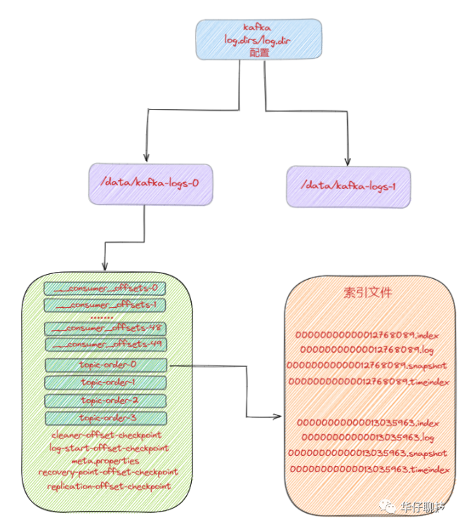

**日志格式演变**

对于一个成熟的消息中间件来说，日志格式不仅影响功能的扩展，还关乎性能维度的优化。所以随着 Kafka 的迅猛发展，其日志格式也在不断升级改进中，Kafka 的日志格式总共经历了3 个大版本：V0，V1 和 V2 版本。

我们知道在 Kafka Partition 分区内部都是由每一条消息进行组成，如果日志格式设计得不够精巧，那么其功能和性能都会大打折扣。

**V0 版本**

在 Kafka 0.10.0 之前的版本都是采用这个版本的日志格式的。在这个版本中，每条消息对应一个 Offset 和 message size。Offset 用来表示它在 Partition分区中的偏移量。message size 表示消息的大小。两者合起来总共 12B，被称为日志头部。日志头部跟 Record 整体被看作为一条消息。如下图所示：

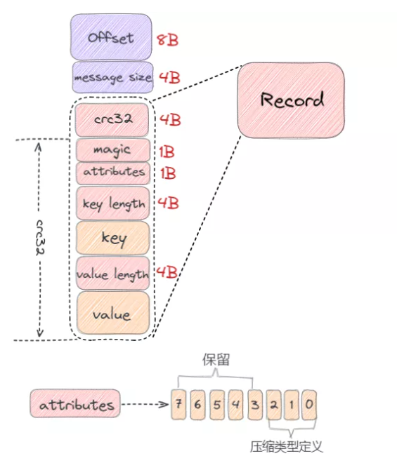

- crc32（4B）：crc32 校验值。校验范围为 magic 至 value 之间。
- magic（1B）：日志格式版本号，此版本的 magic 值为 0。
- attributes（1B）：消息的属性。总共占 1 个字节，低 3 位表示压缩类型：0 表示 NONE、1 表示 GZIP、2 表示 SNAPPY、3 表示 LZ4（LZ4 自 Kafka 0.9.x 版本引入），其余位保留。
- key length（4B）：表示消息的 key 的长度。如果为 -1，则没有设置 key。
- key：可选，如果没有 key 则无此字段。
- value length（4B）：实际消息体的长度。如果为 -1，则消息为空。
- value：消息体。

从上图可以看出，V0 版本的消息最小为 14 字节，小于 14 字节的消息会被 Kafka 认为是非法消息。

下面我来举个例子来计算一条消息的具体大小，消息的各个字段值依次如下：

- CRC：对消息进行 CRC 计算后的值；
- magic：0；
- attribute：0x00（未使用压缩）；
- key 长度：5；
- key：hello；
- value 长度：5；
- value：world。

那么该条消息长度为：4 + 1 + 1 + 4 + 5 + 4 + 5 = 24 字节。

**V1 版本**

随着 Kafka 版本的不断迭代发展， 用户发现 V0 版本的日志格式由于没有保存时间信息导致 Kafka 无法根据消息的具体时间进行判断，在进行清理日志的时候只能使用日志文件的修改时间导致可能会被误删。

从 V0.10.0 开始到 V0.11.0 版本之间所使用的日志格式版本为 V1，比 V0 版本多了一个 timestamp 字段，表示消息的时间戳。如下图所示：

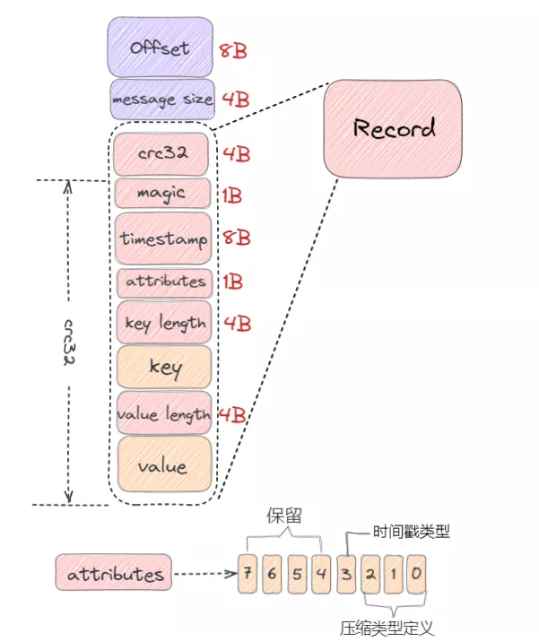

V1 版本比 V0 版本多一个 8B 的 timestamp 字段，那么 timestamp 字段作用：

- 对内：会影响日志保存、切分策略；
- 对外：影响消息审计、端到端延迟等功能扩展。

从上图可以看出，V1 版本的消息最小为 22 字节，小于 22 字节的消息会被 Kafka 认为是非法消息。

总的来说比 V0 版本的消息大了 8 字节，如果还是按照 V0 版本示例那条消息计算，则在 V1 版本中它的总字节数为：24 + 8 = 32 字节。

**V0、V1 版本的设计缺陷**

通过上面我们分析画出的 V0、V1 版本日志格式，我们会发现它们在设计上的一定的缺陷，比如：

- 空间使用率低：无论 key 或 value 是否存在，都需要一个固定大小 4 字节去保存它们的长度信息，当消息足够多时，会浪费非常多的存储空间。
- 消息长度没有保存：需要实时计算得出每条消息的总大小，效率低下。
- 只保存最新消息位移。
- 冗余的 CRC 校验：即使是批次发送消息，每条消息也需要单独保存 CRC。

**V2 版本**

针对上面我们分析的关于 V0、V1 版本日志格式的缺陷，Kafka 在 0.11.0.0 版本对日志格式进行了大幅度重构，使用可变长度类型解决了空间使用率低的问题，增加了消息总长度字段，使用增量的形式保存时间戳和位移，并且把一些字段统一抽取到 RecordBatch 中。

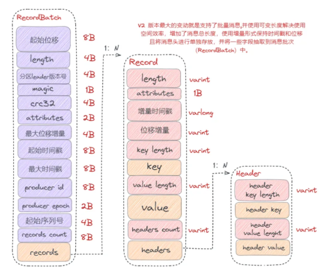

从以上图可以看出，V2 版本的消息批次（RecordBatch），相比 V0、V1 版本主要有以下变动：

- 将 CRC 值从消息中移除，被抽取到消息批次中。
- 增加了 procuder id、producer epoch、序列号等信息主要是为了支持幂等性以及事务消息的。
- 使用增量形式来保存时间戳和位移。
- 消息批次最小为 61 字节，比 V0、V1 版本要大很多，但是在批量消息发送场景下，会提供发送效率，降低使用空间。

综上可以看出 V2 版本日志格式主要是通过可变长度提高了消息格式的空间使用率，并将某些字段抽取到消息批次（RecordBatch）中，同时消息批次可以存放多条消息，从而在批量发送消息时，可以大幅度地节省了磁盘空间。

**日志清理机制**

Kafka 将消息存储到磁盘中，随着写入数据不断增加，磁盘占用空间越来越大，为了控制占用空间就需要对消息做一定的清理操作。从上面 Kafka 存储日志结构分析中每一个分区副本（Replica）都对应一个 Log，而 Log 又可以分为多个日志分段（LogSegment），这样就便于 Kafka 对日志的清理操作。

Kafka提供了两种日志清理策略：

- 日志删除（Log Retention）：按照一定的保留策略直接删除不符合条件的日志分段（LogSegment）。
- 日志压缩（Log Compaction）：针对每个消息的 key 进行整合，对于有相同 key 的不同 value 值，只保留最后一个版本。

这里我们可以通过 Kafka Broker 端参数 log.cleanup.policy 来设置日志清理策略，默认值为 “delete”，即采用日志删除的清理策略。如果要采用日志压缩的清理策略，就需要将 log.cleanup.policy 设置为 “compact”，这样还不够，必须还要将log.cleaner.enable（默认值为 true）设为 true。

如果想要同时支持两种清理策略， 可以直接将 log.cleanup.policy 参数设置为 “delete，compact”。

**日志删除**

Kafka 的日志管理器（LogManager）中有一个专门的日志清理任务通过周期性检测和删除不符合条件的日志分段文件（LogSegment），这里我们可以通过 Kafka Broker 端的参数 log.retention.check.interval.ms 来配置，默认值为 300000，即 5 分钟。

在 Kafka 中一共有 3 种保留策略。

基于时间策略：

日志删除任务会周期检查当前日志文件中是否有保留时间超过设定的阈值（retentionMs） 来寻找可删除的日志段文件集合（deletableSegments）。

其中 retentionMs 可以通过 Kafka Broker 端的这几个参数的大小判断的 log.retention.ms > log.retention.minutes > log.retention.hours 优先级来设置，默认情况只会配置 log.retention.hours 参数，值为 168 即为 7 天。

这里需要注意：删除过期的日志段文件，并不是简单的根据该日志段文件的修改时间计算的，而是要根据该日志段中最大的时间戳 largestTimeStamp 来计算的，首先要查询该日志分段所对应的时间戳索引文件，查找该时间戳索引文件的最后一条索引数据，如果时间戳值大于 0，则取值，否则才会使用最近修改时间（lastModifiedTime）。

删除步骤：

- 首先从 Log 对象所维护的日志段的跳跃表中移除要删除的日志段，用来确保已经没有线程来读取这些日志段。
- 将日志段所对应的所有文件，包括索引文件都添加上 “.deleted” 的后缀。
- 最后交给一个以 “delete-file” 命名的延迟任务来删除这些以 “.deleted” 为后缀的文件。默认 1 分钟执行一次， 可以通过 file.delete.delay.ms 来配置。

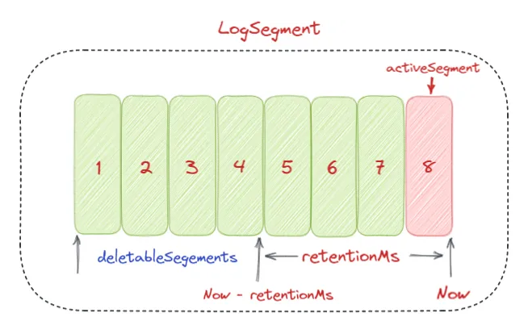

基于日志大小策略：

日志删除任务会周期检查当前日志大小是否超过设定的阈值（retentionSize）来寻找可删除的日志段文件集合（deletableSegments）。

其中 retentionSize 这里我们可以通过 Kafka Broker 端的参数 log.retention.bytes 来设置， 默认值为 -1，即无穷大。

这里需要注意的是 log.retention.bytes 设置的是 Log 中所有日志文件的大小，而不是单个日志段的大小。单个日志段可以通过参数 log.segment.bytes 来设置，默认大小为 1G。

删除步骤：

- 首先计算日志文件的总大小 Size 和 retentionSize 的差值，即需要删除的日志总大小。
- 然后从日志文件中的第一个日志段开始进行查找可删除的日志段的文件集合（deletableSegments）。
- 找到后就可以进行删除操作了。

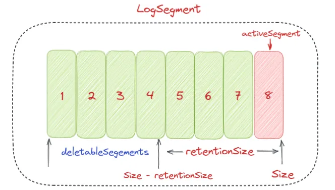

基于日志起始偏移量：

该策略判断依据是日志段的下一个日志段的起始偏移量 baseOffset 是否小于等于 logStartOffset，如果是，则可以删除此日志分段。

如下图所示删除步骤：

- 首先从头开始遍历每个日志段，日志段 1 的下一个日志分段的起始偏移量为 20，小于 logStartOffset 的大小，将日志段 1 加入 deletableSegments。
- 日志段 2 的下一个日志偏移量的起始偏移量为 35，也小于 logStartOffset 的大小，将日志分段 2 页加入 deletableSegments。
- 日志段 3 的下一个日志偏移量的起始偏移量为 50，也小于 logStartOffset 的大小，将日志分段 3 页加入 deletableSegments。
- 日志段 4 的下一个日志偏移量通过对比后，在 logStartOffset 的右侧，那么从日志段 4 开始的所有日志段都不会加入 deletableSegments。
- 待收集完所有的可删除的日志集合后就可以直接删除了。

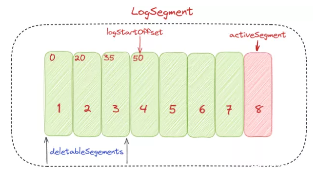

**日志压缩**

日志压缩 Log Compaction 对于有相同 key 的不同 value 值，只保留最后一个版本。如果应用只关心 key 对应的最新 value 值，则可以开启 Kafka 相应的日志清理功能，Kafka 会定期将相同 key 的消息进行合并，只保留最新的 value 值。

Log Compaction 可以类比 Redis 中的 RDB 的持久化模式。我们可以想象下，如果每次消息变更都存 Kafka，在某一时刻，Kafka 异常崩溃后，如果想快速恢复，可以直接使用日志压缩策略，这样在恢复的时候只需要恢复最新的数据即可，这样可以加快恢复速度。

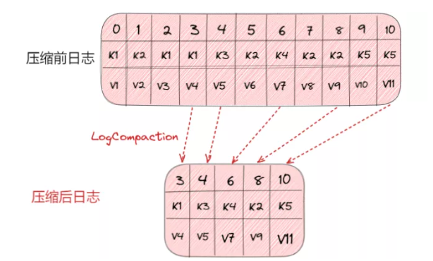

**磁盘数据存储**

我们知道 Kafka 是依赖文件系统来存储和缓存消息，以及典型的顺序追加写日志操作，另外它使用操作系统的 PageCache 来减少对磁盘 I/O 操作，即将磁盘的数据缓存到内存中，把对磁盘的访问转变为对内存的访问。

在 Kafka 中，大量使用了 PageCache，这也是 Kafka 能实现高吞吐的重要因素之一，当一个进程准备读取磁盘上的文件内容时，操作系统会先查看待读取的数据页是否在 PageCache 中，如果命中则直接返回数据，从而避免了对磁盘的 I/O 操作；如果没有命中，操作系统则会向磁盘发起读取请求并将读取的数据页存入 PageCache 中，之后再将数据返回给进程。同样，如果一个进程需要将数据写入磁盘，那么操作系统也会检查数据页是否在页缓存中，如果不存在，则 PageCache 中添加相应的数据页，最后将数据写入对应的数据页。被修改过后的数据页也就变成了脏页，操作系统会在合适的时间把脏页中的数据写入磁盘，以保持数据的一致性。

除了消息顺序追加写日志、PageCache 以外， Kafka 还使用了零拷贝（Zero-Copy）技术来进一步提升系统性能， 如下图所示：

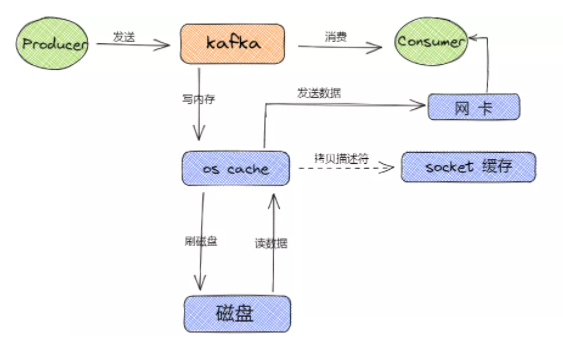

消息从生产到写入磁盘的整体过程如下图所示：

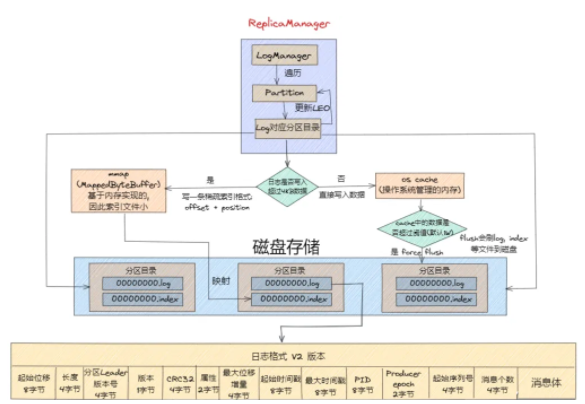

## **总结**
本文从 Kafka 存储的场景剖析出发、Kafka 存储选型分析对比、再到 Kafka 存储架构设计剖析、以及 Kafka 日志系统架构设计细节深度剖析，一步步带你揭开了 Kafka 存储架构的神秘面纱。