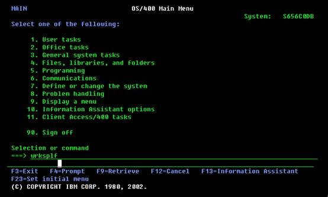

# AS400



AS/400商用服务器，作为IBM的中小型商用计算机系统，以其卓越性能，在全世界赢得广泛客户。自问世以来，AS/400在全球的安装量已经超过60万套，行销150个国家，广泛应用于流通、金融证券、制造、运输行业。

- 集成性：作为一个集成的计算机系统，AS/400将数据库、通讯、安全性等功能全部集成在操作系统当中，最大限度实现各功能间的兼容性。并且，AS/400e还集成有世界上最流行、应用最广泛的数据库系统DB2/400。
- 开放性：从互操作性看，AS/400能以任何形式与任何机器相联。AS/400支持绝大多数的互操作标准，支持几乎所有的通讯协议。其集成数据库DB2也支持绝大多数开放数据库的标准。
- 可移植性：全世界范围内，有8000家应用软件开发商在AS/400平台上从事开发工作，有28000多种应用软件，其中包括3000多种Client/Server软件。
- 兼容性：由于IBM的的专利技术－TIMI，独立于技术的机器界面设计，使得在AS/400性能几十倍提升的同时，而用户的应用程序可不用做任何修改，甚至不用重新编译即可在任一系列的AS/400e上运行。这就使得用户一旦投资AS/400e，便可终身享有信息产业的最先进技术。
- 可连接性：对于AS/400的用户来说，在使用AS/400e的功能时，可以通过任何工作平台访问到AS/400，不一定必须使用AS/400的字符终端。AS/400的用户不必关心自己所使用的操作系统，任何平台都可以作为AS/400的客户机。
- 可支付性：对于计算机系统的总拥有成本来说，在购买AS/400e时，用户不仅得到硬件和操作系统，同时还得到集成于AS/400上的数据库、安全性、通讯功能等，而这些功能对于其他系统来说，还必须另外花人力、财力去购买、实施和维护。
- 可扩充性：从小到大，AS/400e拥有全线产品，而且，AS/400还向用户提供光纤连接技术，可将多达32台AS/400连接起来，集群运作。

### 1) 数据描述规范(DDS data description specification)

AS/400的操作系统OS/400提供一种描述数据属性的方法DDS，它可以在程序外部方便、有效地对数据属性进行描述。

AS/400有两种定义数据的方法：

- （1）程序描述文件：文件在记录的描述仅包含一个记录名和记录长度，任何程序使用这种方式描述的文件必须为记录中的每个字段提供字段级属性（字段名、数据类型、字段长度等）定义，此中类型文件不常用
- （2）外部描述文件：文件包含记录的详细字段描述和有关文件如何被访问的信息，在程序中只要指明该文件为外部描述文件即可，当程序目标建立时，编译器自动从文件中抽取信息到程序中，且转换为高级语言适合的语法，它的显著特点之一是克服了程序描述文件的缺点，通过文件的记录字段仅一次的说明，可定义多种访问路径，多个程序使用。
### 2) DB2 QUERY MANAGER AND SQL DEVELOPMENT KIT支持的结构化查询语言SQL/400

SQL/400是SQL的DB2/400实现，可以交互式地输入大部分SQL语句或把它们嵌入到高级语言（RPGLE、COBOL、CLE等）程序中，替代高级语言内置的读、写和修改等指令。SQL/400主要由以下部分组成：

- （1）SQL运行支持程序，提供对SQL 语句的分析及对运行任何SQL语句的支持功能，是OS/400的一个部分，它允许含有SQL语句的应用程序在没有安装DB2 QUERY MANAGER AND SQL DEVELOPMENT KIT特许程序的系统上运行。
- （2）SQL预编译程序，处理嵌入SQL语句的应用程序
- （3）SQL交互式接口，支持用交互式建立和运行SQL语句
- （4）DB2 QUERY MANAGER FOR AS/400，提供菜单、填空式提示的交互式接口，允许建立、增加、维护数据，和运行报表

### 3) APPLICATION DEVELOPMENT TOOLSET/400(ADTS/400)开发工具包中有PDM、SEU、SDA、RLU、DFU等

#### PDM（PROGRAMMING DEVELOPMENT MANAGER）

可以用来处理源代码、对象和库。为程序员建立源文件成员、访问SEU和许多其他有用的工具提供方便。
```
STRPDM：直接到PDM菜单
WRKLIBPDM：可以指定操作哪一个库或对当前库列表进行操作
WRKOBJPDM：指定操作某一库下的所有对象（可按名称、类型选取）
WRKMBRPDM：指定操作某一库下某一源文件下的所有或部分成员
```
#### SEU（SOURCE ENTRY UTILITY）

是一个全屏幕编辑工具，可以建立和编辑源文件成员，当启动时，能够输入新的源语句，修改、删除、复制、移动已存在的源语句，具有语言相关提示和语法检查功能，且具有分屏编辑/浏览功能。

```
STRSEU：可以对原有成员进行编辑或建立新成员，对原有成员进行编辑也可通过在WORK WITH MEMBERS USING PDM（WRKMBRPDM）屏幕上使用选项2（EDIT）功能来实现，当然，建立新成员也可以通过在WORK WITH MEMBERS USING PDM（WRKMBRPDM）屏幕上使用F6（CREATE）功能键来实现。
```

#### SDA（SCREEN DESIGN AID）

可用来交互式设计、创建和维护应用屏幕，包括显示文件和菜单，且可以将用户设计的屏幕规范地自动转换成DDS源代码，简化了菜单和显示文件的创建。

```
STRSDA：可以进入屏幕和菜单的编辑画面，对原有屏幕编辑也可通过在WORK WITH MEMBERS USINGPDM（WRKMBRPDM）屏幕上使用选项17（CHANGE USING SDA）功能来实现，
```

#### RLU（REPORT LAYOUT UTILITY）

可用来交互式定义打印报表的格式分布，建立打印文件，且可以将用户设计的报表格式分布规范地自动转换成DDS源代码，简化了报表的设计和修改，使用它可以在屏幕上直观地设计打印报表。

```
STRRLU：可以进入报表编辑画面，对原有屏幕编辑也可通过在 WORK WITH MEMBERS USING PDM（WRKMBRPDM）屏幕上使用选项19（CHANGE USING RLU）功能来实现
```

#### DFU（DATA FILE UTILITY）

能够快速定义、创建面向数据录入、查询或文件维护的DFU程序，而不需要编程。对开发应用建立测试数据库尤其有用。

```
STRDFU：显示DFU菜单
DLTDFUPGM：删除DFU程序和文件
CHGDTA：运行DFU程序
DSPDTA：运行DFU程序，但不能修改文件中的数据记录
UPDDTA：使用临时的DFU程序更新文件，可通过在WORK WITH MEMBERS USING PDM（WRKMBRPDM）屏幕上使用选项18 （CHANGE USING DFU）来实现，它可以进行查询、增加、修改、删除记录的操作。该功能最常用。
```

[AS400技术手册](https://docs.huihoo.com/as400/index.htm)