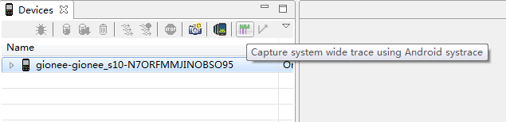
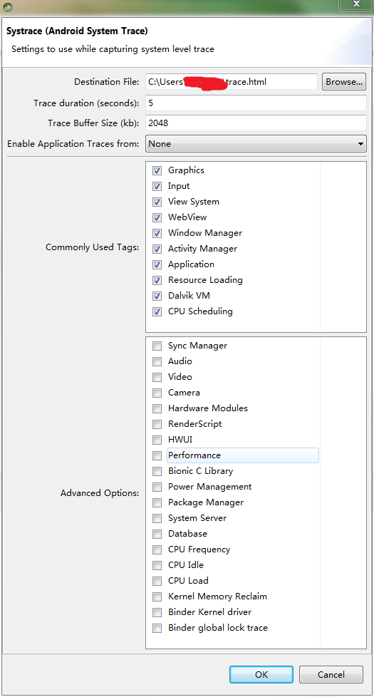
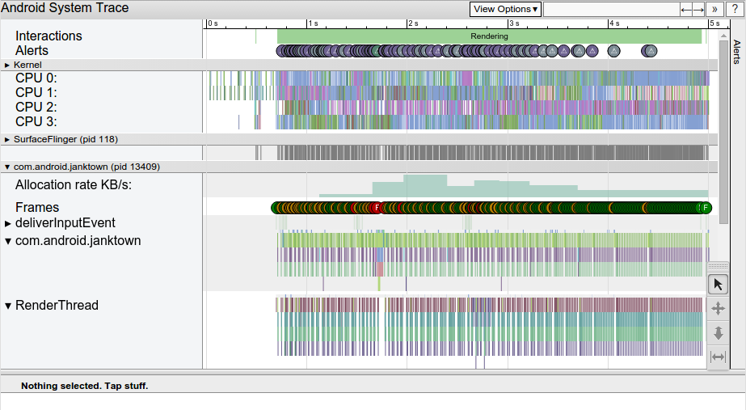
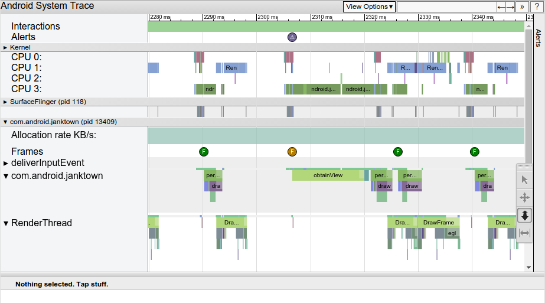
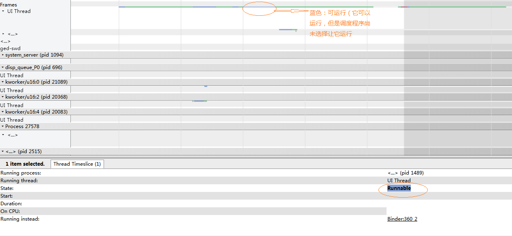
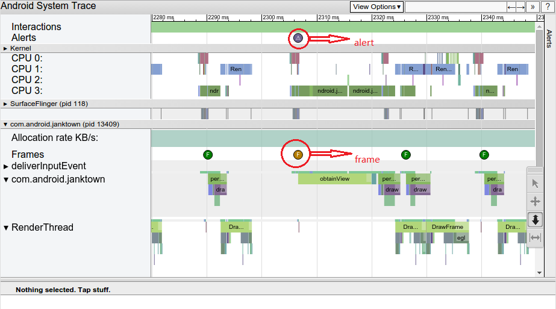
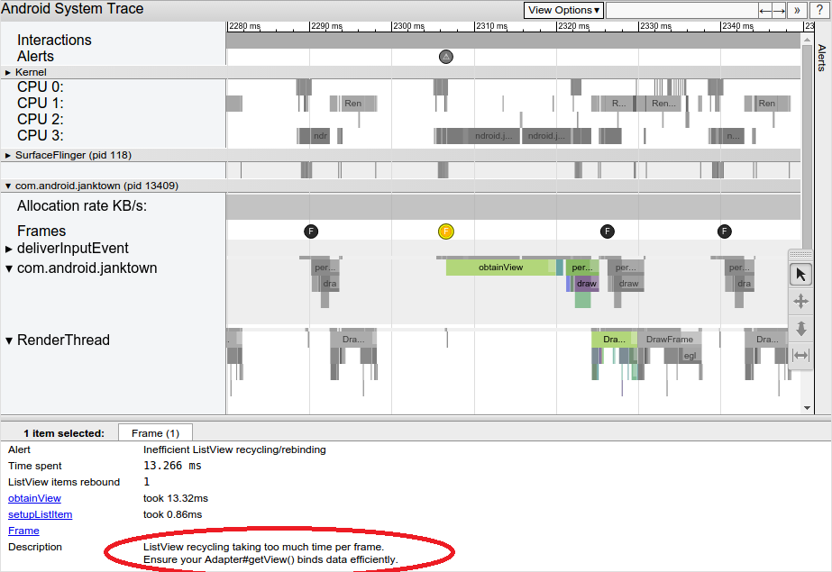
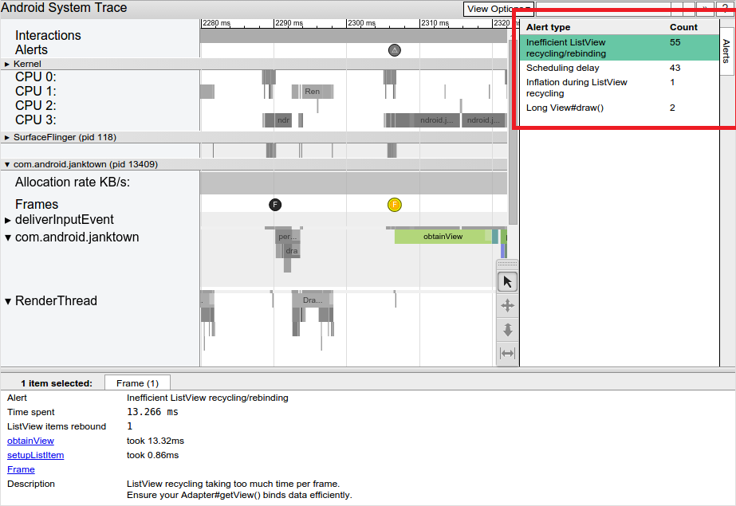

# Android性能问题分析神器Systrace

## 一、简介

Systrace是分析Android设备的性能的主要工具，Google IO 2017上更是对其各种强推. 是分析卡顿掉帧问题核心工具，只要能提供卡顿现场，systrace就能很好定位问题.

## 二、原理

在介绍使用之前，先简单说明一下Systrace的原理：它的思想很朴素，在系统的一些关键链路（比如System Service，虚拟机，Binder驱动）插入一些信息（我这里称之为Label），通过Label的开始和结束来确定某个核心过程的执行时间，然后把这些Label信息收集起来得到系统关键路径的运行时间信息，进而得到整个系统的运行性能信息。Android Framework里面一些重要的模块都插入了Label信息（Java层的通过android.os.Trace类完成，native层通过ATrace宏完成），用户App中可以添加自定义的Label，这样就组成了一个完成的性能分析系统。另外说明的是：Systrace对系统版本有一个要求，就是需要Android 4.1以上。系统版本越高，Android Framework中添加的系统可用Label就越多，能够支持和分析的系统模块也就越多；因此，在可能的情况下，尽可能使用高版本的Android系统来进行分析。

### 作用

用于收集可帮助您检查原生系统进程的详细系统级数据，包括跟踪系统的I/O操作、内核工作队列、CPU负载以及Android各个子系统的运行状况等，例如CPU调度、磁盘活动、应用线程等，并解决掉帧引起的界面卡顿。

### 本质

它是 atrace 的主机端封装容器，是用于控制用户空间跟踪和设置 ftrace 的设备端可执行文件，也是 Linux 内核中的主要跟踪机制。 systrace 使用 atrace 来启用跟踪，然后读取 ftrace 缓冲区并将其全部封装到一个独立的 HTML 查看器中。

### 组成

1. 内核部分：Systrace利用了Linux Kernel中的ftrace功能。所以，如果要使用systrace的话，必须开启kernel中和ftrace相关的模块
2. 数据采集部分：Android定义了一个Trace类。应用程序可利用该类把统计信息输出给ftrace。同时，Android还有一个atrace程序，它可以从ftrace中读取统计信息然后交给数据分析工具来处理。
3. 数据分析工具：Android提供一个systrace.py（python脚本文件，位于Android SDK目录/sdk/platform-tools/systrace中，其内部将调用atrace程序）用来配置数据采集的方式（如采集数据的标签、输出文件名等）和收集ftrace统计数据并生成一个结果网页文件供用户查看。

### 官网

https://source.android.google.cn/devices/tech/debug/systrace

https://developer.android.google.cn/studio/command-line/systrace

### extra:什么是atrace?什么是ftrace?

ftrace 是一种调试工具，用于了解 Linux 内核中的情况；而 atrace (frameworks/native/cmds/atrace) 使用 ftrace 来捕获内核事件； 

官网简单的介绍地址：https://source.android.google.cn/devices/tech/debug/ftrace

## 三、抓取方法

- systrace.py
- AndroidStudio Systrace工具
- 自定义trace

### 1.systrace.py

使用python命令以及systrace.py工具 systrace.py工具位置在 sdk/platform-tools/systrace；

`python systrace.py [options] [categories]`

示例：调用systrace来记录10秒钟内的设备进程，包括图形进程，并生成mynewtrace.html报告

具体命令如下

`python systrace.py --time=10 -o mynewtrace.html gfx`

#### options参数表

|options	|description|
|-----------|-----------|
|-o < FILE >	|输出的目标文件|
|-t N, –time=N	|执行时间，默认5s|
|-b N, –buf-size=N	|buffer大小（单位kB),用于限制trace总大小，默认无上限|
|-k < KFUNCS >，–ktrace=< KFUNCS >	|追踪kernel函数，用逗号分隔|
|-a < APP_NAME >,–app=< APP_NAME >	|追踪应用包名，用逗号分隔|
|–from-file=< FROM_FILE >	|从文件中创建互动的systrace|
|-e < DEVICE_SERIAL >,–serial=< DEVICE_SERIAL >	|指定设备|
|-l, –list-categories	|列举可用的tags|
|-h , --help	|显示帮助信息|
|-l,--list-categories	|列出可用于连接设备的跟踪categories类别|
-o file	|将HTML跟踪报告写入指定的文件。 如果您不指定此选项，systrace会将您的报告保存到systrace.py所在的同一目录中，并将其命名为trace.|html。|
|-t N ,--time=N	|跟踪设备活动N秒。如果不指定此选项，systrace将提示您通过按命令行中的Enter键结束跟踪。|
|-b N ,--buf-size=N	|使用N千字节的跟踪缓冲区大小。通过此选项，可以限制跟踪期间收集的数据的总大小。|
|-k functions,--ktrace=functions	|跟踪中指定的特定内核函数的活动，以逗号分隔的列表|
|-a app-name,--app=app-name	|跟踪指定应用，为逗号分隔列表。|
|--from-file=file-path	|从文件（例如包含原始跟踪数据的TXT文件）创建交互式HTML报告，而不是运行实时跟踪。|
|-e device-serial,--serial=device-serial	|跟踪指定的设备序列号标识的特定连接设备|

#### catagories参数表

|category|	description|
|--------|-------------|
|gfx|	Graphics|
|input|	Input|
|view|	View System|
|webview|	WebView|
|wm|	Window Manager|
|am|	Activity Manager|
|sm|	Sync Manager|
|audio|	Audio|
|video|	Video|
|camera|	Camera|
|hal|	Hardware Modules|
|app|	Application|
|res|	Resource Loading|
|dalvik|	Dalvik VM|
|rs|	RenderScript|
|bionic|	Bionic C Library|
|power|	Power Management|
|sched|	CPU Scheduling|
|irq| IRQ	Events|
|freq|	CPU Frequency|
|idle|	CPU Idle|
|disk|	Disk I/O|
|mmc|	eMMC commands|
|load|	CPU Load|
|sync|	Synchronization|
|workq|	Kernel Workqueues|
|memreclaim|	Kernel Memory Reclaim|
|regulators|	Voltage and Current Regulators|

### 2.AndroidStudio Systrace工具

打开AndroidStudio，连接好设备，打开DDMS ， 点击 Tools——>Android——>Android device monitor



点击systrace按钮，弹出信息配置框，确认后，会记录Trace duration 5秒钟内的设备进程，并生成一个名为trace.html报告



此处信息对应上面的命令参数表，请自行参照

***注意：Enable Application Trace from :若是需要自定义trace信息，必须选择对应的应用进程，否则不会被捕获到***

### 3.自定义trace

用户可以自己添加自定义的trace块，来捕获指定trace的信息 Android 4.3 (API level 18) 以及更高版本可以使用

#### Android
```
Trace.beginSection();
Trace.endSection();
```
代码示例
```
public class MyAdapter extends RecyclerView.Adapter<MyViewHolder> {
...
@Override
	public MyViewHolder onCreateViewHolder(ViewGroup parent, int viewType) {
		Trace.beginSection("MyAdapter.onCreateViewHolder");
		MyViewHolder myViewHolder;
		try {
			myViewHolder = MyViewHolder.newInstance(parent);
		} finally {
			// In 'try...catch' statements, always call endSection()
			// in a 'finally' block to ensure it is invoked even when an exception
			// is thrown.
			Trace.endSection();
		}
	return myViewHolder;
}
@Override
public void onBindViewHolder(MyViewHolder holder, int position) {
	Trace.beginSection("MyAdapter.onBindViewHolder");
		try {
			try {
				Trace.beginSection("MyAdapter.queryDatabase");
				RowItem rowItem = queryDatabase(position);
				mDataset.add(rowItem);
			} finally {
				Trace.endSection();
			}
			holder.bind(mDataset.get(position));
		} finally {
			Trace.endSection();
		}
	}
...
}
```

#### native
```
#include <android/trace.h>
ATrace_beginSection();
ATrace_endSection();
```
创建一个便利的对象/宏结构来跟踪代码块
```
#define ATRACE_NAME(name) ScopedTrace ___tracer(name)
// ATRACE_CALL is an ATRACE_NAME that uses the current function name.
#define ATRACE_CALL() ATRACE_NAME(__FUNCTION__)
class ScopedTrace {
	public:inline ScopedTrace(const char *name) {
		ATrace_beginSection(name);
	}
inline ~ScopedTrace() {
		ATrace_endSection();
	}
};
void myExpensiveFunction() {
	ATRACE_CALL();
... // trace-worthy work here
}
```

## 四、快捷键

查看Systrace生成的trace.html，浏览器打开界面如下：



分析trace.html图形信息之前，先了解下快捷键 点击浏览器界面上右上角“？”，可以查看到各个快捷键提示

|快捷键|	作用|
|-----|-----|
|w|	放大，[+shift]速度更快|
|s|	缩小，[+shift]速度更快|
|a|	左移，[+shift]速度更快|
|d|	右移，[+shift]速度更快|
|f|	放大当前选定区域|
|m|	标记当前选定区域|
|v|	高亮VSync|
|g|	切换是否显示60hz的网格线|
|0|	恢复trace到初始态，这里是数字0而非字母o|
|h|	切换是否显示详情|
|/|	搜索关键字|
|enter|	显示搜索结果，可通过← →定位搜索结果|
|`|	显示/隐藏脚本控制台|
|?|	显示帮助功能|

## 五、分析trace.html




颜色块每块颜色占据的长度即为该系统或者自定义trace等执行所占据的时间长度

Alerts含有三角状的圆圈图标，对应出现警告的位置，点击可以在右边栏Alerts查看具体警告内容； 警告会告诉你可能丢帧或者卡顿等的原因

Frame含有F字母的圆圈图标，对应每一帧开始的位置，不同颜色有不同意义； 绿色表示正常，当颜色为橙色或者红色时，意味着这一帧超过16.6ms（即发现丢帧）；

Kernel（上图为四核CPU）显示每个CPU各自执行的系统方法或自定义trace块，以及占据的时间长度

SurfaceFlingersurfaceFilnger，进程id为118，显示系统方法以及占据的时间长度

com.android.janktown应用进程，进程id为13409，显示应用进程内各个线程等信息每个线程有颜色表示各自不同的状态
	• 灰色：正在休眠。
	• 蓝色：可运行（它可以运行，但是调度程序尚未选择让它运行）。
	• 绿色：正在运行（调度程序认为它正在运行）。
	• 红色：不可中断休眠（通常在内核中处于休眠锁定状态）。可以指示 I/O 负载，在调试性能问题时非常有用。
	• 橙色：由于 I/O 负载而不可中断休眠。



### 分析卡顿或掉帧

Systrace可以直观的看到掉帧引起的界面卡顿如下图



点击F，使用快捷键f放大该帧，可以选择m高亮该选区，查看该帧的所有系统trace块执行时间



查看下面面板的Frame里的信息

`ListView recycling takiing too mush time per frame.Ensure your Adapter#getView() binds data efficiently`

主要问题是在ListView回收和重新绑定中花费了太多时间。

Alerts选项卡可以查看每个警报以及设备触发每个警报的次数



如果你在UI线程上看到了太多的工作，你需要找出哪些方法消耗了太多的CPU时间。 一种方法是添加跟踪标记即自定义trace信息到您认为会导致这些瓶颈的方法； 另一种由于不确定哪些方法可能导致UI线程出现瓶颈，可以使用Android Studio的内置CPU分析器，或生成跟踪日志并使用Traceview来进行查看。
