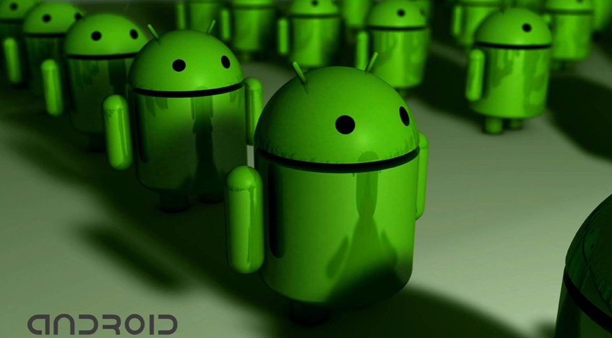

# Android

Android（读音：英：['ændrɔɪd]，美：[ˈænˌdrɔɪd]），常见的非官方中文名称为安卓，是一个基于Linux内核的开放源代码移动操作系统，由Google成立的Open Handset Alliance（OHA，开放手持设备联盟）持续领导与开发，主要设计用于触摸屏移动设备如智能手机和平板电脑与其他便携式设备。

2005年8月由Google收购注资。2007年11月，Google与84家硬件制造商、软件开发商及电信营运商组建开放手机联盟共同研发改良Android系统。随后Google以Apache开源许可证的授权方式，发布了Android的源代码。第一部Android智能手机发布于2008年10月。Android逐渐扩展到平板电脑及其他领域上，如电视、数码相机、游戏机、智能手表等。

Android一词的本义指“机器人”，同时也是Google于2007年11月5日宣布的基于Linux平台的开源手机操作系统的名称，该平台由操作系统、中间件、用户界面和应用软件组成。

Android的Logo是由Ascender公司设计的，诞生于2010年，其设计灵感源于男女厕所门上的图形符号，于是布洛克绘制了一个简单的机器人，它的躯干就像锡罐的形状，头上还有两根天线，Android小机器人便诞生了。其中的文字使用了Ascender公司专门制作的称之为“Droid ” 的字体。Android是一个全身绿色的机器人，绿色也是Android的标志。颜色采用了PMS 376C和RGB中十六进制的#A4C639来绘制，这是Android操作系统的品牌象徵。有时候，它们还会使用纯文字的Logo。

Android在正式发行之前，最开始拥有两个内部测试版本，并且以著名的机器人名称来对其进行命名，它们分别是：阿童木（AndroidBeta），发条机器人（Android 1.0）。后来由于涉及到版权问题，谷歌将其命名规则变更为用甜点作为它们系统版本的代号的命名方法。甜点命名法开始于Android 1.5发布的时候。作为每个版本代表的甜点的尺寸越变越大，然后按照26个字母数序：纸杯蛋糕（Android 1.5），甜甜圈（Android 1.6），松饼（Android 2.0/2.1），冻酸奶（Android 2.2），姜饼（Android 2.3），蜂巢（Android 3.0），冰激凌三明治（Android 4.0），果冻豆（Jelly Bean，Android4.1和Android 4.2），奇巧（KitKat，Android 4.4），棒棒糖（Lollipop，Android 5.0），棉花糖（Marshmallow，Android 6.0），牛轧糖（Nougat，Android 7.0），奥利奥（Oreo，Android 8.0），派（Pie,Android 9.0）。

从Android 10开始，Android不会再按照基于美味零食或甜点的字母顺序命名，而是转换为版本号，就像Windows和iOS系统一样。