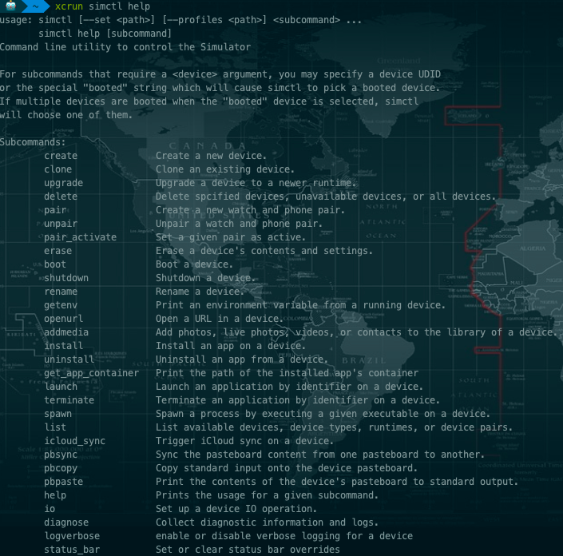

# IOS模拟器命令xcrun simctl系列

## simctl是iOS模拟器命令行管理工具

simctl于安卓的adb命令非常相似。虽然苹果官方文档没有对它进行任何说明。但是我们可以通过Applications/Xcode.app/Contents/Developer/usr/bin/simctl路径找到它。由于是XCode内置的命令，所以在使用的时候要在该命令前面加上xcrun。我们可以通过以下命令来查看该命令所有的功能选项。

xcrun simctl help

如下图：

## simctl子命令以及其功能说明
|子命令	|功能|
|-------|----|
|create	|创建新的模拟器|
|clone	|克隆一个已有的模拟器|
|upgrade	|给模拟器升级系统|
|delete	|删除一个模拟器或删除全部不可用模拟器|
|pair	|将手表模拟器和iPhone模拟器进行配对|
|pair_active	|激活手表模拟器和iPhone模拟器的配对|
|erase	|清楚模拟器的所有数据和设置|
|boot	|启动一个模拟器|
|shutdowm	|关闭一个模拟器|
|rename	|重命名模拟器|
|getenv	|获取模拟器环境变量对应的值|
|openurl	|打开一个链接（不局限于网页链接）|
|addphoto	|给模拟器添加照片|
|addvideo	|给模拟器相册中添加视频|
|addmedia	|给模拟器相册中添加照片、LIVE照片或者视频|
|install	|安装一个应用|
|uninstall	|卸载一个应用|
|get_app_container	|获取应用的沙盒路径|
|terminate	|关闭一个应用|
|spawn	|开启一个新进程|
|list	|列出所有可用的模拟器、模拟器类型、系统版本、设备配对情况|
|icloud_sync	|触发设备上的iCloud同步|
|pbinfo	|打印模拟器粘贴板的信息|
|pbsync	|将设备粘贴板的信息同步给其他设备|
|pbcopy	|将标准输入复制到设备粘贴板上|
|pbpaste	|将设备的剪切板打印到标准输出中|
|notify_post	|发送一个Darwin通知|
|notify_get_state	|获取Darwin通知的状态值|
|notify_set_state	|设置Darwin通知的状态值|
|register	|注册一个服务|
|unregister	|注销一个服务|
|keyboard	|设置键盘的主语言|
|monitor	|当通知到达的时候打印出来|
|appinfo	|获取一个已安装的app的信息|
|listapps	|获取全部已安装的app|
|help	|显示如何使用|
|io	|设置设备IO操作|
|diagnose	|收集诊断信息和日志|
|logverbose	|启用或禁用设备的详细日志记录|
|bootstatus	|检查设备的运行状态|
|darwinup	|调用darwinup来安装一个root运行环境|

这些都是些简单的命令，多运用几次就能学会了。不熟的时候可以借助 help命令来辅助

注意：

如果模拟器应用没有打开，直接调用上面的命令来启动一个模拟器是无效的，所以我们要先打开模拟器应用，然后再启动一个模拟器。

所以补充下打开模拟器命令：

启动默认模拟器

`open "/Applications/Xcode.app/Contents/Developer/Applications/Simulator.app/"`

启动指定的模拟器

`xcrun instruments -w 'iPhone 6 Plus'`

1. 列出安装的可用的模拟器： xcrun instruments -s

        【如：iPhone 5s (9.0) [00AB3BB6-C5DC-45C7-804F-6B88F57C2AFF] (Simulator)】

2. 查看已安装的模拟器：ios-sim showdevicetypes

        【如：iPhone-6s, 11.1
        iPhone-6s, 10.0
        iPhone-6s, 9.0
        iPhone-6s, 11.2
        iPhone-6s, 10.1
        iPhone-6s, 9.2】

3. 查看已安装的模拟器：xcrun simctl list

        【如：
        -- iOS 11.3 --
        iPhone 5s (9ABF3B1A-4A86-4BAC-BBB2-5D63CC30F0DE) (Shutdown)】
        如查看启动的模拟器： xcrun simctl list | grep Booted

4. 开启上面列表中指定的模拟器： xcrun instruments -w "iPhone 8(11.2)"

5. 开启指定的模拟器： xcrun simctl boot udid

6. 关掉模拟器: xcrun simctl shutdown udid

        关掉所有打开的模拟器： xcrun simctl shutdown all

7. 重置模拟器(清除模拟器的数据和设置)xcrun simctl erase udid

8. 安装指定app: xcrun simctl install booted <app路径>

        多设备时：xcrun simctl install <device> <app路径> 

9. 安装指定app: ios-sim launch /Users/nali/Desktop/ting.app --devicetypeid iPhone-X, 11.2

10. 运行指定的app: xcrun simctl launch booted <bundle identifier>

        多设备时：xcrun simctl launch <device> <bundle identifier>

11. 关闭已经打开的应用： xcrun simctl terminate booted <bundle identifer>

        多设备时：xcrun simctl terminate <device> <bundle identifier>

12. 卸载指定应用： xcrun simctl uninstall booted <bundle identifer>

        多设备时：xcrun simctl uninstall <device> <bundle identifier>

13. 截图：xcrun simctl io booted screenshot screenshot.png
        
        会发现在当前目录下会多了一张照片
        多设备时： xcrun simctl io <device> screenshot screenshot.png

14. 录屏：xcrun simctl io booted recordVideo example.mp4

        多设备时：xcrun simctl io <device> recordVideo example.mp4

15. 日志： tail -f \<filename>

        日志文件的路径：
        /Users/\$UserName/Library/Logs/CoreSimulator/$simulator_hash/system.log
