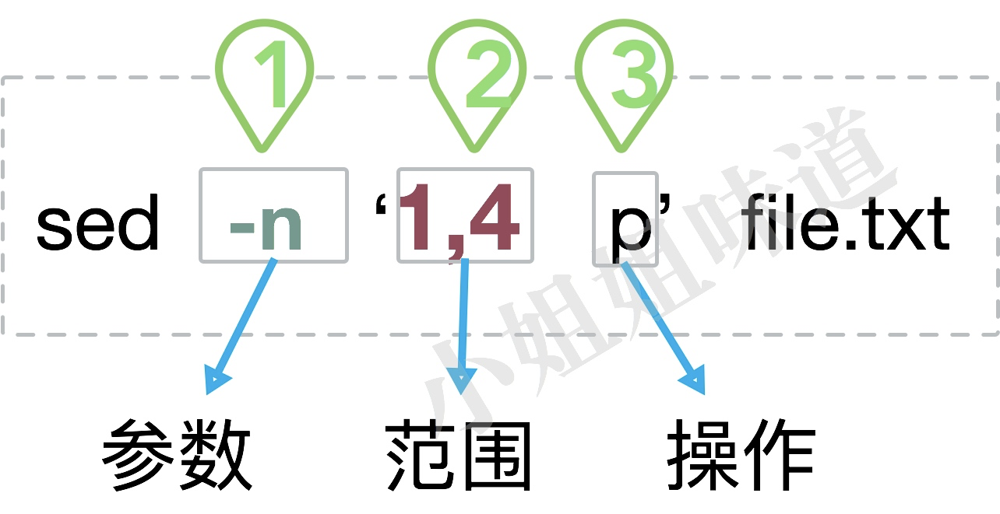
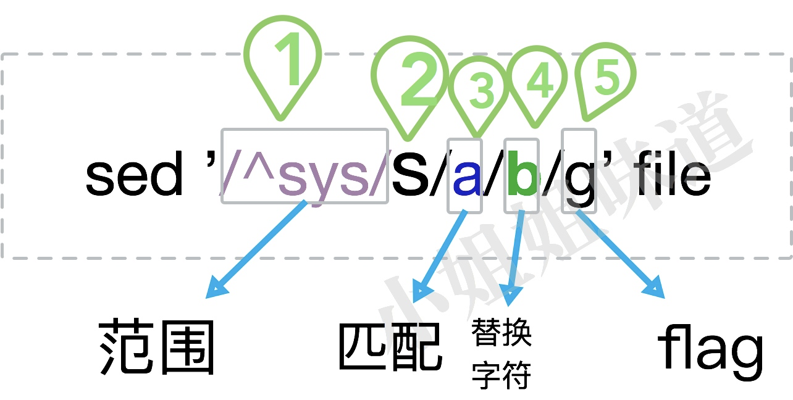

# Linux中最常用的一套Sed技巧

sed命令应用广泛，使用简单，是快速文本处理的利器。它其实没多少技巧，背诵、使用是最合适的学习渠道，属于硬技能。但它又很复杂，因为高级功能太多。本篇不去关注sed的高级功能，仅对常用的一些操作，进行说明。

随着使用，你会发现它和vim的一些理念是相通的，正则表达式的语法也基本上一样，并没有多少学习成本。从个人视野和工作效率上来看，sed命令都是程序员必须掌握的一个重要工具。

## 一个简单的入门

如图，一个简单的sed命令包含三个主要部分：参数、范围、操作。要操作的文件，可以直接挂在命令行的最后。除了命令行，sed也可以通过-f参数指定一个sed脚本，这个属于高级用法，不做过多描述。

有些示例命令我会重复多次，聪明如你一定能发现其中规律，有时连解释都用不着。
### 参数
-n 这个参数是--quiet或者--silent的意思。表明忽略执行过程的输出，只输出我们的结果即可。

我们常用的还有另外一个参数 ：-i。

>使用此参数后，所有改动将在原文件上执行。你的输出将覆盖原文件。非常危险，一定要注意。

### 范围
1,4 表示找到文件中1,2,3,4行的内容。

这个范围的指定很有灵性，请看以下示例（请自行替换图中的范围部分）。

>5 选择第5行。
>
>2,5 选择2到5行，共4行。
>
>1~2 选择奇数行。
>
>2~2 选择偶数行。
>
>2,+3 和2,5的效果是一样的，共4行。
>
>2,$ 从第二行到文件结尾。

范围的选择还可以使用正则匹配。请看下面示例。

>/sys/,+3 选择出现sys字样的行，以及后面的三行。
>
>/\^sys/,/mem/ 选择以sys开头的行，和出现mem字样行之间的数据。

为了直观，下面的命令一一对应上面的介绍，范围和操作之间是可以有空格的。
```
sed -n '5p' file
sed -n '2,5 p' file
sed -n '1~2 p' file
sed -n '2~2 p' file
sed -n '2,+3p' file
sed -n '2,$ p' file
sed -n '/sys/,+3 p' file
sed -n '/^sys/,/mem/p' file
```
### 操作
最常用的操作就是p，意思就是打印。比如，以下两个命令就是等同的：
```
cat file
sed -n 'p' file
```
除了打印，还有以下操作，我们来说常用的。
>
>p 对匹配内容进行打印。
>
>d 对匹配内容进行删除。这个时候就要去掉-n参数了，想想为什么。
>
>w 将匹配内容写入到其他地方。

a,i,c等操作虽基本但使用少，不做介绍。我们依然拿一些命令来说明。
```
sed -n '2,5 p' file
sed    '2,5 d' file
sed -n '2,5 w output.txt' file
```
我们来看一下sed命令都能干些啥，上点命令体验一下。

删除所有#开头的行和空行。

`sed -e 's/#.*//' -e '/^$/ d' file`

最常用的，比如下面这个。

```
sed -n '2p' /etc/group
```
表示打印group文件中的第二行。
```
1、参数部分 比如 -n
2、模式部分 比如'2p'
3、文件，比如/etc/group
```
那么我想一次执行多个命令，还不想写sed脚本文件怎么办？那就需要加-e参数。

sed的操作单元是行。
## 替换模式
以上是sed命令的常用匹配模式，但它还有一个强大的替换模式，意思就是查找替换其中的某些值，并输出结果。使用替换模式很少使用-n参数。

替换模式的参数有点多，但第一部分和第五部分都是可以省略的。替换后会将整个文本输出出来。

前半部分用来匹配一些范围，而后半部分执行替换的动作。
### 范围
这个范围和上面的范围语法类似。看下面的例子。
>/sys/,+3 选择出现sys字样的行，以及后面的三行。
>
>/\^sys/,/mem/ 选择以sys开头的行，和出现mem字样行之间的数据。

具体命令为：
```
sed '/sys/,+3 s/a/b/g' file
sed '/^sys/,/mem/s/a/b/g' file
```
### 命令
这里的命令是指s。也就是substitute的意思。
### 查找匹配
查找部分会找到要被替换的字符串。这部分可以接受纯粹的字符串，也可以接受正则表达式。看下面的例子。
>a 查找范围行中的字符串a。
>
>[a,b,c] 从范围行里查找字符串a或者b或者c。

命令类似：
```
sed 's/a/b/g' file
sed 's/[a,b,c]/<&>/g' file#这个命令我们下面解释
```
### 替换
是时候把找出的字符串给替换掉了。本部分的内容将替换查找匹配部分找到的内容。

可惜的是，这部分不能使用正则。常用的就是精确替换。比如把a替换成b。

但也有高级功能。和java或者python的正则api类似，sed的替换同样有Matched Pattern的含义，同样可以得到Group，不深究。常用的替位符，就是&。

&号，再重复一遍。当它用在替换字符串中的时候，代表的是原始的查找匹配数据。

>[&] 表明将查找到的数据使用[]包围起来。
>
>“&” 表明将查找的数据使用””包围起来。

下面这条命令，将会把文件中的每一行，使用引号包围起来。
```
sed 's/.*/"&"/' file
```
### flag 参数
这些参数可以单个使用，也可以使用多个，仅介绍最常用的。
>
>g 默认只匹配行中第一次出现的内容，加上g，就可以全文替换了。常用。
>
>p 当使用了-n参数，p将仅输出匹配行内容。
>
>w 和上面的w模式类似，但是它仅仅输出有变换的行。
>
>i 这个参数比较重要，表示忽略大小写。
>
>e 表示将输出的每一行，执行一个命令。不建议使用，可以使用xargs配合完成这种功能。

看两个命令的语法：
```
sed -n 's/a/b/gipw output.txt' file
sed 's/^/ls -la/e' file
```
### 好玩
由于正则的关系，很多字符需要转义。你会在脚本里做些很多\\，\*之类的处理。你可以使用|^@!四个字符来替换\。
比如，下面五个命令是一样的。
```
sed '/aaa/s/\/etc/\/usr/g' file
sed '/aaa/s@/etc@/usr@g' file
sed '/aaa/s^/etc^/usr^g' file
sed '/aaa/s|/etc|/usr|g' file
sed '/aaa/s!/etc!/usr!g' file
```
注意：前半部分的范围是不能使用这种方式的。我习惯使用符号@。
## 其他
### 正则表达式

可以看到，正则表达式在命令行中无处不在。以下，仅做简要说明。

>^ 行首
>
>$ 行尾
>
>. 单个字符
>
>\* 0个或者多个匹配
>
>\+ 1个或者多个匹配
>
>? 0个或者1个匹配
>
>{m} 前面的匹配重复m次
>
>{m,n} 前面的匹配重复m到n次
>
>\ 转义字符
>
>[0-9] 匹配括号中的任何一个字符,or的作用
>
>| or，或者
>
>\b 匹配一个单词。比如\blucky\b 只匹配单词lucky

### 参数i
上面已经简单介绍了参数i，它的作用是让操作在原文件执行。无论你执行了啥，原始文件都将会被覆盖。这是非常危险的。

通过加入一个参数，可以将原文件做个备份。
```
sed -i.bak 's/a/b/' file
```
以上命令会对原file文件生效，并生成一个file.bak文件。强烈建议使用i参数同时指定bak文件。
### 表演一下
我们通过两个命令，来稍微看下sed和其他命令组合起来的威力。

输出长度不小于50个字符的行
```
sed -n '/^.{50}/p'
```
统计文件中有每个单词出现了多少次
```
sed 's/ /\n/g' file | sort | uniq -c
```
查找目录中的py文件，删掉所有行级注释
```
find ./ -name "*.py" | xargs sed  -i.bak '/^[ ]*#/d'
```
查看第5-7行和10-13行
```
sed -n -e '5,7p' -e '10,13p' file
```
仅输出ip地址
```
ip route show | sed -n '/src/p' | sed -e 's/  */ /g' | cut -d' ' -f9
```